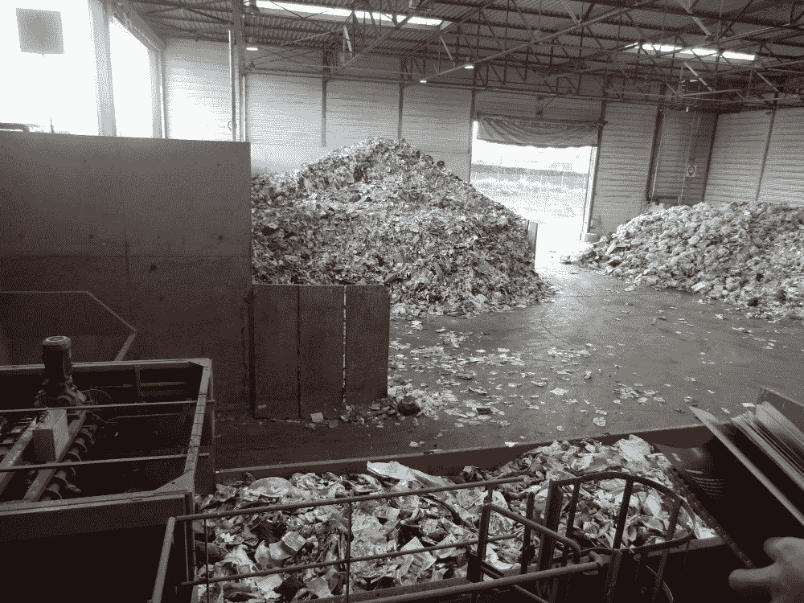

# 使用神经网络改善废物管理，一次一个传播。

> 原文：<https://towardsdatascience.com/using-neural-networks-to-improve-waste-management-one-propagation-at-a-time-b2b7414d329d?source=collection_archive---------38----------------------->

图一。马累 Thilafushi 的废物处理场。哈特斯托克-穆罕默德阿卜杜勒拉希姆

# **问题范围**

这绝对不好看，也不是在餐桌上提出来的东西，尽管每顿饭结束后，这个过程又开始了，我说的是浪费！

废物管理是收集和处理废物的过程，是每个社会不可分割的一部分，通常反映了一个社会的整体发展水平。废物管理的低端是一个非常遥远的过程，通常只涉及一个露天垃圾场。另一方面，这些过程涉及多阶段的努力，有针对性的资助，以便收集、分类和重新利用废物以备将来使用，或完全分解废物以产生能源。世界上存在的大多数废物管理系统都介于这两个极端之间。然而，不幸的是，上图中的 Thilafushi 城市垃圾填埋场更常见。

目前，世界每年产生 20 亿吨城市固体废物，预计到 2050 年将增加到 34 亿吨。高收入国家占世界人口的 16%，却产生了 34%的垃圾。因此，预计随着人口更多的发展中国家继续进步，产生的废物量也将增加。

这是个大问题。

幸运的是，我们有机会从错误中学习并改变！

# **数据如何产生影响**

数据帮助我们量化和结构化问题。数据科学家使用他们所掌握的数据来提供见解，从而为解决此类问题的决策提供信息。一个典型的过程可以总结为 3 个一般步骤:

1.  **确定需求**
2.  **测量问题**
3.  **构建定制解决方案**

就废物管理而言，这一过程极其复杂，需要在地方政府和社区的支持下采取多学科方法才能取得成功。在这篇文章的剩余部分，我将特别关注这个过程的一个方面，通过**图像分类进行垃圾分类。**

由于不同类型的废物需要特定的解决方案，确保废物得到适当分类对于建立有效和高效的废物管理系统至关重要。请看下面(*图 2* )的示例，了解典型的分类设施可能是什么样子，以及废物是如何进行初步分类的。那么大的问题应该是显而易见的，我们如何用可以结合技术的系统来取代现状，以提高这一过程的有效性和效率？

图 2。左图:这只是垃圾分类设施众多可能例子中的一个。右图:最常见的分类方法是手工分类，这非常耗时，而且成本极高。[来源](http://titan-machinery.com/en/engineering/areas/waste-recycling-projects-engineering/)。

例如，某些塑料可以回收并再次用作生产原料，然而，一种塑料所需的再加工通常与另一种塑料大不相同。这些差异的细节超出了本文的范围，但是如果你有兴趣了解更多，请查看这个[网站](https://www.thebalancesmb.com/an-overview-of-plastic-recycling-4018761)。

那么，什么是图像分类，它是如何工作的？下面我简单解释一下。

# **利用**神经网络进行垃圾分类

神经网络(*也称为* [*多层感知器*](https://en.wikipedia.org/wiki/Multilayer_perceptron)*【MLP】*)是一种预测建模技术。像许多其他建模技术一样，神经网络涉及通过迭代过程最小化成本函数。然而，与其他一些模型不同，神经网络的体系结构非常健壮，能够相对容易地处理回归和分类问题。

图 3。一种基本的神经网络架构，也称为多层感知器。资料来源:走向数据

神经网络由多层节点或神经元组成，因此得名(*见图 3* )。第一个是**输入层**，它接收预处理的数字数据。该层中的节点数量取决于输入数据本身。最后一层被称为**输出层**。这一层的节点数量完全取决于问题的性质。例如，回归(*或二元分类*)问题将涉及一个输出节点，而多类分类问题将涉及两个或更多。

输入和输出之间的层被称为**隐藏层，**这就是神奇的地方！可以有任意数量的这些层，并且每层中的每个节点都接收前一层的所有输入值。然后，它为每个值分配一个随机权重乘数，将它们的总和相加，然后添加一个随机偏差值以确保区分( *y = sum(wi*xi) + b* )。然后，该值通过所谓的**激活函数** ( *，其中有许多*)，然后返回一个值，由后续层中的每个节点处理。决定使用哪种激活函数取决于所处理的数据以及问题的类型。这些决定背后有一些复杂的数学原理，我不会在这里深入探讨，更多信息请查看 Sagar Sharma 的这篇伟大的 [Medium 文章](/activation-functions-neural-networks-1cbd9f8d91d6)。

数据通过这些层从左到右被处理的过程被称为**正向传播**。这些步骤随后被再次重复，重复次数由研究人员确定，称为**批量**。达到这个阈值后，网络反向工作，通过使用许多潜在的**优化器**方法之一调整权重和偏差，采取实际上最小化损失函数的步骤(*又名学习*，这是机器学习的*学习*方面！关于如何选择正确的优化器的更多细节，请查看 Sanket Doshi 的这篇伟大的文章。每次模型到达定型数据的末尾时，它都从开始处返回并继续。数据的每个完成的*‘圈’*被称为一个**时期。**

最后，当模型已经完成了所有这些步骤，并且运行了预定数量的时期时，那么可以说模型已经被'*训练过*，并且它准备好进行预测。哦，最后一点是关于我们如何比较模型的。当人们想要评估一个模型与另一个模型时，比方说比较某个任务的性能，用来表示模型大小和复杂性的一个重要术语是它拥有的**参数**的数量，因为计算单个层有时会很麻烦。考虑参数的一种方法是，想象如果我从一个输入节点开始，对每个节点遍历整个模型，会有多少条可能的路径。看看你能不能算出上图中有多少个参数。退一步说，这些数字可能会变得惊人！

干得好！你通过了神经网络的本质！我希望您现在已经理解了这种建模技术的基本过程。下面我将简要解释我用于图像处理的特定类型的神经网络，因为它有一些关键的差异，使它非常擅长具体解释图像数据。

# **卷积神经网络**

如果你已经做到这一步，那么理解卷积神经网络( *CNN* )的细微差别应该相对简单。看看下图( *Pic。看看你自己能不能理解 CNN 在做什么！*

图 4。一个基本的卷积神经网络结构。来源:走向数据科学。

你很有希望马上注意到的是，CNN 和基本的 MLP 架构之间的主要区别是在过程的前端。我们在这里看到的是该过程的**卷积**部分，这是将图像作为数据(*由每个像素的 RGB 值表示*)并将所谓的**滤镜** 应用于每个卷积层的行为。这些过滤器然后重新格式化输入数据，只保留看似重要的信息。当使用 CNN 时，这些信息通常被称为每幅图像的**边缘**或**特征**。每个输入数据经过卷积步骤后，将作为列向量传递到最终的 MLP 结构，并在输出层进行分类，类似于上一节中讨论的过程。这个过程是专门为处理图像数据而设计的，因此它是当今图像处理的前沿方法之一。如需进一步阅读 CNN，请查看 Sumit Saha 的这篇[文章](/a-comprehensive-guide-to-convolutional-neural-networks-the-eli5-way-3bd2b1164a53)。

# 张量流、数据和模型性能

一种用于设计和执行神经网络的非常流行的技术被称为 [**张量流**](https://www.tensorflow.org/) 。Tensorflow 是一个开源软件库， *Google Brain 的*第二代*深度神经网络学习系统*于 2017 年发布。[***Keras***](https://keras.io/)**也是一个开源软件库，旨在实现深度神经网络的快速实验，运行在 Tensorflow 之上。**

**我用来训练我的模型的数据是由 [*Kaggle*](https://www.kaggle.com/techsash/waste-classification-data) *提供的**垃圾分类**数据集。*该数据集包含超过 22，000 张标记图像，代表两个类别，或者是**有机**或者是**回收利用**。大约有 12，000 个有机图像和 10，000 个回收图像，这意味着模型训练的类别平衡良好。检查以确保类之间存在健康的平衡是数据科学家为确保模型稳健而采取的许多重要预处理步骤之一。**

****

**图 5。我的最佳表现模型的培训与验证损失和准确性。**

**所以我们在这里，经过大量的时间和努力微调我的 CNN，我终于能够建立和训练一个我满意的模型。**

**以下是我的 CNN 规格:**

*****参数:670 万*****

*****测试损耗:~0.283*****

*****测试准确率:~91%*****

**这些值显示在左侧(*图 5* )，顶部的图形代表随时间的损失，底部代表精确度。如果你还记得，我们之前简单地讨论过纪元，正如你所看到的，这就是时间在 x 轴上的表现。**

**幸运的是，模型的训练如预期的那样进行，我们可以看到随着时间的推移，损失减少了，准确性也提高了。机器学习中存在许多计算限制，[此链接](https://venturebeat.com/2020/07/15/mit-researchers-warn-that-deep-learning-is-approaching-computational-limits/)详细介绍了这一主题。不过现在，请相信我的话，我说 50 个时期是在我的个人笔记本电脑上用这种规模的数据集调优和训练模型的好时间。总的来说，我对我的模型的表现很满意，因为我能够进入 90 年代，并且测试损失相对较低。**

# **基准**

**数据科学家采用的典型基准测试实践是将您自己定制的模型与**预先训练的模型**进行比较。在 CNN 的世界中，有许多预先训练好的模型，Keras 已经内置了这些模型，允许轻松导入。**

**我决定将我的 CNN 与目前市场上表现最好的三个模型进行比较，即: **VGG16** 、 **VGG19** 和**除了**。这三款都脱胎于 [**ImageNet**](http://image-net.org/) 挑战**。** ImageNet 的数据库中有超过 1500 万张图像，这些模型已经在其中的很大一部分上进行了预训练(*我的数据集是 22，000 张图像，请记住关于计算能力的那部分…* )，因此非常健壮或**“可概括”。**这些模型是开源的，可以作为其他数据科学家在测试时调整/微调和比较他们自己的模型的基础。**

## ****行业精度基准:****

*****VGG16: ~86%，基础参数:1470 万*****

*****VGG19: ~86%，基数参数:2000 万*****

*****异常:~90%，基础参数:2080 万*****

**这里要注意的第一件事是这些预训练模型中的每一个与我的相比有多少参数。这代表了他们接受培训的大型数据集，以及创建这些模型的人投入的大量时间和精力来微调每一层。我们看到的 VGG16 和 19 的较低精度分数并不意味着我的模型在任何方面都*‘更好’*，对于一个不是为我使用的特定数据集构建和训练的模型来说，这是一个非常好的分数。与我创建的模型相比，你将有更好的机会在新数据上测试这些预训练模型中的一个，并获得正确的预测，因为他们只是接触了更多的图像，尽管我支持我的模型，并欢迎挑战！最后，我们有例外模型，它的得分和我自己的模型一样好。关于这种特殊模型的一个注意事项是，它由非常非常多的层组成，但我们看到 VGG19 的参数数量相似…花一分钟时间，看看您是否能想到这可能是为什么(*提示:记住要同时考虑层和节点！*)。**

# **应用和未来工作**

**当谈到解决我们今天在全球面临的非常大和非常真实的废物管理挑战时，将所有这些付诸实践是真正的挑战。在家坐在电脑屏幕前就能获得这类结果，这很有趣，也几乎令人难以置信，但这些技术的实际应用才是问题的核心。幸运的是，已经有很多人致力于这些艰难的挑战。我的一个灵感来自于 Bobulski，Janusz & Kubanek，Mariusz[的这篇论文](https://www.researchgate.net/publication/333625767_Waste_Classification_System_Using_Image_Processing_and_Convolutional_Neural_Networks)。(2019).下图(*图 6* )显示了他们提出的系统。当废物沿着传送带运送时，首先由固定的摄像机捕获图像，然后将数据传递到预先训练的 CNN 模型中，最后给出输出，然后通知空气喷射器将废物引导到哪个垃圾箱中。**

****

**图 6。拟议的废物分类和分类系统。资料来源:Bobulski，Janusz & Kubanek，Mariusz。(2019).**

**这整个过程只需要几秒钟，而且可以连续运行几个小时。因此，从理论上讲，该系统可以提高整个垃圾分类过程的有效性(*正确分类垃圾*)和效率(*能够更快和更长时间地分类*)。**

**这个系统是一个真正的可能性，像这样的分类技术将依赖于在废物管理周期的所有阶段负责任地收集和解释数据，越来越接近[循环经济](https://www.canada.ca/en/services/environment/conservation/sustainability/circular-economy.html)的未来。**

**具体到我未来的工作，我很乐意沿着我已经开始的路线继续下去，访问越来越多的数据集，我可以在其上训练我的模型。然而，获得良好、全面的数据是一项挑战，也是传播此类技术的最大障碍之一。开发解决方案和实施这样的总体系统需要地方做出巨大的努力。在未来，我希望能够亲自为这些努力做出贡献，并在 2020 年 10 月从熨斗学校毕业后从事这一行业。**

**如果你能做到这一步，那么非常感谢你的时间！我希望这是翔实的，请随时联系我，如果你有任何问题或意见在 Tcastanley@gmail.com！**

****

**[来源](https://www.thisiscolossal.com/2013/02/urban-vertical-garden-built-from-hundreds-of-recycled-soda-bottles/)**