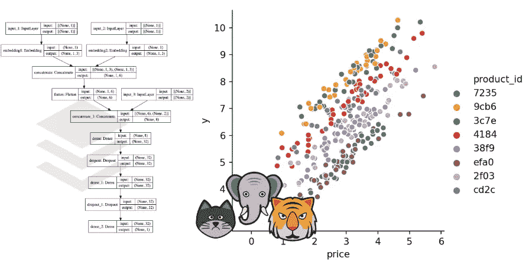
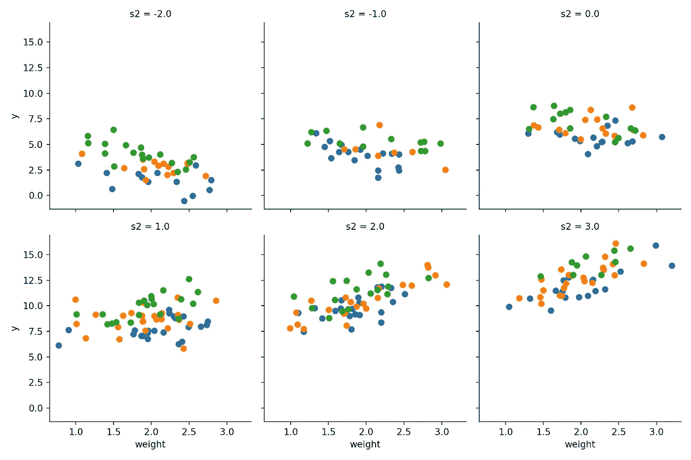
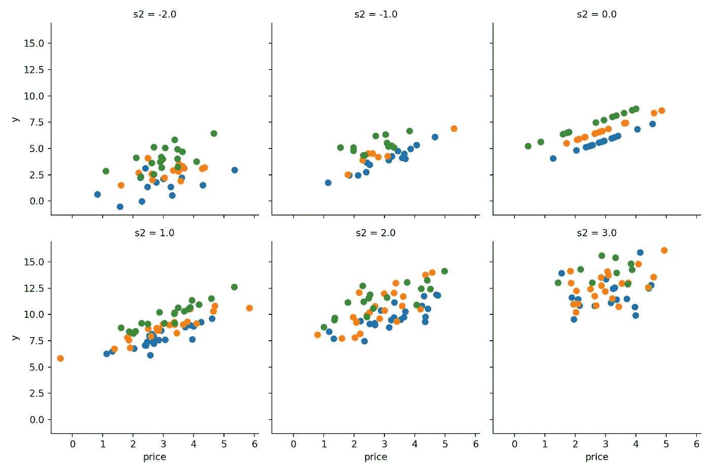
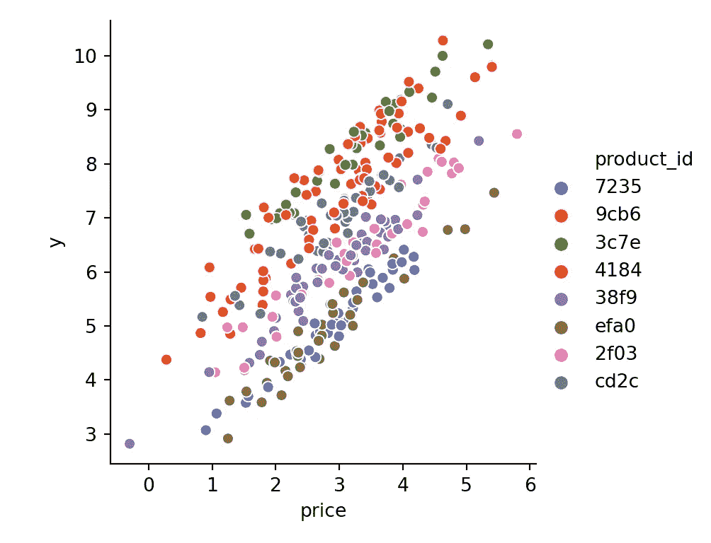
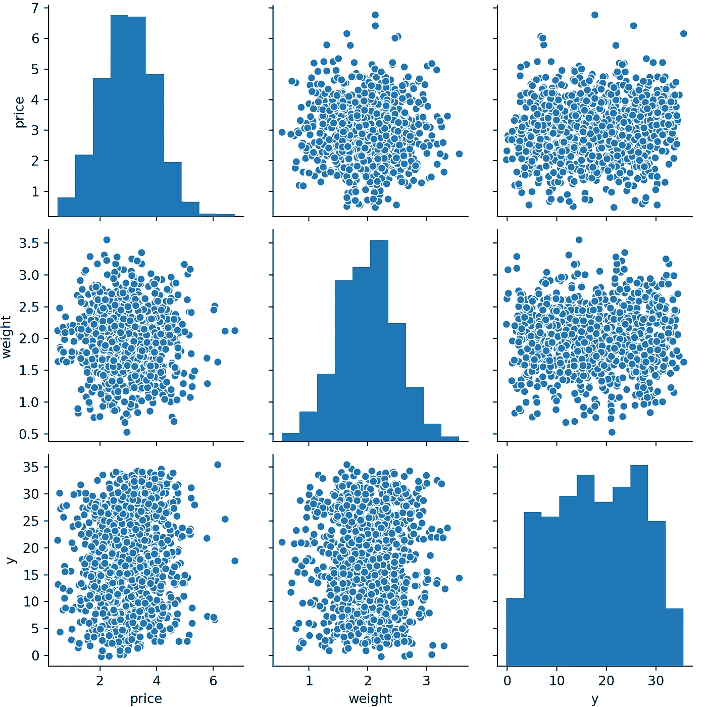
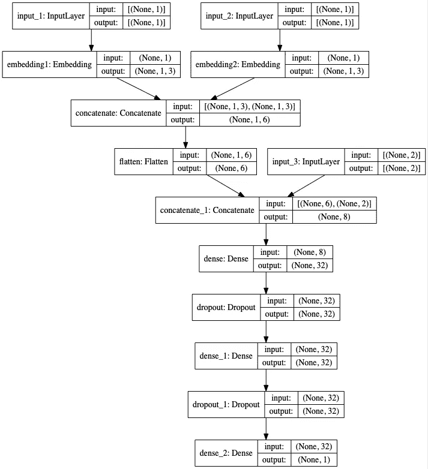

# 使用具有嵌入层的神经网络来编码高基数分类变量

> 原文：<https://towardsdatascience.com/using-neural-networks-with-embedding-layers-to-encode-high-cardinality-categorical-variables-c1b872033ba2?source=collection_archive---------18----------------------->

## 我们如何使用具有数千个不同值的分类特征？

有多种方式对分类特征进行编码。如果类别之间不存在有序关系，one-hot-encoding 是一个受欢迎的候选(即，为每个类别添加一个二进制特征)，还有[和许多其他的](/smarter-ways-to-encode-categorical-data-for-machine-learning-part-1-of-3-6dca2f71b159)。但是一次性编码有一些缺点——可以通过使用嵌入来解决。



稍微有帮助的插图，图片由作者使用 [draw.io](http://draw.io) 完成

一个缺点是，它不适合高基数类别:它将产生非常大/宽和稀疏的数据集，并且由于大量的要素，将需要大量的内存和正则化。此外，一次性编码没有利用类别之间的关系。假设你有*动物种类*作为特征，值类似于*家猫*、*老虎*和*大象*。与*家猫*和*大象*相比，*家猫*和*老虎*可能有更多的相似之处。这是一个更聪明的编码可以考虑的事情。在非常实际的场景中，这些类别可以是诸如客户、产品或位置之类的东西——非常高的基数类别，在各个观察之间具有相关的关系。

解决这些问题的一种方法是使用嵌入，一个流行的例子是 NLP 问题中的单词嵌入。我们使用更小的密集空间，而不是使用巨大的二进制空间对类别进行编码。我们不是手动编码它们，而是定义嵌入空间的大小，然后尝试让模型学习有用的表示。对于我们的动物物种示例，我们可以检索类似于代表*家猫*、`[1, 0.4, 0.1]`代表*老虎*、`[0, 0.1, 0.6]`代表*大象*、`[-0.5, 0.5, 0.4]`代表*鲨鱼*等等的表示。

在接下来的文章中，我们将使用嵌入来构建一个神经网络来编码分类特征，此外，我们将针对一个没有分类变量的非常简单的线性模型和一个具有一次性编码特征的更复杂的正则化线性模型来对该模型进行基准测试。

# 玩具的例子

让我们看一个产生的玩具问题。假设我们反复从不同的供应商那里购买不同的产品，并且我们想要预测它们的大小。现在让我们假设每个产品都标有一个`supplier_id`和一个`product_id`，这是供应商和产品本身的标识符。我们还假设物品具有一些明显的尺寸/特征`x1`和`x2`，如`price`和`weight`，以及一些秘密的、不可测量的特征`s1`、`s2`和`s3`，理论上可以这样计算出`size`(S3 对尺寸没有影响):

```
y = f(price, weight, s1, s2, s3) 
  = price + s1 + weight * s2
```

问题是我们不知道秘密特征`s1`、`s2`和`s3`，我们无法直接测量它们，这实际上是机器学习中一个相当常见的问题。但是我们在这里还有一点余地，因为我们有产品和供应商 id——但是数量太多了，无法一次性编码并直接使用它们。让我们从经验中假设我们知道来自不同卖家的产品具有不同的尺寸，因此有理由假设来自卖家的物品具有非常相似的秘密属性。

```
y = g(supplier_id, product_id, size, weight)
```

问题是，即使我们有几十万个不同的 id，我们的模型能从产品和供应商 id 中学习到上面的关系`g`吗？答案是肯定的，如果我们有足够的观测数据。

让我们看一个小数据集，以获得更好的图片。我们生成 300 个样本，在`s1`中有 4 个不同的值，在`s2`中有 3 个不同的值(记住`s3`没有影响)，并可视化秘密属性对价格、重量和尺寸之间关系的明显影响。

```
import seaborn as sns
import matplotlib.pyplot as pltdata = generate_secret_data(n=300, s1_bins=3, s2_bins=6, s3_bins=2)
data.head(10)
##   s1   s2  s3  price  weight       y
## 0  1  0.0   2  1.269   2.089   4.055
## 1  3  2.0   1  2.412   1.283   9.764
## 2  2  1.0   2  3.434   1.010   8.230
## 3  1  3.0   1  4.493   1.837  12.791
## 4  3 -2.0   2  4.094   2.562   3.756
## 5  1  2.0   2  1.324   1.802   7.714
## 6  1  2.0   1  2.506   1.910   9.113
## 7  3 -2.0   1  3.626   1.864   4.685
## 8  2  1.0   1  2.830   2.064   8.681
## 9  1  2.0   1  4.332   1.100   9.319
g = sns.FacetGrid(data, col='s2', hue='s1', col_wrap=3, height=3.5);
g = g.map_dataframe(plt.scatter, 'weight', 'y');
plt.show()
```



每个 s2 属性的不同重量与尺寸(y)关系

```
g = sns.FacetGrid(data, col='s2', hue='s1', col_wrap=3, height=3.5); g = g.map_dataframe(plt.scatter, 'price', 'y'); 
plt.show()
```



每个 s2 物业的不同价格与规模(y)的关系

# 一个玩具的例子，它将如何出现在(一种)现实

但现在的问题是:我们不知道特性`s1`、`s2`和`s3`，只知道产品 id&供应商 id。为了模拟这个数据集在野外是如何出现的，让我们引入一个散列函数，我们将使用它来模糊我们不可测量的特性，并生成一些产品和供应商 id。

```
import hashlibdef generate_hash(*args):
    s = '_'.join([str(x) for x in args])
    return hashlib.md5(s.encode()).hexdigest()[-4:]generate_hash('a', 2)
## '5724'
generate_hash(123)
## '4b70'
generate_hash('a', 2)
## '5724'
```

我们现在可以用模糊属性生成数据，用产品 id 代替:

```
data = generate_data(n=300, s1_bins=4, s2_bins=1, s3_bins=2)
data.head(10)
##   product_id supplier_id  price  weight      y
## 0       7235        a154  2.228   2.287  4.470
## 1       9cb6        a154  3.629   2.516  8.986
## 2       3c7e        0aad  3.968   1.149  8.641
## 3       4184        0aad  3.671   2.044  7.791
## 4       4184        0aad  3.637   1.585  7.528
## 5       38f9        a154  1.780   1.661  4.709
## 6       7235        a154  3.841   2.201  6.040
## 7       efa0        0aad  2.773   2.055  4.899
## 8       4184        0aad  3.094   1.822  7.104
## 9       4184        0aad  4.080   2.826  8.591
```

我们仍然看到不同的产品倾向于具有不同的值，但是我们不再能够容易地从产品 id 计算出`size`值:

```
sns.relplot(
    x='price',
    y='y',
    hue='product_id',
    sizes=(40, 400),
    alpha=1,
    height=4,
    data=data
);plt.show()
```



每个产品 id 的价格与尺寸(y)的关系—图片由作者制作

现在让我们生成一个更大的数据集。为了能够公平地将我们的嵌入模型与更简单的基线进行比较，并且为了能够验证我们的方法，我们将为我们的分类基数`S1_BINS`、`S2_BINS`、`S3_BINS`假设相当小的值。

如果`S1_BINS, S2_BINS, S3_BINS >> 10000`基准模型会遇到内存问题，性能会很差。

```
from sklearn.model_selection import train_test_splitN = 100000
S1_BINS = 30
S2_BINS = 3
S3_BINS = 50
data = generate_data(n=N, s1_bins=S1_BINS, s2_bins=S2_BINS, s3_bins=S3_BINS)data.describe()# cardinality of c1 is approx S1_BINS * S3_BINS,
# c2 is approx. S2_BINS * S3_BINS
##             price      weight           y
## count  100000.000  100000.000  100000.000
## mean        3.005       2.002      17.404
## std         0.997       0.502       8.883
## min        -1.052      -0.232      -2.123
## 25%         2.332       1.664       9.924
## 50%         3.004       2.002      17.413
## 75%         3.676       2.341      24.887
## max         7.571       4.114      38.641
data.describe(include='object')
##        product_id supplier_id
## count      100000      100000
## unique       1479         149
## top          8851        0d98
## freq          151        1376
```

我们现在将数据分为特征和响应，以及训练和测试。

```
x = data[['product_id', 'supplier_id', 'price', 'weight']]
y = data[['y']]
x_train, x_test, y_train, y_test = train_test_split(x, y, random_state=456)
```

# 构建基准模型:天真和基线

让我们首先组装一个非常简单的线性模型，它的性能非常差，并且只试图从`price`和`weight`中估计`size`:

```
from sklearn.linear_model import LinearRegression
from sklearn.metrics import mean_squared_error, mean_absolute_errornaive_model = LinearRegression()
naive_model.fit(x_train[['price', 'weight']], y_train);y_pred_naive = naive_model.predict(x_test[['price', 'weight']])mean_squared_error(y_test, y_pred_naive)
## 77.63320758421973
mean_absolute_error(y_test, y_pred_naive)
## 7.586725358761727
```

如果我们观察`price`和`weight`与响应`size`之间的相关性，忽略 id，接近响应总体方差的不良性能是显而易见的:

```
sns.pairplot(data[['price', 'weight', 'y']].sample(1000));
plt.show()
```



价格、重量和尺寸(y)之间的相互关系—到处都是—图片由作者制作

为了获得更好的基准，我们可以对分类特性进行一次性编码，并标准化数字数据，使用`sklearns` `ColumnTransformer`将这些转换应用于不同的列。由于要素的数量，我们将使用岭回归而不是正常的线性回归来保持系数较小(但非零，不像 Lasso，这将导致丢失特定类的信息)。

```
from sklearn.preprocessing import OneHotEncoder, StandardScaler
from sklearn.compose import ColumnTransformerdef create_one_hot_preprocessor():
    return ColumnTransformer([
        ('one_hot_encoder', OneHotEncoder(sparse=False, handle_unknown='ignore'), ['product_id', 'supplier_id']),
        ('standard_scaler', StandardScaler(), ['price', 'weight'])]
    )
```

one hot 预处理器将特征扩展到列并使数据变宽，此外，数字特征标准化为零均值和单位方差:

# 建立具有嵌入层的神经网络，包括预处理和未知类别处理

现在让我们为我们的类别建立一个具有嵌入层的神经网络模型。为了将它们提供给嵌入层，我们需要首先将分类变量映射到数字序列，即分别来自区间`[0, #supplier ids]`的整数。`[0, #product ids]`。

由于`sklearns` `OrdinalEncoder`目前还不能处理未知值，我们需要随机应变。当随机分割测试数据或在预测期间看到新数据时，可能会出现未知类别。因此，我们必须使用编码器的简单实现(使用数据帧而不是数组，没有针对速度进行优化),它可以处理未知值:我们本质上使用有序字典作为散列表来将值映射到正整数范围，其中未知值将被映射到 0(我们需要映射到非负值以符合稍后的嵌入层)。

编码器现在可以编码和解码我们的数据:

```
ce = ColumnEncoder()ce.fit_transform(x_train)
##        product_id  supplier_id  price  weight
## 17414         941          104  2.536   1.885
## 54089         330          131  3.700   1.847
## 84350         960          122  3.517   2.341
## 68797         423           77  4.942   1.461
## 50994         617          138  4.276   1.272
## ...           ...          ...    ...     ...
## 55338         218          118  2.427   2.180
## 92761         528           10  1.705   1.368
## 48811         399           67  3.579   1.938
## 66149         531          126  2.216   2.997
## 30619        1141           67  1.479   1.888
## 
## [75000 rows x 4 columns]
ce.inverse_transform(ce.transform(x_train))
##       product_id supplier_id  price  weight
## 17414       a61d        b498  2.536   1.885
## 54089       36e6        e41f  3.700   1.847
## 84350       a868        d574  3.517   2.341
## 68797       4868        80cf  4.942   1.461
## 50994       69f3        eb54  4.276   1.272
## ...          ...         ...    ...     ...
## 55338       2429        cc4a  2.427   2.180
## 92761       5c02        0ec5  1.705   1.368
## 48811       426c        7a7d  3.579   1.938
## 66149       5d45        dc6f  2.216   2.997
## 30619       c73d        7a7d  1.479   1.888
## 
## [75000 rows x 4 columns]
x_train.equals(ce.inverse_transform(ce.transform(x_train)))
## True
```

它还可以通过将未知数据映射到零类别来处理未知数据:

```
unknown_data = pd.DataFrame({
    'product_id': ['!§$%&/()'],
    'supplier_id': ['abcdefg'],
    'price': [10],
    'weight': [20],
  })ce.transform(unknown_data)
##    product_id  supplier_id  price  weight
## 0           0            0     10      20
ce.inverse_transform(ce.transform(unknown_data))
##   product_id supplier_id  price  weight
## 0       None        None     10      20
```

为了将数据输入到模型中，我们需要分割输入，将其传递到不同的层，本质上是传递到`X = [X_embedding1, X_embedding2, X_other]`。我们可以再次使用转换器来实现这一点，这次使用的是`np.arrays`，因为`StandardScaler`返回数组:

```
emb = EmbeddingTransformer(cols=[0, 1])
emb.fit_transform(x_train.head(5))
## [array([['a61d'],
##        ['36e6'],
##        ['a868'],
##        ['4868'],
##        ['69f3']], dtype=object), array([['b498'],
##        ['e41f'],
##        ['d574'],
##        ['80cf'],
##        ['eb54']], dtype=object), array([[2.5360678952988436, 1.8849677601403312],
##        [3.699501628053666, 1.8469279753798342],
##        [3.5168780519630527, 2.340554963373134],
##        [4.941651644756232, 1.4606898248596456],
##        [4.27624682317603, 1.2715509823965785]], dtype=object)]
```

现在让我们将这两者结合起来，用训练数据装配预处理器，对类别进行编码，执行缩放并将其转换为正确的格式:

```
def create_embedding_preprocessor():
  encoding_preprocessor = ColumnTransformer([
      ('column_encoder', ColumnEncoder(), ['product_id', 'supplier_id']),
      ('standard_scaler', StandardScaler(), ['price', 'weight'])
  ])embedding_preprocessor = Pipeline(steps=[
      ('encoding_preprocessor', encoding_preprocessor),
      # careful here, column order matters:
      ('embedding_transformer', EmbeddingTransformer(cols=[0, 1])),
  ])return embedding_preprocessorembedding_preprocessor = create_embedding_preprocessor()
embedding_preprocessor.fit(x_train);
```

如果我们现在将这些数据提供给模型，它将无法学习未知类别的任何合理内容，即当我们进行`fit`时，在训练数据`x_train`中不存在的类别。因此，一旦我们试图对这些进行预测，我们可能会得到不合理的估计。

解决这个词汇外问题的一种方法是将一些随机的训练观察值设置到未知的类别中。因此，在模型的训练期间，转换将使用 0 对这些进行编码，这是未知类别的标记，并且它将允许模型学习接近未知类别的平均值的东西。有了更多的领域知识，我们还可以选择任何其他类别作为默认类别，而不是随机抽样。

```
# vocab sizes
C1_SIZE = x_train['product_id'].nunique()
C2_SIZE = x_train['supplier_id'].nunique()x_train = x_train.copy()
n = x_train.shape[0]# set a fair share to unknown
idx1 = np_random_state.randint(0, n, int(n / C1_SIZE))
x_train.iloc[idx1,0] = '(unknown)'idx2 = np_random_state.randint(0, n, int(n / C2_SIZE))
x_train.iloc[idx2,1] = '(unknown)'x_train.sample(10, random_state=1234)
##       product_id supplier_id  price  weight
## 17547       7340        6d30  1.478   1.128
## 67802       4849        f7d5  3.699   1.840
## 17802       de88        55a0  3.011   2.306
## 36366       0912        1d0d  2.453   2.529
## 27847       f254        56a6  2.303   2.762
## 19006       2296   (unknown)  2.384   1.790
## 34628       798f        5da6  4.362   1.775
## 11069       2499        803f  1.455   1.521
## 69851       cb7e        bfac  3.611   2.039
## 13835       8497        33ab  4.133   1.773
```

我们现在可以转换数据

```
x_train_emb = embedding_preprocessor.transform(x_train)
x_test_emb = embedding_preprocessor.transform(x_test)x_train_emb[0]
## array([[ 941.],
##        [ 330.],
##        [ 960.],
##        ...,
##        [ 399.],
##        [ 531.],
##        [1141.]])
x_train_emb[1]
## array([[104.],
##        [131.],
##        [122.],
##        ...,
##        [ 67.],
##        [126.],
##        [ 67.]])
x_train_emb[2]
## array([[-0.472, -0.234],
##        [ 0.693, -0.309],
##        [ 0.51 ,  0.672],
##        ...,
##        [ 0.572, -0.128],
##        [-0.792,  1.976],
##        [-1.53 , -0.229]])
```

是时候建立神经网络了！我们有 3 个输入(2 个嵌入，1 个正常)。嵌入输入都被传递到嵌入层，被展平并与正常输入连接。下面的隐藏层由 Dense & Dropout 组成，最后线性激活。

```
import tensorflow as tfmodel = create_model(embedding1_vocab_size=C1_SIZE+1, 
                     embedding2_vocab_size=C2_SIZE+1)tf.keras.utils.plot_model(
    model,
    to_file='../../static/img/keras_embeddings_model.png',
    show_shapes=True,
    show_layer_names=True,
)
```



具有嵌入层的神经网络，图像由作者使用 tensor flow . keras . utils . plot _ model 完成

```
num_epochs = 50model.fit(
    x_train_emb,
    y_train,
    validation_data=(x_test_emb, y_test),
    epochs=num_epochs,
    batch_size=64,
    verbose=0,
);
```

如果您看到类似`InvalidArgumentError: indices[37,0] = 30 is not in [0, 30)`的错误，则您选择了错误的词汇表大小，根据[文档](https://keras.io/layers/embeddings/)，它应该是嵌入值的最大索引加 1。

正如我们所看到的，对于我们的线性问题，该模型的表现与基线线性模型相当好，甚至更好，尽管它的真正优势只有在我们扩大类别空间或向响应添加非线性时才会发挥作用:

```
y_pred_emb = model.predict(x_test_emb)mean_squared_error(y_pred_baseline, y_test)
## 0.34772562548572583
mean_squared_error(y_pred_emb, y_test)
## 0.2192712407711225
mean_absolute_error(y_pred_baseline, y_test)
## 0.3877675893786461
mean_absolute_error(y_pred_emb, y_test)
## 0.3444112401247173
```

我们还可以提取嵌入层的权重(第一行包含零标签的权重):

```
weights = model.get_layer('embedding1').get_weights()
pd.DataFrame(weights[0]).head(11)
##         0      1      2
## 0  -0.019 -0.057  0.069
## 1   0.062  0.059  0.014
## 2   0.051  0.094 -0.043
## 3  -0.245 -0.330  0.410
## 4  -0.224 -0.339  0.576
## 5  -0.087 -0.114  0.324
## 6   0.003  0.048  0.093
## 7   0.349  0.340 -0.281
## 8   0.266  0.301 -0.275
## 9   0.145  0.179 -0.153
## 10  0.060  0.050 -0.049
```

这些权重有可能被保存在某个地方，并在其他模型中用作特征(预训练嵌入)。查看前 10 个类别，我们可以看到来自`supplier_id`的具有相似响应的值`y`具有相似的权重:

```
column_encoder = (embedding_preprocessor
  .named_steps['encoding_preprocessor']
  .named_transformers_['column_encoder'])data_enc = column_encoder.transform(data)(data_enc
  .sort_values('supplier_id')
  .groupby('supplier_id')
  .agg({'y': np.mean})
  .head(10))
##                   y
## supplier_id        
## 1            19.036
## 2            19.212
## 3            17.017
## 4            15.318
## 5            17.554
## 6            19.198
## 7            17.580
## 8            17.638
## 9            16.358
## 10           14.625
```

此外，该模型对于未知数据表现合理，因为其表现类似于我们非常简单的基线模型，也类似于假设简单的条件均值:

```
unknown_data = pd.DataFrame({
    'product_id': ['!%&/§(645h'],
    'supplier_id': ['foo/bar'],
    'price': [5],
    'weight': [1]
})np.mean(y_test['y'])
## 17.403696362314747# conditional mean
idx = x_test['price'].between(4.5, 5.5) & x_test['weight'].between(0.5, 1.5)
np.mean(y_test['y'][idx])
## 18.716701011038868# very naive baseline
naive_model.predict(unknown_data[['price', 'weight']])
## array([[18.905]])# ridge baseline
baseline_pipeline.predict(unknown_data)
## array([[18.864]])# embedding model
model.predict(embedding_preprocessor.transform(unknown_data))
## array([[19.045]], dtype=float32)
```

# 包裹

我们已经看到了如何利用嵌入层来编码高基数分类变量，并且根据基数，我们还可以调整密集特征空间的维度以获得更好的性能。这样做的代价是一个更加复杂的模型，而不是运行一个带有一次性编码的经典 ML 方法。
如果经典模型是优选的，则类别权重可以从嵌入层中提取，并在更简单的模型中用作特征，因此取代了一次性编码步骤。

*最初发表于*[](https://blog.telsemeyer.com/2020/02/23/using-neural-networks-with-embedding-layers-to-encode-high-cardinality-categorical-variables/)**。**