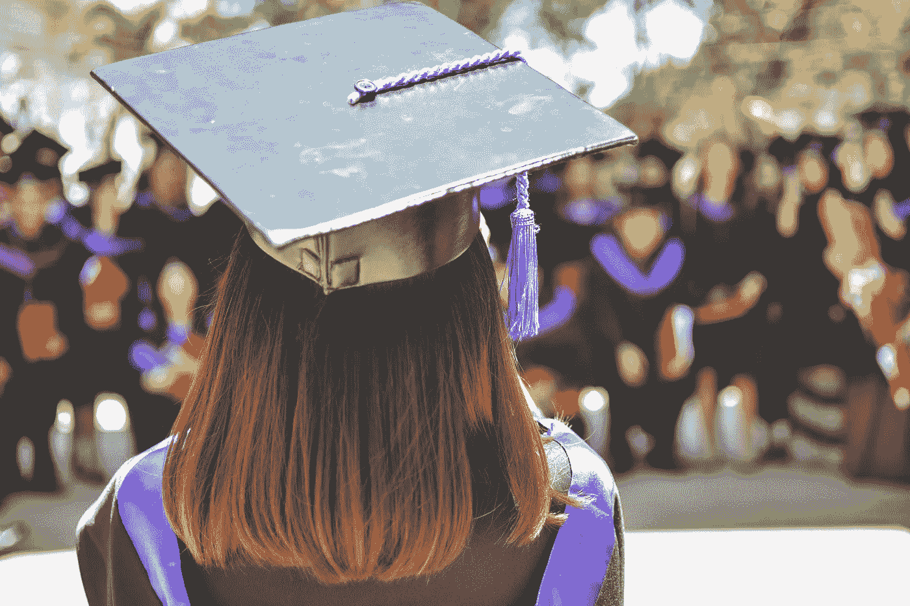
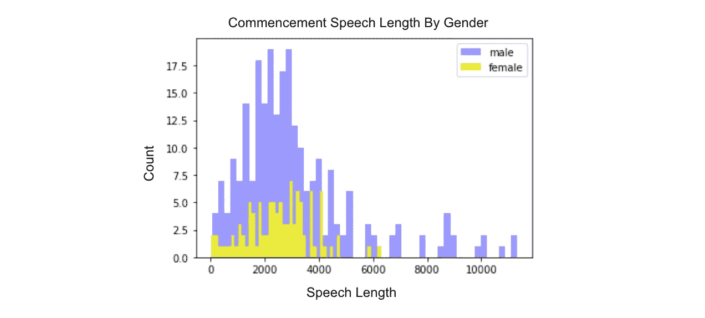
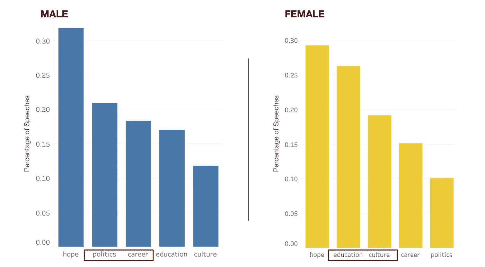
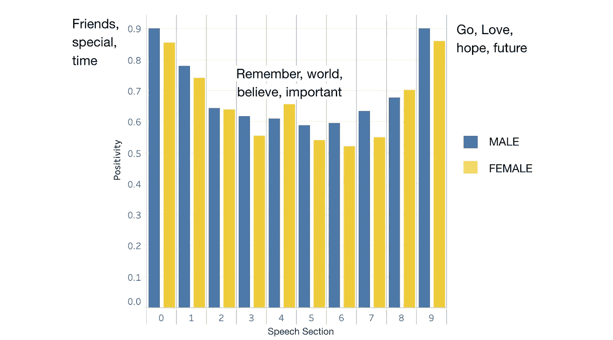

# 使用 NLP 探索领导力和灵感

> 原文：<https://towardsdatascience.com/using-nlp-to-explore-leadership-inspiration-f2e0b805d01c?source=collection_archive---------37----------------------->

## 对 NPR 前 350 名毕业典礼演讲进行 EDA、主题建模和情感分析

[MD 杜兰](https://unsplash.com/@mdesign85?utm_source=unsplash&utm_medium=referral&utm_content=creditCopyText)在 [Unsplash](https://unsplash.com/s/photos/leadership-graduation-ceremony?utm_source=unsplash&utm_medium=referral&utm_content=creditCopyText) 上的照片

每年，全国各地的领导人都会站出来，通过充满情感、政治和鼓舞人心的毕业典礼演讲来激励下一代。随着今年演讲的临近，我决定探究这些领导人如何激励年轻人，以及性别是否在他们的方法中发挥了作用。

# 设计

为了建立我的语料库，我开始用 Beautiful Soup 搜集 [NPR 排名前 350 的毕业典礼演讲](https://apps.npr.org/commencement/)的名字、年份和学校。演讲本身的获取有点棘手，因为它们存在于许多不同的格式中，包括 pdf 文档、各种新闻文章和大学网站。因此，我没有直接从 NPR 提供的链接中抓取演讲稿，而是用 Selenium 构建了一个刮刀，从 YouTube 视频中抓取文稿。由于缺少了一些演讲，我最终得到了一个超过 300 个文档的完整语料库。

利用收集的数据，我使用自然语言处理(NLP)来了解男性和女性领导者如何使用毕业典礼演讲平台。首先，我手动创建了一个男性或女性的二元列，然后使用 ed a、主题建模和情感分析来识别演讲和性别的模式。在这里找到[的完整代码](https://github.com/mollyliebeskind/NLP_Exploration_Leaders_and_Inspiration)。

# 调查的结果

## 探索性数据分析

和埃达单独在一起时，我能够开始看到毕业典礼演讲中的模式。把这些演讲分成一个单词列表，我就可以比较每个演讲的长度。虽然大多数男性和女性的演讲长度在 2000-3000 字之间，但男性的演讲比女性的演讲更长。男性演讲的平均长度为 3068 个单词，而女性演讲的平均长度为 2537 个单词，这相当于 1-2 个段落的差异。

由 Molly Liebeskind 创建的图像

我还创建了仅包含动词、仅包含名词和仅包含形容词的栏目，并发现词性的平均分布在男性和女性的演讲中是一致的。

## 主题建模

在探索了各种主题建模技术和矢量器之后，我确定这个问题最强的方法是使用 [TF-IDF 矢量器](https://scikit-learn.org/stable/modules/generated/sklearn.feature_extraction.text.TfidfVectorizer.html)和[引理化](https://www.nltk.org/_modules/nltk/stem/wordnet.html)的[非负矩阵分解](https://scikit-learn.org/stable/modules/generated/sklearn.decomposition.NMF.html)。男性和女性演讲者的演讲可以分为五个主题:**教育、文化、职业、希望、**和**政治**。

主题符合我对毕业典礼演讲的期望。然而，有趣的是，我发现男性和女性演讲者的主题分布有所不同。为了形成下面的图表，我们根据演讲中最常见的主题对每篇演讲进行了分类。例如，如果一个演讲主要是关于政治，但也有一点关于职业，那么它就被归类为政治。如下图所示，男性演讲者更重视职业和政治，而女性演讲者更重视教育和文化。

由 Molly Liebeskind 创建的图像

男性和女性领导人都谈到了希望、未来和抱负。

## 情感分析

我的下一个目标是确定毕业典礼演讲是否有一个一致的故事情节或公式。为了做到这一点，我首先将每篇演讲分成 10 个更小的部分，这将允许我观察整个演讲过程中情绪的变化。然后，使用[维德情绪分析](https://medium.com/analytics-vidhya/simplifying-social-media-sentiment-analysis-using-vader-in-python-f9e6ec6fc52f)，我确定了每个部分的积极程度。我发现，在激励毕业生时，无论男女，演讲者都遵循一种一致的模式。他们以强烈的正面陈述开始，引发了兴趣和兴奋。他们利用演讲的主体来谈论他们的激情点，包括政治、教育改革、气候变化等。最后，他们以对下一代未来的鼓舞和兴奋而结束。

由 Molly Liebeskind 创建的图像

# 结论

大学毕业典礼是全美领导人与年轻一代分享智慧的时刻。根据演讲者的不同，学生将会接触到关于政治、教育、职业或文化的建议。然而，不管演讲者是谁，学生们都被充满希望、改变和进化的话语所鼓舞和激励。

我个人最喜欢的几个:

*   比尔·盖茨在哈佛大学
*   杜兰大学的艾伦·德杰尼勒斯
*   巴拉克·欧巴马在霍华德大学
*   肯扬学院的戴维·福斯特·华莱士

请在下面留下任何问题和评论！