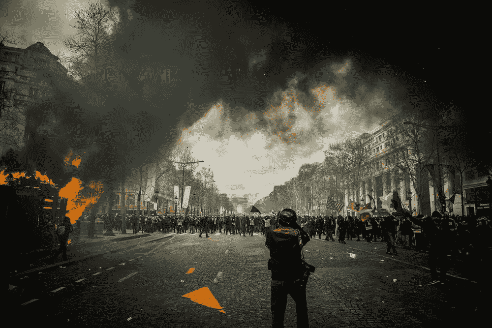
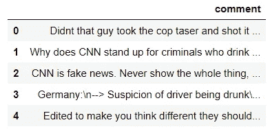
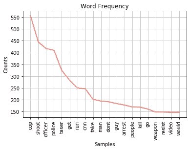
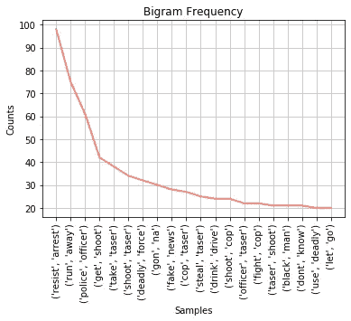
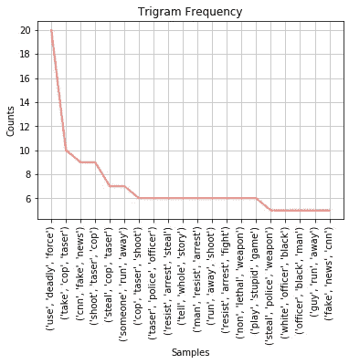
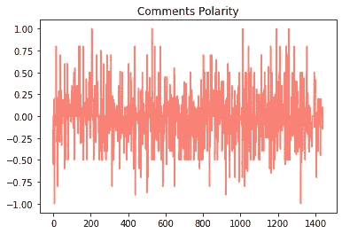

# Python 中的自然语言处理和观点挖掘

> 原文：<https://towardsdatascience.com/using-nlp-to-figure-out-what-people-really-think-e1d10d98e491?source=collection_archive---------20----------------------->

## Rayshard Brooks 枪击案的情感分析



[来源](https://unsplash.com/photos/T1u5YP4blL4)

在本文中，我将向您展示如何使用自然语言处理(NLP)和更具体的情感分析来了解人们对某个主题的真实感受。

# 背景

我决定分析 Youtube 上与以下视频相关的评论:【https://www.youtube.com/watch?v=kuhhT_cBtFU】T2&t = 5s。

美国有线电视新闻网(CNN)发布的视频显示了 2020 年 6 月 12 日亚特兰大一名警察开枪打死 Rayshard Brooks 的瞬间。Rayshard Brooks 因涉嫌酒后驾车被捕，并试图逃离警察。他设法偷了一把泰瑟枪，并试图在逃跑时用它射杀一名警察。然而，美国有线电视新闻网没有显示争吵的最后一部分(在另一台摄像机上捕捉到的)，但他们很快提到了它。

我很想知道人们会对整个事件以及 CNN 遗漏部分事件做出什么样的反应。**非常清楚，我不是在这里给出我的观点**，我只是在分析关于这个事件的说法。

# 获取数据

我用 selenium 搜集了 Youtube 上的评论。我总共收集了 1460 条评论。下面这篇文章展示了我是如何做到的:[https://towards data science . com/how-to-scrape-YouTube-comments-with-python-61ff 197115d 4](/how-to-scrape-youtube-comments-with-python-61ff197115d4)

数据如下所示:

```
df.head()
```



# 清理数据

这是任何 NLP 项目的重要组成部分。以下是用于清理文本的函数:

```
**#Import packages** import pandas as pd
import re, string
import nltk
from nltk.corpus import stopwords
from nltk.stem import WordNetLemmatizer 
from textblob import TextBlobsw = stopwords.words('english')**#The function** def clean_text(text):text = text.lower()
    text = re.sub('@', '', text)
    text = re.sub('\[.*?\]', '', text)
    text = re.sub('https?://\S+|www\.\S+', '', text)
    text = re.sub('<.*?>+', '', text)
    text = re.sub('[%s]' % re.escape(string.punctuation), '', text)
    text = re.sub('\n', '', text)
    text = re.sub('\w*\d\w*', '', text)
    text = re.sub(r"[^a-zA-Z ]+", "", text)

 **#Tokenize the data**    text = nltk.word_tokenize(text)
 **#Remove stopwords**    text = [w for w in text if w not in sw]return text
```

该函数的作用如下:

*   删除所有大写字母、标点符号、表情符号、链接等。基本上，去掉所有不是单词或数字的东西。
*   将数据符号化成单词，这意味着将每个注释分解成一组单独的单词。
*   删除所有停用词，这些词不会给评论增加价值，比如“the”、“a”、“and”等。

现在让我们将函数应用于数据:

```
df['comment'] = df['comment'].apply(lambda x: clean_text(x))
```

## 词汇化

我决定对文本进行词汇化，这是将一个单词的屈折形式组合在一起的过程，这样它们就可以作为一个单独的项目进行分析，因为它们有相似的意思(walking 变成 walk，officers 变成 officer，等等)。).

nltk。WordNetLemmatizer()函数就是这样做的。代码如下:

```
**#Lemmatizer** lemmatizer = WordNetLemmatizer()def lem(text):
    text = [lemmatizer.lemmatize(t) for t in text]
    text = [lemmatizer.lemmatize(t, 'v') for t in text]
    return textdf['comment'] = df['comment'].apply(lambda x: lem(x))
```

最后我把数据里所有的空评论都去掉了(有些人只是评论表情符号，标点符号之类的东西)。

```
**#Remove all empty comments** empty_comment = df['comment'][1459]for i in range(len(df)):
    if df['comment'][i]==empty_comment:
        df=df.drop(i)df=df.reset_index(drop=True)
```

这留给我们 1441 条评论来分析。

# 分析数据

## 字频率

让我们使用 nltk 的 FreqDist 函数，从查看词频开始，也就是说，哪些词在评论中出现的频率最高。

```
**#From lists of comments to a single list containing all words** all_words=[]        
for i in range(len(df)):
    all_words = all_words + df['comment'][i]**#Get word frequency** nlp_words = nltk.FreqDist(all_words)
plot1 = nlp_words.plot(20, color='salmon', title='Word Frequency')
```



这并不能让我们了解人们对这个视频的感受。不过，这里还是有一些值得一提的地方:

*   种族主义这个词被说了 17 次，种族主义这个词被说了 21 次，而残暴这个词只被说了 6 次。
*   罪犯这个词被写了 40 次。

让我们寻找最频繁的二元组，这意味着在评论中最频繁的相邻词对。

```
#**Bigrams**
bigrm = list(nltk.bigrams(all_words))
words_2 = nltk.FreqDist(bigrm)
words_2.plot(20, color='salmon', title='Bigram Frequency')
```



好吧，好吧，现在我们开始看到一些有趣的东西。“拒捕”这个词出现得最多。这里还大量提到了泰瑟枪(射泰瑟枪、拿泰瑟枪、警泰瑟枪等)，即使片段中没有显示显示雷夏德·布鲁克斯(Rayshard Brooks)发射泰瑟枪的视频。著名的“假新闻”也出现了差不多 30 次。

以下是最受欢迎的三元模型图:



我认为这个图表真正突出了人们的想法。很多假新闻和很多关于使用被盗泰瑟枪的报道。还提到了使用致命武力。

## 极性

使用 Textblob 的情感函数，我们可以查看评论的极性，这是一个介于-1 和 1 之间的浮点数，用于表示评论是正面(1)还是负面(-1)。例如，句子“Textblob 很棒”的极性为 0.4。

以下是如何获得每个评论的极性以及所述极性的分布:

```
**#Get sentiment from comments** df['comment'] = [str(thing) for thing in df['comment']]sentiment = []
for i in range(len(df)):
    blob = TextBlob(df['comment'][i])
    for sentence in blob.sentences:
        sentiment.append(sentence.sentiment.polarity)df['sentiment']=sentiment**#Plot** df['sentiment'].plot.hist(color='salmon', title='Comments Polarity')
```



绝大多数评论被认为是相当中性的，平均评论的极性为-0.005。大约 75%的评论极性小于 0.06，意味着正面评论很少(我当然希望如此，毕竟是枪击案！).事实上，1441 条评论中只有 45 条的极性超过 0.5。

尽管如此，我认为可以从这一分析中得出以下几点结论:

*   人们不喜欢 CNN 遗漏了 Rayshard Brooks 开枪的片段，称该视频和 CNN 经常是“假新闻”。
*   Rayshard Brooks 的行为似乎在这里被负面地看待，许多人提到他酒后驾车，拒捕，试图逃跑并开枪。
*   视频观众似乎认为枪击发生的条件更“可接受”，这可以解释中性的极性。
*   令人惊讶的是很少提及警察暴行或种族主义。

这就是了。我们设法了解了人们对 CNN 发布的视频和发生的事件的感受。

## 评论分类

在这种情况下，很难对评论进行分类(例如正面和负面)，因为我们不知道评论的“真实”类别。我们没有已知的标签来构建和评估一个简单的机器学习分类器。

然而，有标记文本数据的方法(手动、使用极性、使用正对负单词的计数等。)，我将在下一篇文章中介绍。但是请记住，如果我们不知道注释的真实类别，就永远不可能知道模型的真实性能。这也是 NLP 如此具有挑战性的原因之一！

非常感谢你的阅读！

完整的代码可以在[这里](https://github.com/francoisstamant/complete_NLP_project)找到。