# 利用公司年报中的自然语言处理预测濒临破产

> 原文：<https://towardsdatascience.com/using-nlp-to-predict-almost-bankruptcy-b2613ed62a3?source=collection_archive---------20----------------------->

## 公司年报的语言能预测股价暴跌吗？

在交易固定收益和货币多年后，我正在寻找一个项目，作为自然语言处理(NLP)的介绍。在目睹了金融和整个企业界如此多的丑闻后，我被这样一种观点吸引住了，即公司年报的措辞可能带有欺诈或不负责任的法庭特征。这种情况下，要看我说的话，而不是我报告的数字。

最大提款是给定时期内投资组合或证券的最大市值损失，是一种广泛使用的风险管理指标。该项目的目标是看看是否可以从公司年度报告的文本中预测急剧和极端的股本减少，作为破产、信贷风险和治理的一个代理，并将其与使用财务指标(FIN)和市场指标(MKT)的更传统的衡量标准进行比较。

***正式调教***

该问题被设置为一个二元分类问题，目标是在发布年度报告后的一年中股票价格的最大滚动 20 天下降。当提款大于或等于 80%时，目标登记“几乎破产”(正面)事件。该特征集是通过预处理公司年度报告的文本并在术语-频率-逆-文档-频率(tf-idf)矩阵中表示这些文本而得到的。

***数据库***

Sharadar 提供价格合理的订阅，涵盖 14，000 多家美国公司的 20 多年历史，可通过 Quandl API 访问。对于我们的应用程序来说，重要的是 Sharadar 股票数据库包括破产公司和其他退市公司。上市公司需要向 SEC 提交年度报告(10K ),这些报告可从 SEC 网站上的 EDGAR 数据库中获得。一个现有的 Python 包被用来抓取这些数据。股票价格数据库提供了 160，926 个潜在目标事件，其中 38，807 个可以与下载的年度报告数据库相匹配。

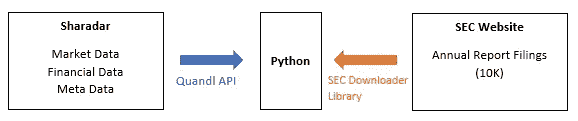

数据库示意图(图片由作者提供)

***文本预处理***

鉴于数据跨度长达数十年，年度报告采用多种格式，包括文本、html 和 XBRL。因此，使用 Regex 来解析报告并删除特殊字符:

```
def remove_html_tags_char(text):
    '''Takes in string and removes special characters '''

    #Define special Chars
    clean1 = re.compile('\n')               
    clean2 = re.compile('\r')               
    clean3 = re.compile('&nbsp;')           
    clean4 = re.compile('&#160;')
    clean5 = re.compile('  ')
    #Define html tags
    clean6 = re.compile('<.*?>')
    #remove special characters and html tags
    text = re.sub(clean1,' ', text)
    text = re.sub(clean2,' ',text)  
    text = re.sub(clean3,' ',text) 
    text = re.sub(clean4,' ',text) 
    text = re.sub(clean5,' ',text) 
    text = re.sub(clean6,' ',text) 
    # check spacing
    final_text = ' '.join(text.split())return final_text
```

为了与现代方法保持一致，文本经过了最低限度的处理，没有词汇化、词干化或停用词删除。这遵循了这样的想法，即有了足够大的数据集，应该让模型来确定这些细微差别(例如时态)对于手头的问题是否重要。

***数据探索***

数据高度**不平衡**:

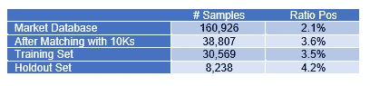

跨管道少数民族阶层比例的演变(图片由作者提供)

毫不奇怪，**“几乎破产”超过了美国经济衰退**(与美国实际 GDP 的关系更加微妙——详见 GitHub):

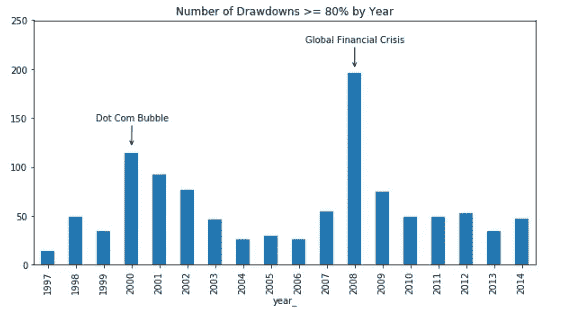

作者图片

像许多其他市场价格变量一样，**自相关性或持续性**在股本缩减中很明显:

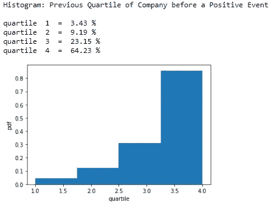

作者图片

这最后一个观察导致了市场(MKT)模型的引入，用于基线比较的目的。MKT 只是将一家公司之前的年度支出四分位数排名作为唯一特征。

**交叉验证**

*方法*

从 2015 年开始的数据被用作保留集，而训练数据从 1997 年运行到 2014 年。使用**扩展窗口**方法，将 CV 集分成 5 等份:

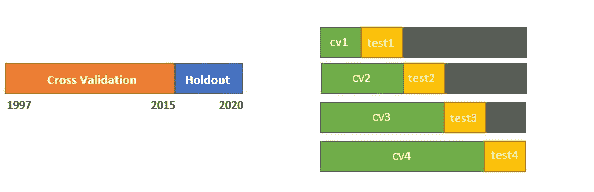

CV 集从 1997 年运行到 2015 年，并使用扩展窗口方法分成 4 次迭代(图片由作者提供)

tf-idf 矢量器在 CV 训练数据上形成，然后使用*变换*将测试文档转换成其 tf-idf 矩阵。宏(谐波)召回被用作 CV 分数，并且与训练集中的数据量成比例地加权(即，CV1 具有 10%的权重，CV2 具有 20%的权重，等等)。在需要加试的情况下，使用 CV 集得分的标准差。

*结构*

使用欠采样、过采样和类别权重来解决数据不平衡问题。考虑的另一个样本偏差是财务报表随时间的不平等分布可能会损害模型的通用性。事实上，我们可能会认为，过去 23 年中不断变化的监管、会计、法律和经济格局将在年度报告的语言和结构中得到反映。为了对此进行测试，对(I)多数类数据的随机选择和(ii)保持每年多数类事件比率等于少数类事件比率的预处理样本进行了验证(*时间均衡*)。最后，测试了各种概率阈值和集合。

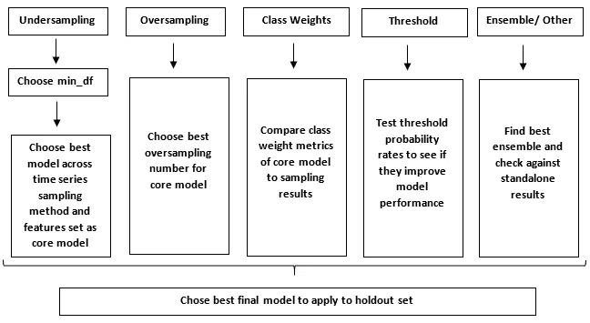

机器学习实现示意图(图片由作者提供)

*主要结果*

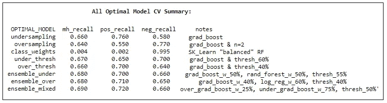

最佳微调下各种模型的 CV 性能指标(图片由作者提供)

欠采样比过采样表现更好

时间均衡将欠采样分数从 62%提高到 66%

梯度增强的性能优于随机森林和对数回归

欠采样有利于肯定回忆(灵敏度)，而过采样有利于否定回忆(特异性)

**最佳模型是比率为 25% / 75%的过采样/欠采样的集合，两种模型都使用梯度增强**

**拒绝测试**

*结果*

最优模型(NLP)应用于基于年度扩展窗口的维持集。然后将综合结果与基线财务比率(FIN)和市场(MKT)模型进行比较:

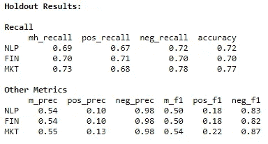

与 FIN 和 MKT 相比，NLP 的聚合维持结果(图片由作者提供)

NLP 混淆矩阵是:

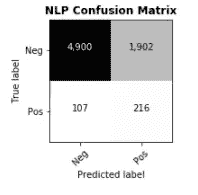

作者图片

*分析*

在二元目标的基础上使用连续变量的好处之一是，我们可以通过计算混淆矩阵中每个类别的下降统计来计算模型误差的成本:

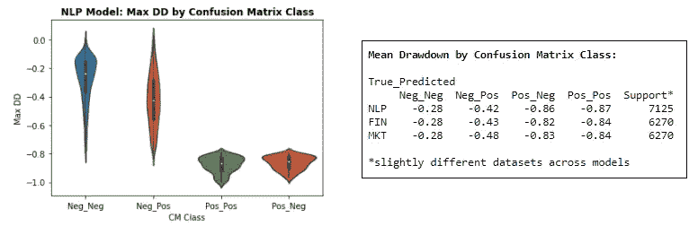

假阳性捕捉关于连续目标空间的有用信息(图片由作者提供)

尽管假阳性的比例相对较高并且相关联的精度较低，但是模型误差揭示了关于分类空间的有趣信息

这可以更实际地在领域空间中通过形成预测真实、预测负面和所有的平均加权的投资组合来充实:

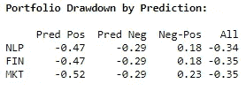

模型实用程序的领域视角(图片由作者提供)

*解读*

对这些模型的解释有些挑战，但是我们可以看看在独立的基础上，维持集中的哪些词具有最高的概率。这是通过形成文档矩阵来实现的，其中每个文档只有一个唯一的单词，然后通过模型预测来运行该矩阵。需要注意的是，一个单词可能有很高的概率，但它只适用于一个或很少几个文档。在这方面，并不是所有的话都会被*笼统地*预测到。

从元数据开始，最大单个单词概率低于 50%，99.9%的单词在 20%到 30%之间。这表明是在文档中找到的单词的组合而不是单个隐含单词产生了高概率的文档。

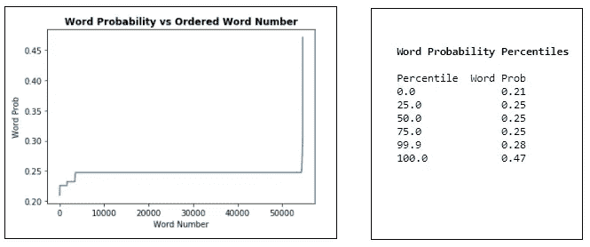

独立单词概率表示单词组合驱动模型(图片由作者提供)

下面列出的**热门词汇**被手动分类。在这些类别中:会计/信贷、顾问发言/业务重组和负面情绪词汇直观上令人愉悦。

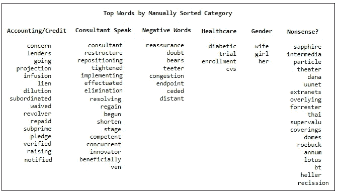

会计/信贷和顾问演讲/业务重组是直观的类别(图片由作者提供)

**进一步的思考**

看到一个相对简单的模型如 tf-idf 与基线财务比率模型相比表现如此之好，多少有些令人惊讶。信贷和业务重组的热门词汇类别表明，该模型擅长提取与财务比率中包含的信息类似的信息。该项目的下一阶段是探索与财务比率强劲的几乎破产事件相关的语言。这种对“额外性”的关注可能需要更复杂的算法(如 BERT)来更好地解析上下文，但可能能够揭示财务报表中不存在的会计欺诈或其他不诚实行为。

识别弱势公司是一回事，但知道这种弱势何时会在积极事件中表现出来要难得多，而且还取决于复杂的外部环境。这是对高假阳性率的合理解释。看看报告文本是否包含比已经摘录的更多的关于时间的信息将是令人着迷的。一种尝试的方法是余弦相似性，但这可能会受到维数灾难的影响。另一种方法是将单个公司的 tf-idf 矩阵本身的年度变化包括在特征集中。在总体水平上，人们可以试着检验年度 tf-idf 矩阵是否能预测下一年几乎破产数量的变化。

**Github**

该模型连同其他项目文件可在 [GitHub](https://github.com/gslicht/Using_NLP_to_Predict_Almost_Bankruptcy) 上获得。玩得开心，请随时分享反馈！