# 用非负矩阵分解对公司进行分类。

> 原文：<https://towardsdatascience.com/using-nmf-to-classify-companies-a77e176f276f?source=collection_archive---------9----------------------->

## 从非财务标准中提取有价值的信息。


乔希·里默尔在 [Unsplash](https://unsplash.com?utm_source=medium&utm_medium=referral) 上的照片

# 介绍

公司是随着时间发展的复杂实体。作为一名参与投资的数据科学家，我长期以来一直在问自己这样一个问题:评估企业数据建模的最合适维度:这些东西存在于什么空间？没有比这个更好的答案了:“太多了！”。这个问题的另一种表述是询问有多少个**独立**标准足以描述一家公司。作为标准的例子，我们可以想到市场资本总额、工业部门、雇员人数、当前收入水平、碳足迹、金融分析师的意见等等:可用标准的数量很容易超过 100 个。这些标准**不是独立的**，相反，它们被一个隐含相关性的整体网络联系在一起。这使得选择相关的变量子集成为一项非常困难的任务。

# 分组与预测

投资从业者通过两种主要方式将机器学习应用于这些数据:

*   通过或多或少复杂的回归，根据不同标准的历史数据预测公司的未来行为，通常是其股票市场价值的演变。这就是**监督学习**。


照片由[石页康让](https://unsplash.com/@omgitsyeshi?utm_source=medium&utm_medium=referral)在 [Unsplash](https://unsplash.com?utm_source=medium&utm_medium=referral) 上拍摄

*   自动将公司分组为同质集合，从而能够将这些公司与其邻居进行比较，而无需适当的标签:这种练习被称为**无监督学习**。金融业经常使用的一个集合的例子是工业部门的概念。


由[塔伊夫·拉赫曼](https://unsplash.com/@ttaifrs?utm_source=medium&utm_medium=referral)在 [Unsplash](https://unsplash.com?utm_source=medium&utm_medium=referral) 上拍摄的照片

这两个练习——分组和**预测**——追求不同的目标，但随着更多标准的使用，这两个练习在实施时都更加困难和不稳定。这是统计学习中众所周知的现象的表现之一，被称为“维数灾难”。

因此，自然需要通过减少所用标准的数量来缩小问题的规模。说起来容易做起来难。如果我们添加一个可解释性约束，在实践中就更难实现了。

在本文中，我们将看到**非负因式分解算法(NMF)** 如何让这两个目标更接近。

现在让我们把这个问题形式化一点。

# 非负矩阵分解

假设可用数据由(n，f)类型的 X 矩阵表示，即 n 行和 f 列。我们假设这些数据是正的或零的，并且是有界的——这种假设可以放宽，但这就是精神所在。

X 的非负因式分解是 X 的一种近似分解:

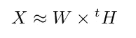

其中 W 为(n，c)型，H 为(f，c)型，满足约束 W ≥ 0，H ≥ 0。
需要记住的一些要点:

*   这种分解是近似的，而不是相等的。解 w 和 h 矩阵最小化了真实数据 x 和它们的近似 X^.之间的二次误差
*   这种分解不一定是唯一的，即使有积极性的约束。人们确实可以以正对角 D 矩阵的形式构造单位变换矩阵，然后获得以下形式的相同分解:

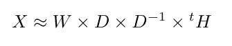

d 及其逆都是正系数的对角线

*   c ≤ min(n，f)是一个整数，表示所选元件的数量。与 K-均值聚类方法一样，该参数表示方法的参数自由度。确定组件的最佳数量需要一个额外的标准。
*   在文献中通常将 W 矩阵的线称为**因子**。

在这里可以找到关于 NMF 的精彩介绍。

# 如何解读分解

通常将 X 线视为同一类别(如客户、患者、公司等)对象的 n 次观察。每个对象都有 f 个属性，矩阵中包含的数据对应于相应对象的属性所取的值。

这种分解的主要效果是减少描述一个观察结果所必需的信息。以近似为代价，X 矩阵的原始观测值可以恢复为具有正系数的线性组合——H 矩阵的线。因此实现了大小的减小:包含在原始矩阵中的部分信息，包括每个个体的 f 数据，可以由每个个体的更小的 c 数据集合来近似概括。

非负分解的另一个有趣的效果是观察和属性的自然聚集的出现。潜在的数学原理在这篇论文中会带我们走得太远，但是你可以在[这篇文章](https://pubmed.ncbi.nlm.nih.gov/27213413/)【2】中找到一个非常清晰的表述。直观地，可以根据主导因子，即 c 个因子中具有最高值的因子，对观察值进行聚类。同样，可以根据对其影响最大的因素对原始特征进行分组。

这种聚集的自然可能性与系数的正定性密切相关。这是与主成分分析(PCA)的一个重要区别，在 PCA 中，要求因子成对正交，这使得不可能控制系数的符号。

# 企业外部财务数据的应用

为投资者收集和发布非金融企业数据本身就是一个行业，参与者是评级机构。每个机构都有自己的标准和自己的评级方法，但从一个机构到另一个机构可以找到大量的标准。

我们感兴趣的是根据环境(E)、社会(S)和治理(G)这三个主要支柱来描述公司行为的数据。这些数据被称为行为得分。他们根据男女同酬、董事会中独立董事的比例、水污染、碳足迹等标准，对公司的表现进行评分，分值范围为 0 到 100 分。

这些分数通常由评级机构每年审核一到两次，主要由公司在申报的基础上进行审核。我们将把这些分数中包含的信息用于:

*   根据比行业部门更多的内在信息确定同类公司群体，
*   将变量分组，以减少影响因素的数量。

本文使用的数据是来自 Vigeo-Eiris research 的 77 个行为得分，Vigeo-Eiris research 是穆迪评级机构的子公司，专门从事全球上市公司的财务外评级。我们在此展示的数值经验是基于欧洲 500 只最大股票的得分，在 2011 年 9 月至 2020 年 6 月期间进行平均评估。

Vigeo 的行为评分分为 6 个方面:

*   环境
*   公司治理
*   社交:商业行为
*   社会:人权
*   社会:人力资源
*   社会:社区参与

关于评分方法的更多内容可在此处找到[。](http://vigeo-eiris.com/about-us/methodology-quality-assurance/?lang=en)

这种数据的多样性和粒度使得有可能设想一个比简单基于工业部门的更相关的公司分组。我们将通过对分数数据应用 NMF 来检验这一假设。

# 缺失数据的替换

并非所有部门的所有行动都有行为得分，因此该系列有缺失值。

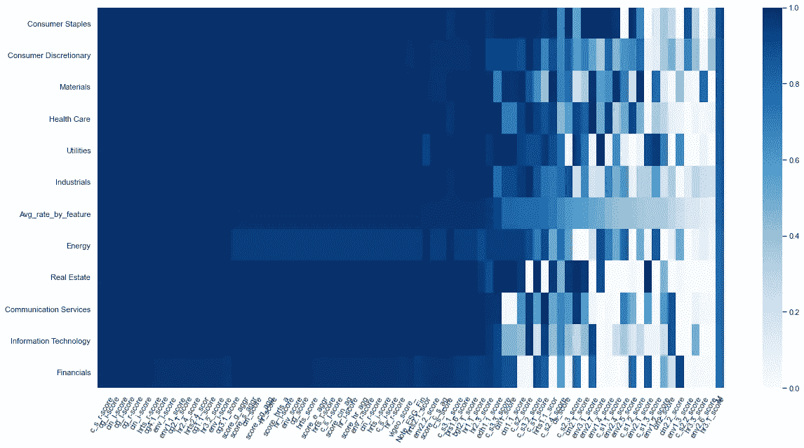

各种分数的部门平均填充率的图形视图。全球平均水平为 81.6%。

图表最左侧的分数具有 100%的填充率。例如，与商业行为(以 C_S 开头)或公司治理(以 C_G 开头)相关的分数就是如此。另一方面，高度专业化的得分，如当地污染治理(名为 EnV2_6)的填充率最低，在一些主题相关性较低的部门(金融、房地产)，填充率可降至 0。

像大量基于矩阵代数的方法一样，NMF 不允许**丢失数据**。因此，我们将用相同分数的平均值替换原始矩阵中每个分数缺失的值，该平均值取自填写了该分数的所有公司。

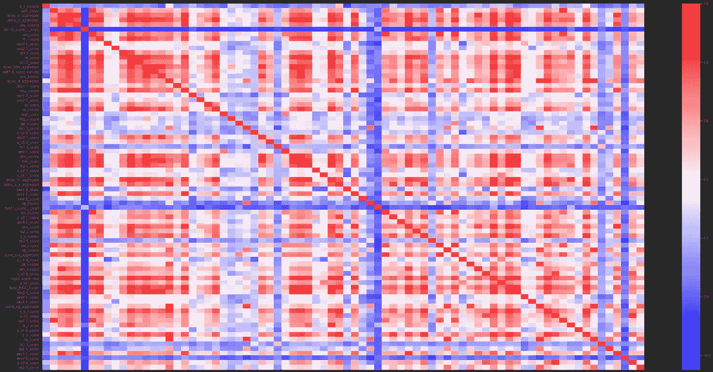

填充缺失数据后要素的相关矩阵-平均成对相关为 41%。两个分数之间的相关性是跨 500 只股票计算的。

# 寻找最佳维度

我们现在几乎准备好启动 NMF 分解。我们现在要做的就是为参数 c 选择一个值。我们对该参数的最佳值知之甚少，但我们希望以下方案是正确的:

*   c == >数据保存的小值和不精确的模型，
*   c == >数据密集的大值和更精确的模型。

这个原则将帮助我们定义一个目标函数，该函数综合了**稀疏度**、**稳定性**和**精度的概念。**这些概念确实是预测系统可解释性的关键因素，正如这里的【3】，【4】所解释的。为了简单起见，在本文中我们将把稳定性放在一边，重点放在稀疏性和精确性上。

为了量化稀疏性，让我们观察大小为(n，f)的初始矩阵已经被分别大小为(n，c)和(c，f)的两个矩阵所代替。因此，我们可以定义由以下公式给出的**稀疏分数**:

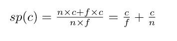

sp(c)是 c 分量的**稀疏分数**,

当然，对于 c = 1，这个分数将是最小的，在理论情况下，所有的观测值将大致是单个向量的倍数。

为了量化精度，很自然地通过以下公式定义类似于线性回归 R 的**精度分数** err(c ):

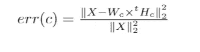

逼近误差的归一化度量。

我们可以通过结合精确性和稀疏性最终定义一个**可解释性得分**:

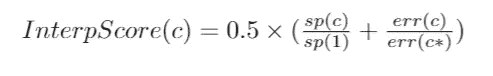

这个分数是一个介于 0 和 1 之间的数字，按照惯例 **0 是可解释性的最佳水平**，1 是最差水平。

当 c = 1 或 c = c*时，分数被校准为 100%最大值；常数 c*起着最大可接受维数的作用，这里设置为 20。

这里有几行你必须写的代码，计算一个给定维度 c 的 [NMF 分解](https://scikit-learn.org/stable/modules/generated/sklearn.decomposition.NMF.html):

```
**>>> import** **numpy** **as** **np
>>> import pandas as pd
>>> from** **sklearn.decomposition** **import** NMF**>>>** X = pd.read_csv (scores_file_path)  # reading the score data
**>>>** c = 4 **>>>** model = NMF(n_components=c, init='random', random_state=0)
**>>>** W = model.fit_transform(X)
**>>>** H = model.components_
**>>>** err = model.reconstruction_err_
```

矩阵 H 和 W 是计算的主要输出，需要它们来重建近似矩阵和误差函数 err(c)。

下图是通过绘制 sp(c)、err(c)和 inter score(c)的值获得的。

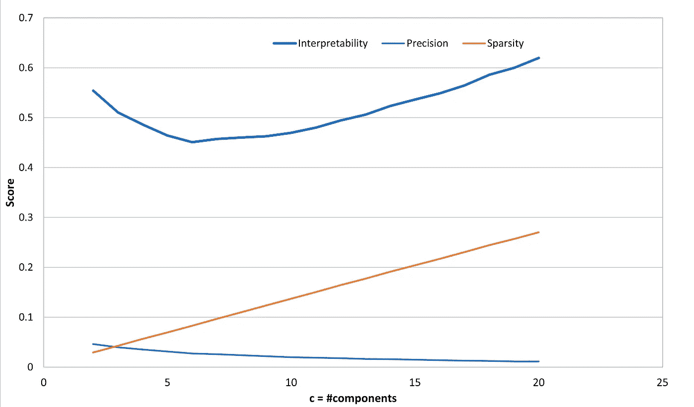

c = 6 时可解释性得分最佳

该图清楚地显示了精度和简约性之间的权衡，c 在 2 到 6 之间急剧下降，随后随着 c 值的增大而缓慢加速上升，在下文中，出于示例的目的，我们保留 c=6 作为元件数量。

# 收集 NMF 福利

## 特征收缩

我们从非负因式分解中获得的最明显的好处是，最初的 77 个特征被 6 个正线性组合的缩减子集，即 ***元特征*** 所取代。

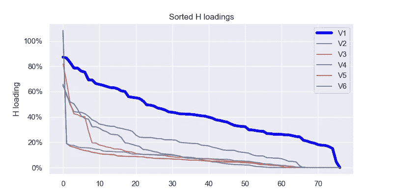

随着等级的增加，特性显得更有选择性。

该图显示了 6 个新的元特征在最初的 77 个特征上的系数分布(“负载”)。正如所料，这些系数分布在几个特征上，线性组合可能难以解释。元特征#1 尤其如此，随着元特征等级的增加，系数越来越集中。

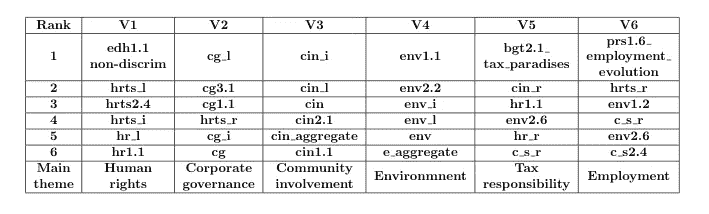

将**主题**分配给元特征

这个数组显示了每个元特性的 6 个最具影响力的特性。有趣的是，这些流入特征的主题是相互关联的。因此，我们可以为每个元特征分配一个主题。例如，特写 V1 讲述的故事大多是关于**人权** (hrts)和人力资源(hr)，而 V4 讲得很清楚的是**环境** (env)。

NMF 交易了维度和可解释性，通过大幅降低维度(从 77 到 6)，代价是获得更多的*但仍有**有意义的**特征。*

## *公司集群*

*有趣的是，NMF 的对称公式还提供了一种将所有公司分组为 6 个可能集群的自然方法:当股票的最大价值在列 I 中时，即当其在元特征#i 上的得分最高时，我们简单地将集群#i 分配给股票。让我们来看看这种将公司分组的新方法如何对应于通常的行业:*

*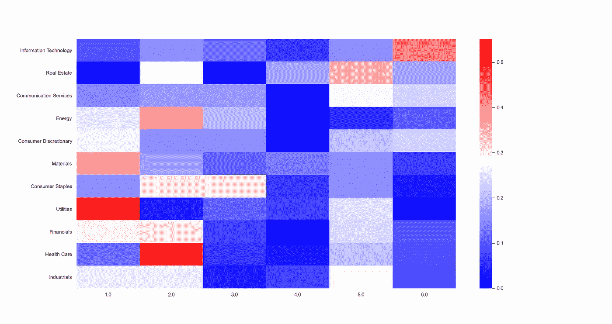*

***NC = 6 个分量的扇区/ NMF 簇对应关系***

*基于 NMF 的聚类带来了不包含在单独的部门中的信息。我们可以将前面图中的每一行作为各个元特征的每个扇区的“签名”。例如，能源部门在与环境主题相关的元特征#4 中得分最低。*

## *缺失数据*

*记住，我们从一个包含缺失数据的 X 矩阵开始。我们已经用每一列的**全局平均值**填充了空的单元格，并用填充后的矩阵填充了我们的 NMF 算法。*

*既然我们已经有了股票的聚类，为什么我们不尝试通过用每列的平均值代替空单元格来改进缺失数据的填充，用相同聚类的股票来代替所有股票呢？这将提供对 X 的新估计，该估计又可以用作因式分解的输入。如此等等…*

*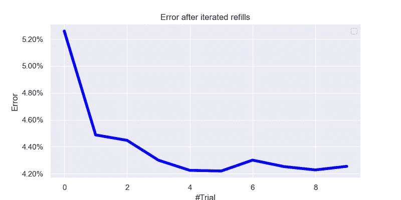*

*使用 NMF 对缺失数据进行自举可以减少 20%的近似误差。*

*与基于均值的先验知识相比，NMF 提供的线聚类允许**以更高的精度插值数据矩阵的缺失值**。这种方法在许多领域非常有用，主要优点是相对于像扇区这样的外部聚类的独立性:它是完全数据驱动的吗？*

# *结论*

*本文旨在说明并支持如何使用非负矩阵分解作为一种强大的工具来创建观察值和特征的自然分组。这一点在生命科学领域早就被认识到，特别是在基因组学领域，减少特征的数量同时保持分析的可解释性是至关重要的。*

*将 NMF 应用于额外的金融数据是提取这些数据集中包含的有价值信息的一种创新方法。我们使用了特定提供商 Vigeo-Eiris 的数据，但好消息是，当使用多个数据源来展示公司的基本属性时，这种方法将非常稳健。*

# *进一步阅读的参考资料*

*[1]丁，钟汉卿；陶；Jordan，M.I .凸和半非负矩阵分解(2010 年)。IEEE Trans。模式
肛门。马赫。Intelli。拱门。2010, 32, 44–55.*

*[2] P.Fogel，Y. Gaston-Mathé等人，使用非负矩阵分解的新型聚类方法在公共卫生环境
研究中的应用(2016)，国际环境研究和公共卫生杂志。*

*[3] B. Yu 和 K. Kumbier，数据科学的三个原则:可预测性、可计算性和稳定性(pcs) (2019)，arXiv 预印本 arXiv:1901.08152。*

*[4]诉玛戈特。比较可解释性的严格方法(2020)，arXiv 预印本 arXiv:2004.01570。*

*[5] Vigeo-Eiris，网站(2020 年)*