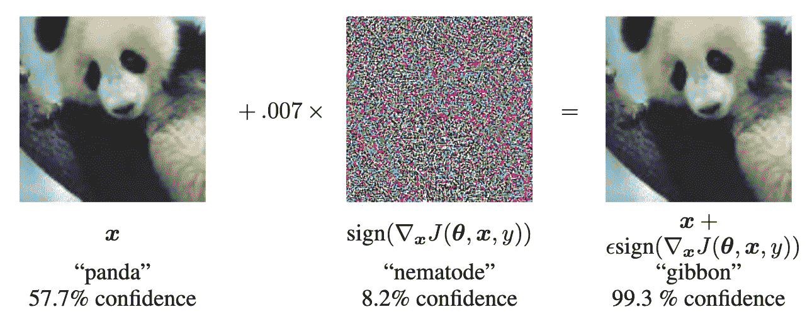
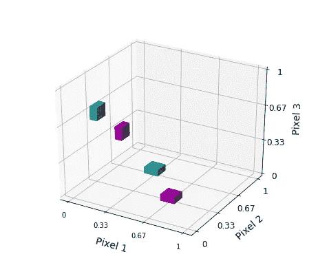
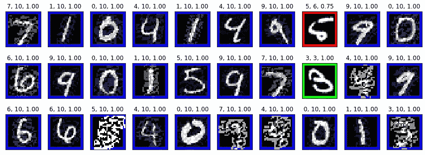

# 使用零样本来形成决策空间和防御敌对攻击

> 原文：<https://towardsdatascience.com/using-null-samples-to-shape-decision-spaces-and-defend-against-adversarial-attacks-3ecd16b6596c?source=collection_archive---------35----------------------->

## 一种更自然的模型训练方法

在机器学习分类模型中，各个类别的最佳决策空间可能是复杂且不相交的，并且仅占据整个输入空间的很小一部分。尽管上图中的绳索纠缠在一起，但人们可以很容易地发现图像中不属于任何绳索的点(这是绝大多数的点)。然而，我们在机器学习社区中不允许我们传统训练的机器学习模型做同样的事情。在这幅图中，这样的模型会愚蠢地将每个点分配给一条绳索。这种不自然的条件可能是这些模型易受恶意(欺骗)攻击的根本原因。

这篇文章是我最近在 arXiv.org 上发表的一篇技术报告的摘要。在这里阅读完整的报告(和正式的引文):[https://arxiv.org/abs/2002.10084](https://arxiv.org/abs/2002.10084)

# 介绍

大约在 2012 年计算机视觉的新一波神经网络模型到来后不久[Krizhevsky，2012；LeCun，2015 年]，人们发现，这种网络可以被巧妙设计的图像所欺骗，这些图像对人类来说，看起来与原始图像的改变很小，如果有的话[Szegedy，2013 年]。这种所谓的*敌对例子*给许多需要抵御敌对行为者的计算机视觉应用带来了问题。

通过向熊猫图像添加一点点噪声，常规训练的神经网络以很高的可信度将熊猫图像误认为长臂猿图像[Goodfellow，2014]。

显然，卷积神经网络(CNN)模型做出决定的方式与人类或任何其他哺乳动物都非常不同。

问题的一个可能来源是，模型被设计和训练为将图像分类为属于 *N* 类(对象)之一，而不管图像。例如，如果一个模型被训练来对从 0 到 9 的孤立数字的图像进行分类，然后显示一个“T”或一个“$”或一只驴子，它会将该图像分类为其中一个数字-这就是它被训练做的所有事情。

这意味着在可能图像的高维输入空间中，每个点都被分配给一个对象类。各个类的决策空间共同填充整个空间，尽管对于给定的对象类，真实样本仅位于学习决策空间的一个小的子区域内。决策空间彼此邻接，即使空间内的真实样本被很好地分开。

下面介绍的是一个玩具模型和任务，它允许这种情况的可视化，它使传统模型容易受到敌对攻击的方式，以及缓解该问题的策略。

# 典型的例子

图 1:玩具示例的最佳决策空间

在我们的玩具环境中，输入“图像”是三个像素的线性阵列，其中可能存在两个对象中的一个，每个对象是一对具有特定值的相邻像素。上图显示了两类物体(洋红色和青色)可能存在的位置。空间位置与类别身份无关，因此单个类别的对象样本存在于 3D 输入空间的两个隔离区域中。彩色区域代表两个类别的“最佳”决策空间，即在洋红色和青色区域之外不存在训练样本。

我们在这个分类任务上训练了一个简单、传统的 CNN，然后用跨越整个输入空间的样本来探测该模型。产生的决策空间如下所示。

图 2:传统 CNN 模型的学习决策空间

传统 CNN 的决策空间完全填充了输入空间——对于给定的架构和训练，它们必须如此——并且各个类的空间(图 2 的中间和右边的面板)比真实对象样本(图 1)的空间大得多。不难想象，当添加到真实对象样本中时，一点点噪声可能会将图像推过决策边界。

缓解这个问题的一个方法是(1)向模型添加一个 *(N* +1)ᵗʰ输出——该输出指示一个*空类*，而不是 n 个对象类中的一个，以及(2)在训练期间使用*空样本*以及对象样本。对于玩具示例，我们使用均匀噪声的三像素图像作为零样本。

图 3:零训练 CNN 模型的学习决策空间

在训练完这个*零模型*后，我们像对传统模型一样可视化决策空间。如上所示，决策空间已经大大缩小了。该图仅显示了两个对象类的决策空间。视觉上的空白空间是 null 类的决策空间。换句话说，如果输入图像没有落入其中一个对象类的决策空间，则允许该模型将输入图像“未分类”。

我们推测，随着输入空间维度的增加，玩具示例中传统模型所展示的情况只会变得更糟。习得的决策空间是错综复杂的，真实的对象样本可能位于与对象的因果特征不相关的决策边界附近——也就是说，使其成为其类成员的特征。

# MNIST 数字识别的零训练模型

虽然 MNIST 数字分类通常被认为是一个“简单”的分类基准任务，CNN 模型仍然容易受到敌对攻击。已经取得了进展[Madry，2017]，但即使是最好的常规 CNN 模型也仍然很脆弱[Schott，2018]。有人可能会说，其他模型类型已经“解决”了这个问题，例如 Schott 等人的*综合分析*模型【Schott，2018】。我们从这种模型中获得了有益的见解，但它们在计算上非常昂贵，对于使用 2020 年硬件处理照片级逼真图像的应用程序来说，不太可能是可行的解决方案。

因此，我们有动力在 MNIST 基准测试任务上测试我们的方法。我们首先训练了一个常规(或“基线”)CNN，在未受干扰的 MNIST 测试集上实现了 99%以上的准确率。然后，我们使用快速梯度符号方法(FGSM) [Goodfellow，2014]来创建具有足够噪声(噪声乘数的最小可能值，ε)的对立图像，以便基线模型将数字分类为除未受干扰的源图像之外的数字。示例如下所示。

图 4:从基线传统模型中创建的对立例子。带有红色边框的图像是那些模型犯了错误分类错误的图像，这是所有这些图像的设计。每个图上方的数字依次为:源图像标签、模型预测标签和预测标签的得分(概率)。

然后，我们训练了一个零模型，使用三种类型的零样本——均匀噪声、混合数字图像和平铺混洗图像。在训练期间，所有的空图像都被赋予空目标标签。

图 5:在零模型的训练中使用的零图像的例子。顶行:均匀噪声。中间一行:混合数字图像。底部一行:不同大小的随机图像。

在训练零模型之后，我们在从基线模型创建的敌对图像上测试它。如下图所示，大多数对抗性图像被归类为空图像(即“未分类”)，而不是错误地归类为不同的数字。

图 6:从基线模型中创建的对抗性例子，并由空模型评分。图标题如图 4 所示。边框-绿色:数字分类正确。红色:分类错误的数字，蓝色:未分类。

最后，我们评估了一组基线模型和几组零模型的性能(每一组都用不同类型的零样本训练)。我们不是简单地在一组固定的对立例子上进行测试，而是通过将噪声乘数ε的范围从 0 变到 1 来改变扰动的程度。

图 7:基线和模型在一系列扰动下的性能(ε值)。左:零模型训练的混合数字零样本。中间:在混排数位零样本上训练的零模型。右图:在混合和混排样本上训练的空模型。

如上所述，用混合数位零样本(左图)训练的零模型有效地防止了对具有低扰动的图像的错误分类，优先将这样的图像分类为零。相比之下，用混洗数位零样本(中间的面板)训练的模型在防止对具有高扰动的图像的错误分类方面是有效的。当对这两种类型的零样本(右图)进行训练时，不管扰动的大小如何，零模型很少产生错误分类。

# 结论

在混合数字和混洗数字零样本上训练的 MNIST 零模型很少在扰动图像上犯数字误分类错误，并且它们准确地分类未扰动的数字图像。此外，我们的零训练方法在训练和推理期间都是计算有效的。

然而，应该强调的是，尽管这些图像中的数字很容易被人类识别，但是零模型不能正确地对具有适度扰动的图像进行分类。相反，这些模型用错误分类换取无效分类。这种折衷对于许多应用程序来说可能是完全可以接受的，因为错误分类可能是灾难性的，而空分类可以被忽略或以其他方式处理。

为了开发既能很好地概括*又能抵御敌对攻击的*模型，还需要额外的研究。一种策略可能是将我们的零训练方法与受损图像训练相结合，最近的研究表明，如果元参数值得到适当调整，就可以提高泛化能力[Rusak，2020]。