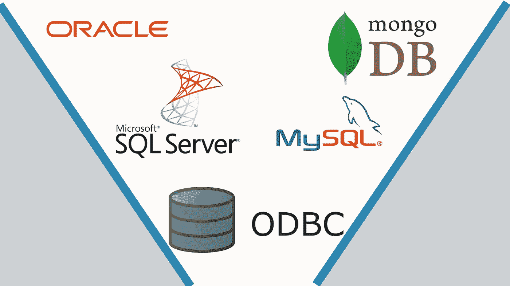

# 使用 ODBC 将任何数据库直接连接到 Jupyter notebook。

> 原文：<https://towardsdatascience.com/using-odbc-to-connect-any-database-directly-to-jupyter-notebook-19741b4b748?source=collection_archive---------8----------------------->

## 嘘，如果你不喜欢 ODBC，也可以选择



无论您是将数据存储在本地还是远程系统中，无论是哪种类型的数据库管理系统， [ODBC](https://en.wikipedia.org/wiki/Open_Database_Connectivity) 都是解决方案。

# 介绍

ODBC 是一个开放的接口，使用 ODBC 驱动程序可以连接几乎所有的数据库管理系统。ODBC 驱动程序是由数据库管理系统提供的，它有助于连接特定的数据库系统。

因此，当数据科学家或分析师需要在他们喜欢的 Jupyter NB 中快速运行查询时，ODBC 就派上了用场。

现在对于 R 中 ODBC 的连接，你可以跟随[其他](https://blog.redpillanalytics.com/how-to-use-the-new-r-odbc-package-to-connect-to-an-oracle-database-70ce6783e397)教程，因为我将只演示 python 实现。

**注意**除了 ODBC 之外，您可以利用其他的包进行连接，但是大多数包只能连接特定的数据库管理系统。

用于 ODBC 的 python 包: ***pyodbc***

# 微软 SQL

> **安装 MS-SQL 驱动程序—仅当数据在远程机器上时才需要安装**

## ***根据您的操作系统下载 MS-SQL 驱动***

**窗户**

1.  对于 windows，只需点击一下鼠标即可轻松安装。MS-SQL 的 ODBC 在这里可用[。](https://www.microsoft.com/en-us/download/details.aspx?id=56567)

2.安装。msi 文件按照你的位。

Linux — Ubuntu

```
sudo su 
curl [https://packages.microsoft.com/keys/microsoft.asc](https://packages.microsoft.com/keys/microsoft.asc) | apt-key add -#Download appropriate package for the OS version
#Choose only ONE of the following, corresponding to your OS version#Ubuntu 14.04
curl [https://packages.microsoft.com/config/ubuntu/14.04/prod.list](https://packages.microsoft.com/config/ubuntu/14.04/prod.list) > /etc/apt/sources.list.d/mssql-release.list#Ubuntu 16.04
curl [https://packages.microsoft.com/config/ubuntu/16.04/prod.list](https://packages.microsoft.com/config/ubuntu/16.04/prod.list) > /etc/apt/sources.list.d/mssql-release.list#Ubuntu 18.04
curl [https://packages.microsoft.com/config/ubuntu/18.04/prod.list](https://packages.microsoft.com/config/ubuntu/18.04/prod.list) > /etc/apt/sources.list.d/mssql-release.list#Ubuntu 18.10
curl [https://packages.microsoft.com/config/ubuntu/18.10/prod.list](https://packages.microsoft.com/config/ubuntu/18.10/prod.list) > /etc/apt/sources.list.d/mssql-release.list#Ubuntu 19.04
curl [https://packages.microsoft.com/config/ubuntu/19.04/prod.list](https://packages.microsoft.com/config/ubuntu/19.04/prod.list) > /etc/apt/sources.list.d/mssql-release.listexit
sudo apt-get update
sudo ACCEPT_EULA=Y apt-get install msodbcsql17
# optional: for bcp and sqlcmd
sudo ACCEPT_EULA=Y apt-get install mssql-tools
echo 'export PATH="$PATH:/opt/mssql-tools/bin"' >> ~/.bash_profile
echo 'export PATH="$PATH:/opt/mssql-tools/bin"' >> ~/.bashrc
source ~/.bashrc
# optional: for unixODBC development headers
sudo apt-get install unixodbc-dev
```

**Linux — Debian**

```
sudo su 
curl [https://packages.microsoft.com/keys/microsoft.asc](https://packages.microsoft.com/keys/microsoft.asc) | apt-key add -#Download appropriate package for the OS version
#Choose only ONE of the following, corresponding to your OS version#Debian 8
curl [https://packages.microsoft.com/config/debian/8/prod.list](https://packages.microsoft.com/config/debian/8/prod.list) > /etc/apt/sources.list.d/mssql-release.list#Debian 9
curl [https://packages.microsoft.com/config/debian/9/prod.list](https://packages.microsoft.com/config/debian/9/prod.list) > /etc/apt/sources.list.d/mssql-release.list#Debian 10
curl [https://packages.microsoft.com/config/debian/10/prod.list](https://packages.microsoft.com/config/debian/10/prod.list) > /etc/apt/sources.list.d/mssql-release.listexit
sudo apt-get update
sudo ACCEPT_EULA=Y apt-get install msodbcsql17
# optional: for bcp and sqlcmd
sudo ACCEPT_EULA=Y apt-get install mssql-tools
echo 'export PATH="$PATH:/opt/mssql-tools/bin"' >> ~/.bash_profile
echo 'export PATH="$PATH:/opt/mssql-tools/bin"' >> ~/.bashrc
source ~/.bashrc
# optional: for unixODBC development headers
sudo apt-get install unixodbc-dev
# optional: kerberos library for debian-slim distributions
sudo apt-get install libgssapi-krb5-2
```

**Linux — RedHat**

```
sudo su#Download appropriate package for the OS version
#Choose only ONE of the following, corresponding to your OS version#RedHat Enterprise Server 6
curl [https://packages.microsoft.com/config/rhel/6/prod.repo](https://packages.microsoft.com/config/rhel/6/prod.repo) > /etc/yum.repos.d/mssql-release.repo#RedHat Enterprise Server 7
curl [https://packages.microsoft.com/config/rhel/7/prod.repo](https://packages.microsoft.com/config/rhel/7/prod.repo) > /etc/yum.repos.d/mssql-release.repo#RedHat Enterprise Server 8
curl [https://packages.microsoft.com/config/rhel/8/prod.repo](https://packages.microsoft.com/config/rhel/8/prod.repo) > /etc/yum.repos.d/mssql-release.repoexit
sudo yum remove unixODBC-utf16 unixODBC-utf16-devel #to avoid conflicts
sudo ACCEPT_EULA=Y yum install msodbcsql17
# optional: for bcp and sqlcmd
sudo ACCEPT_EULA=Y yum install mssql-tools
echo 'export PATH="$PATH:/opt/mssql-tools/bin"' >> ~/.bash_profile
echo 'export PATH="$PATH:/opt/mssql-tools/bin"' >> ~/.bashrc
source ~/.bashrc
# optional: for unixODBC development headers
sudo yum install unixODBC-devel
```

**苹果操作系统**

```
/usr/bin/ruby -e "$(curl -fsSL [https://raw.githubusercontent.com/Homebrew/install/master/install](https://raw.githubusercontent.com/Homebrew/install/master/install))"
brew tap microsoft/mssql-release [https://github.com/Microsoft/homebrew-mssql-release](https://github.com/Microsoft/homebrew-mssql-release)
brew update
brew install msodbcsql17 mssql-tools
```

> **安装 python 的 pyodbc — ODBC 包**

1.  安装 pyodbc 包。

```
pip install pyodbc
```

2.要检查驱动程序是否安装正确，请找到所有连接到 pyodbc 的驱动程序。

```
import pyodbc
pyodbc.drivers()
```

对于 MS-SQL，它将导致

```
['ODBC Driver 17 for SQL Server']
```

随着更多的驱动程序添加到您的系统，更多的驱动程序将被添加到列表中。

> **连接到数据库**

1.  用于远程连接。

```
# enter ip address and port number of the system where the database resides.
server = 'tcp:31.288.186.65,49170'
database = 'database_name' # enter database name
username = 'user_name'
password = 'pass_word' # add appropriate driver name
cnxn = pyodbc.connect('DRIVER={ODBC Driver 17 for SQL Server};SERVER='+server+';DATABASE='+database+';UID='+username+';PWD='+ password)cursor = cnxn.cursor()
```

2.用于本地连接(如果数据在本地计算机中)。

```
 server = 'tcp:31.288.186.65,49170'
database = 'database_name' # enter database namecnxn = pyodbc.connect('DRIVER={SQL Server};SERVER='+server+';DATABASE='+database+';Trusted_Connection=yes;')cursor = cnxn.cursor()
```

> **查询数据库**

1.  你可以在你的笔记本上查询数据库，即选择、插入、更新或删除。

您的查询可以直接转换为熊猫数据框架。

```
import pandas as pd# select command
query = ''' SELECT RecordID FROM tables''';
data = pd.read_sql(query, cnxn)
data.head()
```

## **替代品**

或者，您可以使用 [pymssql](https://pypi.org/project/pymssql/) ，它的工作原理相同，但已经停止使用。不过，如果你想使用它，你必须安装

```
pip install "pymssql<3.0"
```

# 神谕

Oracle 也支持 ODBC 数据库。你需要根据你的操作系统为 oracle 安装一个 [ODBC 驱动。](https://www.oracle.com/database/technologies/instant-client/downloads.html)

1.  安装 Oracle ODBC 客户端。

从 [oracle 网站](https://www.oracle.com/database/technologies/instant-client/linux-x86-64-downloads.html)下载 instant client basic 和 odbc 包。

2.如果下载的包是 zip，使用 ***wget*** 解压或者 ***rpm*** 获取 rpm 文件。

3.设置 ORACLE_HOME 和 LD_LIBRARY_PATH

```
export ORACLE_HOME=/usr/lib/oracle/12.2/client64
export LD_LIBRARY_PATH=/usr/lib/oracle/12.2/client64/lib
```

根据您的版本更改路径“/12.2/”。

4.在/etc/odbcinst.ini 集中:

```
[oracle_db]
Description=Oracle ODBC driver for Oracle 12c
Driver=/usr/lib/oracle/12.2/client64/lib/libsqora.so.12.1
FileUsage=1
Driver Logging=7
UsageCount=1
```

5.现在，打开 Jupyter NB，您可以轻松连接到您的 oracle 数据库。

```
import pyodbc
conn = pyodbc.connect('DRIVER={oracle_db};Host=1.1.1.1;Port=1521;Service Name=orcl.local;User ID=test1;Password=test1')
```

## **替代品**

或者，您可以使用 [Cx_Oracle](https://cx-oracle.readthedocs.io/en/latest/) ，它的工作方式类似，但只适用于 Oracle 数据库。

# 我的 SQL

1.  对于 MySQL，它与上面的配置非常相似，您需要安装合适的 MySQL 驱动程序。

```
import pyodbc
conn = pyodbc.connect('DRIVER {MySQL};SERVER=localhost;DATABASE=test;UID=root;PWD=abc;')
```

## **替代品**

对于 Mysql，有许多包可以连接到 python，比如

*   MySQLdb
*   [mysql.connector](https://www.datacamp.com/community/tutorials/mysql-python)

# MONGO 数据库

1.  对于 [MongoDB](https://www.mongodb.com/blog/post/odbc-driver-for-the-mongodb-connector-for-business-intelligence) ，安装 [MongoDB 驱动](https://github.com/mongodb/mongo-odbc-driver/releases/tag/v1.0.0)并连接到 pyodbc。

## 可供选择的事物

或者，您可以使用 [pymongo](https://api.mongodb.com/python/current/tutorial.html) 来连接 python。

# 结论

根据连接性，有多个包来连接数据库，但是如果您只想要一个通用包， [pyodbc](https://pypi.org/project/pyodbc/) 就是您想要的包，它使用 [ODBC](https://en.wikipedia.org/wiki/Open_Database_Connectivity) 接口来访问独立于数据库系统的数据。

> 此外，对于任何澄清，评论，帮助，赞赏或建议，只需张贴在评论中，我会帮助你。
> 
> 如果你喜欢，你可以跟着我。

[](https://medium.com/@gauravc2708) [## Gaurav Chauhan -中等

### 阅读 Gaurav Chauhan 在媒体上的文章。hopscotch.health 的数据科学家，每天，Gaurav Chauhan 和数千人…

medium.com](https://medium.com/@gauravc2708) 

> 此外，如果你想要更多基于数据科学、人工智能或数据管道的内容，可以在我的社交媒体上连接我。

*   [Linkedin](https://www.linkedin.com/in/gauravc2708/)
*   [电子邮件](http://gauravc2708@gmail.com)
*   [推特](https://twitter.com/2796gaurav)
*   [中等](https://medium.com/@gauravc2708)