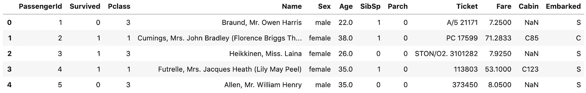
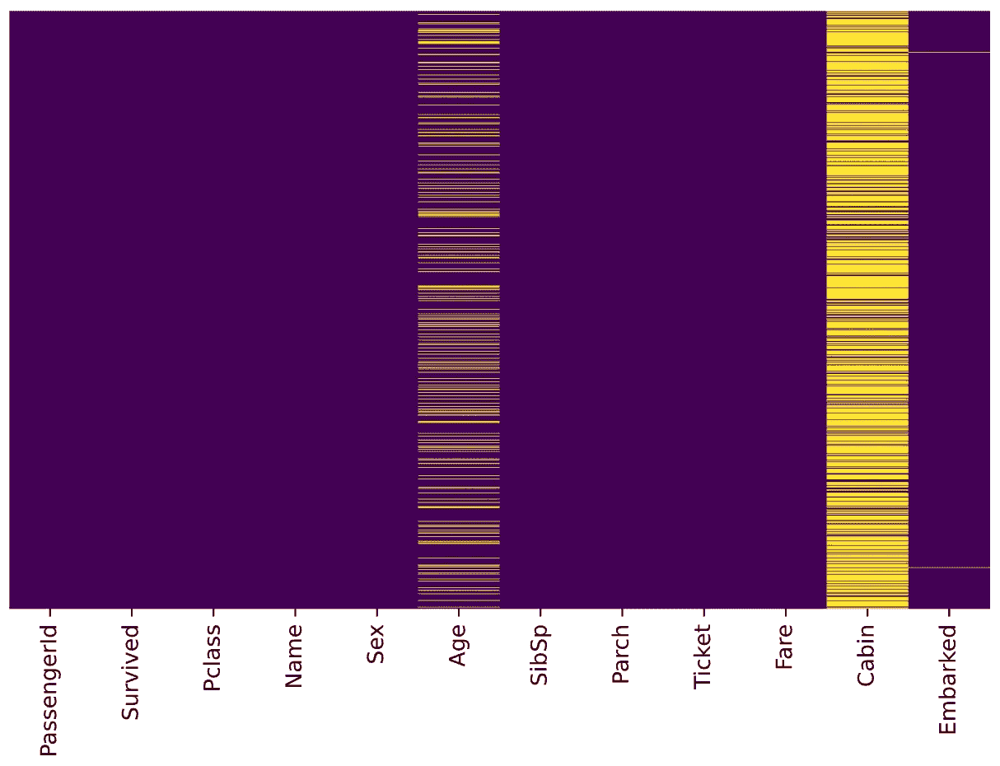
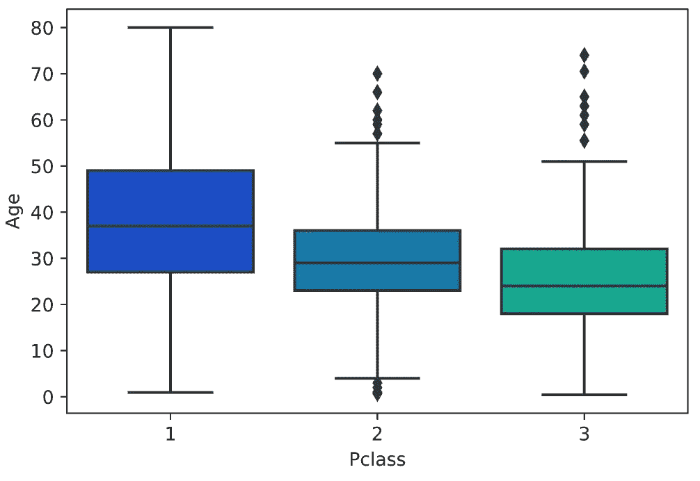
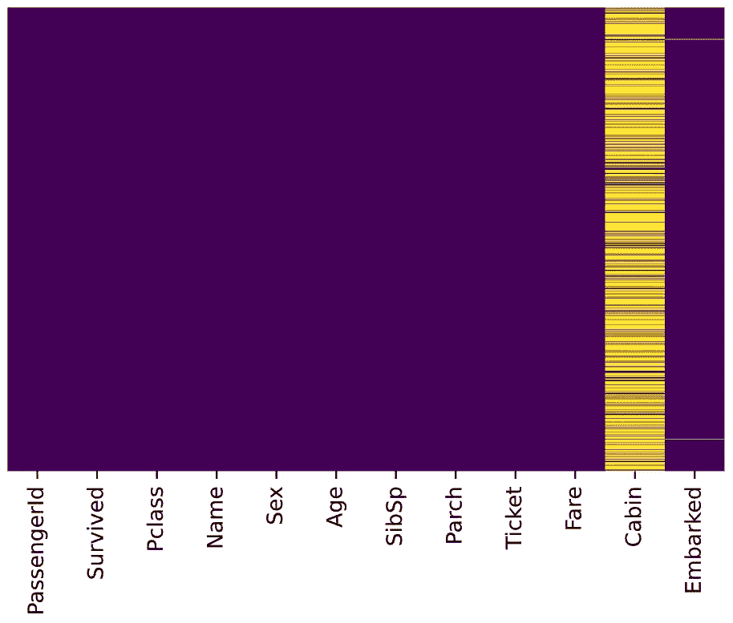
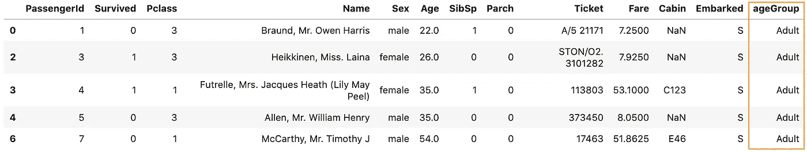
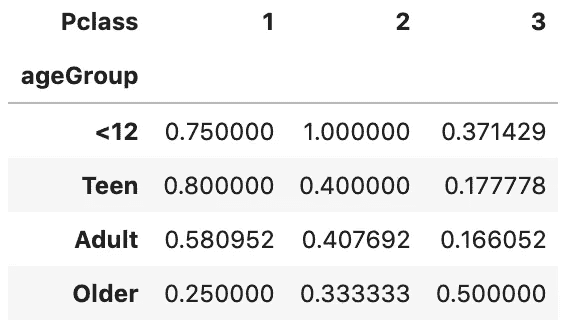
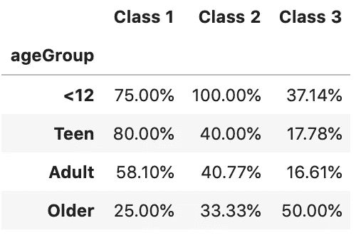

# 使用 Pandas 方法链接提高代码可读性

> 原文：<https://towardsdatascience.com/using-pandas-method-chaining-to-improve-code-readability-d8517c5626ac?source=collection_archive---------4----------------------->

## 熊猫方法链接的最佳实践教程


照片由[斯蒂芬·莱昂纳迪](https://unsplash.com/@stephenleo1982?utm_source=unsplash&utm_medium=referral&utm_content=creditCopyText)在 [Unsplash](https://unsplash.com/s/photos/chain?utm_source=unsplash&utm_medium=referral&utm_content=creditCopyText) 上拍摄

我们一直在讨论使用 [Pandas 管道函数来提高代码可读性](/using-pandas-pipe-function-to-improve-code-readability-96d66abfaf8)。在本文中，我们来看看熊猫**方法链接**。

在数据处理中，经常需要对某一行或某一列执行操作以获得新的数据。而不是写作

```
df = pd.read_csv('data.csv')
df = df.fillna(...)
df = df.query('some_condition')
df['new_column'] = df.cut(...)
df = df.pivot_table(...)
df = df.rename(...)
```

我们能做的

```
(pd.read_csv('data.csv')
   .fillna(...)
   .query('some_condition')
   .assign(new_column = df.cut(...))
   .pivot_table(...)
   .rename(...)
)
```

**方法链接**在 Pandas 中一直可用，但是**通过添加新的“可链接”方法，对链接的支持增加了**。例如`query()`、`assign()`、`pivot_table()`，特别是`[pipe()](/using-pandas-pipe-function-to-improve-code-readability-96d66abfaf8)`、[，用于在方法链](/using-pandas-pipe-function-to-improve-code-readability-96d66abfaf8)中允许用户自定义方法。

> 方法链是一种编程风格，它按顺序调用多个方法调用，每个调用对同一个对象执行一个操作并返回该操作。
> 
> 它消除了在每个中间步骤命名变量的认知负担。 [Fluent 接口](https://en.wikipedia.org/wiki/Fluent_interface)，一种创建面向对象 API 的方法依赖于方法级联(又名方法链)。这类似于 Unix 系统中的管道。
> 
> 阿迪亚曼·科尔提

方法链接大大增加了代码的可读性。让我们深入教程，看看它如何提高我们的代码可读性。

源代码请访问我的 [Github 笔记本](https://github.com/BindiChen/machine-learning/blob/master/data-analysis/007-method-chaining/method-chaining.ipynb)。

# 数据集准备

在本教程中，我们将处理来自 Kaggle 的[泰坦尼克号数据集。这是一个非常著名的数据集，通常是学生学习数据科学的第一步。让我们导入一些库并加载数据来开始。](https://www.kaggle.com/c/titanic/overview)

```
import pandas as pd
import sys
import seaborn as sns
import matplotlib.pyplot as plt
%matplotlib inline
%config InlineBackend.figure_format = 'svg'**df = pd.read_csv('data/train.csv')**
df.head()
```

我们将 **train.csv** 文件加载到熊猫数据帧中



泰坦尼克号数据预览


来自 [Kaggle](https://www.kaggle.com/c/titanic/data?select=train.csv) 的数据字典

让我们从检查缺失值开始。我们可以使用 seaborn 创建一个简单的热图来查看哪里缺少值

```
sns.heatmap(**df.isnull()**, 
            yticklabels=False, 
            cbar=False, 
            cmap='viridis')
```



缺失值的 seaborn 热图输出

***年龄*** ， ***船舱*** ， ***上船*** 有缺失值。 ***年龄*** 缺失的比例很可能小到足以用某种形式的插补进行合理替换。看着 ***舱*** 栏，好像缺了很多值。 ***着手*** 缺失的比例很小。

# 工作

假设我们被要求看一看从南安普顿出发的乘客，并计算出不同年龄组和***p 等级*** 的存活率。

让我们把这项任务分成几个步骤，一步一步地完成。

1.  数据清理:用某种形式的插补替换缺失的 ***年龄***
2.  选择从南安普敦出发的乘客
3.  将年龄转换为年龄范围组:≤12 岁、青少年(≤ 18 岁)、成人(≤ 60 岁)和老年人(> 60 岁)
4.  创建一个数据透视表来显示不同年龄组的存活率和 ***Pclass***
5.  通过重命名轴标签和格式化值来改进数据透视表的显示。

酷，让我们继续使用熊猫**方法链接**来完成它们。

## 1.用某种形式的插补替代缺失的年龄

正如在数据准备中提到的，我们希望用某种形式的插补来替换缺失的 ***年龄*** 。一种方法是填写所有乘客的平均年龄。然而，我们可以更聪明地处理这个问题，按乘客级别检查平均年龄。例如:

```
sns.boxplot(x='Pclass',
            y='Age',
            data=df,
            palette='winter')
```



我们可以看到，在较高的阶层中，较富裕的乘客往往年龄较大，这是有道理的。我们将根据年龄的 Pclass 使用这些平均年龄值进行估算。

```
pclass_age_map = {
  **1: 37,
  2: 29,
  3: 24,**
}def replace_age_na(x_df, fill_map):
    **cond=x_df['Age'].isna()
    res=x_df.loc[cond,'Pclass'].map(fill_map)
    x_df.loc[cond,'Age']=res** return x_df
```

`x_df['Age'].isna()`选择 ***年龄*** 栏，检测缺失值。然后，`x_df.loc[cond, 'Pclass']`用于有条件地访问 ***Pclass*** 值，并调用熊猫`[map()](/introduction-to-pandas-apply-applymap-and-map-5d3e044e93ff)`将每个值替换为另一个值。最后，`x_df.loc[cond, 'Age']=res`有条件地用`res`替换所有缺失的年龄值。

运行以下代码

```
res = (
  pd.read_csv('data/train.csv')
    **.pipe(replace_age_na, pclass_age_map)**
)res.head()
```

应根据年龄的 Pclass 替换所有缺失的年龄。让我们通过运行`res`上的热图来检查一下。

```
sns.heatmap(**res.isnull()**, 
            yticklabels=False, 
            cbar=False, 
            cmap='viridis')
```



太好了，成功了！

## 2.选择从南安普敦出发的乘客

根据泰坦尼克号数据字典，从南安普顿出发的乘客应该是乘坐 ***登上*** ，价值`S`。让我们使用 Pandas `query()`函数进行查询。

```
res = (
  pd.read_csv('data/train.csv')
    .pipe(replace_age_na, pclass_age_map)
    **.query('Embarked == "S"')**
)res.head()
```

为了评估查询结果，我们可以使用`value_counts()`进行检查

```
res.Embarked.value_counts()**S    644**
Name: Embarked, dtype: int64
```

## 3.将年龄转换为年龄范围组:≤12 岁、青少年(≤ 18 岁)、成人(≤ 60 岁)和老年人(> 60 岁)

我们在文章 [Pandas pipe function](/using-pandas-pipe-function-to-improve-code-readability-96d66abfaf8) 中使用了一个自定义函数。或者，我们可以使用 Pandas 内置函数`assign()`向 DataFrame 添加新列。让我们从`assign()`开始。

```
**bins=[0, 13, 19, 61, sys.maxsize]
labels=['<12', 'Teen', 'Adult', 'Older']**res = (
  pd.read_csv('data/train.csv')
    .pipe(replace_age_na, pclass_age_map)
    .query('Embarked == "S"')
    **.assign(ageGroup = lambda df: pd.cut(df['Age'], bins=bins, labels=labels))**
)res.head()
```

熊猫`assign()`用于创建新列 ***年龄组*** 。新列是用 lambda 函数和 Pandas `cut()`一起创建的，用于将年龄转换为范围组。

通过运行代码，我们应该得到如下输出:



## 4.创建一个数据透视表来显示不同年龄组和***p 类*** 的存活率

数据透视表让我们能够洞察我们的数据。让我们用它来计算存活率。

```
bins=[0, 13, 19, 61, sys.maxsize]
labels=['<12', 'Teen', 'Adult', 'Older'](
  pd.read_csv('data/train.csv')
    .pipe(replace_age_na, pclass_age_map)
    .query('Embarked == "S"')
    .assign(ageGroup = lambda df: pd.cut(df['Age'], bins=bins, labels=labels))
    **.pivot_table(
        values='Survived', 
        columns='Pclass', 
        index='ageGroup', 
        aggfunc='mean')**
)
```

第一个参数`values='Survived'`指定要聚合的幸存列。由于存活的值是`1`或`0`，我们可以使用聚合函数`mean`来计算存活率，因此使用了`aggfunc='mean'`。`index='ageGroup'`和`columns='Pclass'`会在输出表中将 ***年龄组*** 显示为行，将 ***Pclass*** 显示为列。

通过运行代码，我们应该得到如下输出:



## 5.通过重命名轴标签和格式化值来改进数据透视表的显示。

到目前为止，我们得到的结果不是很清楚。让我们继续改进显示。

```
bins=[0, 13, 19, 61, sys.maxsize]
labels=['<12', 'Teen', 'Adult', 'Older'](
  pd.read_csv('data/train.csv')
    .pipe(replace_age_na, pclass_age_map)
    .query('Embarked == "S"')
    .assign(ageGroup = lambda df: pd.cut(df['Age'], bins=bins, labels=labels))
    .pivot_table(
        values='Survived', 
        columns='Pclass', 
        index='ageGroup', 
        aggfunc='mean')
    **.rename_axis('', axis='columns')
    .rename('Class {}'.format, axis='columns')
    .style.format('{:.2%}')**
)
```

`rename_axis()`用于清除列标签。之后，`rename('Class {}'.format, axis='columns')`用于格式化列标签。最后，`style.format('{:.2%}')`用于将值格式化为带两位小数的百分比。

通过运行代码，我们应该得到如下输出



# 性能和缺点

在性能方面，根据 DataSchool [2]，方法链提前告诉 pandas 所有事情，因此 pandas 可以更有效地计划其操作，因此它应该比常规方法有更好的性能。

方法链接可读性更好。然而，一个非常长的方法链可能可读性较差，特别是当在链中调用其他函数时，例如，在我们的教程中，在`assign()`方法中使用了`cut()`。

此外，使用方法链的一个主要缺点是调试会更加困难，尤其是在非常长的链中。如果最后看起来有问题，你没有中间值来检查。

关于这个主题的更长的讨论，请参见汤姆·奥格斯伯格的 [**方法链接帖子**](https://tomaugspurger.github.io/method-chaining.html)【1】。

# 好了

感谢阅读。

请在我的 Github 上查看[笔记本的源代码。](https://github.com/BindiChen/machine-learning)

如果你对机器学习的实用方面感兴趣，请继续关注。

最后，这里有两篇你可能感兴趣的相关文章

*   [处理熊猫的缺失值](/working-with-missing-values-in-pandas-5da45d16e74)
*   [使用熊猫管道函数提高代码可读性](/using-pandas-pipe-function-to-improve-code-readability-96d66abfaf8)

# 参考

*   [1]Tom Augspurger 的方法链接【https://tomaugspurger.github.io/method-chaining.html T2
*   [2] [来自 DataSchool.io 的熊猫未来](https://www.dataschool.io/future-of-pandas/#methodchaining)