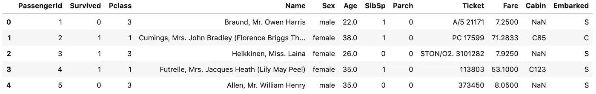
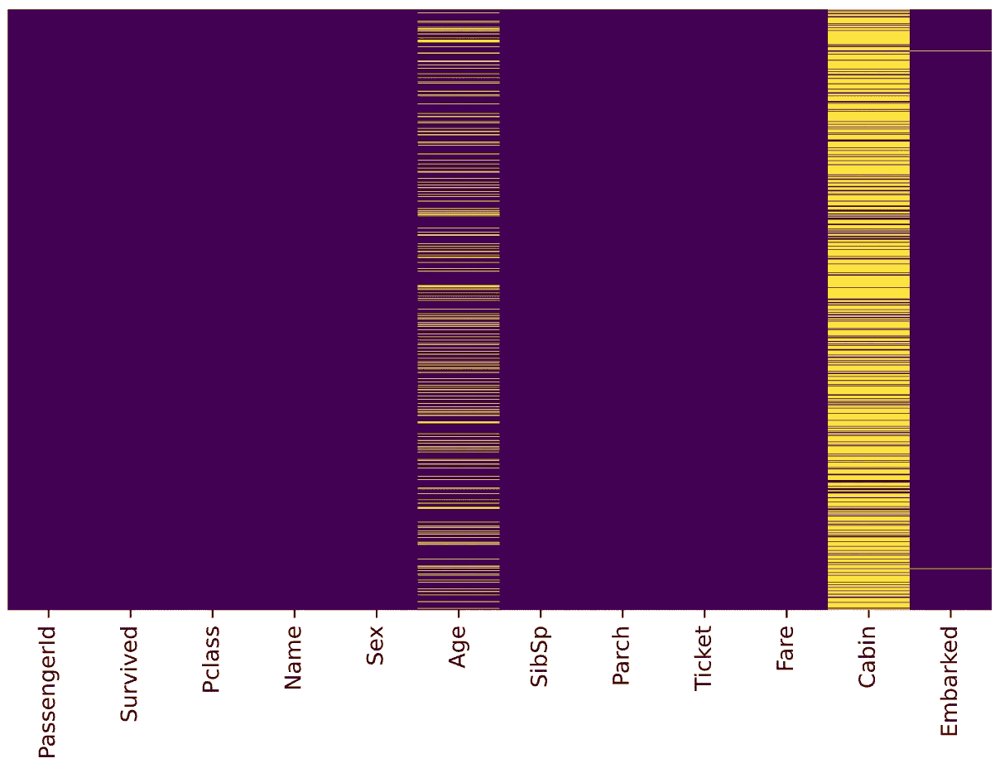
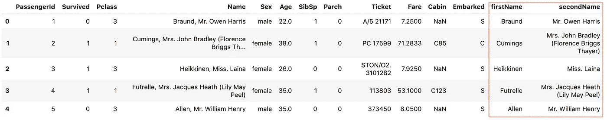
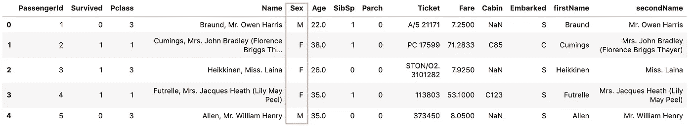
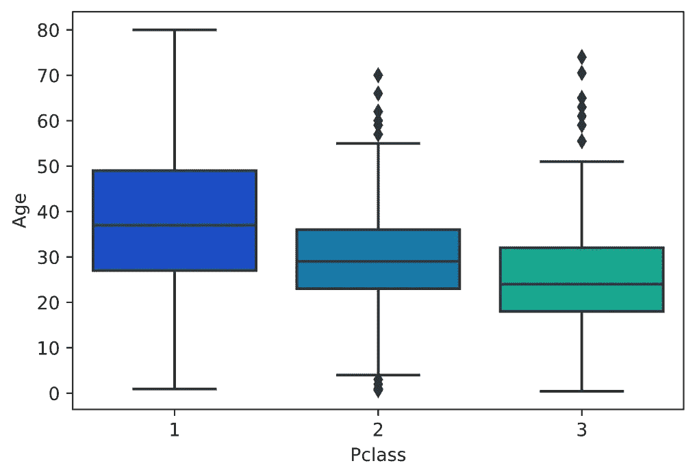
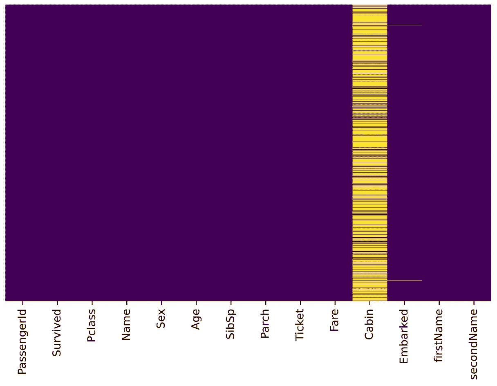
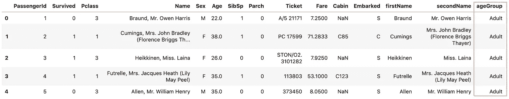

# 使用 Pandas 管道函数提高代码可读性

> 原文：<https://towardsdatascience.com/using-pandas-pipe-function-to-improve-code-readability-96d66abfaf8?source=collection_archive---------10----------------------->

## 熊猫最佳实践的直观指南`pipe()`


照片由 [June Wong](https://unsplash.com/@junio_006?utm_source=unsplash&utm_medium=referral&utm_content=creditCopyText) 在 [Unsplash](https://unsplash.com/s/photos/pipe?utm_source=unsplash&utm_medium=referral&utm_content=creditCopyText) 拍摄

在数据处理中，经常需要编写一个函数对某一行或某一列进行运算(如统计计算、拆分或代入值)以获得新的数据。

而不是写作

```
# f(), g(), and h() are user-defined function
# df is a Pandas DataFramef(g(h(df), arg1=a), arg2=b, arg3=c)
```

我们可以写作

```
(df.pipe(h)
   .pipe(g, arg1=a)
   .pipe(f, arg2=b, arg3=c)
)
```

熊猫从 0.16.2 版本开始引入`pipe()`。`pipe()`在方法链中启用用户定义的方法。

> 方法链接是一种编程风格，它依次调用**多个方法调用**，每个调用在同一个对象上执行一个动作并返回它。
> 
> 它**消除了在每个中间步骤命名变量**的认知负担。 [Fluent 接口](https://en.wikipedia.org/wiki/Fluent_interface)，一种创建面向对象 API 的方法依赖于方法级联(又名方法链)。这类似于 Unix 系统中的管道。
> 
> [作者阿迪亚曼·科尔西](/the-unreasonable-effectiveness-of-method-chaining-in-pandas-15c2109)

方法链接大大增加了代码的可读性。让我们深入教程，看看它如何提高我们的代码可读性。

# 数据集准备

在本教程中，我们将处理来自 Kaggle 的[泰坦尼克号数据集。这是一个非常著名的数据集，通常是学生学习数据科学的第一步。让我们导入一些库并加载数据来开始。](https://www.kaggle.com/c/titanic/overview)

```
import pandas as pd
import sys
import seaborn as sns
import matplotlib.pyplot as plt
%matplotlib inline
%config InlineBackend.figure_format = 'svg'**def load_data():
    return pd.read_csv('data/train.csv')**df = load_data()
df.head()
```

我们创建了一个函数`load_data()`来将 **train.csv** 文件加载到 pandas DataFrame 中。



泰坦尼克号数据预览


数据字典来自 [Kaggle](https://www.kaggle.com/c/titanic/data?select=train.csv)

让我们从检查缺失值开始。我们可以使用 seaborn 创建一个简单的热图来查看哪里缺少值

```
sns.heatmap(**df_train_raw.isnull()**, 
            yticklabels=False, 
            cbar=False, 
            cmap='viridis')
```



缺失值的 seaborn 热图输出

***年龄******船舱****有缺失值。 ***年龄*** 缺失的比例很可能小到足以用某种形式的插补进行合理替换。看着 ***舱*** 栏，好像缺了很多值。 ***着手*** 缺失的比例很小。*

# *任务*

*假设我们被要求完成以下任务*

1.  *将 ***名*** 拆分为名和名*
2.  *对于 ***性别*** ，用 *M* 替换值*公*，用 *F* 替换值*母**
3.  *用某种形式的插补替换缺失的 ***年龄****
4.  *将年龄转换为年龄范围组:≤12 岁、青少年(≤18 岁)、成人(≤60 岁)和老年人(> 60 岁)。*

*让我们继续使用`pipe()`一步一步地完成它们，*

## *1.将姓名分为名和姓*

*让我们创建一个函数`split_name()`，它接受一个数据帧作为输入并返回一个数据帧。*

```
*def split_name(x_df):
    def split_name_series(string):
        firstName, secondName=string.split(', ')
        return pd.Series(
            (firstName, secondName),
            index='firstName secondName'.split()
        ) # Select the Name column and apply a function
    **res=x_df['Name'].apply(split_name_series)**
    x_df[res.columns]=res
    return x_df*
```

*`x_df['Name']` 选择 ***名称*** 列(在熊猫中称为一个系列)，熊猫`[apply()](/introduction-to-pandas-apply-applymap-and-map-5d3e044e93ff)`用于对系列的值应用`split_name_series()`函数。*

*运行以下代码*

```
*res=(
    load_data()
    **.pipe(split_name)**
)res.head()*
```

*我们应该得到如下输出:*

**

*`split_name()`的结果*

## *2.对于 ***性别*** ，用 M 替代值*男*用*女*用 *F**

*让我们创建一个函数`substitute_sex()`，它接受一个数据帧作为输入并返回一个数据帧。*

```
*def substitute_sex(x_df):
    mapping={'male':'M','female':'F'}
    x_df['Sex']=df['Sex'].map(mapping)
    return x_df*
```

*`x_df['Sex']`选择性别列，然后选择熊猫`[map()](/introduction-to-pandas-apply-applymap-and-map-5d3e044e93ff)`，用于将序列中的每个值替换为另一个值。*

*运行以下代码*

```
*res=(
    load_data()
    .pipe(split_name)
    **.pipe(substitute_sex)**
)res.head()*
```

*我们应该得到如下输出:*

**

*`substitute_sex()`的结果*

## *3.用某种形式的插补替换缺失的 ***年龄****

*我们想用某种形式的插补来代替缺失的年龄。一种方法是填写所有乘客的平均年龄。然而，我们可以更聪明地处理这个问题，按乘客级别检查平均年龄。例如:*

```
*sns.boxplot(x='Pclass',
            y='Age',
            data=df,
            palette='winter')*
```

**

*我们可以看到，在较高的阶层中，较富裕的乘客往往年龄较大，这是有道理的。我们将根据年龄的 Pclass 使用这些平均年龄值进行估算。*

```
*pclass_age_map = {
 **1: 37,
  2: 29,
  3: 24,**
}def replace_age_na(x_df, fill_map):
    **cond=x_df['Age'].isna()
    res=x_df.loc[cond,'Pclass'].map(fill_map)
    x_df.loc[cond,'Age']=res** return x_df*
```

*`x_df['Age'].isna()`选择 ***年龄*** 列，检测缺失值。然后，`x_df.loc[cond, 'Pclass']`用于有条件地访问 ***Pclass*** 值，并调用熊猫`[map()](/introduction-to-pandas-apply-applymap-and-map-5d3e044e93ff)`将每个值替换为另一个值。最后，`x_df.loc[cond, 'Age']=res`有条件地用`res`替换所有缺失的年龄值。*

*运行以下代码*

```
*res=(
    load_data()
    .pipe(split_name)
    .pipe(substitute_sex)
    **.pipe(replace_age_na, pclass_age_map)**
)
res.head()*
```

*应根据年龄的 Pclass 替换所有缺失的年龄。让我们通过运行`res`上的热图来检查一下。*

```
*sns.heatmap(**res.isnull()**, 
            yticklabels=False, 
            cbar=False, 
            cmap='viridis')*
```

**

*太好了，成功了！*

## *4.将年龄转换为年龄范围组:≤12 岁、青少年(≤18 岁)、成人(≤60 岁)和老年人(> 60 岁)*

*让我们创建一个函数`create_age_group()`，它接受一个数据帧作为输入并返回一个数据帧。*

```
*def create_age_group(x_df):
    bins=[0, 13, 19, 61, sys.maxsize]
    labels=['<12', 'Teen', 'Adult', 'Older']
    **ageGroup=pd.cut(x_df['Age'], bins=bins, labels=labels)**
    x_df['ageGroup']=ageGroup
    return x_df*
```

*`pd.cut()`用于将年龄转换为年龄范围组。*

*运行以下代码*

```
*res=(
    load_data()
    .pipe(split_name)
    .pipe(substitute_sex)
    .pipe(replace_age_na, pclass_age_map)
    **.pipe(create_age_group)**
)res.head()*
```

*我们应该得到如下输出:*

**

*`create_age_group()`的结果*

# *好了*

*感谢阅读。*

*请在我的 Github 笔记本上查看源代码。*

*如果你对机器学习的实用方面感兴趣，请继续关注。*

*最后，这里有两篇你可能感兴趣的相关文章*

*   *[熊猫应用简介，应用地图和地图](/introduction-to-pandas-apply-applymap-and-map-5d3e044e93ff)*
*   *[处理熊猫的缺失值](/working-with-missing-values-in-pandas-5da45d16e74)*