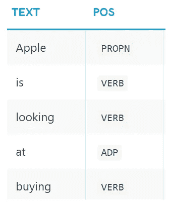
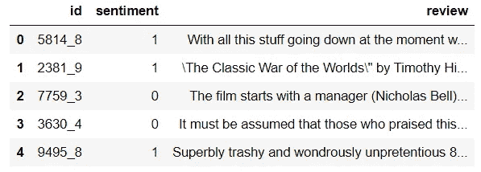
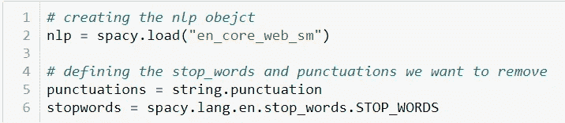
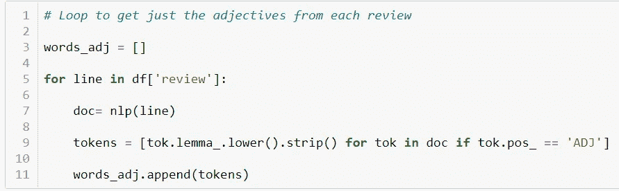
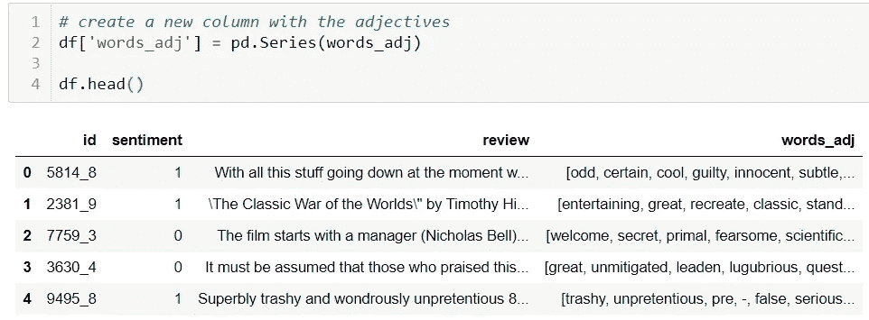
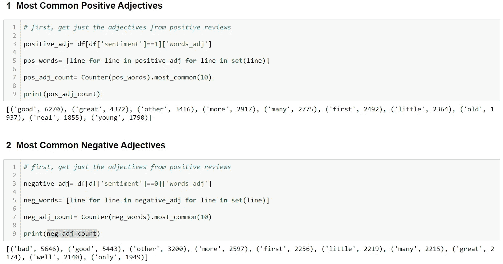
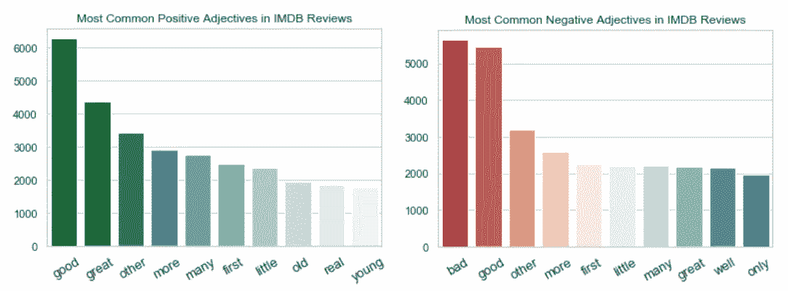

# 利用词性分析电影评论

> 原文：<https://towardsdatascience.com/using-part-of-speech-to-analyse-movie-reviews-3a3cfb9986d5?source=collection_archive---------32----------------------->

## 自然语言处理变得简单

## 惊讶于 POS 在数据分析中的强大功能。

马库斯·斯皮斯克在 [Unsplash](https://unsplash.com?utm_source=medium&utm_medium=referral) 上的照片

当我们谈论自然语言处理(NLP)时，很容易想到它在机器学习中的应用，特别是情感分析。像“这篇评论是正面的还是负面的？”，或者“这条推文到底讽刺不讽刺？”非常常见，所以我们的注意力通常集中在实际方面，比如使用哪种算法，或者如何在令牌中转换单词，等等。但是，当涉及到纯数据分析时，如何使用 NLP 来获得关于我们的数据的见解呢？

顺便说一句，如果你是 NLP 世界的初学者，你可能会喜欢在这里查看这个主题的简介。

在本文中，我们将使用最流行的 NLP 库之一 [*spacy*](https://spacy.io/) 来执行文本分析并生成一些见解。包含所有代码和注释的笔记本在这里等着你。

## 什么是词性？

spacy 最强大的工具之一是它能够使用复杂的统计模型预测一个词在给定上下文中的功能。

**词性**指的是根据一个词的句法功能对其进行分类，比如它是动词还是名词等等。我们可以看看下面的例子:

来源:[https://spacy.io/usage/linguistic-features](https://spacy.io/usage/linguistic-features)

POS 标签及其描述的完整列表可在[文档](https://spacy.io/usage/linguistic-features)中找到。

## 关于数据

数据来自 IMDB 电影评论数据集，可在 [kaggle](https://www.kaggle.com/c/word2vec-nlp-tutorial/data) 上获得。让我们检查第一行:

来源:作者

我们这里有关于评论的标签情绪:

*   1 =正面评价；
*   0 =负面评价。

然后我们有评论本身的文本。简单吧？

## 创建 NLP 模型

为了创建 nlp 对象，我们导入 SpaCy English 模型。简而言之，nlp 对象是 spacy 工作的核心，因为它执行繁重的任务，如将单词转换成记号、词条等。

我们还将导入英语*停用词*和一个带标点符号的列表。停用词是对我们的分析没有意义的常见词，如“the”和“an”。我们将使用这些对象来过滤我们想要保留的单词。

来源:作者

## 仅从评论中选择形容词

当人们写评论时，他们通常用词来描述他们如何喜欢或不喜欢某事，这些词被称为 ***形容词。*** 因此，使用几行代码，我们将创建一个循环，它将:

*   迭代每个评论，使用 spacy 删除停用词和标点符号，然后预测并保存形容词到列表中；

来源:作者

然后，我们需要将这个列表转换成一个新列，返回到我们的数据框:

来源:作者

最后，使用一些 python 基础知识，我们可以选择正面和负面评论中最常用的形容词:

来源:作者

而且，当我们谈论数据分析时，为什么不在一些漂亮的图中展示我们的发现呢？

来源:作者

使用词类过滤器，我们发现“好”是正面评论中第一个最常见的形容词，但令人惊讶的是，它是负面评论中第二个最常见的形容词。这是一个有趣的发现，可以进一步研究，如根据情绪使用二元模型来发现“好”之前和之后使用的常用词，以及它为其他分析打开了大门，这些分析可以提供有价值的信息来构建报告和仪表板。

本文的目标是向您展示如何将 POS 用于数据分析，展示我们在学习 NLP 时所学概念的实际应用。我希望你喜欢，请在评论中让我知道你可能会发现的 POS 的其他用途。感谢阅读！