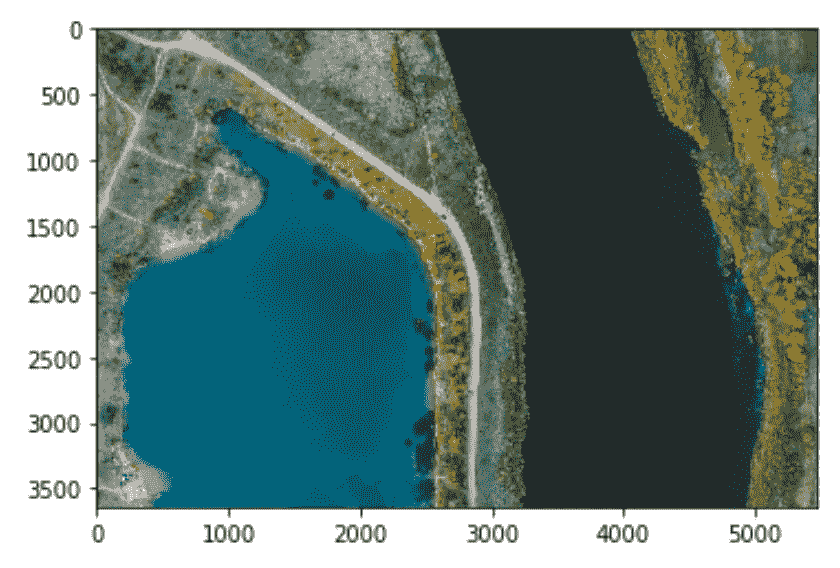
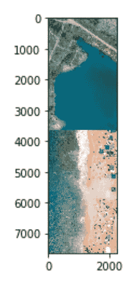

# 利用 PIL 图像进行图像变换

> 原文：<https://towardsdatascience.com/using-pils-image-for-image-transformation-64a6d7b6e58b?source=collection_archive---------46----------------------->

## 在 Python 中轻松调整图像大小和连接图像


照片由 [Hitesh Choudhary](https://unsplash.com/@hiteshchoudhary?utm_source=medium&utm_medium=referral) 在 [Unsplash](https://unsplash.com?utm_source=medium&utm_medium=referral) 上拍摄

我最近在做一个项目，涉及操纵图像，以便我们可以在其上运行无监督的机器学习算法。作为一个 Python 爱好者，我决定使用 Python 和它的库来为我操作，而不是走 Photoshop 路线。

在这篇文章中，我强调了我如何使用`PIL`中的`Image`子模块来创建我的项目所需的图像。

# 收集图像

我为这篇文章拍摄了两张图片，都来自 Unsplash。我特别使用了不同尺寸的图像，这样我们就可以了解不同尺寸的图像是如何相互作用的。


图片由 **Ivars Utināns** 提供


图片来自**塞尔吉奥·索萨**

请注意，第一幅图像较宽，而第二幅图像高度较长。把它们结合起来我们会很开心。

图片 1:[https://unsplash.com/photos/DujBHPRqAKk](https://unsplash.com/photos/DujBHPRqAKk)
图片 2:[https://unsplash.com/photos/JSye5r1eAVY](https://unsplash.com/photos/JSye5r1eAVY)

我通常使用 unsplash.com T21，因为它有大量各种各样的高质量图像，可以免费获取。显然，不要忽略对艺术家的适当肯定。是好的伦理！！

# 安装库

我在这里使用的是 Python 3.6，但是 Python 3.5 和更高版本的所有版本都应该可以正常工作。

```
pip install Pillow
pip install matplotlib
```

`Pillow`是包含我们的子模块`Image`的 PIL 包。我还决定安装`matplotlib`,因为它让在 Jupyter 笔记本上显示图像变得更加容易，不管图像的大小如何。例如，当我试图使用`Image`直接显示图像时，它打开了一个新窗口，图像全部放大。

如果你想在 Jupyter 笔记本中这样做，使用`pip install jupyter`安装它，启动 Jupyter 服务器并创建一个新的笔记本。

# 加载库

我们现在将加载已安装的库。我们需要来自`PIL`的`Image`子模块和来自`matplotlib`的`pyplot`子模块，我们将以名称`plt`加载它们。你可以给它起任何名字，也可以什么都不用，用`plt`只是惯例。

```
from PIL import Image
import matplotlib.pyplot as plt
```

# 加载图像

使用`Image.open()`，我们可以简单地将图像加载到笔记本中(或者 Python 文件，如果你正在使用的话)。我们将在变量`img1`中保存第一幅图像，在变量`img2`中保存第二幅图像。

```
img1 = Image.open("image.jpg")
img2 = Image.open("image2.jpg")
```

要查看第一幅图像，我们只需使用以下命令:

```
plt.imshow(img1)
```

`imshow()`方法显示 Jupyter 笔记本中的图像，如下图所示:



plt.imshow 的结果(img1)

我们可以重复同样的操作来查看第二个图像，只需替换上面命令中变量的名称。

# 调整图像大小

使用`Image`调整图像大小非常非常简单。我们只是使用`resize()`方法，并为最终调整后的图像定义一个元组(宽度，高度)。在下面的代码中，我将图像 1 的大小调整为 1200x800，然后打印新旧图像的大小，最后显示结果图像。

```
img1_resized = img1.resize((1200, 800))
print("Original image size: {}".format(img1.size))
print("Resized image size: {}".format(img1_resized.size))
plt.imshow(img1_resized)## Output
# Original image size: (5464, 3640)
# Resized image size: (1200, 800)
```


已调整大小的图像

查看水平轴和垂直轴，您会看到新图像的大小现在调整为 1200x800。

# 水平连接

在我的项目中，我必须水平地一个接一个地组合几幅图像。这个想法是让图像具有相同的高度，但宽度增加。一旦我开始寻找可能的解决方案，我就能够编写出有效的代码。然而，与我项目中的正方形图像不同，我很好奇是否可以组合不同大小的图像并生成可用的图像。经过仔细的实验，我找到了一个适用于不同尺寸图像的解决方案。

```
result_img = Image.new('RGB', (img1.width + img2.width, min(img1.height, img2.height)))
result_img.paste(img1, (0, 0))
result_img.paste(img2, (img1.width, 0))
plt.imshow(result_img)
```

我首先使用`Image.new()`创建一个新图像。第一个参数声明我正在创建一个 RGB 图像，第二个参数是最终图像的宽度和高度。显而易见，当两张图片并排放置时，它们的宽度会简单地相加。然而，由于两者的高度不同，使用`min()`方法会将组合图像缩小到适当的高度，因此没有空白。

然后我粘贴从`(0,0)`开始的第一张图片和到`(img1.width, 0)`结束的第二张图片。生成的图像如下:


水平组合两幅图像

如果我们用`max()`方法替换`min()`方法，我们将在原本没有像素的地方得到黑色。在上面的代码中，如果我们使用`max()`，得到的图像应该是:


水平组合两幅图像(使用 max())

# 垂直连接

就像水平拼接一样，我们也可以垂直组合图像。为此，总高度将是两个图像的高度之和，而宽度将是两个图像中的最小值。

```
result_img = Image.new('RGB', (min(img1.width, img2.width), img1.height + img2.height))
result_img.paste(img1, (0, 0))
result_img.paste(img2, (0, img1.height))
plt.imshow(result_img)
```



垂直组合图像

这里，我们将在`(0,0)`再次粘贴图像 1，但是第二个图像将被放置在`(0, img1.height)`。同样，我们在这里使用了`min()`方法来代替`max()`方法。

# 保存图像

最后，一旦所有的转换完成，我们可以保存图像。如果我们将图像设为`result_img`，命令将会是:

```
result_img.save("new_image.jpg")
```

这里，新图像将以名称`new_image.jpg`保存。

本文到此为止。如果你有建议或问题，请在评论中告诉我。