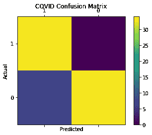

# 使用预训练的深度卷积神经网络对新冠肺炎 CT 扫描进行二值分类

> 原文：<https://towardsdatascience.com/using-pretrained-deep-convolutional-neural-networks-for-binary-classification-of-covid-19-ct-scans-3a7f7ea8b543?source=collection_archive---------33----------------------->

作者:劳纳克·索德，斯蒂芬·汉弗莱斯博士。

马萨诸塞州阿克顿-博克斯伯勒地区高中高年级学生；国家犹太健康定量成像实验室高中实习生

放射学助理教授；科罗拉多州丹佛市国家犹太健康定量成像实验室主任。

[GitHub](https://github.com/raunak-sood2003)

[领英](https://www.linkedin.com/in/raunak-sood-8766021a5/)

# 介绍

起源于中国武汉的高毒性新冠肺炎病毒导致了全球性的疫情，影响了许多人的生活。截至本文撰写之时，全球已有超过 1160 万人被诊断感染该病毒，超过 53.9 万人死亡。许多人群正在研究不同的方法来诊断新冠肺炎:RT-PCR(逆转录聚合酶链式反应)测试，抗体测试和 CT 扫描。虽然 RT-PCR 是 CDC 推荐的新冠肺炎诊断方法，但测试可能需要两天才能完成。此外，抗体测试只有在患者对病毒产生免疫力后才有用。使用 CT 扫描进行诊断是有希望的，尽管研究表明它对于单一的诊断测试是不可靠的。

然而，最近的研究已经使用人工智能来诊断新冠肺炎感染的肺部图像，以增强放射科医生的分析。在 Trehan⁴和 Markevych⁵撰写的文章中，他们使用 Tensorflow 库从头构建的卷积神经网络分别对 x 射线和 CT 图像进行分类。然而，在这篇文章中，我将使用迁移学习，使用 VGG 和雷斯内特等最先进的模型来分类新冠肺炎阳性和阴性肺部 CT 扫描。此外，我将与 PyTorch 合作。

项目工作流程

# 数据

我使用了来自大 Challenge⁶新冠肺炎 CT 的开源数据集，这是一组超过 750 个 PNG 的肺部 CT 图像，其中大约一半是新冠肺炎阳性的。

让我们来看一些示例图片。

数据集中的示例图像

你也许能分辨出右边的图像是新冠肺炎阳性的。为什么？因为左叶浑浊的白色区域是磨玻璃样阴影(GGO)的一个例子，这是在肺部 CT 中识别新冠肺炎的关键特征之一。正如你在右边的图片上看到的，没有这种毛玻璃外观的痕迹。注意包含毛玻璃特征的肺部 CT 图像并不总是新冠肺炎阳性；还有其他疾病，如感染性疾病、间质性肺病和急性肺泡疾病，在肺部 CT scans⁷.中也显示 GGO 但是，在这种情况下，这不应该是一个问题，因为这是一个二元分类问题。此外，并不是所有的图像都这么容易识别；例如，让我们看看下面的图像。

你怎么想呢?结果，它是新冠肺炎阳性的，因为两个肺叶都有 GGO。这不是一个更难的例子吗？让我们看看卷积神经网络是否可以更好地对这些图像进行分类。

# 数据预处理

在开始训练模型之前，我们首先要完成一些预处理步骤。

1.  读入图像并给它们贴上标签
2.  调整图像大小
3.  将数据分成训练集、验证集和测试集
4.  将图像转换为 PyTorch 张量
5.  添加图像增强

那我们开始吧。注意，本文中的所有代码都可以在我的 [GitHub](https://github.com/raunak-sood2003) 新冠肺炎分类库中找到。

目录结构:

丙:。/图像-已处理-新建

|————CT _ COVID

|————CT _ non vid

我们首先导入预处理所需的库。然后，对于每个目录中的每个图像，我们读入具有 RGB 通道的图像，将图像的大小调整为(224，224)并将图像及其相关联的标签附加到列表 training_data。我们必须调整图像的大小，因为我们稍后将使用的迁移学习模型只接受这种形状的图像。然后我们标记图像，1 代表 COVID 阳性，0 代表 COVID 阴性。注意:tqdm 库用于创建一个进度条。

现在，我们必须将数据分为训练集、验证集和测试集，并将它们转换为 PyTorch 张量。

让我们把这段代码分成几个部分。我创建了一个分割大小，它是整个数据的 10%，因此训练集是数据的 80%(大约 600 张图像)，测试和验证集各占总数据的 10%(大约 75 张图像)。然后，对于每个集合，我使用列表理解将原始数据分解为图像(X)和标签(y)。然后，我将每个数组转换为 PyTorch 张量，并将其重新整形为格式(图像数量、通道数量、图像宽度、图像高度)。这种形状格式是 PyTorch 模型接受张量数据的方式。最后，我对图像的像素强度进行归一化。PNG 图像的像素强度在 0 到 255 之间；然而，在训练过程之前，它们需要在 0 和 1 之间被标准化。

在 PyTorch 中，数据加载器用于创建成批的训练图像，并对图像应用变换。因此，我们必须将我们的代码包装到一个数据集类中，我们可以将该数据集类与任何相关的转换一起提供给 DataLoader 对象。

__init__ 方法本质上与上面的代码相同，都被格式化以适合数据集类。__len__ 和 __getitem__ 函数必须被覆盖，以指定如何访问我们的图像。我使用“数据”参数来指定集合是训练、验证还是测试。你可以在 [PyTorch 文档](https://pytorch.org/tutorials/beginner/data_loading_tutorial.html#dataset-class)中读到更多关于 Dataset 类的内容。

最后，我们必须创建数据加载器对象以及可以应用于图像的转换。

我使用了 [Monai](https://monai.io/) ，一个基于 PyTorch 构建的医学成像库，用于图像转换。LoadPNG()、AddChannel()和 ToTensor()转换对于将原始 PNG 图像转换为机器可学习的张量至关重要。对于训练集，我们还使用 ScaleIntensity()来确保图像强度是归一化的；RandRotate()、RandFlip()和 RandZoom()用于几何变换。RandGaussianNoise()，顾名思义，就是给图像添加噪点。这些变换模拟真实世界的 CT 图像，因为它们有时可以以不同的方式变形，并且图像中可能存在噪声。总的来说，这些图像增强技术将使模型更健壮，并可推广到低质量的图像。对于验证和测试集，我只添加了前三个转换，因为我不想修改测试集。

接下来，我实例化了 Dataset 类，并将其传递给 DataLoader 对象。我最初将批处理大小设置为 32，但是我们将在本文后面处理这个值并查看结果。我们可以查看数据集中的一些图像，看看这些图像进入模型后是什么样子。

与预处理前的原始图像相比，图像略有改变。

太好了！我们完成了预处理步骤，并准备使用迁移学习来开发我们的模型。

# 模型开发

我用迁移学习进行模型开发。我测试了三种不同深度的不同型号的性能:VGG-16⁹、VGG-19⁹和⁰. resnet-34 这三个模型都在 ImageNet16 数据集(1400 万个图像数据集，包含 1000 个不同的类)上进行训练，获得了最先进的精度。

第一步是决定是否要在 GPU 上训练。我有一个 Nvidia GeForce GTX 本地 GPU，所以我打算将该模型分配给 GPU。

注意:如果您的本地设备上没有 CUDA，设置 GPU 可能是一个非常复杂的过程。我强烈推荐你阅读[这篇文章](/tensorflow-gpu-installation-made-easy-use-conda-instead-of-pip-52e5249374bc)，了解一个非常简单的设置过程。它为 Tensorflow 设置了一个 CUDA 环境，但它与 PyTorch 的工作方式相同。

然后，我必须“冻结”模型中的所有权重。如果你想了解 PyTorch 中迁移学习的更多信息，请参考[这篇文章](/transfer-learning-with-convolutional-neural-networks-in-pytorch-dd09190245ce)。这意味着我使权重不可训练，所以它们不会通过梯度下降来更新。因此，我遍历模型参数并将 requires_grad 设置为 false。

以下是代码:

最后，我创建了一系列可训练层来替换模型中的最终分类层。最初的模型有 1000 个类，但是这是一个二进制分类问题，所以我需要以两个类的输出结束。

我使用了 torch.nn 库中的顺序模型。这个模型的好处是它允许输入一个字典。所以，我可以给每一层标上一个名字，以便跟踪不同的层。我选择使用 4 层，以允许从数据中学习足够的可训练参数。当然，这是一个可以调整到任何程度的超参数。此外，每层中神经元的数量是另一个可变的超参数。通常，你可能会看到 2 的幂被用来表示神经元的数量，所以我坚持使用它。最后，你可能会注意到，我在每一层之间使用了 dropout 正则化。这防止了模型过度拟合训练数据，这将导致验证和测试数据的精确度降低。

转移学习工作流

如前所述，我比较了三种最先进的模型。冻结权重和替换最终分类层的过程对于所有三个模型都是相似的，所以我在这里不打算展示。

现在我们的模型已经准备好进行训练了。

# 培养

与 Tensorflow 和 Keras 库不同，我们必须用 PyTorch 编写自己的训练循环。但是，这实际上是一个直观的过程，所以我们开始吧。

我将定义一个名为 train 的方法，它接受模型、训练加载器、验证加载器、优化器、损失函数、时期数以及潜在的学习率调度器的参数。该函数将训练模型并返回四个列表:训练准确度、训练损失、验证准确度和验证损失的列表。

该方法是这样开始的:

然后，我们循环遍历历元数(模型通过数据的次数)，并初始化变量来跟踪损失和准确性度量(这在本文的后面会很重要)。

然后，我们遍历训练数据加载器中的图像和目标类，找到模型的预测，将模型的预测与实际情况进行比较(计算损失函数)，并相应地更新权重。

我还写了一个更小的循环来计算正确预测的数量和总预测，这样我们就可以计算精度了。

接下来，我们将模型设置为验证模式，并计算验证损失和准确性。该过程类似于训练步骤，除了模型不应该在该步骤中学习。这意味着我们不会更新该数据的权重。我创建了一个名为 validation 的辅助函数来计算验证损失和准确性。我没有在这里展示，但是你可以在我的 GitHub 上看到完整的代码。

我们在每个时期之后打印出损失和准确性度量，并将这些度量附加到列表中。您可能想知道为什么我将所有的度量存储在一个列表中。当我们查看损耗和精度曲线时，这将派上用场。

现在我们可以使用该方法来训练我们的模型。

对于这次试验，我使用了二元交叉熵损失和 Adam 优化，因为这些是二元分类任务的标准。我还训练了 30 个时期的模型，因为以前的尝试表明，损失在这个点附近稳定下来。

这是 30 个时期后的输出:

# 结果

我对 VGG16、VGG19 和 ResNet-34 进行了不同数量的历元、批量大小和学习率调度程序的培训。这些是每个预训练网络收到的最佳模型。

# 讨论

在我们深入分析模型的性能之前，让我们更仔细地看看循环学习率调度。根据 Smith(最初的循环学习率论文的作者)的说法，这种类型的学习率调度背后的思想是允许学习率在一定范围内循环变化，而不是系统地增加或减少它。

循环学习率可视化

我使用循环学习率调度，因为它比我尝试的其他调度程序更容易调优，并且显示出更好的结果。

好吧，回到模型分析。

VGG16 模型在 30 个时期后具有最高的验证和测试准确性，而 VGG19 模型具有最高的训练准确性。ResNet-34 型号在所有设备中表现最差。VGG16 模型是唯一没有过度拟合的模型，这可能是因为该模型较浅，因此无法拟合如此复杂的函数。因此，较浅的网络通常表现更好，因为数据集非常小。ResNet 通常表现不佳，因为它比其他网络更深，因此可能需要更长的训练时间或更大的批量。

我在训练各种模型时注意到的一件事是，验证/测试的准确性有时高于训练的准确性。这很可能是由于数据量小和验证分割大小。图片总数大约是 750 张，我使用了 0.1 的验证分割大小，这意味着只有大约 75 张图片需要验证。因此，如果在某个时期内有更多的图像被正确分类，验证精度的提高将超过训练精度的提高。这是这个项目的一个限制，因为没有足够的数据来真正比较验证准确性和训练准确性。然而，我们仍然可以区分模型性能，因为验证准确性可以在模型之间进行比较，因为验证集中的图像数量保持不变。

虽然结果显示 VGG16 模型表现最佳，但测试数据集非常小(只有 74 张图像)，因此如果不进行额外的分析，还不足以说 VGG19 模型更好。因此，我们将在评估部分查看进一步的分析。

# 测试数据评估

还记得我说过存储准确性和损失指标很重要吗？现在，我们可以绘制这些值与时期数的关系，并想象它们如何随着训练过程的进行而变化。

VGG16 损耗和精度图

VGG19 损耗和精度图

ResNet-34 损失和精度图

您可能会在图中注意到一个趋势，即验证图比训练图噪声大得多。这是因为验证集只有 74 幅图像，而训练集大约有 550 幅图像。因此，验证集中的几个错误可能会导致损失和准确性比训练集中的几个错误差得多。但总的来说，每种型号的损耗都随着时间的推移而减少。此外，如果您查看所有三个模型的训练曲线，ResNet-34 和 VGG16 看起来似乎都趋于平缓，而 VGG16 模型似乎将继续改善。在未来的工作中，我计划为更多的纪元训练该模型，以观察 VGG16 是否会继续改进。

我们可以继续基于接收器操作特征(ROC)曲线来评估我们的模型，ROC 曲线是假阳性率对真阳性率的曲线图。

VGG16(左)、VGG19(中)和 ResNet-34(右)ROC 曲线

ROC 曲线表明该模型能够很好地区分这两个类别。曲线下面积(AUC)值接近 1 表明很少有假阳性和假阴性。直线的 AUC 为 0.5，表示随机猜测的对照二元分类器。显然，VGG16 是 COVID 阳性和 COVID 阴性 CT 扫描之间的最佳区分器。正如我们对测试准确性的预期，VGG19 模型的 AUC 得分第二好，ResNet 最差。

可分性的另一个评估是混淆矩阵。二元分类器的混淆矩阵在一个易于阅读的矩阵中显示真阳性、真阴性、假阳性和假阴性的数量。

VGG16(左)、VGG19(中)和 ResNet-34(右)混淆矩阵

同样，VGG16 模型具有最好的结果，很少有错误标记的图像。当测试时，它没有假阴性，这真的很重要，因为如果新冠肺炎被错误地诊断为阴性，那么对患者的生存来说可能是一个严重的问题。其他两个模型有一些假阴性，甚至比 VGG16 模型有更多的假阳性。

为了增强我们对假阳性和假阴性的分析，我们可以将其中一些图像可视化。本质上，我们需要创建一个函数来遍历测试集，并将错误标记的数据组织到适当的类别中。这将允许我们看到分类器正在犯什么样的错误。

下面是这个方法的代码。

该函数接受所使用的模型、测试数据、损失函数以及在显示假阳性和假阴性之间的选择。我们首先创建两个列表来分别保存误报和漏报。接下来，正如我们在训练循环中所做的那样，我们遍历测试数据并对数据运行模型。然后，我们编写“if”和“else if”语句来测试分类是假阳性还是假阴性，并将错误标记的图像附加到适当的列表中。最后，根据该函数是否用于显示假阴性和假阳性，我们使用 Matplotlib 中的 figure 和 subplot 函数在一个网格中显示错误标记的数据。

以下是一些贴错标签的图片的例子。

假阴性的例子

误报的例子

正如您在假阴性显示中看到的，很难判断图像是否为 COVID 阳性。同样，假阳性似乎也有一些异常；然而，这种特殊的异常可能不是由于新冠肺炎。为了修复这些错误分类，我们可能会添加更多类似于假阳性和假阴性的图像，以使模型对这些图像更具普遍性。查看错误分类是改进模型开发的重要工具。

我们可以对模型进行的最后一个测试是霍斯默-莱梅休(HL)拟合优度测试。HL 测试用于模型校准:它将数据的多个子组中的观察值(预测值)与预期值(真实值)进行比较，以确定模型与数据的拟合程度。

这是 HL 测试的方程式。

这可能看起来很复杂，但实际上很简单。该测试遍历每个观察值和期望值，取其差值的平方，然后除以期望值。第一个求和符号是对创建的所有不同子组求和，第二个求和符号是对每个观察值和期望值求和。如果您熟悉统计学，您可能会注意到 HL 检验与[卡方检验](https://en.wikipedia.org/wiki/Chi-squared_test)非常相似。

HL 测试的输出是介于 0 和 1 之间的卡方值和 p 值。较低的卡方值表示观察值和期望值之间的相关性较高。在我们的例子中，较低的值意味着我们的预测更准确地符合实际情况。此外，小于 0.05 的 p 值表明模型拟合不佳。远远大于 0.05 的 p 值表明有足够的证据表明模型校准良好，并准确地拟合了数据。想要更深入的了解这个测试背后的统计数据，可以参考[这篇](https://thestatsgeek.com/2014/02/16/the-hosmer-lemeshow-goodness-of-fit-test-for-logistic-regression/)文章。

现在我们已经了解了测试工作的基本原理，让我们看看如何在代码中实现它。不幸的是，Python 没有提供实现 HL 测试的便捷方法，所以我使用了 R。

首先，我导入了 ResourceSelection 库，它有一个实现 Hosmer-Lemeshow 测试的方法。然后，我创建了两个向量，用于地面真实分类和二进制输出预测。我从我创建的测试方法中获得这些值，以获得测试精度(同样，你可以在我的 [GitHub](https://github.com/raunak-sood2003) 上找到这个)。最后，我对这两组数据运行了 hoslem.test 函数。请注意，参数“g”表示我将数据分成的子组的数量。

下面是这段代码的输出。

我们可以用它们的二进制输出概率为我的另外两个模型写同样的代码。我在下表中组织了所有三个模型的结果。

VGG16 分类器具有最低的卡方值和最接近 1 的 p 值，这意味着它是数据的最佳拟合模型。因此，VGG19 是第二好的校准模型，最不适合的模型是 ResNet-34。尽管 ResNet-34 在 HL 测试中表现最差，但这并不意味着该模型校准不佳。事实上，高 p 值表明该模型很好地拟合了数据，只是没有其他两个模型拟合得好。这是 HL 测试相对于其他指标的优势。它允许我们判断模型中的拟合缺失是否具有统计学意义。我们知道，高 p 值和低卡方值表明所有三个模型都相对符合数据。

# 限制

尽管我们能够在训练我们的各种模型时得到好的结果，但是我们确实有一些需要注意的限制。首先，我们使用 PNG 图像，而不是医学成像中使用的标准 DICOM 格式。由于新冠肺炎疫情是最近的，DICOM 格式的原始 CT 扫描很难找到，获得使用患者数据的许可就更难了。使用 DICOM 图像的好处是它们比 PNG 图像更标准化，质量更高。我们使用的数据集包含来自在线文章、网站和博客的图像，因此质量不如原始 DICOM 图像。

我们工作的另一个限制是数据集中图像的数量。正如我之前提到的，拥有更少的数据可能会导致我们的验证准确性略有偏差。这就是为什么我们看到有时验证精度高于训练精度。

最后一个限制是，在我们的模型中使用之前，我们必须对图像进行下采样。我们使用的最新模型需要(224，224，3)的输入图像，而医学图像通常具有更高的分辨率，例如(512，512)和(1024，1024)。这种信息的丢失会导致关键的细节被遗漏，并阻碍我们模型的准确性。解决这个问题的一个方法是创建我们自己的模型，该模型接收更高分辨率的图像。这样，我们就不必对图像进行下采样。

# 结论

在本文中，我们看到了如何使用 Dataset 类和 Dataloader 对象对 CT 扫描进行分类预处理。然后，我们使用迁移学习在 CT 图像上微调 VGG16、VGG19 和 ResNet-34 预训练模型。然后，我们根据 ROC 曲线、混淆矩阵和 Hosmer-Lemeshow 拟合优度测试进一步评估每个模型。最后，我们讨论了项目中的一些限制，这些限制可以在未来的工作中得到改进。例如，未来的工作可能涉及到使用 DICOM 图像，如果它们是开源的。

现在我们已经在 ROC 曲线、混淆矩阵和 Hosmer-Lemeshow 测试上评估了所有三个模型，我们可以说 VGG16 模型在这组新冠肺炎 CT 扫描上表现最好。

1.  世卫组织。冠状病毒疾病(新冠肺炎)。2020.[https://www . who . int/docs/default-source/corona virus/situation-reports/2020 06 11-新冠肺炎-sitrep-143.pdf？sfvrsn=2adbe568_4](https://www.who.int/docs/default-source/coronaviruse/situation-reports/20200611-covid-19-sitrep-143.pdf?sfvrsn=2adbe568_4)
2.  在荷兰，CT 与 RT-PCR 诊断新冠肺炎相关:一项前瞻性研究。2020.[https://www . medrxiv . org/content/10.1101/2020 . 04 . 22 . 20070441 v1 . full . pdf](https://www.medrxiv.org/content/10.1101/2020.04.22.20070441v1.full.pdf)
3.  梅等人工智能实现新冠肺炎患者的快速诊断。2020.[https://www.nature.com/articles/s41591-020-0931-3](https://www.nature.com/articles/s41591-020-0931-3)
4.  崔汉，达克什。使用深度学习检测新冠肺炎。2020.[https://towards data science . com/detecting-新冠肺炎-使用-深度学习-262956b6f981](/detecting-covid-19-using-deep-learning-262956b6f981)
5.  马克维奇，伊霍尔。卷积神经网络能通过肺部 CT 扫描诊断新冠肺炎吗？。2020.[https://towards data science . com/can-a-卷积-神经网络-诊断-来自肺部的新冠肺炎-CT-扫描-4294e29b72b](/can-a-convolutional-neural-network-diagnose-covid-19-from-lungs-ct-scans-4294e29b72b)
6.  新冠肺炎 CT 大挑战。2020.[https://covid-CT . grand-challenge . org/CT-新冠肺炎诊断/](https://covid-ct.grand-challenge.org/CT-diagnosis-of-COVID-19/)
7.  Knipe 等人，毛玻璃乳浊化。2019.[https://radio paedia . org/articles/磨砂玻璃-乳浊化-3？lang=us](https://radiopaedia.org/articles/ground-glass-opacification-3?lang=us)
8.  哈里森.金斯利。“介绍和预处理—使用卷积神经网络识别狗与猫 p . 1”*YouTube，*send ex 上传，2019 年 2 月 22 日，[https://www.youtube.com/watch?v=gT4F3HGYXf4](https://www.youtube.com/watch?v=gT4F3HGYXf4)。
9.  用于大规模图像识别的非常深的卷积网络。2014.[https://arxiv.org/abs/1409.1556](https://arxiv.org/abs/1409.1556)
10.  何等。图像识别的深度残差学习。2015.[https://arxiv.org/abs/1512.03385](https://arxiv.org/abs/1512.03385)
11.  史密斯。训练神经网络的循环学习率。2017.[https://arxiv.org/pdf/1506.01186.pdf](https://arxiv.org/pdf/1506.01186.pdf)
12.  罗斯布鲁克。Keras 和深度学习的循环学习率。2019.[https://www . pyimagesearch . com/2019/07/29/cyclic-learning-rates-with-keras-and-deep-learning/](https://www.pyimagesearch.com/2019/07/29/cyclical-learning-rates-with-keras-and-deep-learning/)