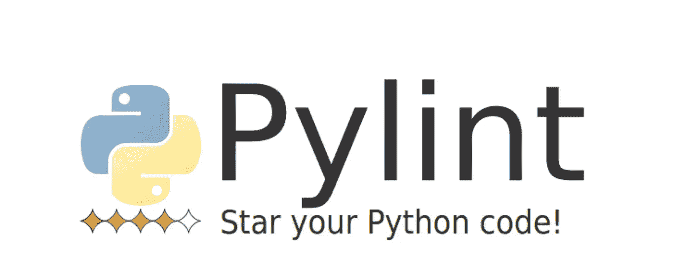
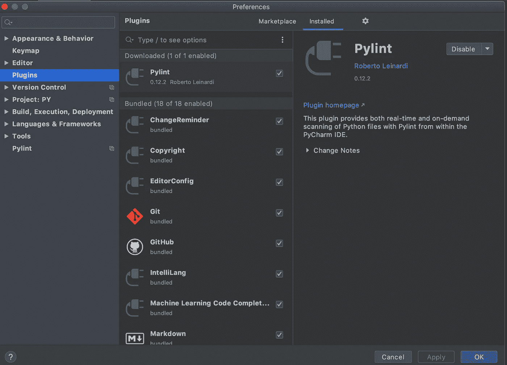
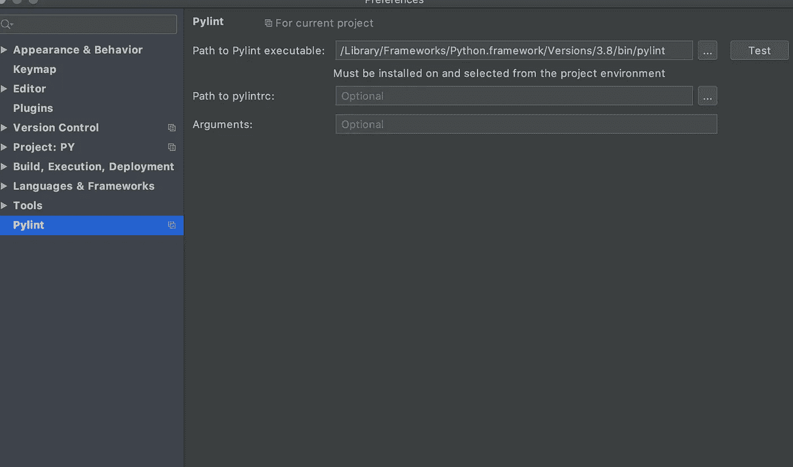
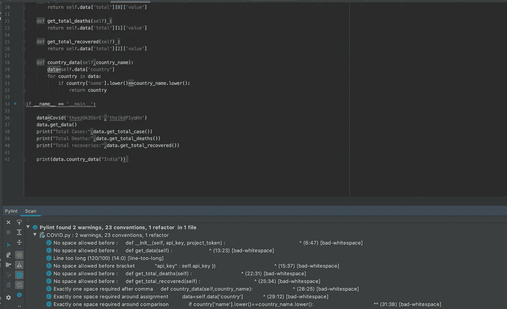
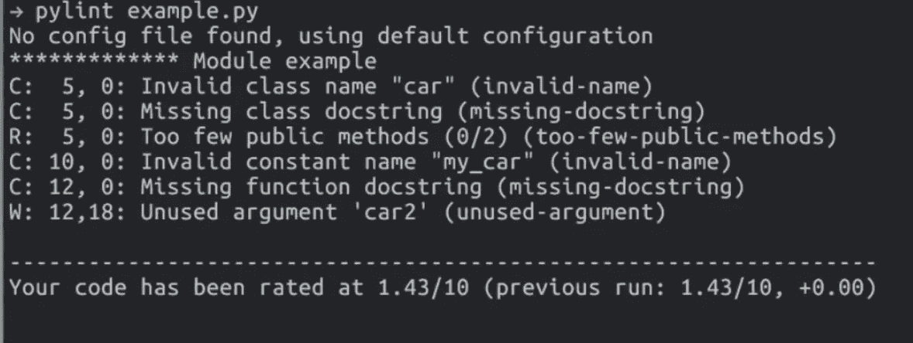

# 使用 Pylint 编写干净的 Python 代码

> 原文：<https://towardsdatascience.com/using-pylint-to-write-clean-python-code-660eff40ed8?source=collection_archive---------27----------------------->

## 因为代码质量很重要！



Pylint:启动您 Python 代码！

代码翻译器基本上是一个检查你的代码并给出反馈的程序。linter 可以告诉你程序中的问题，以及解决问题的方法。您可以随时运行它，以确保您的代码符合标准质量。

Linters 查看代码的各个方面并检测 lints:

1.  逻辑 Lint:讲述代码错误、危险的代码模式
2.  统计 Lint:查看格式问题

有许多 Python linters，如 Flake8、Pylint、Pylama 等。在本文中，我将讨论 Pylint，因为它处理逻辑和统计 lint。

**安装 Pylint**

如果您想从终端安装 Pylint，这是一个单行命令。

```
pip install pylint
```

我已经在我的代码编辑器 PyCharm 中安装了 Pylint。为此，你可以进入首选项>插件并搜索“Pylint”插件。从窗口安装并下载它，然后重新启动 IDE。



然后您可以为插件设置 Exec 路径，这样每当用户需要检查代码时，Pycharm 就可以执行 Pylint。为此，请转到设置/首选项，单击其他设置，然后单击 Pylint。在那里输入 PATH 环境变量，就可以开始了。



现在，你完成了！现在，每次运行代码时，您都可以使用 Pylint 来寻找重构、约定和其他小警告信号。



对于我的代码，你可以看到我有许多显示约定问题。在左下角，您可能会看到 4 个符号(红色、黄色、蓝色、红色)，这些符号告诉用户代码中的“错误”、“警告”、“显示约定”和“重构”问题。

我有许多蓝色的，这意味着我的代码中有许多显示约定问题。您可以改进代码，然后再次打开 linter 来查看您的代码质量。

**给航站楼**的人

您可以简单地使用下面的命令来检查代码。

> pylint example.py



Pylint 是一个令人惊叹的 linter，您的代码库中必须有它。因为代码质量很重要！

关于反馈和讨论，请通过我的 [Linkedin](https://www.linkedin.com/in/vishal-sharma-239965140/) 找到我！