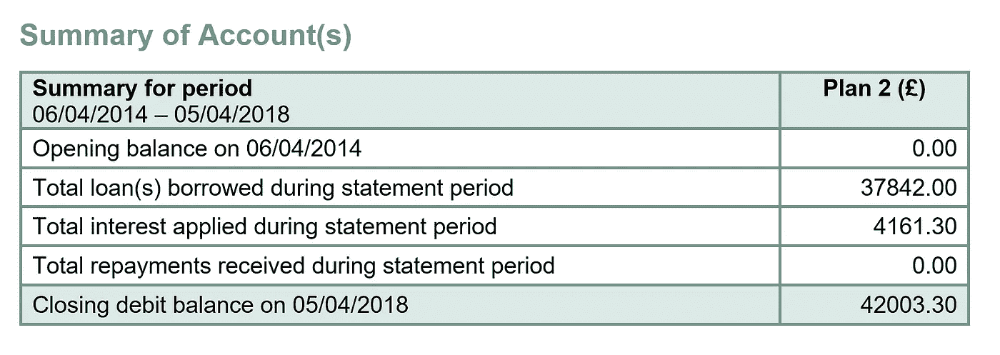
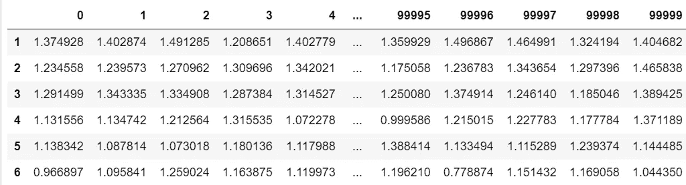
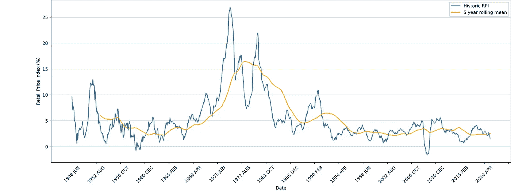
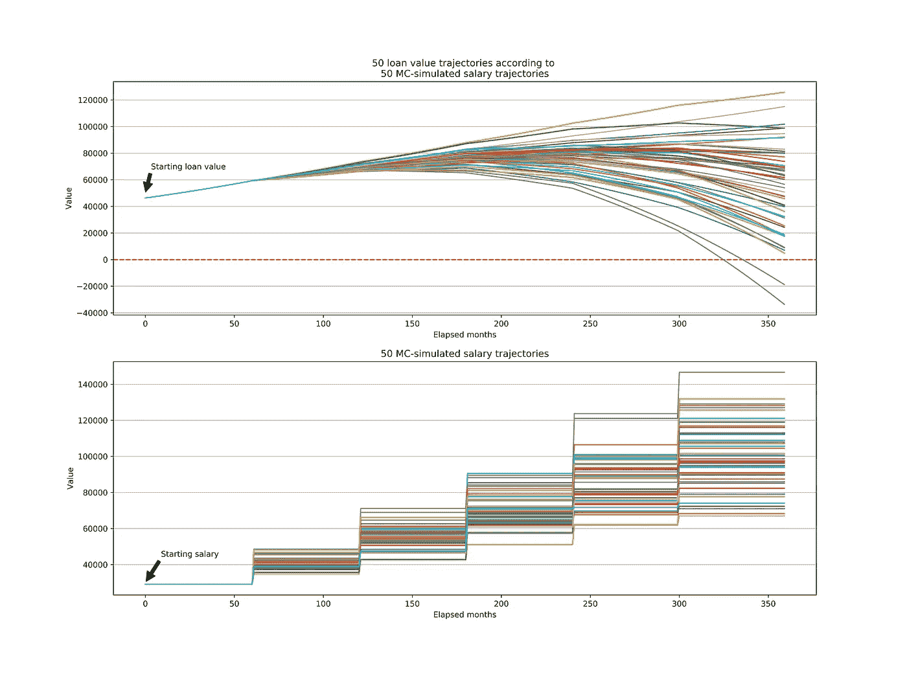
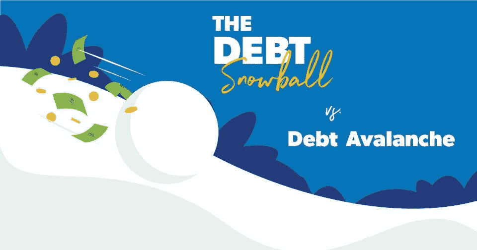
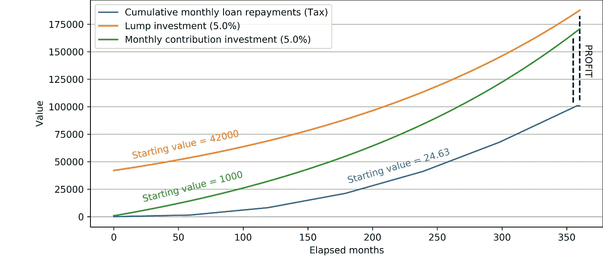

# 用 Python 和蒙特卡罗来预测我的学生贷款还款

> 原文：<https://towardsdatascience.com/using-python-and-monte-carlo-to-predict-my-student-loan-repayment-5866dc198b?source=collection_archive---------40----------------------->

## 管理个人财务的数据科学方法

图片来源:乔希·阿佩尔，[Unsplash](https://unsplash.com/photos/NeTPASr-bmQ)； [Pixabay](https://pixabay.com/vectors/graduation-cap-hat-achievement-309661/)

我开始对我的学生贷款报表上的数字没有意义感到沮丧，并对为什么你不应该在有能力的情况下尽快还清贷款发表了猜测性的意见。我想衡量我还清全部贷款的可能性，并练习我的数据科学技能，所以我用 Python 编写的蒙特卡洛模拟了我的收入。在这里，我给出了一个调查结果的走查和评估。

我的 [GitHub](https://github.com/lvassor/student_finance_simulation/tree/master/notebooks) 上有完整的代码。

如果时间不够，请跳到**方法**和**结果**！

# 介绍

在英国，学生可以向英国学生资助局申请大学贷款来支付学费和生活费，该机构提供由学生贷款公司担保的贷款。一旦你以毕业生的身份进入就业市场，你就开始按月偿还贷款，作为你税收减免的一部分。重要的是，如果你在 30 年内没有还清贷款和利息，你的贷款就会被取消。它们也很可观——在许多情况下，毕业一年后大约有 4.2 万人。

毕业生毕业后从学生贷款公司收到的声明摘要示例。(图片由作者提供)。

# 基本原理

*   我发现有关还款的文件晦涩难懂。这很令人困惑，网上和我的圈子里没有人能给我明确的答案。
*   **围绕还款的相互矛盾的观点**—*“它来自我的税，所以我甚至没有注意到它”*和*“大多数学生不会还清它，它会被取消，所以提前支付额外的钱可能是浪费你的钱”* —但这概括了“大多数学生”，它跨越了科目、所上大学和行业之间的收入(因此摊销)的巨大差异。
*   我想避开噪音，捕捉利息增长和每月纳税额之间的动态变化，量化我自己还清的概率。

# 问题

1.考虑到我可能的工资增长，我有多大可能在 30 年的付款窗口内还清我的学生贷款？
2。如果你设法存钱，或遇到一笔钱(如遗产)，你应该以自愿付款的形式偿还部分或全部贷款吗？

# 事实

*   自 2012 年以来，贷款的学生都是“计划 2”贷款，他们被分成几期，你在整个学位期间都会收到。
*   截至本文发表之日，当毕业生月薪超过 2214 英镑或年薪超过 26568 英镑(税前)时，他们才开始偿还贷款。
*   当你的雇主给你发工资时(在英国，通常是每月的最后一个工作日)，贷款还款会从你的工资中扣除——如果你的收入超过门槛，这些还款应在毕业后的 4 月份到期。
*   你从第一笔贷款的那一天开始计息(即在你进入大学后不久)。
*   利息每天都在增加。
*   [计划 2 贷款被**注销**](https://www.gov.uk/repaying-your-student-loan/when-your-student-loan-gets-written-off-or-cancelled) 30 年后的 4 月，你是第一次到期偿还，如果你还在偿还。

# 学生贷款不同于其他贷款

*   你偿还学生贷款的金额是按照你收入高于某个阈值的百分比来计算的，因此它更像是一种税，而不是定期的贷款偿还。
*   利率是可变的，而不是固定的——它们是按照通货膨胀的 RPI(零售价格指数)衡量标准加上 3%计算的，因此近年来利率一直高达 6.6%。
*   每个学年(9 月 1 日)的利率都会发生变化，使用截至上一年 3 月的财年的 RPI 通货膨胀率(即 2019 年 3 月的 RPI 用于 2020 年 9 月 1 日设定的利率)。

# 方法

*   在 Python 中构建一个模拟器，通过 30 年的贷款支付，贷款同时每天产生利息。
*   使用蒙特卡洛模拟许多不同的工资轨迹(更多信息见下文)。

## **导入 Python 库**

导入相关库

## **构建函数来计算每月从工资中扣除的学生财务费用**

## **找出我在读大学期间收到的每期贷款的利率**

1.  使用一个简单的 web scraper([beautiful soup](https://www.crummy.com/software/BeautifulSoup/bs4/doc/)library)从[政府网站](https://www.gov.uk/guidance/how-interest-is-calculated-plan-2)获取过去学年的利率，并将它们存储在一个查找字典中。
2.  构建一个函数，它可以取我学位期间的任何一天，并从字典中找到在该时间点支付的分期付款的利率。

网络刮刀，以建立一个利率和附带的检索功能查找字典。

## **毕业后计算欠款**

为了计算我大学毕业后欠了多少钱，我模拟了整个大学期间每天的利息，加上来自英国学生资助局的任何新分期付款，使用的是熊猫的付款数据框架(从我的纸质对账单数字化而来)。

毕业后计算利息和贷款总额的函数。

## **寿命模拟**

使用上述函数，可以计算就业开始时学生金融贷款的欠款额。毕业后的四月，你开始以每月纳税的方式偿还贷款。在这个模拟中，贷款的利息每天都在增长，在每月的最后一个工作日(b 月末)你的还款从你的工资中扣除，就像现实中一样。

函数来模拟整个职业生涯的终身收入和贷款的价值，因为你每个月支付它。

# 进入蒙特卡洛

蒙特卡罗方法是一类依靠重复随机采样来获得数值结果的算法——根据大数定律，可以通过取独立样本的样本均值来逼近随机变量的期望值。用简单的英语来说:“虽然我们不知道正确的答案或策略是什么，但我们可以模拟许多尝试，平均结果将接近正确的答案”。蒙特卡罗可用于许多带有概率元素或“风险”的问题，如赌博，或金融中的股票市场和投资组合表现。这里有一个[很好的例子](/the-house-always-wins-monte-carlo-simulation-eb82787da2a3)。

## **模型—假设&考虑事项**

由于我在整个工作生涯中支付的学生贷款金额(通过每月付款)是基于我在 t 时刻的收入，并且我不知道我会赚多少，我可以使用蒙特卡洛模拟我的职业收入。在模拟中:

*   起薪(29，000 英镑)是毕业生起薪的中位数，基于毕业生就业计划——由[学生雇主协会](https://luminate.prospects.ac.uk/graduate-salaries-in-the-uk#:~:text=The%20Institute%20of%20Student%20Employers,likely%20to%20be%20too%20high.)报告。
*   我把贷款的 30 年支付期划分为职业生涯的不同工资段。
*   我选择了 6 个独立的乐队，每个乐队 5 年长(但这可以是不同的)。
*   每个工资级别代表时间 t 时的工资增长——该增长来自以平均值为中心的[高斯分布](https://www.youtube.com/watch?v=rzFX5NWojp0),该平均值是我在时间 t-1 时总工资的百分比。
*   随着模拟在我的职业生涯中的深入，这个百分比会降低，也就是说，大部分工资增长发生在最初几年(高百分比增长)，然后会放缓(低百分比增长)。如下表(0，1) = 37.49%加薪。
*   我按照这些薪带模拟职业生涯 10 万次。

蒙特卡洛模拟中使用的加薪数据框架。100，000 次 6 个薪带的重复——每列代表一个终生薪资轨迹。

*   贷款利率定为 5.5% — RPI 为 2.5%加 3% ( [政府法](https://www.gov.uk/guidance/how-interest-is-calculated-plan-2))。为了说明这一点，我使用了英国历史 RPI 值的 5 年移动平均值，这是我从[国家统计局(ONS)](https://www.ons.gov.uk/economy/inflationandpriceindices/timeseries/czbh/mm23) 下载的。虽然[预测的 RPI](https://www.statista.com/statistics/374890/retail-price-index-rpi-forecast-united-kingdom-uk/#:~:text=Retail%20Price%20Index%20(RPI)%20inflation,Kingdom%20(UK)%202019%2D2024&text=The%20forecasted%20inflation%20rate%20for,to%204.2%20percent%20by%202024.) 估计值可用，但当前的新冠肺炎危机及其经济影响可能会影响这些预测，因此我采用了 COVID19 之前的值，该值近年来一直保持在 2.5%左右。

具有 5 年滚动平均值的英国历史 RPI，用于通知模拟的利率。

*   我计算了 30 年支付期后所有工资轨迹的平均贷款价值和累计还款总额(终身供款)。

**翻译**:

作为一名毕业生，大部分工资增长发生在最初几年(高增长%),然后趋于平稳(低增长%)——见财政研究所令人难以置信的彻底的新报告 [*本科学位对终生收入的影响*](https://assets.publishing.service.gov.uk/government/uploads/system/uploads/attachment_data/file/869263/The_impact_of_undergraduate_degrees_on_lifetime_earnings_research_report_ifs_dfe.pdf) 。

5 年内加薪 x%是不确定的——它可能略低于或高于 x%,或者你可能会有一系列或多或少的加薪(这些加薪的总和体现在 5 年的跳跃中)。蒙特卡洛通过从每个级别的正态分布中提取许多工资值(k = 100，000)来帮助缓解这一问题。这些平均值为 x%，但可以小于或大于 x%。我模拟了所有这些轨迹和我贷款的月还款额，并计算出在多少次模拟中我还清了全部贷款。

# 结果

50 贷款价值轨迹(上图)根据其对应的蒙特卡洛模拟工资轨迹。注意:只有 50 个模拟在这里运行，用于可解释的可视化。实际结果基于 1e5 模拟。

正如你在上面的图中看到的，只有一小部分贷款是通过每月扣款的方式还清的。这些贷款可以被识别为穿过零线(用红色标记)的轨迹，并且对应于最大的工资。多年来最低的工资导致贷款价值持续增长。

对于 100，000 次模拟，30 年付款期后:

*   平均贷款价值为: **60，600.74**
*   只有在 **3.54%** 的工资轨迹中，贷款才完全还清，即越过了图中的红色零线(3，543/100，000)
*   平均已付贷款总额为:**99691.01**

# 评估—你应该做什么？！

**免责声明:*我不是财务顾问——这里的任何想法都纯粹是基于一系列假设的模拟假设。这些只是我对潜在有效策略的想法，作为概念性练习的一部分。如果你对自己的个人财务状况不确定，可以向有资质的理财顾问寻求建议。***

## **注意事项**

当然，这个模拟包含几个警告:

1.  **工资级别**:我假设 6 x 5 年的工资级别——不能保证毕业生的收入会遵循这种格式。在英国，没有关于特定领域的常规工资增长的足够数据，因为工资增长和晋升受许多变量的影响，包括学术资格(例如，理学学士与理学硕士和博士)、领域、公司和个人本身的表现。虽然有关于每个学科毕业生平均收入的数据，但这些数据并没有涵盖拥有特定学位的毕业生可以选择的许多路线/领域。在与我网络中的高级角色交谈后，我确定，对于 STEM 毕业生来说，平均而言，大约 5 年的加薪频率和所选的百分比接近现实。
2.  **利率**:该模拟假设最近的 RPI 值在未来几年保持不变，但是由于 RPI 的变化，贷款的实际利率每年都会发生变化，这将影响贷款的复利速度。
3.  **起薪**:我使用的是基于毕业生计划的平均起薪，但这并不能代表所有毕业生的工资——这影响了还款。
4.  **其他薪酬**:模拟仅考虑基本工资，不考虑奖金、公司股份或其他形式的薪酬。

那么这里的结论是什么呢？关于偿还学生贷款，你应该采取什么策略？

图片来源:[DaveRamsey.com](https://www.daveramsey.com/blog/debt-snowball-vs-debt-avalanche)

首先，应该强调的是，债务偿还是算术和心理学的结合，因为作为复杂的生物，我们关于债务的情感福利受到多种因素的影响。如果你有多笔债务要偿还，有不同的债务合并策略，例如[滚雪球法或雪崩法](https://www.thebalance.com/debt-snowball-vs-debt-stacking-453633)。

其次，从纯粹的数学意义上来说，支付学生贷款最低金额的最佳策略是在整个 30 年的还款期内保持低于还款门槛的工资水平，从而免费获得学位，因为你从未为此支付一分钱。然而，这只是在孤立于其他因素考虑贷款的情况下，显然不能反映一个典型毕业生的真实生活抱负。考虑到这一点，我考虑的策略是假定职业发展是渐进的，包括偿还你的贷款。

## **孤立贷款**

实际上，在孤立的情况下，**是的**，你应该尝试用你遇到的任何额外的钱来偿还，因为**结果**显示，平均而言，在你的工作生涯中，你将支付超过两倍的贷款(99691.01/42000 = 2.37)。

至关重要的是，在这个问题中影响分期偿还的主要因素是利息和每月还款之间的动态变化。如果某个月的贷款利息是 20 英镑，你需要在月底支付比 20 英镑更多的还款来减少本金——这是基本的数学原理。

关键因素是你的工资增长速度，因为复合增长的力量。你的还款需要扣除利息，然后开始减少本金。**但是**，如果你的工资意味着你不能在早期设法克服利息，即使你的工资在以后的生活中增长到一个可观的数额，贷款将增长到一个需要不成比例的更高的工资来征服以后的月利息的数额，由于复合增长的非线性，这将更大。因此，要想通过每月纳税成功还清贷款，工资必须在最初几年增长足够快，这样还款才能很快超过利息，债务就不会“允许”增长。另一种选择是，如果你的工资太低，无法实现这一点，你可以每月自愿还款，以弥补差额。

## **现实——金钱的时间价值**

当然，在现实中，你的贷款偿还不是孤立的其他因素。这是个多维度的问题！归根结底，你还可以将任何额外的钱投资于其他长期项目，因为金钱的时间价值有****和**机会成本。**金钱的时间价值是这样一个概念，即同样数量的金钱由于其潜在的收入和通货膨胀，现在比以后更有价值。****

********

****图片来源:[中等](https://miro.medium.com/max/1400/1*eIFGBjnB3xL9jGi9cYo9kg.jpeg)****

****如果你遇到一笔钱，使你有能力偿还贷款(无论是从储蓄账户，遗产等。)，你可以投资它，让它成长，利用复合增长，而不只是成为它的受害者。****

## ******事后分析******

****我做了一个*事后*分析来展示这一点。假设你没有还清贷款，而是在一项投资中采用了长期持有策略，其平均回报高于你通过每月工资扣除支付的贷款金额——要么一次性支付相当于贷款价值的金额(42，000 英镑)，要么——因为这种情况对典型的毕业生来说非常罕见——初始投资 1000 英镑，每月储蓄 200 英镑。****

********

****两种投资方案的月平均累积还贷额为 1000 MC 模拟工资。****

****3 种情况:****

1.  ****你遇到 4.2 万，马上还清贷款。每月还款(蓝线)将花费你大约。你一生中有 10 万英镑，而你一直在逃避。10 万—4.2 万= 5.8 万“利润”。****
2.  ****你遇到 42，000 英镑，以 5.0%的回报率(通胀后)进行投资，让它继续增长 30 年(橙色线)。30 年后，这大约值 187，000 英镑。18.7 万— 10 万= 8.7 万利润。****
3.  ****你投资 1000 英镑，用你每月存下来的钱(例如 200 英镑)来补充每月的投资(绿线)。30 年后，这大约值 17 万英镑。17 万–10 万= 7 万利润。****

****正如这些结果所显示的，即使模拟毕业生没有一大笔可用的钱，而是用更少的钱来投资他们每月的储蓄，他们仍然可以比完全还清贷款获得更大的利润。在大多数情况下，毕业生不太可能遇到这种一次付清的情况，试图在支付生活费用后存钱，然后支付学生贷款可能会让你永远追逐自己的尾巴，因为贷款利息同时复合超过你可以储蓄的部分——你最好投资它。****

## ******机会成本******

****这种机会成本适用于其他投资，如购买一栋房子并利用其升值，甚至适用于对自己的投资，如课程、研讨会和会议，这些可以发展你的技能并扩大你的人脉。虽然这很难用金钱来衡量，但它将产生更多的机会，并可能带来更大的利润。****

# ******结论******

****这不是一个非常明确的结论——有很多“如果”:****

*   ****如果贷款的利息低得多，很明显，只需通过每月扣款来支付，而不用担心额外的投资，因为你不太可能多付。****
*   ****如果你遇到一笔接近你学生债务价值的钱**或者**如果你每个月都存钱，投资可能会更有利可图，因为偿还贷款会产生巨大的机会成本。作为一名年轻的毕业生，你处于有利地位——你最初几年投入的时间/精力/金钱会影响你的职业生涯，而未来几年的延迟投资会大大降低你以后的投资回报率。****
*   ****如果你有钱，但**不投资，那么你最好用这笔钱偿还贷款，否则你可以通过每月还款支付几倍，加上这些流动资金每年都会因通货膨胀而贬值。******

****这些结果无疑会在不久的将来影响我的个人理财决策。****

****同样令人欣慰的是，上面提到的[报告](https://assets.publishing.service.gov.uk/government/uploads/system/uploads/attachment_data/file/869263/The_impact_of_undergraduate_degrees_on_lifetime_earnings_research_report_ifs_dfe.pdf)发现，即使算上税收和学生贷款偿还，英国毕业生平均仍比获得学位多至少 10 万英镑，因为他们获得了额外的净实得工资。****

# ****最后的想法****

****这个项目确实让我明白了“不要全额还清贷款，因为贷款在之后的会被取消”的想法是错误的，因为它缺乏详细说明——它完全取决于工资，因为这决定了你是否会为你的学位支付过低或过高的费用。如果终身工资足够低，那么你可以通过每月还款来支付学位费用，在这种情况下，你不应该支付额外的费用或担心投资。然而，这些模拟表明，如果你最终收入在平均(最密集)区域(见**结果**中的工资阶梯图)，那么你应该投资任何额外的钱，并支付最低还贷额。这是因为你以后需要投资来平衡你学位的超额支付。当然，这些结论是假设性的，是从预测利率和模拟工资中得出的，可能会有所不同。****

****除了让我对学生贷款系统有了更多的了解之外，这次练习也突出了一些重要的东西。我们**没有足够的公开可用和可消费的数据**来跟踪不同领域或职业的毕业生一生的收入。提到的[报告](https://assets.publishing.service.gov.uk/government/uploads/system/uploads/attachment_data/file/869263/The_impact_of_undergraduate_degrees_on_lifetime_earnings_research_report_ifs_dfe.pdf)分析了来自特定群体的毕业生和非毕业生的纵向数据，并于最近发表——像这样的研究需要提供给未来的本科生并易于理解。英国的大学本科课程现在每年的费用高达 9250 英镑，正如我们所看到的，你可能要支付数倍于此的费用。我们需要特定大学的特定课程毕业生的收入数据，这样候选人就可以根据他们将承担的巨额贷款，自己判断他们的课程和大学的投资回报率，而不是简单地在开放日被大学弄得眼花缭乱。****

****希望这篇文章已经很有见地了！下一个项目…****

## ****数据科学项目的一些有用链接:****

**** [## 开启 2020 年数据科学学习之路的顶级资源

### 一步一步的指南，从初学者到中级，50+资源，使 2020 年成为你有意义的数据年…

medium.com](https://medium.com/omdena/top-resources-to-kick-off-your-2020-data-science-learning-path-5630470a801b)  [## 教程:使用 BeautifulSoup 的 Python Web 抓取

### 在执行数据科学任务时，通常希望使用在互联网上找到的数据。你通常可以…

www.dataquest.io](https://www.dataquest.io/blog/web-scraping-tutorial-python/)  [## Python 编程教程

### 欢迎使用 python 进行蒙特卡罗模拟实验。在我们开始之前，我们应该建立一个蒙特卡洛…

pythonprogramming.net](https://pythonprogramming.net/monte-carlo-simulator-python/)****