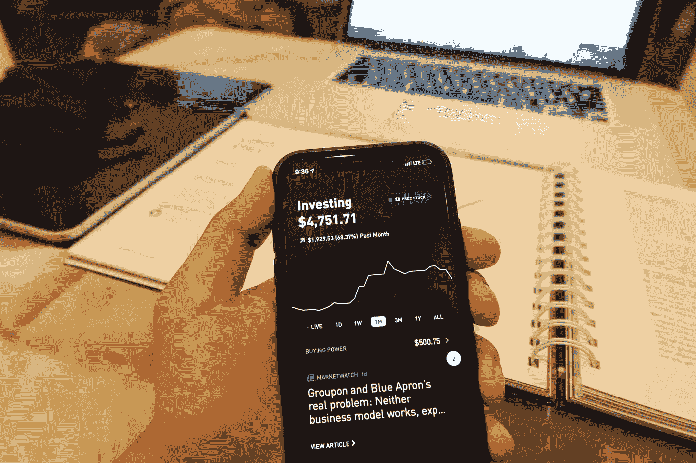
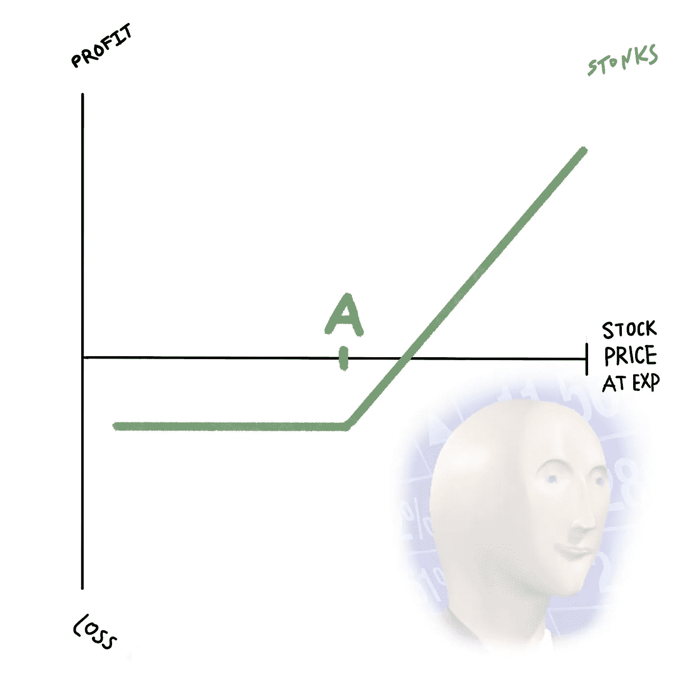

# 使用 Python 和 Robinhood 构建多头交易机器人

> 原文：<https://towardsdatascience.com/using-python-and-robinhood-to-build-a-long-call-trading-bot-661b1f6d75ae?source=collection_archive---------16----------------------->



我过去一个月(一月到二月)的实际收获。

这是另一个我正在尝试自动化的交易策略。

所以对于那些不知道的人，我真的在努力了解[被动收入](https://medium.com/@melvfnz/data-from-my-passive-income-sources-acb5fddb0e3c)的想法。在过去的三个月左右，我一直在大量研究交易。随着我越来越深入这个领域，越来越理解其中的动态，我想看看我是否能把这个领域的知识翻译成 Python。因此，让我们从理解什么是长时间通话开始。

## 什么是长途电话？

看涨期权是期权交易中的一种合约形式。它给了你以某一价格买入股票的“选择权”(执行价格 A)。从看涨期权中赚钱的方法是，如果你相信某只股票的价格会上涨。此外，如果你相信一只股票会持续上涨，那么它就有无限的盈利潜力。



艺术作品[小敏](https://www.linkedin.com/in/mandyxiao/)

## 我们需要什么

对于那些不了解我的人，我已经写了两篇文章，这两篇文章已经在第一步帮助了我们。所以我们需要[使用 Python](/using-python-to-get-robinhood-data-2c95c6e4edc8) 连接到 Robinhood。创建将[为我们](/how-to-use-python-to-buy-options-from-robinhood-8022bbcf3ddf)订购选项的代码。在所有的初始设置之后，实际的长期通话策略非常简单。

## **长通话的设置**

*   以执行价格 A 买入看涨期权
*   我们希望股价等于或高于股价 A

## 编写代码

所以让我们从最后开始。要执行期权订单，我们需要从`[robin_stocks](https://robin-stocks.readthedocs.io/en/latest/index.html)`开始使用:

```
robin_stocks.orders.order_buy_option_limit(*price*, *symbol*, *quantity*, *expirationDate*, *strike*, *optionType='both'*, *timeInForce='gfd'*)
```

我们只需要期权合约的价格。我们将要使用的股票的符号。我们想要购买的合同数量。上述合同的到期日。股票的执行价格。期权类型设置为看涨期权。

对于这个例子，让我们使用特斯拉购买我们的订单。我通常通过 Robinhood 应用程序购买一个期权，其执行价格与股价相当。所以我们来抓一下特斯拉目前的股价。

> `current_price = r.stocks.get_latest_price(‘TSLA’)[0]`

一旦我们有了这个价格，我们就可以抓住高于这个价格的看涨期权，选择最接近这个价格的期权。但在此之前，我们还需要考虑产品的有效期。我喜欢购买 30-45 天后的长期看涨期权。我已经创建了代码，将检查今天的日期，并找到 30-45 的日期。然后我选择最远的日期。一旦我们有了成交价格和截止日期，我们就可以把它插回到`r.options.find_options_for_stock_by_expiration_and_strike(symbol, expirationDate, strike_a, optionType=’call’, info=None).`中，现在它将搜索 30-45 天内最长的看涨期权，并为我们提供一个订单价格。对于订单价格，我们可以从最高卖价到最低卖价中选择一个数字。我只是倾向于选择`low_fill_rate_buy_price`它通常会立即执行我的订单。但是你可以根据自己的交易偏好随意摆弄这些数字。

我们现在可以使用`robin_stocks.orders.order_buy_option_limit(*price*, *symbol*, *quantity*, *expirationDate*, *strike*, *optionType='call'*, *timeInForce='gfd'*)`来执行我们的订单了

我们可以填写所有变量，订单现在已经发送过来了。这基本上是一个长期看涨期权，我知道一些投资者喜欢，但低于执行价格，但对我来说溢价太贵了。一切取决于你的交易策略。

我其他一些涉及 Python 和 Robinhood 的文章:

[](/using-python-and-robinhood-to-create-a-simple-buy-low-sell-high-trading-bot-13f94fe93960) [## 使用 Python 和 Robinhood 创建一个简单的低买高卖交易机器人

### 所以我最近一直在折腾 Robinhood，一直在努力理解股票。我不是财务顾问或…

towardsdatascience.com](/using-python-and-robinhood-to-create-a-simple-buy-low-sell-high-trading-bot-13f94fe93960) [](/using-python-and-robinhood-to-build-an-iron-condor-options-trading-bot-4a16e29649b0) [## 使用 Python 和 Robinhood 构建一个钢铁秃鹰期权交易机器人

### 所以我最近发现了期权交易的潜在收益。

towardsdatascience.com](/using-python-and-robinhood-to-build-an-iron-condor-options-trading-bot-4a16e29649b0) 

以上代码可以在[这里](https://www.patreon.com/posts/34305972)找到，请随时关注我的交易之旅[这里](https://www.patreon.com/melvfnz)。

我也有家教和职业指导。

如果你们有任何问题、意见或担忧，不要忘记在 LinkedIn 上与我联系！

***注来自《走向数据科学》的编辑:*** *虽然我们允许独立作者根据我们的* [*规则和指导方针*](/questions-96667b06af5) *发表文章，但我们不认可每个作者的贡献。你不应该在没有寻求专业建议的情况下依赖一个作者的作品。详见我们的* [*读者术语*](/readers-terms-b5d780a700a4) *。*