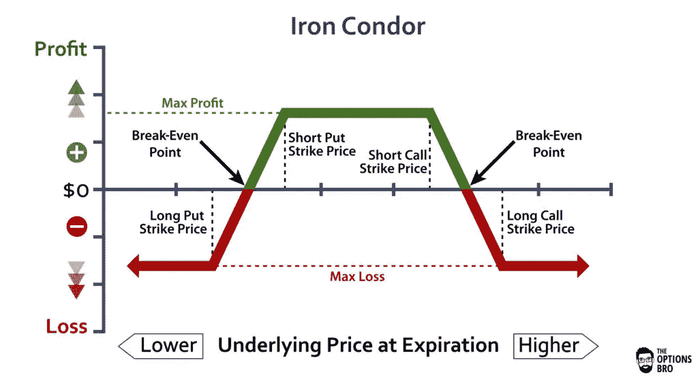

# 使用 Python 和 Robinhood 构建一个钢铁秃鹰期权交易机器人

> 原文：<https://towardsdatascience.com/using-python-and-robinhood-to-build-an-iron-condor-options-trading-bot-4a16e29649b0?source=collection_archive---------1----------------------->

让·维拉在 [Unsplash](https://unsplash.com?utm_source=medium&utm_medium=referral) 上拍摄的照片

所以我最近发现了期权交易的潜在收益。我的思维非常技术性，注意到交易策略只不过是条件语句。所以我决定创建一个简单的铁鹰交易策略。

根据 [OptionAlpha](https://optionalpha.com/members/video-tutorials/neutral-strategies/iron-condors) 的说法，铁鹰期权交易策略是与期权一起使用的利润最高、风险最低的交易策略。我将使用 Python 和 Jupyter Notebook 在 Robinhood 下这些期权订单。

让我们首先试着理解什么是铁鹰战略。对于那些熟悉期权的人来说，它们基本上是四种期权合约。有铁秃鹰，可以要求所有的呼吁，所有的 put 或基本的铁秃鹰。在这个例子中，我们将使用基础。要求同时做多卖出、做空卖出、做空买入和做多买入。执行这一策略的最佳时机是，当我们知道我们订购的股票在特定的时间框架内上下波动最小时。

图片来自 Options Bro—[https://www . Options Bro . com/iron-condor-option-strategy-example/](https://www.optionsbro.com/iron-condor-option-strategy-example/)

我认识的大多数投资者都喜欢在到期后的 30 到 45 天内操作这个游戏。这就是时间衰减的好处。他们还在指数期权而不是个股上玩这种游戏，因为指数没有那么不稳定。但是我们可以在其他时间更深入地研究逻辑，让我们专注于创建可以工作的代码。

## 我们需要什么

对于那些不了解我的人，我已经写了两篇文章，这两篇文章已经在第一步帮助了我们。所以我们需要[使用 Python](/using-python-to-get-robinhood-data-2c95c6e4edc8) 连接到 Robinhood。创建将[为我们](/how-to-use-python-to-buy-options-from-robinhood-8022bbcf3ddf)订购选项的代码。在所有的初始设置之后，实际的铁秃鹰战略非常简单。

## 铁鹰的设定

*   我们希望股票处于执行价 A(低于股价)和 B(高于股价)之间
*   买入低于执行价的看跌期权
*   以执行价格卖出看跌期权
*   卖出看涨期权执行价格 B
*   买入高于执行价 B 的看涨期权
*   所有这些合同都将有相同的到期日

## 编写代码

首先，让我们找一只股票来玩。我继续做了一些研究，并将在我们的代码中使用 Fitbit。Fitbit 在 11 月份左右有所上涨，但我相信它未来将横向移动。使我们可以很容易地看到我们可以订购哪些选项。我们只需要输入股票代码。

它现在将输出如下所示的数据帧:

因此，我们希望从这里开始关注的主要栏目是`expiration_date`,让我们从创建代码开始，它将找到从现在起 30 到 45 天的到期日期。然后，我们将使用这些日期来消除现有的期权订单。我们现在将有一个列表，将是我们的铁秃鹰完美的可用选项。

接下来的部分，我获取当前的股票价格，并把它附加到一个列表中，这个列表是我从执行价格列中得到的。然后，我对这些值进行排序，以便使用指数值来选择每个订单所需的执行价格。然后，在到期日期中，我将选择从今天起 30–45 天内最晚的一天。

接下来，我只需下 4 个不同的期权订单，并填入所有必要的信息。在所有这些之后，我们已经成功地创建了执行 iron condor 订单的 Python 代码！

我其他一些涉及 Python 和 Robinhood 的文章:

 [## 使用 Python 和 Robinhood 创建一个简单的低买高卖交易机器人

### 所以我最近一直在折腾 Robinhood，一直在努力理解股票。我不是财务顾问或…

towardsdatascience.com](/using-python-and-robinhood-to-create-a-simple-buy-low-sell-high-trading-bot-13f94fe93960) 

以上代码可以在[这里](https://www.patreon.com/posts/34200909)找到，请随时关注我的交易之旅[这里](https://www.patreon.com/melvfnz)。

我在这里也有家教和职业指导。

如果你们有任何问题、评论或顾虑，请不要忘记通过 LinkedIn[与我联系！](https://www.linkedin.com/in/melvfernandez/)

***来自《走向数据科学》编辑的提示:*** *虽然我们允许独立作者根据我们的* [*规则和指导方针*](/questions-96667b06af5) *发表文章，但我们并不认可每个作者的贡献。你不应该在没有寻求专业建议的情况下依赖一个作者的作品。详见我们的* [*读者术语*](/readers-terms-b5d780a700a4) *。*