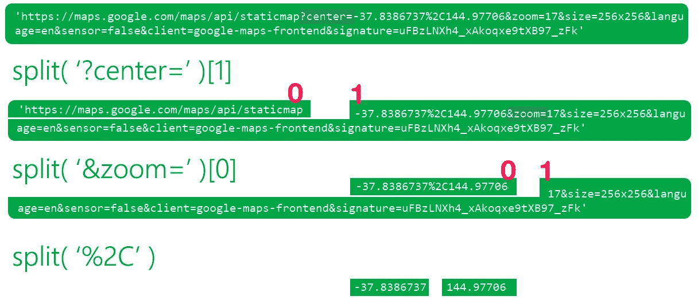

# 使用 Python 和 Selenium 从街道地址获取坐标

> 原文：<https://towardsdatascience.com/using-python-and-selenium-to-get-coordinates-from-street-addresses-62706b6ac250?source=collection_archive---------4----------------------->


澳洲墨尔本市(www.pxhere.com)

这是一篇分步介绍如何使用 **Python** 和 **Selenium** 从基于街道地址的谷歌地图**中抓取**坐标数据**(纬度和经度值)的文章。**

在这个例子中，我将使用一个包含所有澳大利亚慈善机构和非营利组织街道地址的官方数据集。最后，我将继续使用**lyum，**绘制**墨尔本**市的所有慈善机构和非营利机构的地图，以展示如何使用新获得的坐标数据。

要继续学习，您可以从我的 GitHub 库下载 [Jupyter 笔记本。](https://github.com/kelmouloudi/MediumArticle-Selenium)

# 软件包和设置:


Selenium 主要用于自动化 web 应用程序测试，但也可以用于从网站上抓取数据或在浏览器上执行重复性任务(www.rawpixel.com)

我们将需要 [**硒**](https://pypi.org/project/selenium/) python 包来执行数据抓取**。**如果还没有，可以使用**pip:**`**pip install selenium**`**安装[。](https://www.youtube.com/watch?v=FKwicZF7xNE)******

******我们还需要一个**网络驱动**来与浏览器互动，所以你必须[到这里下载](https://chromedriver.chromium.org/downloads)到你的机器上(确保它与你当前的 Chrome 版本兼容)。******

****现在让我们开始导入:****

```
**from selenium import webdriver**
```

****让我们也得到 [**tqdm**](https://github.com/tqdm/tqdm) ，一个必不可少的 progressbar python 包。估计你的代码的 web 抓取部分将花费多少时间是非常有用的(我使用 tqdm_notebook 是因为我在 Jupyter 笔记本上工作) :****

```
**from tqdm import tqdm_notebook as tqdmn**
```

****除此之外，我们还需要 [**熊猫**](https://pandas.pydata.org/) 来读取和操作数据集:****

```
**import pandas as pd**
```

****最后，我们将得到[](https://pypi.org/project/folium/)****来绘制地图上的坐标数据(可以使用`pip install folium`来安装):********

```
****import folium****
```

******我将在一个 Jupyter 笔记本上工作([你可以在这里下载](https://github.com/kelmouloudi/MediumArticle-Selenium))。如果您在 python IDE 中工作，所有这些步骤仍然适用。******

# ******数据集:ACNC 慈善和非营利注册******

************

******澳大利亚慈善和非营利委员会(ACNC)是澳大利亚慈善机构的国家监管机构******

******在涵盖过去 10 年的第 10 版 CAF 世界捐赠指数中，澳大利亚在全球排名第四。通过访问 [ACNC 的网站](https://www.acnc.gov.au/)，你会很快注意到他们让研究人员可以很容易地获取所有关于澳大利亚慈善机构和非营利组织的数据。******

******我们将使用的数据集可以在这里下载(以及一个解释变量的有用的用户注释文档):******

*   ******[ACNC 慈善登记数据集](http://data.gov.au/dataset/acnc-register)*【Excel 文件 XLSX****|****7.7 Mb****|****截至 2020 年 1 月 23 日 74155 行 60 列*******

****该数据集展示了澳大利亚慈善机构和非营利机构的许多有趣方面:唯一标识符、法定名称、地址(用于通信)、注册日期、规模、目的、受益人等(阅读用户注释了解更多信息)。****

****这里我们主要感兴趣的是**街道地址特征**，它跨越了几列:*地址 _ 行 _1* ，*地址 _ 行 _2* ，*地址 _ 行 _3* ，*城镇 _ 城市*，*州*，*邮政编码*和*国家*。此外，为了简单起见，我们将只调查墨尔本市的慈善机构和非营利组织。****

# ****数据清理和准备:****

********

****自由峰的 rawpixel.com/宏矢量****

****首先，让我们来看看之前从 ACNC 网站下载的关于熊猫的数据集:****

****请确保提供 Excel 文件在您的计算机上的路径。参数`keep_default_na`被设置为`False`，所以当某些值丢失时，我们将得到空值而不是`NaN`。稍后当我们将所有街道地址变量合并成一个变量时，这将非常有用。****

********

****acnc.shape 给出了 **74155** 行和 **60** 列****

****现在，让我们创建一个新的数据框架`mel`，在通过变量`Town_City`过滤后作为`acnc`的副本，以便只选择墨尔本市的慈善机构和非营利组织:****

```
**mel = acnc[acnc.Town_City.str.contains('melbourne', case=False)][['ABN', 'Charity_Legal_Name', 'Address_Line_1', 'Address_Line_2', 'Address_Line_3', 'Town_City', 'State', 'Postcode', 'Country', 'Date_Organisation_Established', 'Charity_Size']].copy()**
```

****我在这里做了两件事:我通过`Town_City`变量过滤了`acnc`数据帧，然后我从最初的 60 列中只选择了 11 列有用的列。`copy()`确保我们制作了经过过滤的`acnc`数据帧的正确副本。****

****我在这里没有使用`acnc[acnc.Town_City == 'Melbourne']`，因为我怀疑它可能以不同的方式编写。为了确保这是必要的:****

```
**mel.Town_City.value_counts()**
```

********

****正如我们在上面看到的，这个专栏包含了不同的方式来表明一个慈善机构确实位于墨尔本，其中一些使用了郊区，甚至是城市中非常特殊的地方，比如墨尔本大学。通过使用`acnc.Town_City.str.contains('melbourne', case=False)`，我们确保了上述所有慈善机构都被计算在内(否则我们只能得到 1779 个正确标记的慈善机构)。****

****让我们看看新的`mel`数据框架是什么样的:****

```
**mel.head()**
```

********

****mel.shape 赋予 **2722** 行和 **11** 列****

****现在，让我们添加一个包含完整地址的新列`Full_Address`:****

```
**mel['Full_Address'] = mel['Address_Line_1'].str.cat( mel[['Address_Line_2', 'Address_Line_3', 'Town_City']], sep=' ')**
```

****`str.cat()`在这里有效，因为所有这些列都是 object 或 string 类型的。****

****下面是`mel`中第一个完整地址的例子:****

```
**mel.Full_Address.iloc[0]Output:'G Se 11 431 St Kilda Rd   Melbourne'**
```

****还有一点:这些完整的地址中，有些只包含邮政信箱号码(称为邮政信箱或邮政信箱)。这些地址对我们来说完全没有用，因为它们不涉及一个已存在的地方。这里有一个例子:****

```
**mel[mel.Full_Address.str.contains('po box', case=False)].Full_Address.iloc[0]Output:'GPO Box 2307   Melbourne VIC 3001 AUSTRALIA'**
```

****在继续之前，我们需要删除这些记录(或行):****

```
**mel = mel[~mel.Full_Address.str.contains('po box', case=False)].copy()**
```

****最后一件事:一些地址包含字符`/`，它可以破坏任何 URL。我们需要用空格替换任何斜杠:****

```
**mel.Full_Address = mel.Full_Address.str.replace('/', ' ')**
```

# ****探索谷歌地图:****

********

****rawpixel.com****

****在任何网络抓取工作之前，探索你想要从中提取数据的网站是很重要的。在我们的例子中，它是[谷歌地图](https://www.google.com/maps)。****

****首先，让我们研究一下使用 Google Maps 内部的搜索栏搜索完整地址是如何影响结果页面的 URL 的。为此，我将使用虚构的地址`Grinch house mount crumpit whoville` ,因为我希望谷歌地图不返回任何结果:****

********

****正如你在上面看到的，我们得到了`www.google.com/maps/search/`,后面是我们搜索的地址。换句话说，如果我们想在谷歌地图中搜索一个地址 XYZ，我们所要做的就是使用网址`www.google.com/maps/search/XYZ`，而不必与搜索栏本身进行交互。****

****这里的想法是在`mel`中生成一个新列，我们将`www.google.com/maps/search/`与数据帧`mel,`中的每一个`Full_Address`组合在一起，然后让 Selenium 遍历它们，一个接一个地访问 URL。****

****让我们创建新的`Url`列:****

```
**mel['Url'] = ['https://www.google.com/maps/search/' + i for i in mel['Full_Address'] ]**
```

****现在我们有了一个包含所有要抓取的 URL 的列，让我们看看地址`G Se 11 431 St Kilda Rd Melbourne`例如:****

****[www.google.com/maps/search/G 东南 11 区，墨尔本第一基尔达路 431 号](http://www.google.com/maps/search/G Se 11 431 St Kilda Rd Melbourne)****

****上面的链接给了我们:****

********

****以上地址对应的是慈善机构**澳大利亚护士纪念中心**。让我们在谷歌地图上按名字搜索一下:****

********

****我们得到完全相同的点，但在 URL 中没有相同的坐标。这是因为 URL 中的坐标与地图的居中方式相关联，而不是与标记相关联(如果放大或缩小，坐标会发生变化)。这就是为什么我们要直接从页面本身的源代码中提取坐标。****

****要查看源代码，请右键单击页面内的空白区域(地图外部),然后选择“查看页面源代码”(在 Mac 中为 CTRL+U 或 Command+U)。现在在源页面中搜索 **-37.8** 或 **144.9** :****

********

****你会在源代码中的很多地方找到我们正在寻找的坐标。但是如果它们包含在一个我们可以瞄准的 HTML 标签中，那么它们对我们来说是最有用的。幸运的是，这里有一个元标记我们可以利用:****

********

****现在，让我们注意它是一个带有属性`content`的`meta`标签，属性`content`包含我们想要提取的 URL，属性`itemprop`的值`image`可以用来识别和定位这个特定的`meta`标签。****

****现在我们所要做的就是使用 Selenium 访问`mel.Url`中的每个 URL，并定位这个`meta`标签，以提取其属性`content`的值。****

# ****使用硒:****

********

****rawpixel.com—[网络仓鼠](https://www.flickr.com/photos/webhamster/)****

****下面是我们将用来从 Google Maps 中提取包含坐标的 URL 的代码:****

*   ******第 1 行**:我们创建了一个名为`Url_With_Coordinates`的空列表，稍后我们将用(你猜对了)我们想要提取的 URL 填充它；****
*   ******第 3 行到第 5 行** : prefs 在没有 javascript 和图片的情况下运行 Webdriver。这样，代码加载网页的时间会少得多。显然，如果您想要提取的内容依赖于 javascript，这不是一个好的选择。移除`'images':2, 'javascript':2`，网页将正常加载图片和 javascript****
*   ****确保指定你把 chromedriver.exe 文件放在你机器的什么地方。在我的例子中，为了简单起见，我把它放在 c 盘中。注意，路径中的反斜杠`\`需要加倍`\\`才能识别路径；****
*   ******第 9 行**:这个 for 循环在`mel.Url`系列上迭代。包装我们的 iterable 的`tqdmn()`在执行完单元后添加了一个进度条。其参数`leave=False`确保操作完成后，杆消失；****
*   ******第 10 行**:对于`mel.Url`中的每个 URL，网络驱动打开那个 URL(对于第一个 URL，你会看到一个 chrome 窗口打开，然后你会注意到它从一个 URL 到另一个 URL，直到`mel.Url`结束)；****
*   ******第 11 行**:首先，我们使用`driver.find_element_by_css_selector`搜索我们的`meta`标签，并且我们通过`meta[itemprop=image]`识别标签。之后，我们使用`.get_attribute('content')`提取属性`content`的值。然后使用`append()`将该操作的结果(包含坐标的 URL)添加到`Url_With_Coordinates`列表中。****
*   ******第 13 行**:我们在脚本完成后关闭 webdriver (chrome 窗口)(这是一个很好的做法)。****

****下面是运行中的脚本和 tqdm 进度条(或 tqdmn，因为我使用的是 tqdm_notebook 子模块) :****

********

****tqdm 估计整个操作大约需要 32 分钟(大约每秒 1 次迭代或 URL)****

******NB 1:** **下次运行笔记本的时候，你就不用再重新运行一遍网页抓取代码**了，因为我们已经把结果保存在一个名为`Url_With_Coordinates.csv`的 CSV 文件里了。让我们改为读取该文件:****

```
**import csvwith open('Url_With_Coordinates.csv', 'r') as f:
    reader = csv.reader(f, delimiter=',')
    for i in reader:
        Url_With_Coordinates = i
        break**
```

****在你的测试中，你不会想让 for 循环遍历数千个地址，到头来却抛出一个错误。在正确执行脚本之前，您需要先测试几个值。在我们的例子中，测试代码将是这样的，只检查`mel.Url`的前 10 个值:****

```
**for url in tqdmn(mel.Url[:10], leave=False):
    driver.get(url)
    ......**
```

****现在让我们看看`Url_With_Coordinates`列表是什么样子的:****

********

****2009 年前 5 个网址****

****让我们将这个列表作为一列添加到我们的`mel`数据框架中:****

```
**mel['Url_With_Coordinates'] = Url_With_Coordinates**
```

****但是我们如何从这些 URL 中提取坐标呢？下面是如何使用 Python 的`split()`方法实现这一目的的直观解释:****

********

****该代码翻译成如下代码(该代码不会运行，因为没有定义`url`，它只是为了展示上面的解决方案是如何工作的):****

```
**url.split('?center=')[1].split('&zoom=')[0].split('%2C')Output:[-37.8386737, 144.97706]**
```

****现在使用上面的代码，我们将向我们的`mel`数据框架添加两个新列:`lat`表示纬度，`long`表示经度:****

```
**mel['lat'] = [ url.split('?center=')[1].split('&zoom=')[0].split('%2C')[**0**] for url in mel['Url_With_Coordinates'] ]mel['long'] = [url.split('?center=')[1].split('&zoom=')[0].split('%2C')[**1**] for url in mel['Url_With_Coordinates'] ]**
```

****最有可能的是，上面的代码给出了一个错误`list index out of range`:****

********

****这个错误意味着对于列`Url_With_Coordinates`中的一些 URL，`split()`方法没有按预期工作。也许一些 URL 没有我们用于`split()`方法的关键字。让我们寻找缺少`&zoom=`的 URL，例如:****

```
**mel[~mel.Url_With_Coordinates.str.contains('&zoom=')]**
```

********

****正如我们在这里看到的，我们有 5 个提取的 URL 以`//www.gstatic.com/images ...`开头的实例(因此我们得到了错误) :****

```
**list(mel[~mel.Url_With_Coordinates.str.contains('&zoom=')].Url_With_Coordinates)Output:['//www.gstatic.com/images/branding/product/1x/maps_round_512dp.png',
 '//www.gstatic.com/images/branding/product/1x/maps_round_512dp.png',
 '//www.gstatic.com/images/branding/product/1x/maps_round_512dp.png',
 '//www.gstatic.com/images/branding/product/1x/maps_round_512dp.png',
 '//www.gstatic.com/images/branding/product/1x/maps_round_512dp.png']**
```

****为了简单起见，因为 5 不是一个大数字，我们将从`mel`中删除这些实例:****

```
**mel = mel[mel.Url_With_Coordinates.str.contains('&zoom=')].copy()**
```

****现在，让我们重新运行将两列`lat`和`long`添加到我们的`mel`数据帧的代码:****

```
**mel['lat'] = [ url.split('?center=')[1].split('&zoom=')[0].split('%2C')[0] for url in mel['Url_With_Coordinates'] ]mel['long'] = [url.split('?center=')[1].split('&zoom=')[0].split('%2C')[1] for url in mel['Url_With_Coordinates'] ]**
```

****成功了！下面是我们的`mel`数据框架的样子，其中每个慈善机构或非营利组织都获得纬度和经度值(这里的一些列被屏蔽了) :****

```
**mel.head()**
```

********

****让我们来绘制这些坐标，看看它们能有多精确。****

# ****使用叶子进行坐标映射:****

********

****在此下载该地图的 HTML 文件****

****颜色编码(慈善规模取决于年收入) :****

*   ******红色**:大型慈善机构(100 万澳元以上)；****
*   ******紫色**:中等慈善机构(25 万澳元至 100 万澳元之间)；****
*   ******橙色**:小型慈善机构(25 万澳元以下)；****
*   ******灰色**:无数据。****

****下面是我们将用来映射这些坐标的代码:****

****我不会详细介绍如何使用 Folium，但我会在这里澄清一些要点:****

*   ****我在这张地图上使用了`CartoDB positron`,因为它对彩色标记提供了非常低的对比度(这使得它们更加明显)。使用默认图块`OpenStreetMap`很难看到标记；****
*   ****我使用`folium.CustomIcon`的参数`icon_size=(..,..)`根据慈善机构的规模改变了标记的大小。这背后的原因是为了防止居住在同一栋楼里的慈善机构互相掩盖。因为先画大的标记，然后在上面画小的标记，这样即使重叠的慈善机构也能被区分出来；****
*   ****我使用自定义标记(托管在 imgur 上),因为默认标记会大大降低导航速度，因为我们在地图上有大约 2000 个标记。对于自定义标记，您可以提供要使用的图像的 URL，或者您计算机上图像文件的路径。****
*   ****如果你点击一个标记，它会给你慈善机构的名称和地址，所以你可以验证定位是否正确；****
*   ****在上面的代码中，我可以只使用`mel_map`而不是`mel_map.save('mel_map.html')`后跟`IFrame(src='mel_map.html', width='100%', height=500)`，但是当标记的数量很大时，最好将地图保存为 HTML 文件，然后使用`IFrame()`打开它(否则您将得到一个空白地图)。****

# ****这种方法有多准确可靠？****

********

****我们将使用已经有街道地址和坐标的华盛顿州 DC 的企业数据集来测试我们的方法——图片(CC0)pxhere.com****

****这是一个非常合理的问题。显然，从街道地址中获取坐标的最佳方式是从一个像 Google Maps 或 Bing 这样的知名 API 中获取，但是这些选项可能要花钱。****

****这种方法的准确性很大程度上受所提供的街道地址的精确度和正确性的影响。例如，在我们上面的例子中，你会注意到一个标记被扔在了印度洋的中央。经审查，地址`65 Macarae Road Melbourne`实际上应该是`65 Mcrae Road Melbourne`，因此出错。****

****为了从经验上测试我们的方法，我们将使用一个数据集，该数据集包含华盛顿州 DC 数千家企业的街道地址和坐标。我们将随机抽取 500 个商业地址，然后使用我们的方法从中生成坐标。之后，我们会将它们与数据集中列出的实际坐标进行比较。我们将在测试中使用的数据集可以从这里下载:****

*   ****[最近 30 天的基本营业执照](https://opendata.dc.gov/datasets/a9ac9f8d9d1546e8bd6610b48cb29810/data):opendata.dc.gov 数据集， **6418** 记录(截至 26/01/2020)，2.64 Mb****

********

****我们将用来测试我们方法的数据集****

****结果如下(测试详情可在 [Jupyter 笔记本](https://github.com/kelmouloudi/MediumArticle-Selenium)中获得) :****

********

****红色:数据集中的实际坐标—橙色:使用 Selenium 和 Google Maps 生成的坐标(此处下载 HTML 文件形式的地图)****

****正如我们在上面看到的，在华盛顿州 DC 随机抽样的 500 家企业中，生成的坐标非常接近实际坐标。我将橙色标记做得比红色标记小，这样当它们完全重叠时就都可见了(这就是为什么缩小时橙色标记看起来有红色边框)。****