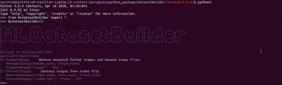
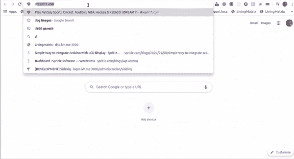
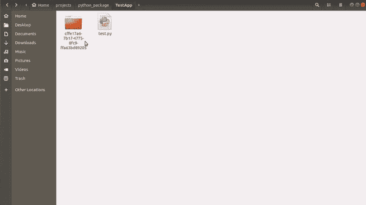
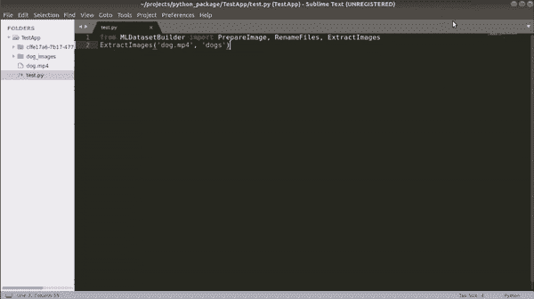

# 使用 python 包构建您的自定义数据集— MLDatasetBuilder

> 原文：<https://towardsdatascience.com/using-python-package-to-build-your-custom-dataset-mldatasetbuilder-d23ffd6d4fd1?source=collection_archive---------40----------------------->

## MLDatasetBuilder 是一个 python 包，可帮助您为 ML 数据集准备图像。


**图片来源于【www.spritle.com】[](https://www.spritle.com/blogs/2020/07/12/mldatasetbuilder-a-python-package-for-build-your-custom-dataset%E2%80%8A/)**

> **作为一名 ML 新手，我需要找出为我们的机器学习训练模型准备数据集的最佳方法。根据我的[上一篇文章](/deep-learning-prepare-image-for-dataset-d20d0c4e30de)，我为这个过程设计了一个 Python 包！**

**每当您训练自定义模型时，重要的是数据集。是的，当然，数据集在深度学习中起主要作用。模型的准确性将取决于数据集。因此，在训练自定义模型之前，您需要计划**如何构建数据集？**在这里，我将分享我关于构建数据集的简单方法的想法。**

**[](https://pypi.org/project/MLDatasetBuilder/) [## MLDatasetBuilder

### MLDatasetBuilder 是一个 python 包，可帮助您为 ML 数据集准备图像。每当我们启动一台机器…

pypi.org](https://pypi.org/project/MLDatasetBuilder/) 

# [MLDatasetBuilder-版本 1.0.0](https://pypi.org/project/MLDatasetBuilder/)

## 为机器学习构建数据集的 Python 包

每当我们开始一个机器学习项目时，我们首先需要的是一个数据集。数据集将是训练模型的支柱。您可以自动或手动构建数据集。MLDatasetBuilder 是一个 python 包，可帮助您为 ML 数据集准备图像。

[](https://github.com/karthick965938/ML-Dataset-Builder) [## karthick 965938/ML-数据集构建器

### MLDatasetBuilder 是一个 python 包，可帮助您为 ML 数据集准备图像。每当我们启动一台机器…

github.com](https://github.com/karthick965938/ML-Dataset-Builder) 

# 装置

我们可以使用下面的命令安装***MLDatasetBuilder***包

```
pip install MLDatasetBuilder
```

# **如何测试**

当您在终端中运行`python3`时，它将产生如下输出:

```
Python 3.6.9 (default, Apr 18 2020, 01:56:04) 
[GCC 8.4.0] on linux
Type "help", "copyright", "credits" or "license" for more information.
>>> 
```

运行下面的代码可以得到 ***MLDatasetBuilder 包的**初始化**过程输出。***

```
>>> from MLDatasetBuilder import *
>>> MLDatasetBuilder()
```



**初始化**过程的输出

# 可用操作

**准备图像** — *移除*不需要的格式图像，并*重命名*您的图像

```
#PrepareImage(folder_name, image_name)
**PrepareImage('images', 'dog')**
```

**提取图像** — *从*视频文件*中提取*图像

```
#ExtractImages(video_path, file_name, frame_size)
**ExtractImages('video.mp4', 'frame', 10)**
#OR
#ExtractImages(video_path, filename)
**ExtractImages('video.mp4', 'frame')**
#Default FPS will be 5
```

# 第一步——从谷歌获取图片

是的，我们可以从谷歌上获取图片。使用[下载所有图像](https://chrome.google.com/webstore/detail/download-all-images/ifipmflagepipjokmbdecpmjbibjnakm?hl=en)浏览器扩展，我们可以在几分钟内轻松获取图像。你可以查看[这里](https://www.youtube.com/watch?v=ik1VxrtN7m8&feature=youtu.be)关于这个扩展的更多细节！



从谷歌获取图片

# 步骤 2-创建 Python 文件

一旦你使用这个扩展下载了图像，你就可以创建一个名为 **test.py** 的 python 文件，目录如下。

```
download_image_folder/
|   _14e839ba-9691-11ea-a968-2ed746e9a968.jpg
|   5e5f7af12600004018b602c0.jpeg
|   A471529_Alice_b-1.jpg
|   image1.png
|   image2.png
|   ...
test.py
```

在 images 文件夹中，你可以看到许多 PNG 图像和随机文件名。

# 步骤 3 —准备图像

***MLDatasetBuilder****提供了一个名为 **PrepareImage 的方法。**使用此方法，我们可以删除不想要的图像，并重命名您已经从浏览器的扩展下载的图像文件。*

```
*PrepareImage(folder_path, class_name)
#PrepareImage('download_image_folder', 'dog')*
```

*根据上面的代码，我们需要提到图像**文件夹路径**和**类名**。*

**

***准备图像**选项的输出*

*完成这个过程后，你的图像文件夹结构将如下所示*

```
*download_image_folder/
|   dog_0.jpg
|   dog_1.jpg
|   dog_2.jpg
|   dog_3.png
|   dog_4.png
|   ...
test.py*
```

*这个过程非常有助于在贴标签的同时给你的图像添加注释。当然，这将是标准化的事情之一。*

# *步骤 4 —提取图像*

****MLDatasetBuilder****还提供了一个名为**的提取图像的方法。使用这种方法我们可以从视频文件中提取图像。****

```
**download_image_folder/
video.mp4
test.py**
```

**根据下面的代码，我们需要提到**视频路径、文件夹名称、**和**帧大小。文件夹名**将**类名**和 **framesize 的**设为默认值 **5** 并且**不是强制的**。**

```
**ExtractImages(video_path, folder_name, framesize)
#ExtractImages('video.mp4', 'frame', 10)
ExtractImages(video_path, folder_name)
#ExtractImages('video.mp4', 'frame')**
```

****

**提取图像方法的输出**

**完成这个过程后，你的图像文件夹结构将如下所示**

```
**download_image_folder/
dog/
|   dog_0.jpg
|   dog_1.jpg
|   dog_2.jpg
|   dog_3.png
|   dog_4.png
|   ...
dog.mp4
test.py**
```

# **什么是 2.0.0 版？**

**我计划在下个月发布 2.0.0 版本，这将包括一些额外的功能。**

> ***我的意思是这个包将提供超过 100 个带有注释文件的物体图片:)***

# **贡献的**

**欢迎所有问题和拉请求！要在本地运行代码，首先，派生存储库，然后在您的计算机上运行以下命令:**

```
**git clone https://github.com/<your-username>/ML-Dataset-Builder.git
cd ML-Dataset-Builder
# Recommended creating a virtual environment before the next step
pip3 install -r requirements.txt**
```

**添加代码时，一定要在必要的地方编写单元测试。**

# **接触**

**MLDatasetBuilder 是由 [Karthick Nagarajan](https://stackoverflow.com/users/6295641/karthick-nagarajan?tab=profile) 创建的。请随时在[Twitter](https://twitter.com/Karthick965938)Linkedin 或通过[电子邮件联系我们！](mailto:karthick965938@gmail.com)**

*****原载于***[**www.spritle.com**](https://www.spritle.com/blogs/2020/07/12/mldatasetbuilder-a-python-package-for-build-your-custom-dataset%E2%80%8A/)****