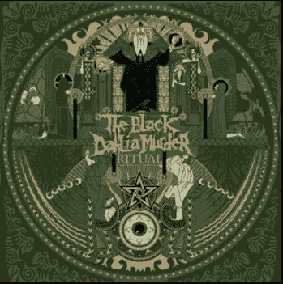
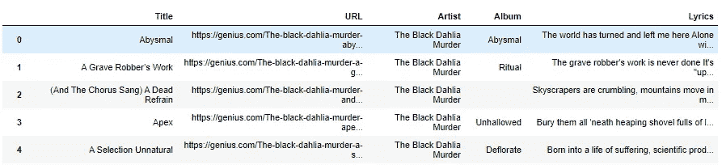
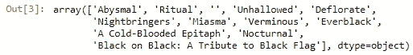
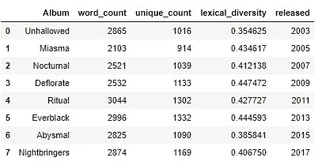
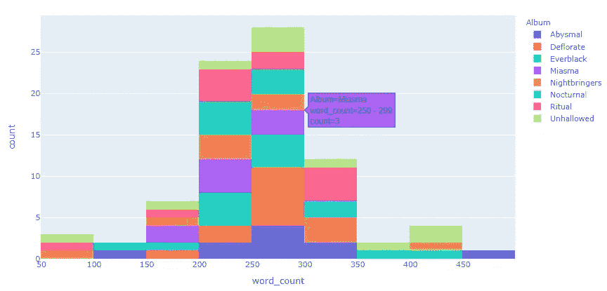
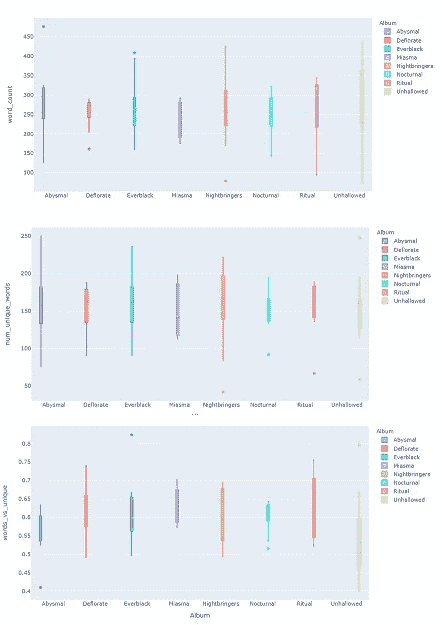
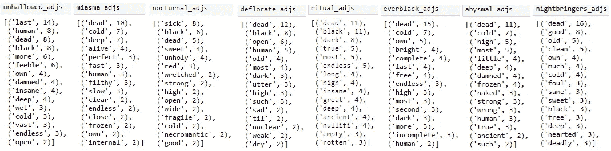
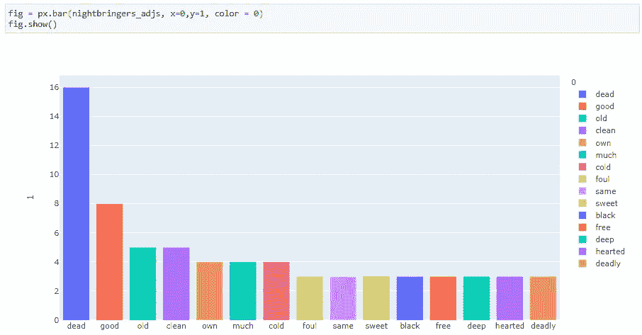

# 用 Python 分析《黑色大丽花谋杀案》的残酷歌词

> 原文：<https://towardsdatascience.com/using-python-to-analyze-the-brutal-lyrics-of-the-black-dahlia-murder-with-genius-api-spacy-bfc7e0e8577f?source=collection_archive---------32----------------------->

## 发现死亡金属的主题


在 [Unsplash](https://unsplash.com?utm_source=medium&utm_medium=referral) 上 [ActionVance](https://unsplash.com/@actionvance?utm_source=medium&utm_medium=referral) 拍照

# 为什么是黑色大丽花谋杀案？

为了纪念他们即将于 2020 年 4 月 17 日发行的专辑*verminus*，也因为他们是我有史以来最喜欢的死亡金属乐队之一，我决定分析黑色大丽花谋杀案(BDM)的歌词，看看它们是如何随着时间的推移而演变的。早在 2006 年，我的朋友刻录了一张他最喜欢的金属歌曲的 CD，上面有 BDM 专辑*中的“瘴气”。一听到这首歌，我就对生活着了迷，并看过他们五次现场表演。成立于 2001 年，BDM 迅速崛起为最受欢迎的美国死亡金属乐队之一。他们的最后七张专辑随着他们的第五张专辑*仪式*登上 [Billboard 200](https://en.wikipedia.org/wiki/Billboard_200) 排行榜，在 2011 年达到 31 张的峰值！*



[https://en . Wikipedia . org/wiki/Ritual _(The _ Black _ Dahlia _ Murder _ album)](https://en.wikipedia.org/wiki/Ritual_(The_Black_Dahlia_Murder_album))

主题是黑暗和忧郁的，音乐感觉像是愤怒和抑郁的化身，但作为 21 世纪初一个焦虑的青少年，死亡金属的能量和愤怒引起了我的共鸣。我能感同身受。直到今天，我还能在旋律重复、双踢和抱怨声中找到安慰，因为它们让我处于恍惚状态，让我放松，让我集中注意力。我发现死亡金属是编码和锻炼的完美音乐，我喜欢随着节奏开始我的一天。

# 获取数据

我正在从 Genius.com 中提取歌词。由于重金属音乐中令人毛骨悚然的尖叫声和神秘的咆哮，歌词有时很难理解。这就是为什么我用天才来破译它们。[Genius.com](https://genius.com/Genius-about-genius-annotated)是一个标注歌词、收集音乐、专辑、艺人等琐事的平台。

虽然网站不允许用户使用 API 提取歌词，但我使用的是一个 Genius API 包装器，它用 BeautifulSoup 解析 Genius HTML。这个过程会产生一个熊猫数据帧，其中包含歌曲名称、url、艺术家、专辑和歌词。在我的 GitHub 上一个名为 **getLyrics.py** 的文件中找到这个包装。

[](https://github.com/bendgame/lyrics-analysis) [## 弯曲游戏/歌词-分析

### 媒体歌词分析。在 GitHub 上创建一个帐户，为 bend game/歌词分析开发做出贡献。

github.com](https://github.com/bendgame/lyrics-analysis) 

```
#import dependencies
from getLyrics import GeniusLyricCollector#pass the api token and artist name into the lyric collector
g = GeniusLyricCollector(token, 'The Black Dahlia Murder')#load the dataframe with the data
songs_df = g.get_artist_songs()#display first 5 rows
songs_df.head()
```

要使用包装器，将您的 Genius API 令牌和艺术家传递到***Genius lyric collector***中。然后调用 **get_artist_songs()** 来填充 DataFrame。



歌曲 _df 数据帧

# 探索相册

在分析数据之前，最好根据需要探索和清理数据。马上，我注意到第 2 行没有列出专辑，所以我知道我需要清理数据，我也想添加一些功能。为了保留原始数据帧，以防我需要返回它，我将复制它并在副本上工作。我查看了附带的相册:

```
lyrics = songs_df[["Lyrics", 'Album', "Title"]].copy()
lyrics.Album.unique()
```



我只想要他们 8 张录音室专辑里的歌。Verminous 还没有发行，也没有歌词，Black on Black 是一个致敬专辑，而冷血墓志铭是一个 EP，所以我会排除所有这些。

# 特征工程

特征工程是使用数据挖掘技术和领域知识从原始数据中提取特征的过程。我想设计一些功能，让我深入了解专辑的词汇丰富性。我将使用几个不同的因素来定义词汇丰富性。我再加一个**字数**、**唯一字** **字数**、**唯一字/字数(词汇多样性)**。虽然这是一个有用的度量，并且是一个简单的计算，但是用这种方法计算词汇多样性的基本问题是它对文本长度的敏感性。幸运的是，每张专辑的长度都差不多。[已经设计了几种不同的方法来克服方法](http://eurosla.org/monographs/EM02/Lindqvist_etal.pdf)的问题，但是我将使用简单的计算。

```
songs_group = lyrics.groupby('Album')
album_stats = pd.DataFrame(columns=('Album', 'word_count', 'unique_count', 'lexical_diversity', 'tokens'))
i = 0
for name, album in songs_group:# Create a list of words for every word that is in an album
    album_tokens = []for lyric in album['Lyrics'].iteritems():if isinstance(lyric[1], str):
            words = lyric[1].replace('\n', ' ')
            words = words.split(' ')album_tokens.extend(words)# Find how many words and unique words are in the album
    unique_count = len(set(album_tokens))
    word_count = len(album_tokens)# Calculate the lexical richness of the album, which is the amount of unique words relative to
    # the total amount of words in the album
    album_stats.loc[i] = (name, word_count, unique_count, (unique_count / float(word_count)), album_tokens)

    i += 1

album_stats["released"] = [2015,2009,2013,2005,2017,2007,2011,2003]
album_stats = album_stats.sort_values('released').reset_index().drop(columns=('index'))
album_stats
```

我还添加了专辑的发行年份，并按栏目排序。

```
album_stats["released"] = [2015,2009,2013,2005,2017,2007,2011,2003]
album_stats = album_stats.sort_values('released').reset_index().drop(columns=('index'))
album_stats
```



## 见识

在 2019 年接受 kerrang.com 采访时，作词人、歌手和乐队主唱 Trevor Strnad 讨论了专辑，将它们从最差到最佳进行了排名。最后，他放了乐队的第二张录音室专辑《T2》中的《瘴气》。伴随着这张专辑长大，我喜欢它，但他说这张专辑感觉没有重点，部分是因为他们从早期的成功和*的失败中走得如此之远。统计数据显示, *Miasma* 拥有最少的单词和最少的独特单词，这表明特雷弗关于主题的观点是正确的，与其他专辑相比，歌词没有那么明确。他没能给予这张专辑应有的关注。*

# 使用 Plotly Express 可视化统计数据

为了可视化数据，我使用了 [**plotly express**](https://plot.ly/python/histograms/) ，因为它只用了几行代码就产生了交互式的可视化效果！下面是一个直方图，显示了专辑的字数分布。

```
#import dependencies
import plotly.express as px#create plot
fig = px.histogram(lyrics, x="word_count", color = 'Album')#show fig
fig.show()
```



箱线图是可视化四分位数统计的好方法。使用 pandas 的 **describe()** ，也很容易生成原始四分位数。使用 [Plotly Express，可以设置盒图中使用的四分位数算法](https://plot.ly/python/box-plots/)。默认为线性。

```
#drop songs with no lyrics
lyrics = lyrics.loc[lyrics.word_count > 0]#count words for each song
lyrics['word_count'] = lyrics['Lyrics'].apply(lambda x :  len(x.split()))#count unique words
lyrics['unique_count'] = lyrics['Lyrics'].apply(lambda x: len(set(w for w in x.split())))#calculate lexical diversity
lyrics['lexical_diversity'] = lyrics['unique_count'] / lyrics['word_count']#display the quartile numeric data.
lyrics.describe()fig = px.box(df, x="Album", y="word_count", color = "Album")
fig2 = px.box(lyrics, x="Album", y="unique_count", color = "Album")
fig3 = px.box(lyrics, x="Album", y="lexical_diversity", color = "Album")fig.update_traces(quartilemethod="linear") # or "inclusive", or "exclusive"
fig2.update_traces(quartilemethod="linear") # or "inclusive", or "exclusive"
fig3.update_traces(quartilemethod="linear") # or "inclusive", or "exclusive"fig.show()
```



再一次，我们可以看到专辑《瘴气》没有其他专辑的广度和多样性。看着词汇多样性较低的专辑，我注意到这些都是主题明确的专辑:*夜行*、*仪式*、*深渊*和*不被允许的*。例如,是他们排行榜上最高的专辑，但词汇多样性比其他专辑低。这可能是因为像“哦，伟大的燃烧的否定者”这样的歌曲有重复的模式，像圣歌，这是专辑的主题。

# 用空间探索歌词

SpaCy 是一个工业级的自然语言处理库。它是在幕后使用 Cython 开发的，使其快速有效地用于大规模文本处理任务，如词性(PoS)标记和命名实体识别(NER)。我将使用词性标注器来更深入地了解专辑中使用的歌词和主题。

如果你是 spaCy 的新手，我建议你看看他们的安装页面，因为他们有很多安装选项。SpaCy 与 Python 2.7 / 3.5+兼容，可以在 Unix/Linux、macOS/OS X 和 Windows 上运行。最新的 spaCy 版本可以通过 [pip](https://pypi.python.org/pypi/spacy) 和 [conda](https://anaconda.org/conda-forge/spacy) 获得。否则，这些命令将使您启动并运行。

```
pip install -U spacy
pip install -U spacy-lookups-data
python -m spacy download en_core_web_sm
```

使用 spaCy，我可以将文本分割成标记，并使用词性标记器来识别所有的名词、动词和形容词。我要看看每张专辑前 15 个形容词，看看会出现什么样的模式。需要注意的是，spaCy 功能强大，但并不完美。[它使用统计模型来预测词性或命名实体](https://spacy.io/usage/training)。

```
import spacy# load a medium-sized language model
nlp = spacy.load("en_core_web_sm")Unhallowed = album_stats['tokens'].loc[album_stats['Album'] == 'Unhallowed']a1 = nlp(str(Unhallowed[0]))
```

我不分析原始词，而是分析引理。词条解释是一种技术，通过将单词简化为词根形式，同时保持它是一个真实的单词，从而使语言规范化。另一种常用的规范化技术叫做词干分析。

```
#create a new dataframe
unhallowed = pd.DataFrame(columns=("token", "pos", "lemma"))# map with frequency count
pos_count = {}
i = 0
for token in a1:
    unhallowed.loc[i] = (token, token.pos_, token.lemma_)
    i+=1

#locate the parts of speech to keep and reset the index 
unhallowed = unhallowed.loc[unhallowed['pos'].isin(['PROPN', 'NOUN', 'VERB', 'AUX',' DET', 'ADJ', 'ADP'])].reset_index().drop(columns =('index'))
```

注意，在上面的代码片段中，我创建了一个 dataframe，并用单词 token、词性标记和词条填充它。当我计算 ADJ 的计数时，我将使用**引理**而不是**令牌**。

```
unhallowed_freq = Counter(unhallowed['lemma'].loc[unhallowed['pos'] == 'ADJ'])#call the 15 most frequent
unhallowed_adjs = unhallowed_freq.most_common(15)unhallowed_adjs
```



15 个最常见的形容词

很明显，死亡、黑暗和人性的脆弱是 BDM 音乐的主题。“死亡”这个词在所有专辑中高居榜首，除了他们早期的两张热门专辑《不被允许的》和《夜间的》*。虽然很多相同的词出现在每张专辑中，但还是有一些主题上的不同。例如，在*夜间*中，我可以看到“邪恶的”、“可怜的”和“死灵的”这些词出现了多次，它们在主题上代表了一个被抛入永恒黑暗的世界，就像这张专辑所传达的那样。使用 plotly express 条形图，数据易于可视化。*



# 包扎

虽然歌词只是我喜欢的死亡金属的一小部分，但分析起来很有趣。即使没有运行 K-means 或 LDA 等技术，spaCy 也可以使用标记器和命名实体识别等功能来帮助识别文本中的主题。看黑大丽花谋杀案的歌词，它们代表了愤怒和堕落，抑郁和疯狂。虽然有些人可能会因恶意的描述而回避或感到腐败，但我拥抱它和音乐，我永远是快速双踢、催眠旋律重复片段和黑色大丽花谋杀案惊人的音域的粉丝。我迫不及待地想听听他们在*verminus 中会推出什么。*

有关 NLP 和数据科学的更多信息，请查看我的其他教程:

[](/analyzing-wine-descriptions-using-the-natural-language-toolkit-in-python-497ac1e228d5) [## 使用 Python 中的自然语言工具包分析葡萄酒描述

### 用什么词来形容酒？

towardsdatascience.com](/analyzing-wine-descriptions-using-the-natural-language-toolkit-in-python-497ac1e228d5) [](/k-means-clustering-chardonnay-reviews-using-scikit-learn-nltk-9df3c59527f3) [## K-Means 使用 Scikit-Learn & NLTK 对 Chardonnay 评论进行聚类

### 霞多丽是世界上最受欢迎的白葡萄酒。聚类有助于区分高于平均水平的葡萄酒吗…

towardsdatascience.com](/k-means-clustering-chardonnay-reviews-using-scikit-learn-nltk-9df3c59527f3) 

# 谢谢大家！

*   *如果你喜欢这个，* [*在 Medium 上关注我*](https://medium.com/@erickleppen) *获取更多*
*   [*通过订阅*](https://erickleppen.medium.com/membership) 获得对我的内容的完全访问和帮助支持
*   *我们来连线一下*[*LinkedIn*](https://www.linkedin.com/in/erickleppen01/)
*   *用 Python 分析数据？查看我的* [*网站*](https://pythondashboards.com/)

[**—埃里克·克莱本**](http://pythondashboards.com/)