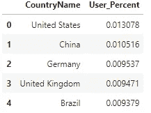
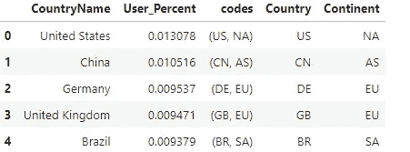
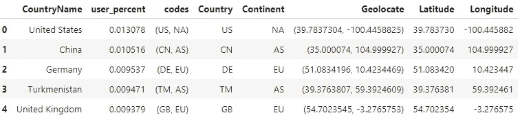
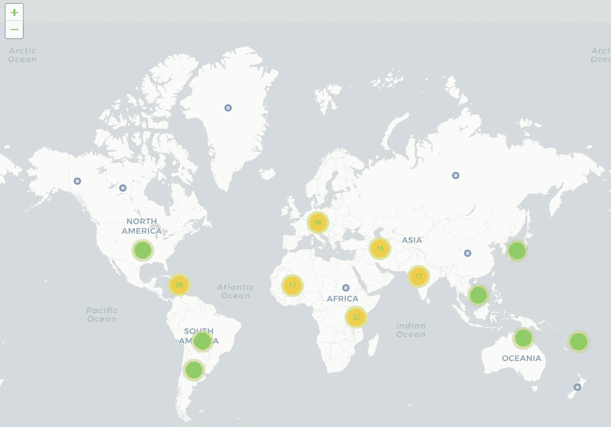

# 使用 Python 从国家名称列表创建世界地图

> 原文：<https://towardsdatascience.com/using-python-to-create-a-world-map-from-a-list-of-country-names-cd7480d03b10?source=collection_archive---------2----------------------->

## 从国家名称列表中，获取纬度和经度以创建世界地图

最近，我参与了一个项目，根据一系列简短的国家名称(如美国)创建一幅世界地图。在这里，我展示了创建世界地图(或任何其他地图)的步骤。

# 数据

有两列(国家名称、用户百分比)的样本数据是我们的原始数据。



# 1.转换为阿尔法 2 代码和大陆

alpha 2 代码更便于以后的分析，因此简短的国家名称被转换为 alpha 2 国家代码。例如，美国转换为美国。Python 的 pycountry-convert 包用于处理转换。下面的 Python 代码片段显示了一个要转换的函数。

```
#installation
pip install pycountry-convert#function to convert to alpah2 country codes and continentsfrom pycountry_convert import country_alpha2_to_continent_code, country_name_to_country_alpha2def get_continent(col):
    try:
        cn_a2_code =  country_name_to_country_alpha2(col)
    except:
        cn_a2_code = 'Unknown' 
    try:
        cn_continent = country_alpha2_to_continent_code(cn_a2_code)
    except:
        cn_continent = 'Unknown' 
    return (cn_a2_code, cn_continent)
```

在这个步骤之后，原始数据被处理如下:



# 2.获取经度和纬度

第二，基于这些 alpha 2 国家代码提取经度和纬度信息。Python 的 geopy 可以使用第三方地理编码器和其他数据源轻松定位地址、城市、国家和地标的坐标。下面的 Python 代码片段展示了一个获取经度和纬度的函数。

```
#installation
pip install geopy#function to get longitude and latitude data from country namefrom geopy.geocoders import Nominatimgeolocator = Nominatim()
def geolocate(country):
    try:
        # Geolocate the center of the country
        loc = geolocator.geocode(country)
        # And return latitude and longitude
        return (loc.latitude, loc.longitude)
    except:
        # Return missing value
        return np.nan
```

在运行上面的函数并将 geolocate 拆分为两个独立的纬度和经度列后，显示了下表。



# 3.创建世界地图

有许多 Python 包可用于创建视觉上吸引人且信息丰富的地图，包括底图、散景和树叶等。这里，follow 用于创建某些用户分布的世界地图。Folium 的 CircleMarker()通过改变半径和颜色变量来描述数据是很有用的。

```
#installation
pip install folium# Create a world map to show distributions of users 
import folium
from folium.plugins import MarkerCluster#empty map
world_map= folium.Map(tiles="cartodbpositron")marker_cluster = MarkerCluster().add_to(world_map)#for each coordinate, create circlemarker of user percent
for i in range(len(df)):
        lat = df.iloc[i]['Latitude']
        long = df.iloc[i]['Longitude']
        radius=5
        popup_text = """Country : {}<br>
                    %of Users : {}<br>"""
        popup_text = popup_text.format(df.iloc[i]['Country'],
                                   df.iloc[i]['User_Percent']
                                   )
        folium.CircleMarker(location = [lat, long], radius=radius, popup= popup_text, fill =True).add_to(marker_cluster)#show the map
world_map
```

用户可以放大地图，查看更详细的国家用户分布情况。



在这个例子中，我在几个 Python 包的帮助下创建了一个世界地图。不用说，使用给定的坐标可以很容易地创建其他类型的地理地图。