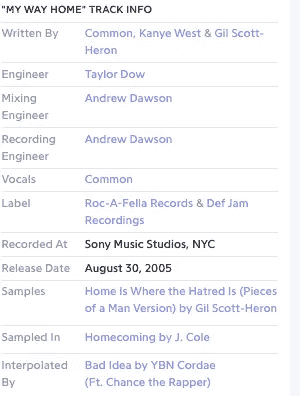

# 使用 Python 创建专辑中样本的 Spotify 播放列表

> 原文：<https://towardsdatascience.com/using-python-to-create-spotify-playlists-of-the-samples-on-an-album-e3f20187ee5e?source=collection_archive---------19----------------------->


(通过[去飞溅](https://unsplash.com/photos/dZPp5ZVMcN0)

## 用循环和随机样本交换鼓循环和灵魂样本

# 介绍

作为一个狂热的嘻哈迷，我一直对采样极其感兴趣。对于门外汉来说，音乐采样是将一首现有歌曲的一部分重新用作新歌的一部分的行为。一个很好的例子是坎耶·韦斯特 2005 年专辑*[](https://open.spotify.com/album/5ll74bqtkcXlKE7wwkMq4g?si=TcITaOg8T8qtnIGBqDxERQ)*中的[我回家的路](https://open.spotify.com/track/0TzIHqhAbvYR6qJKrMMFlk?si=pImuTmN8TlmdzGCXnikQ4A)，这是吉尔·斯科特-赫伦 1971 年专辑中的[家是仇恨的地方](https://open.spotify.com/track/7Fztxy3uXxR169c6vLzhS9?si=F8tR0cDbRaazHZUfb4JQtg)， [*一个人的片段*](https://open.spotify.com/album/6gZlPB0fBBD75qUSKSFKs0?si=7LoFiYE5SU6IkCb8zkbkxA) *。***

***迟到的报名*充满了从前面提到的苍鹭曲目到雪莉·贝西的经典曲目“[钻石恒久远](https://open.spotify.com/track/5MOMDX8hLLVOtji1vhSPmb?si=K5SSMOyaQ7qUb8clQEbhnw)”的精彩样本，该曲目曾作为同名邦德电影的主题曲。听了无数遍《迟到的登记》( Late Registration )( T23 ),我想更深入地了解音乐，并探索韦斯特和联合制作人乔恩·布里昂(Jon Brion)通过采样对文字的影响。我开始在 [Genius](https://genius.com/) 上搜索歌曲，找到样本的名称，并手动将它们添加到 Spotify 播放列表中。不出所料，过了一段时间后，这变得很麻烦，所以我写了一个脚本来自动化这个过程。下面，我将以*后期注册*为例演示脚本是如何工作的，但是如果你想直接跳到代码中，你可以在我的 [GitHub](https://github.com/eric-hochberger/sample-playlists) 上找到。**

# **网页抓取**

**第一步是生成来自*延迟注册*的样本列表。如前所述， [Genius](http://genius.com) 拥有大量关于每首歌曲样本的众包数据，因此只需收集专辑中每首歌曲页面的链接，循环浏览它们，并从每首歌曲中收集样本信息:**

****

**[Genius](https://genius.com/Kanye-west-my-way-home-lyrics) 关于“我回家的路”的曲目信息**

**使用 Python 模块 BeautifulSoup4 和请求**

**至少我是这么认为的。在使用这种策略运行 scraper 时，看到结果数据帧包含 12 个结果(其中两个是重复的)，我怀疑 scraper 丢失了信息，所以我在 Genius song 页面上做了一些手动检查以找出原因。**

****

**天才歌曲页为《[晚期](https://genius.com/Kanye-west-late-lyrics)》作者坎耶·韦斯特**

**事实证明，一些 Genius 歌曲页面上的样本信息位于介绍性制作注释中，而不是歌曲的信息框中。这是一个令人沮丧的认识，但它促使我设计一个解决方法。**

## **从注释中获取样本数据**

**像 Spotify 一样，Genius 也有一个[免费 API](https://docs.genius.com/) ，它允许用户提取关于特定注释的信息，所以一旦我分离出注释，我只需要提取样本信息。因为注释不是标准化的，所以解析文本以确定样本的名称并不简单。然而，我注意到，每当 Genius 用户引用样本时，他们都会提供一个附带的 Youtube 链接。多么体贴。利用这些信息，我能够开发一个补充的 scraper，该 scraper 隔离一个 Genius 产品注释，并通过在注释中抓取 Youtube 视频的标题来输出示例信息:**

**现在配备了这个更健壮的 scraper，我们可以看看从*晚注册* 的 [Genius URL 输出的数据:](https://genius.com/albums/Kanye-west/Late-registration)**

****

**信息框中的示例数据(作者截图)**

****

**来自注释的示例数据(作者截图)**

**接下来，我将这两个数据帧分别称为`sample_data`和`titles`。尽管由于数据帧中存在重复的轨道，刮刀可能会出现一些错误，但这实际上是刮刀正在工作的证据。*后期注册的前两首曲目，“* [叫醒韦斯特先生](https://open.spotify.com/track/62KeM7jbmYvzT5FycdiQeS?si=75vnCko8Qni30xu_SaMwlA)”和“[听见他们说](https://open.spotify.com/track/6yIjtVtnOBeC8SwdVHzAuF?si=93OmnffeT8-ylVvBtJr-xg)”被[这首华丽的娜塔莉·科尔曲目](https://open.spotify.com/track/32nMIZuO9A0TtXq0uI5XWr?si=fp_sJRFRSsyW_kWOzkjUzg)的样本出色地联系在一起，前者原样采样介绍性的钢琴部分，后者采用循环上的一段相同的钢琴部分作为其节拍的基础《钻石是永恒的》出现了两次，因为这张专辑包含了原版的"[来自塞拉利昂的钻石](https://open.spotify.com/track/0uGDH1WaBzmznj0ilMu4VI?si=yxByf8AZQAmHkteKXM0g_g)"，它是 Bassey 曲目的样本，也是这张专辑的主打单曲，还有一张[由 Kanye 的导师 Jay-Z 演唱的混音版](https://open.spotify.com/track/66VueiRZubO0SwPAFtPZpu?si=uNa-PgjHQRytOSJNc3hroQ)。**

# ****使用 Spotify 创建 Spotify 播放列表****

**下一步是自动创建一个恰当命名的 Spotify 播放列表，这可以通过`Spotipy`模块轻松完成。启动`Spotipy`是一个[的简短过程](https://spotipy.readthedocs.io/en/2.9.0/#getting-started)，它可以归结为向 Spotify 注册为开发人员，以获得一个客户端 id 和一个客户端密码，结合一个活跃的 Spotify 用户名，允许你通过 Spotify 的免费 API，通过 Python 对你的 Spotify 帐户执行无数操作。我使用 Spotipy 的“授权代码流”来授权使用我的帐户，然后创建一个 Spotipy 对象:**

```
**token = util.prompt_for_user_token(username,scope,client_id=client_id,client_secret=client_secret,redirect_uri='http://localhost/') 
sp = spotipy.Spotify(auth=token)**
```

**现在我们可以创建播放列表了:**

```
**playlist_name = f"Samples in {album_title} by {album_artist}"    sp.user_playlist_create(username, name=playlist_name)**
```

****

**[Spotify](https://www.spotify.com/us/) 上的播放列表**

**非常简单。执行这段代码后，我们在 Spotify 上有了一个标题描述性的播放列表，可以添加歌曲了。**

# **向播放列表添加曲目**

**不幸的是，将曲目添加到播放列表并不像提交您想要的曲目列表那么简单，但我们不做数据科学，因为这很容易。我们这样做是因为这很难，因为创建 Spotify 音乐播放列表的挑战将有助于组织和衡量我们最好的精力和技能，因为这是一个我们将接受的挑战，一个我们不愿意推迟的挑战，一个我们[打算赢得](https://genius.com/2228973)的挑战！但是，我跑题了。**

**下面是我写的一些代码，用于从`sample_data`数据帧和 Youtube 视频标题列表中获取 Spotify 曲目 id 列表。我使用了`Spotipy`和`fuzzywuzzy`，这是一个模糊字符串匹配模块，我稍后将讨论它的用途:**

**由于我采取了一些不直观的步骤，我们将更详细地分解这段代码。我通过实验发现，Spotify 搜索的第一个结果并不总是想要的曲目，这是由于 Spotify 搜索算法的特性，我不会假装理解，因此有必要检索多个结果:**

```
**results = sp.search(q=f"{sample_data['title'][i]} {sample_data['artist'][i]} ", limit=5, type='track')**
```

**然后，我必须验证五个回答中的哪一个是我首先想要的音轨。诚然，我第一次尝试这样做是一个彻底的失败。我当时年轻乐观，认为 Spotify 搜索结果的标题会与众包网站 Genius 从网上搜集的标题完全一致。他们没有。作为一名经验丰富的老手，我通过模糊(近似)字符串将 Spotify 结果的艺术家和曲目标题与`sample_data`数据帧中列出的艺术家和曲目标题进行匹配。下面是代码的简化版本:**

```
**if fuzz.partial_ratio(Spotify_artist_name, sample_data_artist_name) > 90 and fuzz.partial_ratio(Spotify_track_title, sample_data_track_title) > 90:                    
track_ids.append(Spotify_track_id) #append track id** 
```

**由于几乎不可能从 Youtube 视频的标题中区分艺术家和曲目名称，因此我们无法核实 Spotify 在**注释工作流程**中的结果。然而，这一工作流程产生了许多我们在其他情况下不会发现的额外样品，因此我发现其好处超过了潜在的成本。**

## **关于模糊字符串匹配的简短说明**

**模糊字符串匹配包含一组量化两个字符串相似程度的方法。他们这样做的方法是计算使一个字符串与另一个字符串完全匹配所需的改变次数(想想替换一个字母，删除一个空格)。我将用一个例子来说明为什么我们需要这种技术:**

**如果你检查上面的`sample_data`数据框，你会看到“凯吉夫妇”的“天梦”在 Spotify 上，这支乐队的名字是“凯吉斯”艰难。显然，如果我们对艺术家姓名进行精确匹配，我们不会在播放列表中找到这个正确的样本。但是，通过使用`fuzzywuzzy`函数`partial_ratio()`，它是一个模糊字符串匹配算法的实现，我们得到:**

```
**fuzz.partial_ratio("The Kay-Gees", "The Kay Gees")
100**
```

**由于一些差异比这更具戏剧性，我将艺术家和曲目标题字符串的匹配阈值都设置为 90，但请随意试验您自己的！**

## **将曲目添加到播放列表**

**幸运的是，将曲目添加到播放列表**就像提交您想要的曲目的曲目 id 列表**一样简单，这正是上面的`GetTrackIDs()`函数的输出。我们需要的唯一附加信息是我们之前创建的播放列表的`playlist_id`:******

**现在我们将曲目添加到播放列表中:**

```
**sp.user_playlist_add_tracks(username, playlist_id, track_ids)**
```

**瞧啊。我们在 Kanye West 的*晚注册上有一个相当广泛的歌曲样本播放列表。*唯一明显的错误是管弦乐版的《钻石恒久远》(Diamonds is Forever)，在我看来，这是一个小小的代价，以确保我们包括纽约社区合唱团 1977 年的《自从你走进我的生活》，它为西部经典的旋律提供了核心的号角，“[快克音乐](https://open.spotify.com/track/4fRTe59xEeNHT4uyAGsV27?si=e-0rfstWTO2YbQiTzRbjHQ)”**

**我希望你阅读这个演示的乐趣有我制作它的一半多，[因为我玩得很开心](https://genius.com/2216206)。我的 [GitHub](https://github.com/eric-hochberger) 上有更多与音乐相关的项目。**