# 使用 PyRFC 使用 Python 将数据插入 SAP

> 原文：<https://towardsdatascience.com/using-python-to-insert-data-into-sap-with-pyrfc-5eb2ceeda79b?source=collection_archive---------9----------------------->


约翰·汤纳在 [Unsplash](https://unsplash.com?utm_source=medium&utm_medium=referral) 上拍摄的照片

## 如何用使用最多的语言将一个机器学习方法的结果插入到 SAP 中开发机器学习模型？

今天，我们看到机器学习(ML)开发的日益增长，最大的开发工具是 Python，每天都有越来越多的人试图将 ML 模型的结果返回到他们的企业资源规划系统(ERPs)中。

SAP 是最常用的 ERP 系统之一，要将 ML 模型的结果插入其中，我们有两种选择，一种是在自定义 SAP 事务中手动插入，另一种是使用远程函数调用(RFC ),这是 SAP 系统和其他系统之间通信的标准 SAP 接口，因此 RFC 调用要在远程系统中执行的函数。

假设您可以使用机器人流程自动化系统(RPA)自动上传事务中的结果文件，那么我们应该选择哪一个呢？

嗯，如果我必须选择其中一个，我会选择第二个选项，因为它往往比第一个变化更小，更新更少，所以你可能会有更少的问题与未被注意的更新。

需要指出的重要一点是，RFC 有许多目标和方法有待开发，我们想要使用的是将数据插入表格

我们可以使用 PyRFC 包用 Python 来实现，但是它的第一次使用并不那么简单，所以为了帮助我们，我创建了一些函数和文档。

我们开始吧！

# 装置

## -第一步:下载 SAP NW RFC SDK

SAP NW RFC SDK 是 SAP NetWeaver 远程函数调用系统开发工具包的缩写，它允许您管理 RFC。

我从 **Informatica** of 找到了一本非常好的如何下载它的手册，但它是针对旧版本的，现在一些图标已经完全不同了，所以我写下了步骤并重印了图片以更新它。

如果想看 Informatica 的手册，文末有链接作为出处。

下载这些内容的一个困难是你需要一个 SAP 账户，所以在开始这个旅程之前，试着去申请一个。

回来，下载步骤:

*   前往 SAP 服务市场:[http://service.sap.com/support](http://service.sap.com/support)
*   输入您的 SAP 服务市场用户名和密码。将出现“SAP 支持门户”页面。

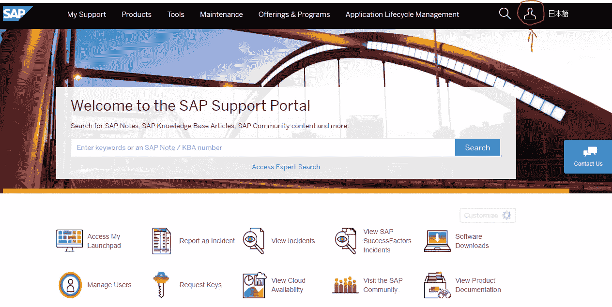

来源:作家

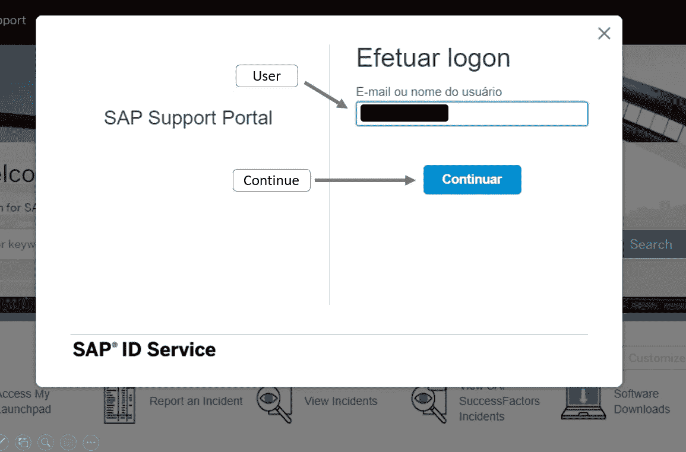

来源:作家

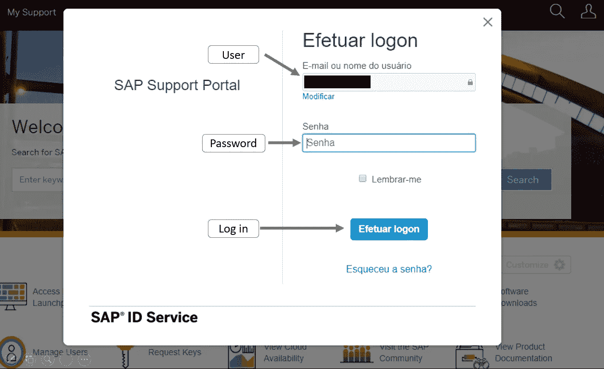

来源:作家

*   单击下载软件图标。


来源:作家

观察，一旦您登录，用户图标的颜色会变成蓝色

*   单击支持包和修补程序选项卡。

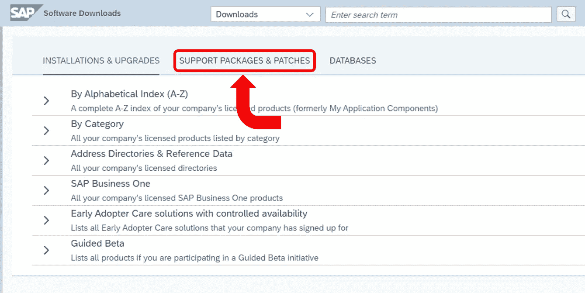

来源:作家

*   从列表中单击“按类别”。

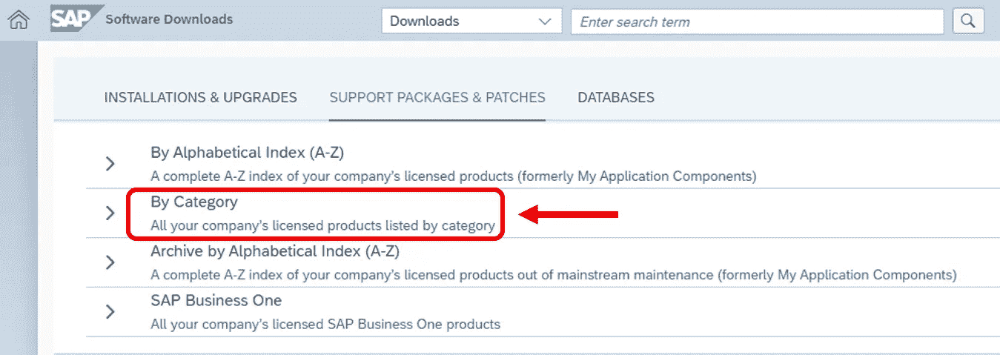

来源:作家

*   从列表中单击其他组件。

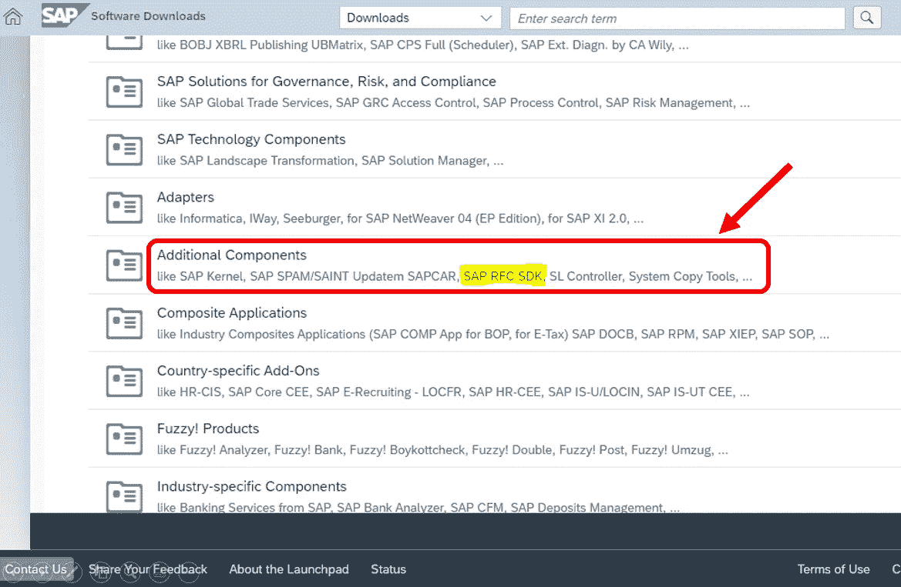

来源:作家

*   从列表中单击 SAP NW RFC SDK。

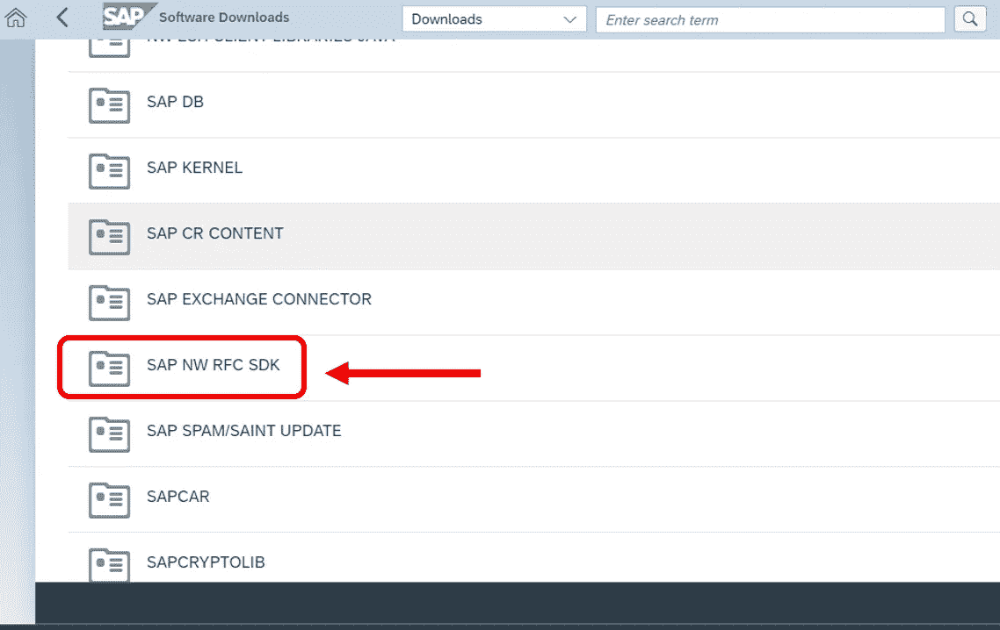

来源:作家

*   单击 SAP NW RFC SDK 的最新版本。

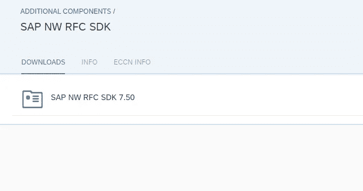

来源:作家

*   选择要下载的操作系统

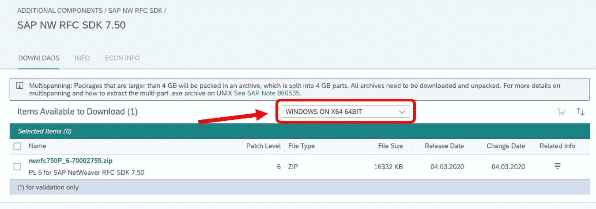

来源:作家

*   单击超链接。zip 文件来下载库。

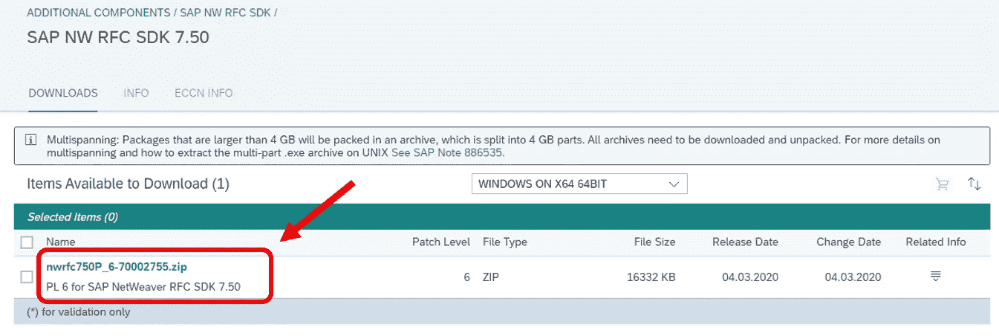

来源:作家

*   提取中的文件和文件夹。压缩到您的 SAP 文件夹

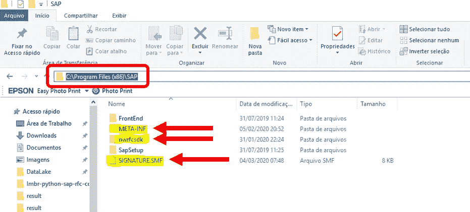

来源:作家

突出显示的文件夹和文件是. zip 文件中的内容。

一旦你做到了这一点，一切都从 SAP 端设置好了。

## -第二步:安装软件包

这比上一步简单一点，只需在 Python 终端上分别编写和运行这两行代码。

```
pip install pyrfcpip install pynwrfc
```

我想你可能只需要运行第二个，但是我已经安装了它们，我更愿意告诉你也安装它们，而不是你不能使用 PyRFC 包。

# 编码

酷，现在你已经到了有趣的部分！

> Obs:如果您必须打开虚拟专用网络(VPN)才能访问 SAP，那么在使用这些功能时您也需要打开它。

对于这个开发，我们将有两个文件:**常量**。和 **sap_rfc_connection** .py

里面的**常数**。我们存储三样东西，带有 SAP 登录凭证的字典，RFC 函数和表名，以及每次 RFC 调用要插入的行数。

现在，在 **sap_rfc_connection** 中。py 我们有两个主要功能:

*   desc 功能区

```
def rfc_func_desc(dict_sap_con, func_name):
    '''consult the RFC description and needed input fields

    Parameters
    ----------
    dict_sap_con : dict
        key to create connection with SAP, must contain: user, passwd, ashost, sysnr, client
    func_name : str
        name of the function that you want to verify

    Returns
    -------
    funct_desc : pyrfc.pyrfc.FunctionDescription
        RFC functional description object
    '''
    print(f'{time.ctime()}, Start getting function description from RFC')
    print(f'{time.ctime()}, Start SAP connection')
    # create connection with SAP based on data inside the dict
    with Connection(**dict_sap_con) as conn:
        print(f'{time.ctime()}, SAP connection stablished')
        # get data from the desired RFC function
        funct_desc = conn.get_function_description(func_name)
        # display the information about the RFC to user
        display(funct_desc.parameters[0],funct_desc.parameters[0]['type_description'].fields)
        # return it as a variable
        return funct_desc
    # how the whole command is inside the 'with' when it ends the connection with SAP is closed
    print(f'{time.ctime()}, SAP connection closed')
    print(f'{time.ctime()}, End getting function description from RFC')
```

现在是它如何工作的一个例子，这个函数的主要目标是让你得到完整的 RFC 描述，并把它存储到一个变量中，这样你以后可以参考它(你也可以查看 PyDrive 文档，看看你可以用它做的所有事情)，并向你显示使用 RFC 需要什么，比如字段名和数据类型。

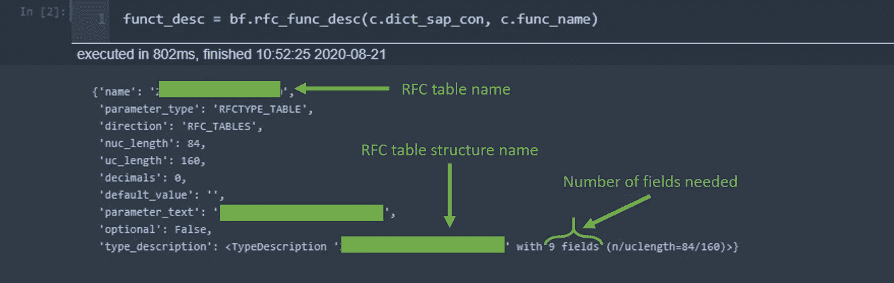

来源:作家

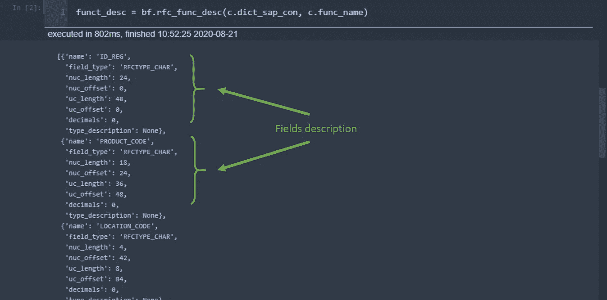

来源:作家

这很有用，因为有了它们，我们就知道了数据框的结构/列名以及每个字段中必须使用的数据类型，以免出错。

在我的例子中，我创建了下面这个数据框来测试。

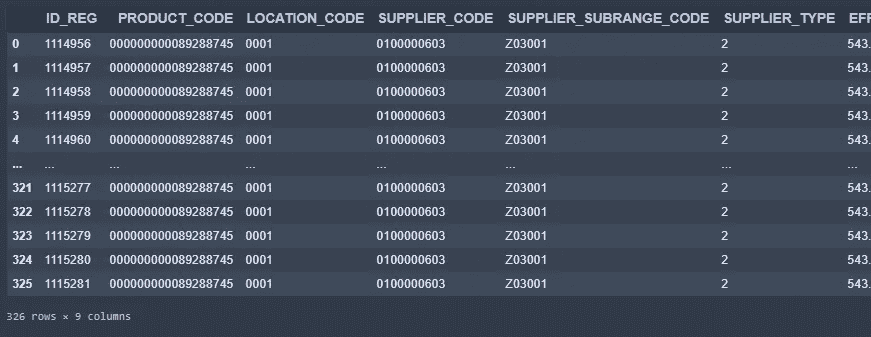

来源:作家

数据框创建后，我们可以继续第二个功能。

*   df_to_sap_rfc

```
def df_to_sap_rfc(df, dict_sap_con, func_name, rfc_table):
    '''ingest data that is in a data frame in SAP using a defined RFC, checking if the dataframe has the same size, column names and data types

    Parameters
    ----------
    df : pandas.DataFrame
        dataframe that is going to be used to insert data to SAP
    dict_sap_con : dict
        dictionary with SAP logon credentials (user, passwd, ashost, sysnr, client)
    func_name : string
        name of the RFC function
    rfc_table : string
        name of the rfc table you are going to populate

    Returns
    -------
    None
    '''
    # get needed parameters from RFC
    lst_param = get_rfc_parameters(dict_sap_con, func_name)
    # check dataframe input
    check_input_format(df, lst_param)
    # insert data
    lst_res = insert_df_in_sap_rfc(
        df, dict_sap_con, func_name, rfc_table)
```

这个函数包含了另外三个方法，但是为了不在它们上面浪费太多时间，前两个方法是检查数据帧是否符合 RFC 请求的格式(列名和数据类型)，如果不符合，它就停止执行，以免将错误的数据插入 SAP。

真正的“神奇”发生在第三个函数中，insert_df_in_sap_rfc 函数:

```
def insert_df_in_sap_rfc(df, dict_sap_con, func_name, rfc_table):
    '''Ingest data that is in a data frame in SAP using a defined RFC

    Parameters
    ----------
    df : pandas.DataFrame
        dataframe that is going to be used to insert data to SAP
    dict_sap_con : dict
        dictionary with SAP logon credentials (user, passwd, ashost, sysnr, client)
    func_name : string
        name of the function that you want to remotelly call
    rfc_table : string
        name of the table which your RFC populates

    Returns
    -------
    lst_res : list
        list of dictionaries with field names and data types used in RFC
    '''
    print(f'{time.ctime()}, Start data ingestion to SAP process')
    # create an empty list that is going to recive the result
    lst_res = []
    # get the quantity of rows of the dataframe
    rows_qty = len(df)
    # define the number of execution, getting the entire part of the division and 
    # adding 1 to it, to execute the last rows that don't achieve the quantity of 
    # an extra execution
    iter_qty = (rows_qty // c.rows_per_exec) + 1
    print(f'{time.ctime()}, Start SAP connection')
    # create connection with SAP based on data inside the dict
    with Connection(**dict_sap_con) as conn:
        print(f'{time.ctime()}, SAP connection stablished')
        # for each iteration
        for i in range(iter_qty):
            # define the first and last row for this execution
            f_r = i*c.rows_per_exec
            l_r = min((i+1)*c.rows_per_exec, rows_qty)
            # define an auxiliar dataframe with only the rows of this iteration
            df_aux = df.iloc[f_r:l_r]
            print(f'{time.ctime()}, Rows defined')
            # convert this dataframe to a json format, oriented by records
            # this is the needed format to do a multirow input with a RFC
            # by last all the json data must be inside of a list
            lst_dicts_rows = eval(df_aux.to_json(orient='records'))
            # once we have the desired rows well formatted we must tell for
            # which table we are going to insert it
            dict_insert = {rfc_table: lst_dicts_rows}
            print(f'{time.ctime()}, RFC input format applied')
            print(f'{time.ctime()}, Start sending rows {f_r} to {l_r-1}')
            # with everything set just call the RFC by its name 
            # and pass the connection dict
            try:
                result = conn.call(func_name, **dict_insert)
                exec_ind = True
            except:
                result = None
                exec_ind = False
            print(f'{time.ctime()}, Rows {f_r} to {l_r-1} sent')
            # save the row's numbers, execution indicator and the result of the call in the list
            # as a dict
            lst_res.append({'row':f'{f_r}_{l_r-1}', 'exec_ind':exec_ind, 'rfc_result':result})
    # how the whole command is inside the 'with' when it ends the connection with SAP is closed
    print(f'{time.ctime()}, SAP connection closed')
    print(f'{time.ctime()}, End data ingestion to SAP process')
    return lst_res
```

长话短说，这段代码获取 constants.py 中定义的每次执行的行数，并计算将数据框完全插入 SAP 的迭代次数。

之后，它会将您的数据框分割成多个片段，将它们转换成一个面向记录格式的. json 文件，并将其全部放入一个列表中，最后，它会存储在一个字典中，该字典的关键字是 RFC 表名。

这种来来去去可能有点混乱，但是它创建了一个字典，允许我们一次向 SAP 表中插入多行。

最后，如果一切都设置好了，您将得到如下结果:

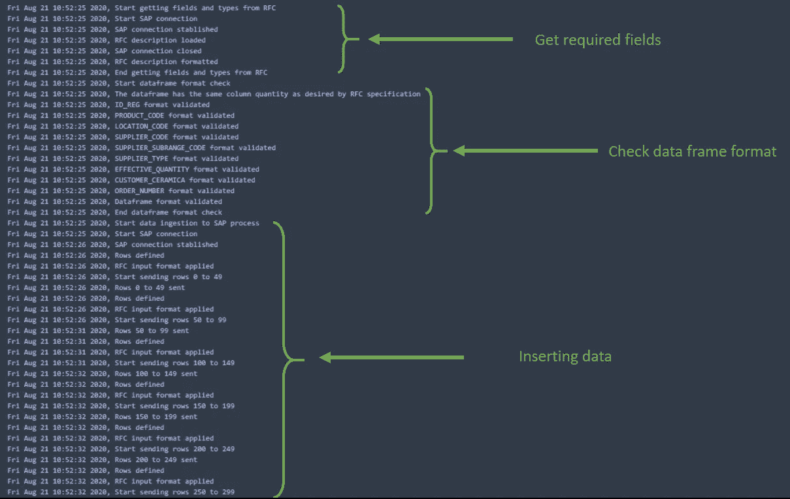

来源:作家

如果你对这些文件感兴趣，你可以通过下面的链接在我的 **Git Hub** 中看到它们:

[](https://github.com/rfpcordeiro/python-sap-rfc-connection) [## rfpcordeiro/python-sap-RFC-connection

### 使用远程函数调用(RFC)更容易地使用 PyRFC 将数据插入 SAP 的函数 GitHub 是 over…

github.com](https://github.com/rfpcordeiro/python-sap-rfc-connection) 

如果您正在考虑在一个必须定期重复的过程中使用 PyRFC，也许下面的这篇文章可以帮助您安排它。

[](https://medium.com/better-programming/automate-and-schedule-your-python-code-executions-22c3ed27794e) [## 自动化并安排 Python 代码的执行

### 让您的代码按照您的计划工作

medium.com](https://medium.com/better-programming/automate-and-schedule-your-python-code-executions-22c3ed27794e) 

# 这就是了！

嗯，有了这个，我想你现在可以使用 Python 和 RFC 更轻松地将数据插入 SAP 了！

希望这篇文章对你有帮助！

> 特别感谢莱昂纳多·拉莫斯和安德森·泰西托利，当我和他们一起解决了一百万个 RFC 问题的时候，他们忍受了我

# 来源:

[https://kb . informatica . com/h2l/how to % 20 library/1/0953-howtodownloadandstallsapnetweaverrfcsdklibraries-h2l . pdf](https://kb.informatica.com/h2l/HowTo%20Library/1/0953-HowtoDownloadandInstallSAPNetWeaverRFCSDKlibraries-H2L.pdf)

[https://python . hotexamples . com/examples/pyrfc/Connection/call/python-Connection-call-method-examples . html](https://python.hotexamples.com/examples/pyrfc/Connection/call/python-connection-call-method-examples.html)

[https://sap.github.io/PyRFC/client.html#examples](https://sap.github.io/PyRFC/client.html#examples)

[https://sap . github . io/py RFC/install . html # sap-NW-RFC-SDK-installation](https://sap.github.io/PyRFC/install.html#sap-nw-rfc-sdk-installation)