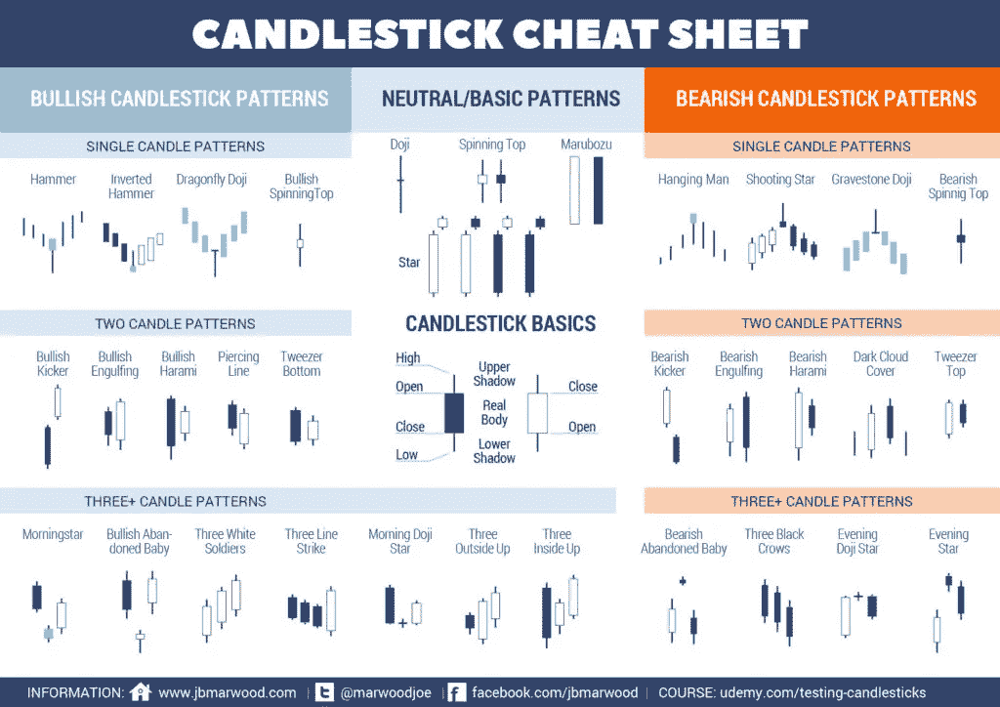
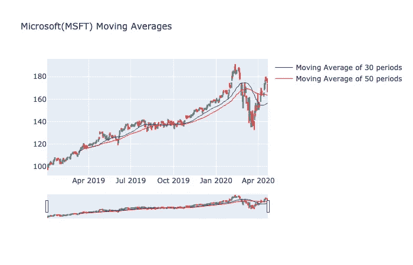

# 使用 Python 将股票数据可视化为蜡烛图

> 原文：<https://towardsdatascience.com/using-python-to-visualize-stock-data-to-candlestick-charts-e1a5b08c8e9c?source=collection_archive---------5----------------------->

[M. B. M.](https://unsplash.com/@m_b_m?utm_source=medium&utm_medium=referral) 在 [Unsplash](https://unsplash.com?utm_source=medium&utm_medium=referral) 上拍摄的照片

烛台数据是一个非常重要的方式来显示数据在股票市场如何移动。有些人可能用它来观察股票价格。有些人可能还会添加颜色，以便更好地形象化。许多人还用它来绘制交易模式。它们也非常有用，因为它们不是显示一个股票价格，而是有四个不同的价格点。这些包括开盘价、收盘价、最高价和最低价。

图片由[https://www.newtraderu.com/](https://www.newtraderu.com/2019/08/28/candlestick-patterns-cheat-sheet/)提供

## 概述代码

假设你以前有 Python 知识，我将在一个 [Jupyter 笔记本](https://jupyter.org/)中创建这一切。我将使用`[pandas_datareader](http://pandas_datareader)`从雅虎获取数据。然后，我将使用`[plotly](https://plotly.com/)`来绘制这些信息，将它们可视化到烛台上。所以一个简单的大纲应该是这样的:

1.  导入必要的库
2.  使用`pandas_datareader`从雅虎获取数据
3.  将数据存储到数据帧中
4.  将数据框与`plotly`烛台格式匹配
5.  使用`plotly`将数据框中的数据可视化

## 创建代码

从 Jupyter 开始，我做所有必要的进口。

对于这个例子，我将使用微软作为我的股票。我将股票代码设置为一个变量，然后使用`pandas_datareader`从 Yahoo 获取信息并存储到一个变量中。它应该自动保存为 DataFrame 对象。对于日期，我只是把它设置为去年年初。

为了让`plotly`理解我们的数据，我们需要将它与正确的信息相匹配。他们把它变得简单，使用“痕迹”，把痕迹看作图形的选项。我们从数据帧中定义我们想要使用的内容，然后在选项中设置这些内容。

我们现在可以在`plotly`中设置图表布局。

然后我们现在可以展示可视化。它应该看起来像这样。请随意使用工具来改变它。

## 奖金

[均线](https://www.investopedia.com/terms/m/movingaverage.asp)也可以作图！大多数交易者使用均线来观察股票的走向。有些人还使用不同的日期，在这些天里，如果 T2 交叉(当不同的移动平均线交叉时)发生，他们可以用它作为买入或卖出的信号。将它添加到我们的代码中非常简单。我们只是为每条均线创建单独的轨迹。我创建了一个 30 天均线的轨迹和一个 50 天均线的轨迹。

更新后的图表应该如下所示。

这是使用 Python 将股票绘制成烛台的简单方法。使用跟踪可以添加更多的数据。我希望这对刚开始学习 Python 并且对金融数据感兴趣的人有所帮助。此外，这还深入研究了数据可视化，这使得模式的识别更容易。

我其他一些涉及 Python 和 Robinhood 的文章:

 [## 使用 Python 和 Robinhood 创建一个简单的低买高卖交易机器人

### 所以我最近一直在折腾 Robinhood，一直在努力理解股票。我不是财务顾问或…

towardsdatascience.com](/using-python-and-robinhood-to-create-a-simple-buy-low-sell-high-trading-bot-13f94fe93960)  [## 使用 Python 和 Robinhood 构建一个钢铁秃鹰期权交易机器人

### 所以我最近发现了期权交易的潜在收益。

towardsdatascience.com](/using-python-and-robinhood-to-build-an-iron-condor-options-trading-bot-4a16e29649b0) 

以上代码可以在[这里](https://gist.github.com/melvfnz/43fb917a58dafa473b7c99b96c5f747b)找到，请随时关注我的交易之旅[这里](https://www.patreon.com/melvfnz)。

我在这里也有家教和职业指导！

如果你们有任何问题、评论或顾虑，请不要忘记通过 LinkedIn[与我联系！](https://www.linkedin.com/in/melvfernandez/)