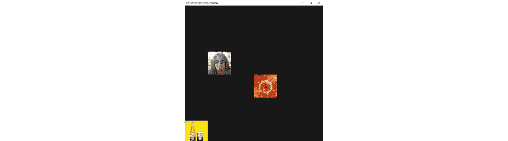
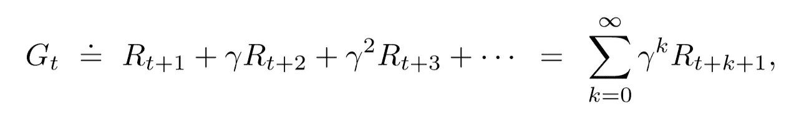
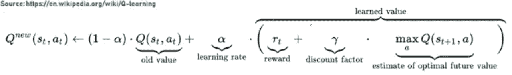
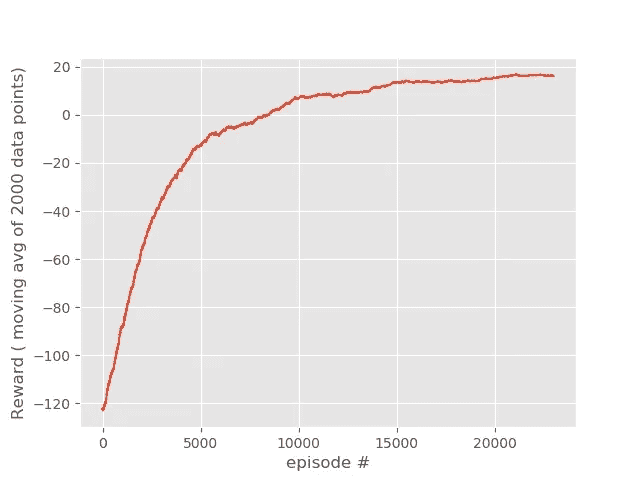
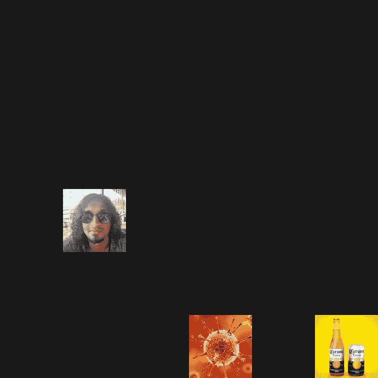
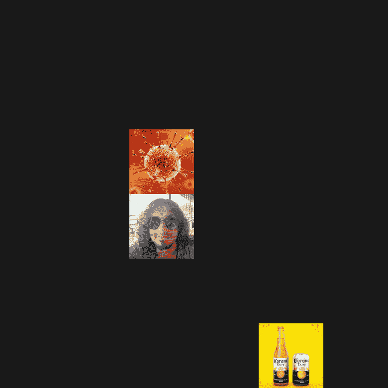
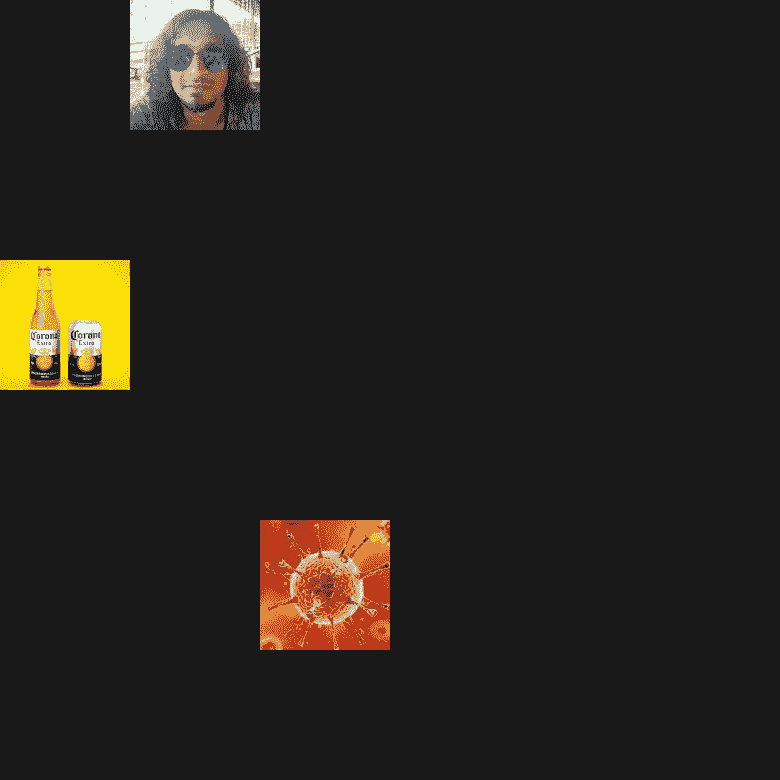

# 在 Numpy 中使用 Q-Learning 玩游戏

> 原文：<https://towardsdatascience.com/using-q-learning-in-numpy-to-teach-an-agent-to-play-a-game-4fee32eb922a?source=collection_archive---------35----------------------->

有一些机器学习模型可以被训练以基于训练期间使用的输入-输出对将任何给定的输入映射到期望的输出。通过输入输出对，我显然是指输入和它各自的基础事实或标签。这种算法被称为监督学习算法。分类和回归就是其中的一些例子。

此外，存在一类机器学习模型，它们在数据中寻找潜在的模式，而不需要明确地知道标签。这些算法被称为无监督学习算法。聚类和密度估计就是其中的一些例子。

除了监督学习和非监督学习，还有第三种机器学习范式，称为强化学习，它与前两种类型有着根本的不同。

这基本上包括在一个环境中做出连续的决策，以最大化累积的未来回报。稍后我会更详细地解释这一点。

**Q** - **学习**就是这样一种无模型强化学习算法，它学习在各种情况下做出正确的动作。

让我们首先熟悉强化学习设置的基本术语。

# 让我们熟悉一些基本的 RL 术语

有一种叫做**环境**的东西，它实际上包含了构成系统的所有东西。它有一个**代理**，它观察环境(从环境中获取输入)，然后根据输入采取**动作**，改变环境的**状态**，并在此过程中收集**奖励**。

如果这对你来说还不够完美，请不要担心！

让我们借助一个例子来理解这一点。

于是就有了 6x 6 的网格。我们让代理在网格中 6x6=36 个可能的单元中随机产生。同样，在我们网格世界的另外两个细胞中，我们有一瓶啤酒和一种致命的病毒。药剂、一瓶啤酒和致命病毒每次都会在独特的细胞位置上繁殖。代理人想要够到啤酒瓶子，以避免可能感染它的病毒，并因此结束游戏。对代理移动的限制是它只能在任何对角线方向上移动一个单元格。

在这个设置中，我们的 6x6 网格世界就是**环境**。代理可以访问它相对于一瓶啤酒(奖励)和致命病毒(敌人)的位置，我们称这个代理可以访问的环境信息为**状态**。根据环境的当前状态，代理可以采取某些预定义的**动作**，比如在四个对角线方向的任何一个方向上移动一个单元。代理的行为可能会给它一瓶啤酒(一个**正奖励**)或者它可能会让代理被致命病毒感染(一个**负奖励**)。因此，代理人的目标是通过与环境互动来了解它的环境，并最终学会采取行动，以使未来的累计回报最大化。

状态、动作和奖励的顺序，直到它全部结束(要么伸手拿啤酒瓶，要么被病毒感染)，被称为**集**。

导致情节终止的状态称为**终端状态**。在我们的网格世界的例子中，代理人相对于啤酒瓶或病毒的相对位置变为零的状态是终端状态。

**回报**是未来奖励的累计总和。在没有终端状态的情况下，这可能达到无穷大，也称为**非情节**任务。为了使它成为一个有限的总和，我们使用一个叫做 **gamma** 的贴现因子来贴现未来的奖励。

下面是 t 时刻的回报公式，用不同时间点的回报来表示。这里 T 是最终的时间步长，**γ**是贴现率，使得 0≤**γ**≤1

**价值函数**是状态(或状态-动作对)的函数，估计代理处于给定状态有多好(或在给定状态执行给定动作有多好)

价值函数总是相对于称为策略的特定行为方式来定义的。

一个**政策**只不过是从状态到选择每个可能行动的概率的映射。

我想多谈谈**状态-行动价值函数**，因为我们将在博客的其余部分使用它。

如前所述，状态-动作函数是一个返回预期收益的函数，从状态“s”开始，采取动作“a”，然后遵循策略 **π** 。

因此，比较给定状态的状态-动作函数值和动作空间中的所有动作，可以引导我们找到在该状态下可以采取的最佳可能动作。这实际上是我们的代理如何选择在给定状态下可以采取的最佳行动。

**Q 表**是由所有状态-动作对组成的表。这就像一个查找表，如果给出一个当前的状态和动作，我们可以得到状态-动作或 q 值。

我们最初用随机数初始化 q 表，然后随着代理在各种状态下继续采取各种行动，继续更新每个状态-行动对的值。在代理对环境进行了一定程度的探索之后，我们可以通过使用 q 表来判断对于任何给定的状态应该采取哪种最佳行动！

是不是很疯狂！:D

# 让我们把手弄脏吧！

我们现在要学习如何实现 q-learning。这将是一次有趣的旅程。:D，系好你的安全带

我们从导入所有必需的库开始。

然后，我们定义了 q 学习算法和显示窗口的所有超参数。

接下来，我们为我们的代理、啤酒瓶(正奖励)和病毒(负奖励)定义图像的路径，并读取它们以显示在屏幕上。这只是为了让显示窗口看起来有趣。

我们需要创建一个名为**【Blob】**的类，我们的代理、啤酒瓶和病毒将继承这个类。一个 Blob 类对象将有一个相关联的生成位置(x 和 y 坐标),它将能够根据其**‘移动’**方法中传递的输入进行对角移动。我们也能够加减两个斑点对象。它将简单地增加或减少两个斑点对象的 x 和 y 坐标。

现在让我们来定义 q 表，它将被一次又一次地用来选择给定状态下的最佳行动。我们将不断更新此表，以提高我们代理商的决策能力。

请注意，这里我们对状态空间的取值范围是 **-SIZE+1 到 SIZE** 。这是因为我们将状态空间定义为啤酒瓶和病毒之间的相对位置。所以这可以是正面的，也可以是负面的。例如，如果网格世界的大小是 6，那么代理相对于啤酒瓶的相对位置将从-5 变化到 5。

现在不要担心更新 q 表中 q 值的更新规则。我们稍后会谈到这一点。

在每一集里，我们的特工、啤酒瓶和病毒都需要在特定网格世界的特定细胞位置繁殖。但是我们的 Blob 类只是在 grid-world 中的一个随机单元位置上产生了一些人。这可能会导致角色在同一位置产生，这是我们不希望的。为此，我们编写了一个函数，它将一个元组列表作为输入，该列表包含已经被繁殖的个体的坐标。这将确保任何两个家伙，代理人，啤酒瓶和病毒不共享他们的细胞位置。

设置和定义好一切后，我们开始训练代理(更新 q 表)。

这就是奇迹发生的地方。

让我们一行一行来理解。所以我们从一个循环开始，这个循环将运行规定的集数。

我们使用前面已经定义的**get _ unique _ spacing _ location**函数和 **Blob** 类来初始化播放器、啤酒和病毒对象。

然后，我们使用 **SHOW_EVERY** 参数来打印 epsilon 的当前值、到目前为止的平均奖励(这应该随着训练而增加)以及用于显示实际网格世界的显示参数**‘SHOW’**。

接下来，我们将**‘插曲 _ 奖励’**初始化为 0，代理开始采取 200 个时间步长的动作。

对于每个时间步长，我们需要环境的状态，我们将它定义为代理相对于啤酒瓶和病毒的相对位置。

那么代理将需要采取行动，这也将取决于ε的当前值。我们从均匀分布中抽取一个随机数，并将其与 epsilion 的当前值进行比较。如果随机值大于ε的当前值，则代理使用 q 表并选择 q 表中具有最大 q 值的动作。否则代理采取随机行动。

代理利用 q 表挑选具有最高 q 值的动作的第一种情况被称为**利用**，而代理采取随机动作的第二种情况被称为**探索**。参数ε负责**开发-勘探权衡**。

然后，我们检查代理是否接触到啤酒瓶，或者它是否被病毒感染。我们相应地定义当前时间步长的奖励。

然后代理采取行动，导致它在网格世界中的状态发生变化。

然后，我们计算新的 q 值，并使用下面提到的公式更新 q 表。

为了显示网格世界和这些家伙，我们制作了一个空画布，根据 **DISPLAY_SIZE** 参数调整大小，并将代理、啤酒瓶和病毒的图像粘贴到它们各自的当前位置。

最后，如果代理人得到了他的啤酒或者他被病毒感染了，我们就打破了这个循环。

我们计算移动平均线，并绘制回报图。

最后，我们保存更新的 q 表。

# 结果

下面是报酬移动平均值的曲线。它的上升趋势表明，随着越来越多的训练，代理变得越来越聪明。

移动平均数

这里有一些 gif 展示了代理如何在每一次训练中变得更聪明。

这是一个口渴的代理用随机初始化的 q 表寻找一瓶啤酒。这意味着代理还没有关于环境的线索。

愚蠢的代理人想要啤酒，但没有得到它

经过一些训练后，代理人在做出连续决策方面做得相对更好。他还不是很快，但他最终找到了啤酒。

嗯，这样更好

最后，经过数千次的训练，代理人真的很擅长做连续的决定，并且很快就找到了啤酒！:D

这才是个聪明的特工！b)

# Q 学习的优势

这是一个易于理解和实施的简单概念。它非常适合没有巨大国家行为空间的环境。

# Q 学习的局限性

q 学习包括从 q 表中查找。并且 q 表由每个可能的单个状态-动作对的值组成。因此，随着状态空间的增加，q 表的大小呈指数增长。因此，Q-Learning 有利于在状态-动作空间较小的环境中训练智能体。对于更复杂的设置，使用深度 Q 学习。

# 密码

你可以在我的 GitHub 账号上找到这个 q-learning 项目的代码，点击这个链接[**【https://github.com/n0obcoder/Q-Learning】**](https://github.com/n0obcoder/Q-Learning)

# 参考

1.  【https://www.youtube.com/playlist? list = plqvvvaa 0 qudezjfiou 5 wddfy 4 e 9 vdnx-7
2.  [https://www . coursera . org/learn/fundamentals-of-reinforcement-learning](https://www.coursera.org/learn/fundamentals-of-reinforcement-learning)
3.  [https://web . Stanford . edu/class/psych 209/Readings/suttonbartoiprlbook 2 nded . pdf](https://web.stanford.edu/class/psych209/Readings/SuttonBartoIPRLBook2ndEd.pdf)

我写这篇博客是因为我通过阅读别人的博客学到了很多东西，我觉得我也应该尽可能多地写下并分享我的学习和知识。所以，请在下面的评论区留下你的反馈，让我知道如何改进我未来的博客！:D

我也是一个独立的音乐艺术家，喜欢在空闲时间演奏和录制音乐。也许你可以看看我的艺人页面，表示支持:)
[Spotify 上的 8 楼和声！](https://open.spotify.com/artist/7G2BgSnludIYl1gFyJKG6X?si=Bv5L4ZAVQrmIsl5SgGRAUw)