# 在 Google Sheets 公式中使用 R 和 Python

> 原文：<https://towardsdatascience.com/using-r-and-python-in-google-sheets-formulas-b397b302098?source=collection_archive---------9----------------------->

## Google Sheets 中的自定义编程语言功能


在 [Unsplash](https://unsplash.com?utm_source=medium&utm_medium=referral) 上由 [Carlos Muza](https://unsplash.com/@kmuza?utm_source=medium&utm_medium=referral) 拍摄的照片

# 谷歌床单太神奇了！

谷歌的电子表格版本叫做[谷歌表格](https://www.google.com/sheets/about/)，它有一个隐藏的宝石，可以显著增加你的电子表格的功能，叫做[谷歌应用程序脚本](https://developers.google.com/apps-script)。Google Apps Script 使用 Javascript 调用其他 Google 服务，创建交互式弹出对话框，甚至进行 API 调用。通过一点设置，您可以创建电子表格公式供其他人使用，执行 R、Python 或几乎任何编程语言代码！虽然 Shiny 和 Dash 是分享您的工作的好方法，但是按照本文中的说明，您将能够直接在 Google Sheets 中创建 R 和 Python 仪表板。另外，这些方法允许您将 R 和 Python 功能插入到其他 Google 服务中，比如文档、表单和幻灯片！

# 这里有几个例子

1.  **矩阵乘法**

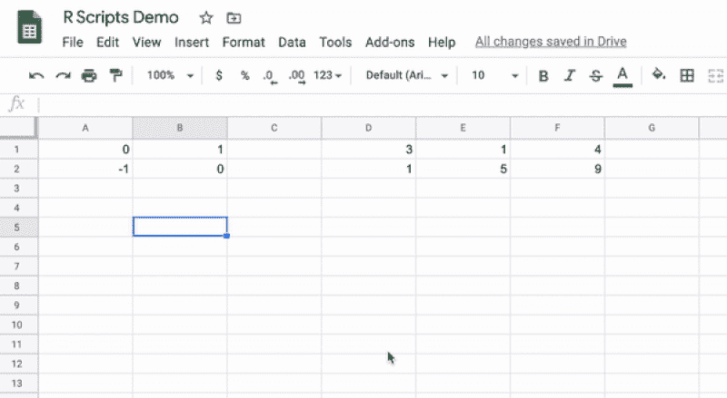

作者图片

**2。绘图(基数 R)**

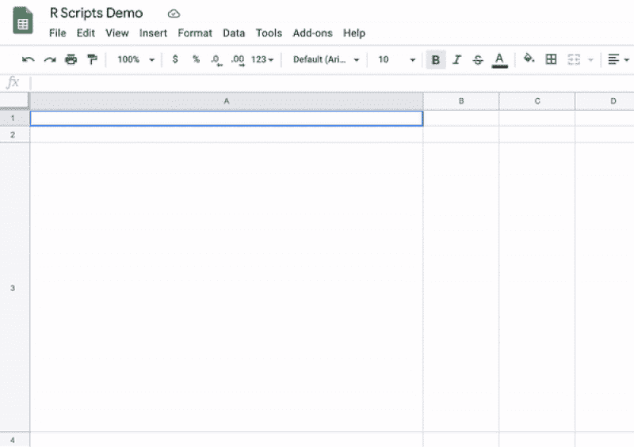

作者图片

**3。绘图(ggplot2)**

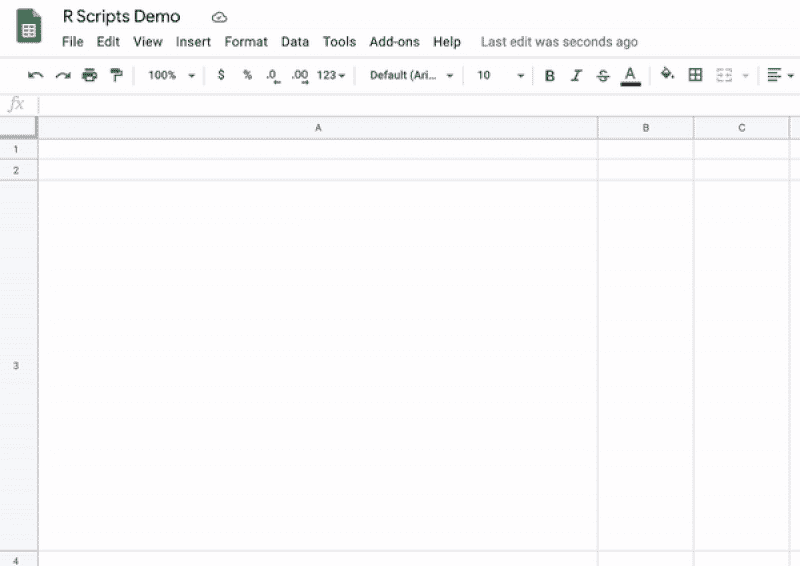

作者图片

**4。部署模型**


作者图片

**5。任何 R 脚本！**

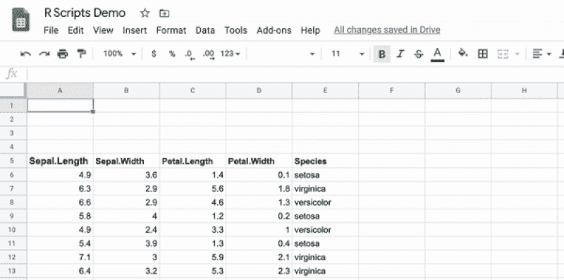

作者图片

# 这是什么魔法**？**

在幕后，每个自定义函数都是一个 Google Apps 脚本，它对我在 Google Cloud Run 中设置的一个端点进行 API 调用。如果您可以设置运行 R、Python 或任何其他语言脚本的 API 端点，那么您可以将这些功能导入到 Google 电子表格中。这是惊人的！

# 尝试一下

下面的 6 个步骤从最容易到最难排列，将简单地让你开始使用你自己的定制的电子表格函数。关于 Google Apps 脚本、创建自己的 API 和 Google Cloud Run 还有很多内容可以在另一篇文章中介绍。

1.  **在 Google Drive 中创建电子表格**
2.  **工具菜单- >脚本编辑器**

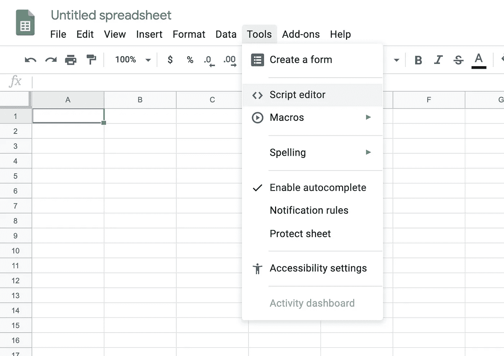

作者图片

3.将下面的代码复制并粘贴到编辑器中。适应你的需求。

```
/**
 * Run an R, Python, or other language script on spreadsheet data.
 *
 * [@param](http://twitter.com/param) var1 The value or cell contents to pass to your API.
 * [@param](http://twitter.com/param) var2 The value or cell contents to pass to your API.
 * [@return](http://twitter.com/return) The results of the API call you're about to make.
 * [@customfunction](http://twitter.com/customfunction)
 */
function myCustomFunction(var1 = null, var2 = null){

  // Assuming your API endpoint is like {baseURL}/{endpoint}.
  var baseURL = '(Copy and paste API base url w/o trailing /)';
  var endpoint = 'myCustomFunction';

  // Encode the variable values as JSON (or XML, or something else). 
  // See Google Apps Script UrlFetchApp documentation.
  var data = {
    'var1': var1,
    'var2': var2,
  }// Set up the API call. Use POST requests to pass variables.
// You can pass variables as query params of GET requests instead.
  var options = {
    'method' : 'post',
    'contentType': 'application/json',
    'payload' : JSON.stringify(data)
  };

  // Make the API call. NOTE: Trailing slashes are important!
  var response = UrlFetchApp.fetch(baseURL + '/' + endpoint + '/', options);

  // Parse the response.
  data = JSON.parse(response.getContentText());

  // I return "Error: {the error}" on script errors. 
  // Not necessary, but it shows useful error messages in cells.
  if(String(data).substring(0,6) == "Error:"){
    throw(String(data));
  }

  return(data);
}
```

4.**创建一个名为“Dockerfile”的不带扩展名的纯文本文件。** 把它放在硬盘上自己的文件夹里。不要紧张；你不需要在你的系统上安装 Docker 来执行这些步骤(但是你绝对应该在你的日常工作中使用 Docker！)

将以下内容之一复制并粘贴到 docker 文件中。

*   R 示例 1:这里有一个 R API 的 docker 文件，它使用了令人惊奇的 [Plumber 包](https://www.rplumber.io/)。这不是 Tidyverse 的产品，但它能创造出苗条的形象。

```
FROM trestletech/plumberCOPY [".", "./"]ENTRYPOINT ["R", "-e", "pr <- plumber::plumb(commandArgs()[4]); pr$run(host='0.0.0.0', port=as.numeric(Sys.getenv('PORT')), swagger = T)"]CMD ["Plumber.R"]
```

*   R 示例 2:这里有一个 R API 的 rocker 文件，它确实带有 Tidyverse 和 Tensorflow(基于 [rocker/ml image](https://hub.docker.com/r/rocker/ml) )。这就产生了臃肿的图像，并附带了 RStudio。它不是用来生产的。

```
FROM samterfa/rmlsheetsCOPY [".", "./"]ENTRYPOINT ["Rscript", "-e", "pr <- plumber::plumb(commandArgs()[9]); pr$run(host='0.0.0.0', port=as.numeric(Sys.getenv('PORT')), swagger = T)"]CMD ["Plumber.R"]
```

*   Python 示例:这里有一个 Dockerfile 文件，它使用了名副其实的[快速 API](https://pypi.org/project/fastapi/) 。

```
FROM tiangolo/uvicorn-gunicorn-fastapi:python3.7RUN pip install pandasCOPY [".", "./"]
```

5.**创建支持自定义功能的脚本。将以下文件添加到与您的 docker 文件相同的文件夹中。请注意，Google Sheets 中的单元格引用是作为单个单元格的单个值或多个单元格的嵌套列表传入的。**

*   R API 文件:创建一个名为 Plumber.R 的文件。

```
# Swagger docs at ...s/__swagger__/ (needs trailing slash!)
if(Sys.getenv('PORT') == '') Sys.setenv(PORT = 8000)#' [@apiTitle](http://twitter.com/apiTitle) R Google Sheets Formulas
#' [@apiDescription](http://twitter.com/apiDescription) These endpoints allow the user to create custom functions in Google spreadsheets which call R functions.#* Return the product of 2 matrices
#* [@param](http://twitter.com/param) var1 An array of values representing the first matrix.
#* [@param](http://twitter.com/param) var2 An array of values representing the second matrix.
#* [@post](http://twitter.com/post) /myCustomFunction/
function(var1, var2){

  err <- tryCatch({

    return(data.matrix(var1) %*% data.matrix(var2))

  }, error = function(e) e)

  return(paste0('Error: ', err$message))
}#* Confirmation Message
#* [@get](http://twitter.com/get) /
function(msg=""){
  "My API Deployed!"
}
```

*   Python API 文件:创建一个名为 Main.py 的文件。

```
from fastapi import FastAPI
from pydantic import BaseModelclass Matrices(BaseModel):
    var1: list
    var2: list

app = FastAPI()[@app](http://twitter.com/app).post("/myCustomFunction/")
def myCustomFunction(matrices: Matrices):

  import sys
  import numpy as np try:

    var1 = np.matrix(matrices.var1)
    var2 = np.matrix(matrices.var2)

    results = np.matmul(var1, var2)

    return np.array(results).tolist()

  except: e_type, e_value, e_traceback = sys.exc_info()

    return 'Error: ' + str(e_type) + ' ' + str(e_value)@app.get("/")
def myAPIdeployed(): return "My API Deployed!"
```

注意:要在 Google Sheet 中运行任意的 R 或 Python 脚本，该脚本需要确定传递的数组是否包含列名。代码有点笨拙，但是我在本文的结尾加入了一个 R 尝试。

6.**部署您的 API(到 Google Cloud Run)** 如果您已经知道如何部署 R 或 Python API，那么您可能已经停止阅读这篇文章并开始比赛了！对于我们其余的人，我将指导您使用 Google Cloud Run 来托管您的 API。

马克·埃德蒙森创造了一个惊人的 R 包，名为 [googleCloudRunner](https://code.markedmondson.me/googleCloudRunner/index.html) 。这个包处理 auth，创建构建，并将容器部署到 Google Cloud Run。这真的很了不起。如果您没有安装 R，您可以遵循[这些项目设置说明](https://medium.com/google-cloud/google-cloud-run-or-how-to-run-your-static-website-in-5-minutes-and-much-more-dbe8f2804395)，以及[这些部署说明](https://medium.com/google-cloud/hosting-a-website-on-google-cloud-using-cloud-run-a65343a98fce)，记住我们正在尝试从上面部署我们的 Dockerfile。从现在开始，我将假设您已经安装了 R running 和 googleCloudRunner。

*   转到[https://console.cloud.google.com/](https://console.cloud.google.com/)
*   如果您以前从未创建过项目，请同意条款和服务。
*   点击*选择一个项目*，然后*新建项目*。
*   命名并创建项目。我喜欢脚本、Pyscripts 或类似的东西。
*   确保项目名称在左上方的下拉列表中。
*   点击左侧下拉菜单，点击*计费*，然后*添加计费账户*。我保证，[很便宜](https://cloud.google.com/run/pricing)！

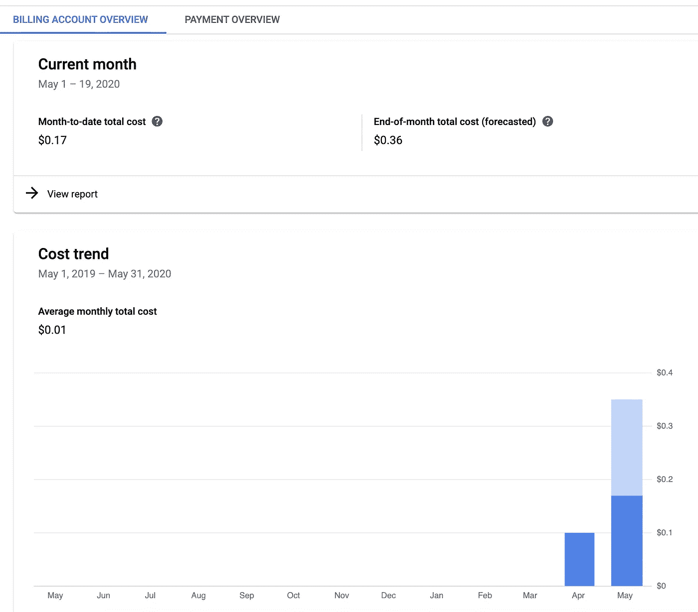

作者图片

*   对于其余的设置，遵循马克埃德蒙森的指示[这里](https://code.markedmondson.me/googleCloudRunner/articles/setup.html#gcp-settings)。
*   确定包含 docker 文件和 API 文件的文件夹的路径。姑且称之为“/用户/我/我的/API/路径”。
*   使用 R，运行以下命令来部署您的 API！在 Google Cloud Run 中创建的服务的名称将是文件夹路径中最后一个文件夹的名称，所以请确保您喜欢这个名称，并且它的名称是小写的。

```
googleCloudRunner::cr_deploy_run(local = "/users/me/my/api/path")# Wait, that's it? Just that?
```

*   将打开一个浏览器，显示您的构建进度。如果有错误，您可以使用日志消息来确定哪里出错了。常见的问题是缺少服务帐户权限和代码问题。如果您对 Docker 感到满意，可以在本地进行测试，以确保没有代码问题。如果成功，您应该会看到一条消息(如果您复制并粘贴了我的代码)。

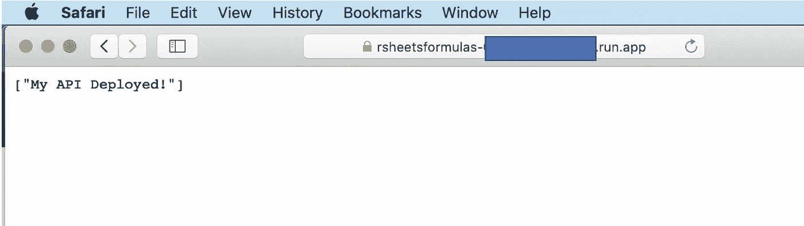

作者图片

*   一旦启动，你需要将上面的 API URL 复制并粘贴到你的 Google Apps 脚本中。

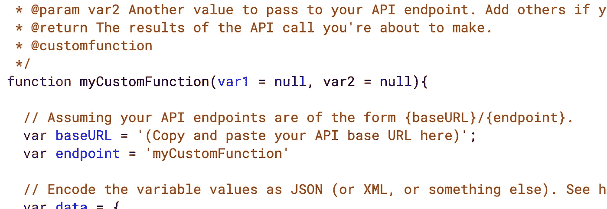

作者图片

*   试试吧！在 Google 工作表中创建两个数字数组，它们可以作为矩阵相乘，开始输入“=myCustomFunction("，突出显示单元格，然后给自己留下深刻印象。

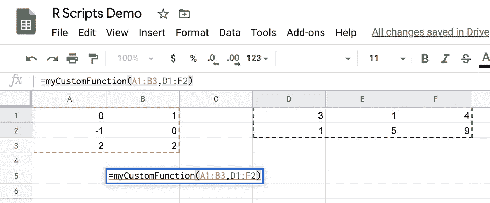

作者图片

# 资源

1.  **免费 API**[**Swagger**](https://swagger.io/docs/specification/2-0/what-is-swagger/)**网页** 这些都是自动为你生成的，因为你用了 R 包 Plumber 或者基于 Python 的 FastAPI。

*   r 版本位于{YourBaseURL}/__swagger__/

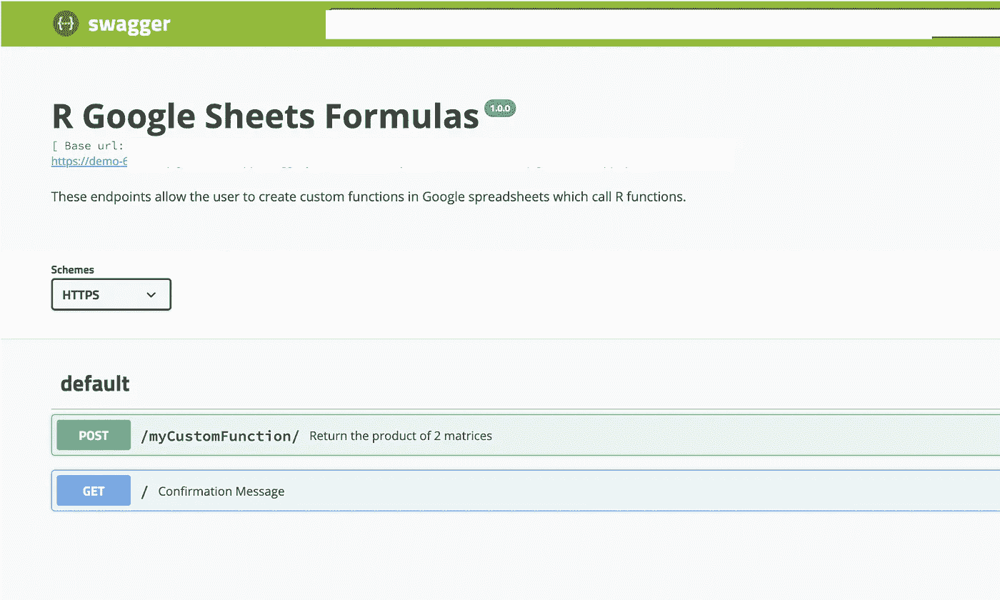

作者图片

*   Python 版本位于{YourBaseURL}/docs

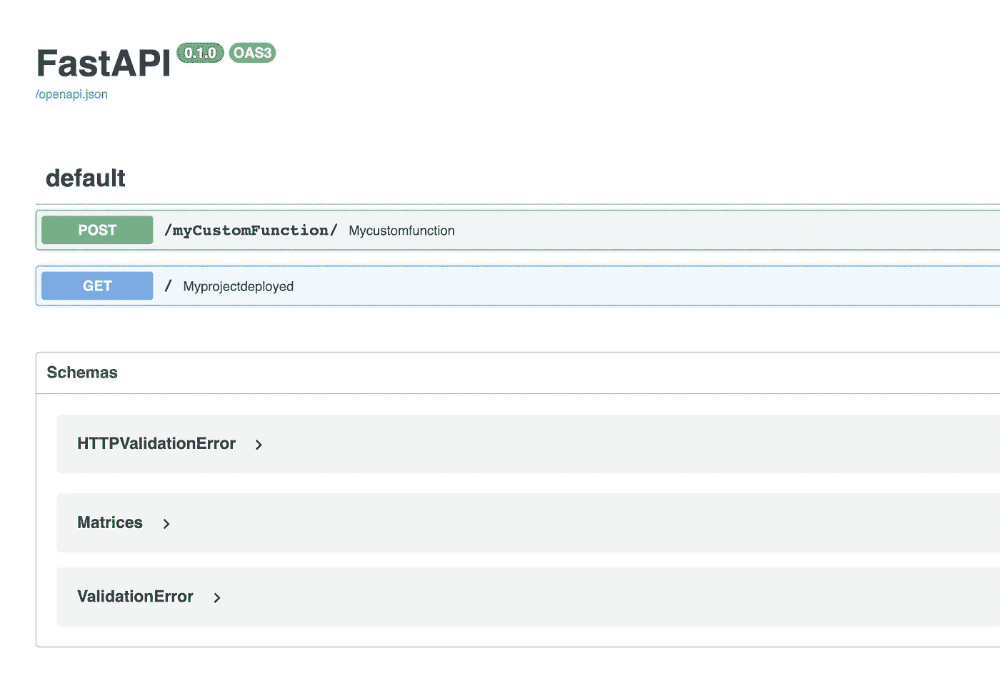

作者图片

2.[**samterfa/rpysheets****GitHub Repo**](https://github.com/samterfa/rpysheets)这个 Repo 包含上面列出的所有文件加上一些额外的材料。奖励材料包括通用脚本函数，以及 MNIST 数字预测函数。如果你想对大型模型进行预测，谷歌表单会给你 30 秒的时间限制。你可能还需要增强你的谷歌云运行服务。