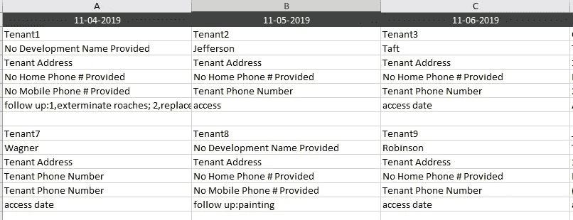
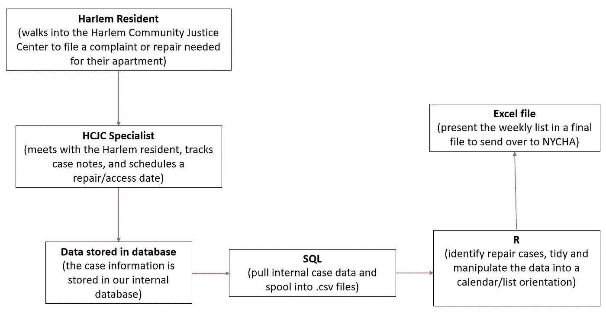
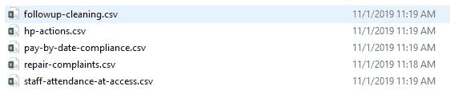
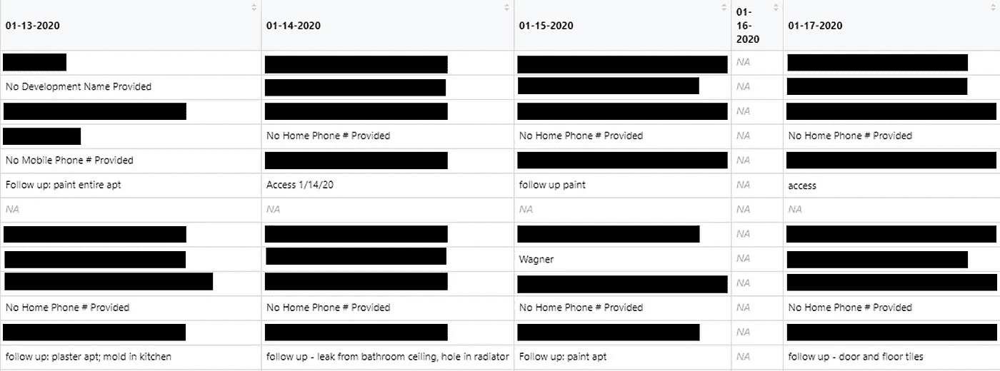

# 使用 R 和 SQL 倡导哈莱姆住宅修缮

> 原文：<https://towardsdatascience.com/using-r-and-sql-to-advocate-for-harlem-housing-repairs-8b7557644a63?source=collection_archive---------39----------------------->

## 为纽约市工作人员建立维修清单，以帮助哈莱姆区经济适用房的维修合规性


纽约市的经济适用房

经历了多年的预算短缺和不断增加的债务，纽约市住房管理局(NYCHA)在维护其五个区的 326 个公共住房开发项目的基础设施方面严重落后。

来自纽约市 40 多万租户的令人痛心的紧急维修报告每周出现在[周刊](http://brooklyn.news12.com/story/41545016/east-new-york-nycha-tenant-says-shes-still-awaiting-repairs-to-collapsed-ceiling)上。

根据纽约市公共辩护律师办公室的数据，截至 2019 年 11 月，纽约市建筑的未完成工作订单接近 [35 万份(自 2018 年以来增长了 43%)。随着这一毁灭性的消息，朱玛恩·威廉姆斯(Jumaane Williams)在 2019 年 12 月发布年度房东观察名单时，将纽约市视为“2019 年最糟糕的房东”。](https://landlordwatchlist.com/)

作为[法院创新中心](https://www.courtinnovation.org/)的高级研究和数据助理，我的部分工作是支持[哈莱姆社区司法中心(HCJC)](https://www.courtinnovation.org/programs/harlem-community-justice-center/more-info) 。21 世纪初，HCJC 作为一个解决问题的法庭而成立，为居住在哈莱姆区及其周边的个人提供支持。

我在那里承担的一个特殊项目是帮助员工跟踪住房情况。作为一个基于社区的中心，HCJC 的一部分工作是帮助倡导租户的权利，要么帮助哈莱姆区的居民向住房法院提起诉讼，要么推动纽约市跟进过时的维修——所有这些文书工作和咨询都发生在东 121 街 170 号的住房和资源中心。自该中心在 2018 年底开始跟踪这些信息以来，收到的 2000+次上门服务中，超过一半来自整个哈莱姆社区 NYCHA 大楼的租户。

如前所述，随着纽约市越来越多的维修工作订单，HCJC 决定加倍努力，利用其内部数据库向纽约市的工作人员发送维修时间表，以加快维修过程，并代表其客户进行宣传。

为此，我决定采用数据科学方法，在 SQL 和 R 中构建一个自动化流程，将我们的住房和资源中心数据从我们的内部数据库中提取到最终的 Excel 电子表格中，该电子表格列出了计划在一周的特定日期进行维修的租户的信息(请参见下面的最终产品截图)。



此工作流创建的自动化租户列表的示例。请注意，真实姓名和信息已从该截图中删除，但实际输出包括我们系统中每个租户的联系信息，计划访问日期为该周/日。

以下是工作流程的完整概述，从一名哈莱姆居民走进哈莱姆社区司法中心的大门，到发送给纽约市工作人员以跟进维修的 Excel 列表:

# 维修案例和自动化工作流程



我们将讨论其中的自动化部分，从 SQL 步骤开始，一直到创建 Excel 文件。

# SQL 查询

```
spool "C:\directory_name\data.csv"
SELECT /*csv*/ distinct 
.
.
.
FROM
internal tables
.
.
.
WHERE
date range variable and other parameters
spool off;
```

我不能共享用于该查询的特定表和变量，但是需要注意的重要一点是，我在 SQL 查询的开始声明了一个文件路径，然后指示脚本将信息放入该目录中的一个. csv 文件中。完成后，该目录将有一个假脱机列表。csv 文件本质上是从查询中创建的 SQL 视图:



一旦 SQL 脚本运行完毕(不到 20 秒)，我就可以打开我的 R 脚本并在这些新的。来自 SQL 的 csv 文件。

# r 脚本

打开我的 R 脚本后，我会高亮显示整个脚本并点击“Run”。在运行的 15 秒钟内，它将完成以下步骤(为了节省时间，我将省略其他一些步骤):

使用的库

```
library(devtools)
library(statsr)
library(dplyr)
library(ggplot2)
library(tidyverse)
library(readxlsx)
library(Hmisc)
library(plyr)
library(DT)
library(XLConnect)
library(lubridate)
library(reshape)
library(xlsx)
```

1.  创建一个新的 Excel 电子表格，最终保存我的最终日历/列表数据:

```
# GET CURRENT DATE
date <- format(Sys.Date(), "%m-%d-%Y")# EXCEL SHEET CREATED WEEKLY FOR NYCHA ACCESS/FOLLOW-UP REPAIRS
new_filename <- paste("internal_directory/nycha_accessfollowup_", date, ".xlsx", sep = "")# SAVING THE WORKBOOK IN A VARIABLE
nycha_summary <- loadWorkbook(new_filename)saveWorkbook(nycha_summary)
```

2.正在加载假脱机的 SQL。我之前声明的目录中的 csv 文件:

```
# SAVING THE SPOOLED CSV FILENAME IN A VARIABLE TO USE LATERrepair_file_name <- "repair-complaints.csv"# SET THE WORKING DIRECTORYsetwd("C:/Help Center/Zach-Housing-Resource-Center/SQL_outputs")# FILES TO LOAD repairsData <- read_csv(repair_file_name)
lengthOfData_repairs <- length(repairsData$`Episode ID`)-1
repairsData <- slice(repairsData, 1:lengthOfData_repairs)
```

3.一旦。csv 文件已加载，我知道根据我们从数据库收到的内部案例注释的结构，我需要创建几个函数来筛选这些条目并识别未完成的维修案例，将这些条目与其他住房案例分开，然后创建几个列来区分:

*   “无法进入”案例——被记录为 NYCHA 未能在预定日期出现在租户公寓进行维修的案例
*   “待定访问”案例—已安排但尚未实施的案例
*   “成功访问”案例 NYCHA 确实在预定日期参与了维修工作

```
cleanNotes <- function(dataset, dataLength){
  dataset <- dataset
  for (x in 1:dataLength){
    if(isTRUE(dataset$Note_category[x] == "Successful Access NA NA")){
      dataset$Note_category[x] = "Successful Access"
    } else if(isTRUE(dataset$Note_category[x] == "NA NA NA")){
      dataset$Note_category[x] = NA
    } else if(isTRUE(dataset$Note_category[x] == "NA NA Pending Access")){
      dataset$Note_category[x] = "Pending Access"
    } else if (isTRUE(dataset$Note_category[x] == "NA Failed Access NA")){
      dataset$Note_category[x] = "Failed Access"
    } else {
      dataset$Note_category[x] = NA
    }
  }
  return(dataset)
}
```

4.创建最终清洁功能，将上述功能与一些附加功能结合起来:

```
dataCleaning <- function(dataset, dataLength){
  dataset <- dataset
  dataset <- addAccessField(dataset)
  dataset <- checkforSuccessAccess(dataset)
  dataset <- checkforFailedAccess(dataset)
  dataset <- checkforPendingAccess(dataset)
  dataset <- dataset %>%
    mutate(Note_category = paste(Access_success, Access_failed, Access_pending))
  dataset <- cleanNotes(dataset, dataLength)
  dataset <- selectColumns(dataset)
  dataset <- parseAccess(dataset, dataLength)
  dataset <- followupDecipher(dataset, dataLength)
  dataset <- reminderDecipher(dataset, dataLength)
  dataset <- failedAccessTenant(dataset, dataLength)
  return(dataset)
}
```

5.隔离本周的日期:

```
# SEQUENCE OF MONDAYS AND FORMATTING INTO A TIBBLEmondays <- seq(as.Date("2019/01/08"), as.Date("2022/01/04"), "7 days")mondays <- format(as.POSIXct(mondays), "%m-%d-%Y")
workweek <- tibble(mondays = 1:157)# ISOLATING MONDAYS AND FRIDAYS IN THE WEEK AND DATE FORMATTINGworkweek$mondays <- mondays
workweek$fridays <- format(as.Date(mondays, format = "%m-%d-%Y") + 4, "%m-%d-%Y")# CALCULATE DAYS OF THE CURRENT WEEKcurrent_Monday <- workweek$mondays
current_Tuesday <- format(as.Date(workweek$mondays, format = "%m-%d-%Y") + 1, "%m-%d-%Y")
current_Wednesday <- format(as.Date(workweek$mondays, format = "%m-%d-%Y") + 2, "%m-%d-%Y")
current_Thursday <- format(as.Date(workweek$mondays, format = "%m-%d-%Y") + 3, "%m-%d-%Y")
current_Friday <- workweek$fridays
```

正如你在上面看到的，我创建了一个长列表，包含从 2019 年初到 2022 年初的每个星期一的日期。然后，从这个列表中，通过在脚本的第一部分分离出当前日期，我创建了一周的其余日子。

6.过滤维修信息以仅存储当前周的案例数据框，并将其处理成最终产品的日历/列表格式:

```
for(y in valuesLength){
  indexIWant <- which(!is.na(access_calendar[[y]]))
  for(j in valueOne){
    access_calendar[, columnName[y]] <- NA
    for(i in indexIWant){
      access_calendar[j,columnName[y]] <- pendingAccess_week$`Full Name`[i]
      access_calendar[j+1,columnName[y]] <- ifelse(is.na(pendingAccess_week$`Development Name`[i]), 'No Development Name Provided', pendingAccess_week$`Development Name`[i])
      access_calendar[j+2,columnName[y]] <- pendingAccess_week$`Address`[i]
      access_calendar[j+3,columnName[y]] <- ifelse(is.na(pendingAccess_week$`Home Number`[i]), 'No Home Phone # Provided', pendingAccess_week$`Home Number`[i])
      access_calendar[j+4,columnName[y]] <- ifelse(is.na(pendingAccess_week$`Mobile Number`[i]), 'No Mobile Phone # Provided', pendingAccess_week$`Mobile Number`[i])
      access_calendar[j+5,columnName[y]] <- pendingAccess_week$`Case Note`[i]
      access_calendar$index[j] <- j
      access_calendar$index[j+1] <- j
      access_calendar$index[j+2] <- j
      access_calendar$index[j+3] <- j
      access_calendar$index[j+4] <- j
      access_calendar$index[j+5] <- j
      j <- j + 6
    }
  }
}
```

从上面的 R 语法中可以看出，我创建了两个“for”循环来遍历一周中的日期以及在一周中有预定访问日期的租户的案例信息(每个租户总共 7 行)。

创建数据框后，我们可以在 R:



R 数据框快照，包含访问日期的租户列表。

尽管出于保密原因，许多访问信息不得不被隐藏，但您可以看到，最终的数据框根据一周中的某一天以及 NYCHA 联系居民所需的重要租户信息，以整齐的列和行打印租户信息。

# 最终 Excel 输出

数据框在 R 中正确格式化后，剩下的唯一事情就是将数据框保存在我之前创建的 Excel 电子表格中，我在 R 脚本的开头表示:

```
# SAVE THE DATA FRAME IN AN EXCEL SPREADSHEETwb <- openxlsx::write.xlsx(access_calendar, file = new_filename, col.names = TRUE)
```

我之前也分享过的最终产品如下:


自动化流程的最终 Excel 输出。

从运行 SQL 查询到获得 Excel 输出的整个过程每周花费大约 **1 分钟**。

# 这一进程的初步效果

对于这样一个每周一次的任务，利用 R 和 SQL 来自动化这个过程是必不可少的。

很难将维修合规率的提高直接归因于我们对该流程的实施，但是，早期的分析表明，我们对这类工具的跟进和尽职调查为与住房和资源中心互动的哈莱姆居民带来了更好的结果。至少，我们能够向 NYCHA 工作人员和利益相关者提供的更多信息只会有助于他们跟进居民的维修投诉。

当我们寻求在这些问题上与城市机构更紧密地合作，并最终帮助整个哈莱姆社区的居民时，自动化工具将在沟通各方和协助赤字方面发挥越来越重要的作用，例如及时解决经济适用房维修案件。