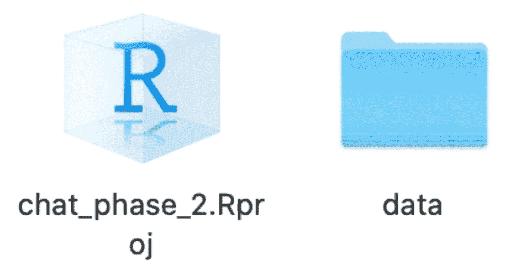

# 第一次使用 R？

> 原文：<https://towardsdatascience.com/using-r-for-the-very-first-time-7d78c526ae68?source=collection_archive---------43----------------------->

最近，我的任务是让一名实习生熟悉 R。当我考虑如何最好地指导他时，我想起了当 R 对我来说完全陌生时，我是多么努力地站稳脚跟。我最初发现了这么多解释各种包、最佳实践和分析的伟大资源，但是我甚至不知道在哪里键入我的代码！我最终通过 YouTube 视频拼凑出了对 R 用法的大致理解，感觉自己正在成功前进。

然后，我很幸运地在研究生院学习了一个非常棒的基于 R 的数据科学资源，并意识到我的代码一团糟。我不知道 R 项目和 R Markdown 文件的存在，所以我所有的代码都存在于桌面上组织混乱的脚本中。我通过给自己发电子邮件来备份我的工作，并利用了现在让我畏缩的变量名和间距。那门课程帮助我学会了如何创建不仅可以运行，而且可重复的代码，这有助于我的数据分析团队进行有效的协作。

希望帮助这位实习生避免我最初的错误，我编写了以下 r 入门指南。它是为完全的初学者设计的——第一部分实际上涵盖了安装软件的位置！我确保包含了我在数据科学课程中学到的许多重要经验，因此在创建本指南时经常参考[课程网站](https://p8105.com/)。我分享这个链接不仅是为了赞扬杰夫·戈德史密斯的想法，也是为了给那些寻找超出这里所涵盖的材料的指导的人提供一个非常有用的资源。本指南当然不是详尽无遗的，但是应该可以让你用一个好的工作流开始并运行 R！

**1。** **安装软件**

首先，您需要安装 R 和 RStudio！

r 下载链接:[https://cloud.r-project.org/](https://cloud.r-project.org/)

从这里，选择您的操作系统并选择最新版本。

RStudio 下载链接:[https://rstudio.com/products/rstudio/download/](https://rstudio.com/products/rstudio/download/)

从这里，选择免费的 RStudio 桌面选项。

**2。** **熟悉 RStudio**

打开 RStudio，这应该是您看到的屏幕:


你在看什么？

蓝色的是您的控制台—您可以在这里运行不会作为脚本的一部分保存的代码(您可能希望使用此选项来安装一个包，或者快速查看一个表)，在这里您将看到有关您已经运行的代码以及您可能收到的任何错误的信息。其他选项卡允许您访问您的终端和作业，但是随着您对 r 的熟悉，您将很少使用这些选项卡。

绿色的是环境。您创建的任何命名实体(如数据帧、向量、函数)将在此显示。通常，您可以单击环境中的内容进行查看，这在您加载外部数据并对其进行清理时非常有用。小扫帚图标可以用来清空这个环境。一旦我们设置了 git 和到 GitHub 的连接，这里也会看到一个“Git”标签。

红色是一个查看器窗格。目前它在“包”标签上，允许你看到什么包被安装在本地。带有勾号的是当前加载的。根据 RStudio 设置，代码输出可能会显示在“绘图”和“查看器”选项卡中。您可以在“帮助”标签中搜索软件包名称以获得有用的信息。

**3。** **文件类型**


我将要经历的工作流尽可能利用 R Markdown 文件，但是我想快速介绍 R 脚本和闪亮的 Web 应用程序。

*剧本:*


脚本是用 R 编写代码的最基本的文件类型，通常用于存储最终将被部署的函数或其他代码。即使您在开始使用 R 时能够选择独占 R Markdown 用法，您也会经常收到来自他人的脚本代码，熟悉这种格式很重要。如您所见，蓝色框中包含的是一个新面板，现在您已经在脚本中了。这是您可以输入代码的地方。

我已经创建了三个命名值:“x”、“y”和“sum”，这是 x 和 y 的总和。由于这三个都是命名的，所以可以在环境面板中找到它们及其相关的数值。

看一下控制台。

当我运行这三行代码时，前三条蓝色的线出现了——它们只是表明代码已经运行了。

在第四行，我直接在控制台中键入“x + y”并按下“enter”下面的黑色文字提供了这个等式的答案。因为这只是在控制台中输入的，所以输出不会保存在任何地方，也不会影响脚本。

试着复制我这里非常简单的代码。你可以通过点击“运行”按钮来运行代码，或者在 Mac 上同时按下 *command + return* 键(对于 Windows，按下 *control + enter* )。

*闪亮:*

我不打算解释如何创建闪亮的应用程序，因为一旦你相当熟悉 R 语言编码，这是一个需要解决的问题，但是知道它们的存在是很好的。Shiny 允许您创建交互式仪表板，是一个非常好的数据可视化工具。您可以通过 RStudio 的服务器公开托管仪表板，将它们嵌入网站等等。

如果你感兴趣，这里有一些关于 Shiny 的进一步信息:[https://shiny.rstudio.com/](https://shiny.rstudio.com/)

*R 降价文件:*

使用 Markdown 文件是创建可重复的、可理解的代码的重要工具。除了编写代码的实际 Markdown 文件之外，您还可以将它“编织”成一个易于阅读的输出文件(我将解释这是什么意思),即使没有安装 R 也可以打开它。您可以从下面的气泡中选择想要的输出类型(HTML、PDF 和 Word)。我喜欢坚持使用 HTML，因为它格式好，允许在线共享，但我经常为最终报告创建 pdf，与数据分析团队以外的同事共享。


继续点击“确定”！这是您接下来应该看到的内容:


你在看什么？

蓝色是您的 YAML 标题，上面有您刚刚输入的信息。想要更改标题、日期或输出类型吗？通过编辑与标题、作者和日期相关联的引号之间的文本，以及将“html_document”替换为“pdf_document”或“word_document”，您可以很容易地做到这一点如果您对在输出文件中列出标题、作者或日期不感兴趣，您可以简单地删除相关的行。

绿色的是代码块。您的所有代码都将包含在代码块中。代码块都遵循以下格式:

```
```{r chunk_name, specifications}```
```

可以通过 *option + command + i* 快捷键(Windows 上， *control + Alt + i* )在 MAC 上直接插入代码块。您可以通过按块右上角的绿色箭头来运行单个代码块。

给你的代码块命名是一个好习惯。这对可能使用您的代码的任何人都很有用，也有助于在您的代码产生错误时有效地进行故障排除。您希望对代码块命名使用与变量命名相同的准则:唯一的、描述性的、不带空格。例如，您可能有名为“数据导入”、“数据清理”、“分析”和“绘图”的代码块。

您可以使用多种规范来更改任何给定代码块中的代码在输出文件中的显示方式，下面提供了一些最常用的规范:


https://p8105.com/writing_with_data.html 杰夫·戈德史密斯的名单

红色的是标题。您可以使用井号来确定输出文件中文件头的大小，每增加一个“#”会使文件头变小:

```
# Main Heading
## Subheading 1
### Subheading 2
```

灰色是常规文本，它将在输出文件中显示出来。好的 Markdown 文件通常有大量的文本来帮助其他人理解你的代码，使它更容易理解。文档记录良好的代码也将使您在以后回过头来看自己的代码时更容易理解！

知道可以加粗和斜体文本以及添加内联代码是很有用的:

```
*bold*
**italicize**
`r desired_inline_code`
```

一个有用的使用和格式化 R Markdown 文件的备忘单可以在这里找到:[https://R studio . com/WP-content/uploads/2016/03/rmarkdown-cheat sheet-2.0 . pdf](https://rstudio.com/wp-content/uploads/2016/03/rmarkdown-cheatsheet-2.0.pdf)

橙色的是“编织”按钮——这就是你创建输出文件的方式！只有在代码中没有错误的情况下，文件才会被编织，因此编织也是检查工作的一种有用方式。现在尝试单击“编织”按钮，看看示例代码在输出文件中的样子。

**4。** **工作流和 Git**

有效地、可重复地使用 R 的一个基本技能是拥有一个清晰的、标准化的工作流程。我将在这里使用 GitHub 演示一个，当你在 r 中工作时，你应该总是使用一致的工作流程。

Git 和 GitHub 是版本控制和代码共享的常用工具。为了开始，你需要在 GitHub 上创建一个免费账户:[https://github.com/](https://github.com/)

接下来，您需要验证 git 是否已经安装并准备好在您的计算机上运行。为了做到这一点，你应该遵循这个指南:[https://happygitwithr.com/install-git.html](https://happygitwithr.com/install-git.html)(尽管如果你愿意，你可以使用 RStudio 中的 terminal 选项卡而不是 shell 来遵循 6.1 中的说明——我发现这要容易得多)。

现在，您应该按照以下工作流程进行配置:

*   *创建一个有意义命名的 GitHub 库*
*   *在 R 中创建新项目，并将其链接到此回购*
*   *将所有相关文件存储在该项目文件夹中，并使用有意义的命名、一致的子文件夹(如存储所有数据的“数据”文件夹)*
*   *使用 R 中的 Git 选项卡来一致地编织、提交和推送*

让我们走一遍:

*一、创建一个有意义命名的 GitHub 库*

在 GitHub 中，点击存储库，然后点击新建:


在那里，您可以为您的 repo 命名并进行简要描述。这个报告包含了使用在线聊天数据的第二阶段研究的数据，因此被命名为“chat_phase_2”我知道这个名字将允许我在几个月后再次使用它时找到回购协议，并且我的合作者也将能够跟踪它。

您的回购可以是公开的(任何人都可以找到您的回购及其内容)，也可以是私有的(只有您和指定的合作者可以看到它及其内容)。公开回购有许多很好的用途(例如，共享您创建的包，共享您创建的酷项目)，但如果您正在使用包含机密信息的数据和/或正在进行尚未发表的研究，您总是希望使用私人回购。您可以在以后更改这些名称，但是应该始终小心您公开的信息。

通常，您会希望创建一个自述文件，以指导您自己和其他任何可能通过其内容访问您的 repo 的人。一份好的自述文件概述了你的报告的内容，并为你所做的工作提供了简要的理由。


单击“创建存储库”，然后复制将出现在以下页面上的链接:


*二。在 R 中创建新项目，并将其链接到这个 repo*

在 R 中，单击文件→新建项目

接下来，选择“带有版本控制的项目”:


选择 Git:


最后，将您从 GitHub 复制的 URL 粘贴到 Repository URL 下，然后单击“创建项目”。我已经在我的桌面上创建了我的项目文件夹，但是你可以在你电脑的任何地方浏览创建你的项目。


项目应该在 r 中打开。您将知道它工作了，因为您的项目将在屏幕的右上角显示为打开的项目，并且您现在将在右上角面板中有一个“Git”选项卡。


*三世。将所有相关文件存储在该项目文件夹中，并使用有意义的命名、一致的子文件夹(如存储所有数据的“数据”文件夹)*

既然您已经创建了一个本地项目和一个 GitHub repo，那么您会希望在进行过程中保持它们的整洁和有序。

我将数据添加到数据文件夹中的项目中，因此我当前的项目文件夹如下所示:



随着我的进展，任何额外的数据都将以一致的文件名添加到这个“数据”文件夹中，我将为我创建的任何重要图表或其他输出创建一个“输出”文件夹，并且我将有几个故意划分的 R Markdown 文件。例如，我可能有一个用来清理数据的 Markdown 文件，一个用来执行分析，一个用来生成可视化。

*四世。使用 R 中的 Git 选项卡一致地编织、提交和推送*

GitHub 只对版本控制有效，如果你坚持把你的工作推给他们的平台。为此，请点击 RStudio 中的“Git”选项卡。每当您对本地项目进行更改时，它们都会出现在该选项卡下。首先，单击自上次更新回购以来所做的所有更改。接下来，单击“提交”按钮。


您需要输入一条提交消息来描述您所做的更改。这使得其他人可以更容易地浏览您的回购协议，如果您以后需要访问它，也可以更容易地找到您代码的以前版本。

输入提交消息后，选择右下角的“提交”。如果运行无误，就可以使用“按钮”了。点击“推送”将您的更新发送到 GitHub。


现在你所有的修改都备份在 GitHub 上了！你会希望在工作中坚持这样做。我建议你第一次这样做的时候检查一下你的 GitHub 账户，看看你的作品是如何存储在那里的。如果你正在访问别人的回购，或者别人对你的回购做了更改，你可以使用“拉”将最新版本的回购拉至你的电脑。

**5。** **装载包裹**

现在一切都设置好了，您可以开始在 R 中工作了！

首先，打开一个新的 R Markdown 文件。如果您在项目打开时单击“文件”→“新建文件”→“R Markdown ”(同样，如果您的项目的名称出现在窗口的右上角，您就可以知道该项目是打开的), R Markdown 文件将会在您的项目中自动创建。

R 自动带有“base R”函数。然而，R 是开源的(这意味着任何人都可以贡献包)，并且有许多令人惊奇的包，你将需要有效地使用 R。您必须一次性安装这些软件包，然后在每次需要使用它们时加载它们。下面提供了这样做的代码(注意双引号表示安装包，单引号表示加载包)。我喜欢在控制台中安装包，因为我只需要这样做一次，因此没有理由保存安装包的代码行。您将在控制台中看到确认信息，表明软件包已正确安装和加载。

```
install.packages("tidyverse")
library('tidyverse')
```

注意:Tidyverse 实际上是包的集合而不是单个包。我强烈建议您熟悉 tidyverse 及其包含的软件包。它们被广泛使用和流行，因为它们会让你的生活变得无限简单——我每次创建一个新的减价文件时都会自动加载它。你可以在这里找到更多关于 tidyverse 及其组件包的信息:【https://www.tidyverse.org/ 

**6。** **其他注释**

r 是区分大小写的，不像 SAS 和其他一些语言。这种区分大小写是使用一致的文件和变量命名结构如此重要的原因之一——您的代码中不太可能出现令人讨厌的错误，其他查看您代码的人也更容易理解它。我个人是专门用 snake case(everything _ is _ lower case _ with _ understand)的。

对于如何格式化代码，也有既定的指导方针。你应该努力让代码不仅运行，而且整洁！哈德利·韦翰的一本有用的时尚指南可以在这里找到:[http://adv-r.had.co.nz/Style.html](http://adv-r.had.co.nz/Style.html)

**7。** **启动运行！**

现在，您应该能够打开一个新的 R Markdown 文件，作为有意工作流的一部分，并在该文件中安装和加载包。这些技巧可以让你更好地利用精彩的教程，而不是带你在 r 中导入、清理、分析和可视化数据。