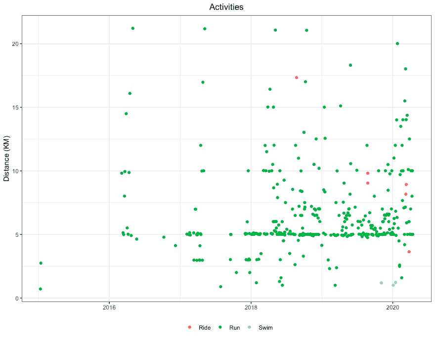

# 使用 R 分析我的 Strava 数据

> 原文：<https://towardsdatascience.com/using-r-to-analyse-my-strava-data-fc57188b4c51?source=collection_archive---------23----------------------->

## 使用 Strava 数据学习 R 的初学者之旅

有了这些空闲时间，我决定花相当多的时间来提高我的统计知识和编程技能。作为一名数据分析师，我每天都使用 SAS 和 SQL，但目前没有使用更高级的 R -这对于可视化、更高级的统计分析和机器学习非常有用。考虑到提高上述技能的愿望，我决定 R 是实现我的目标的一个好起点。

因为没有像现在这样的时间(确切地说是此刻)，我要陷进去！

**入门**

首先，分析什么？当然，我可以在网上找到一些东西，有很多有趣的新冠肺炎数据集可以开始使用。然而，对我来说，当学习新的东西时，有一定程度的熟悉是好的，这样手头的任务看起来就不那么令人生畏了。在这种情况下，这种熟悉的形式是我的数据集；我过去 5 年的斯特拉发活动的输出。那就是 355 次跑步，7 次循环和 3 次游泳(对我喜欢的项目有什么猜测吗？如果我要在今年完成我的铁人三项的话，我也许应该多学学另外两项。).使用我自己的数据集对我来说很重要，因为如果我犯了错误，如果我知道并理解数据，我更有可能发现它。显然，在处理庞大的数据集时，情况并不总是这样，但当我是一个完全的 R 新手时，这是一个很好的起点。


Strava 数据样本(36 个变量中的 7 个)

虽然我通常会为我试图利用数据实现的目标设定目标(以便提供清晰性和方向)，但在这种情况下，我已经偏离了轨道，虽然我已经熟悉了 R，但我的主要目标只是更好地理解该计划，同时*希望*得出一些有趣的见解。

因为我以前从未使用过 R，所以我在谷歌上搜索了一些初学者教程。我发现[对 R and R 工作室的介绍](https://www.youtube.com/watch?v=lL0s1coNtRk&t=8s)真的很有用，也很容易理解。我没有像班上其他人一样使用样本数据集，而是使用我自己的数据，只是将我自己的变量和字段应用于函数，而不是导师给的那些。这是一个开始适应 R 的好地方，经过几个小时的基础学习，我觉得已经准备好开始构建自己的见解了。

完全公开，我肯定还在掌握 R，但我想分享我的想法和迄今为止我创造的情节的发现。

**直方图**

我制作的第一个图表是这个直方图。这相对容易做到(图片下面的代码)，但它很好地显示了我在每个框中的活动频率。如你所见，我绝大多数的活动都是 5 公里。


活动距离直方图

```
#Histogram
hist(strava2$Distance, breaks = 21, main = "Histogram of Activity Distances", xlab = 'Distance (KM)')
```

**散点图**

然后我转向散点图，这花了我一段时间，主要是因为我在处理日期，这被证明是一个巨大的痛苦。我从 Strava 下载的 CSV 文件将活动日期生成为带有时间戳的日期，格式为 Jan 01，2016，07:30:00’，并作为字符传递给 R。您可能会认为转换成 date 类很简单，但是由于最后的时间戳，这就不那么简单了。在花了几个小时试图解决这个问题之后，我真的快要放弃了，用 Excel 来修改原始数据，这样可能会快得多。然而，我坚持了下来，并最终使用了“mutate”函数。我不确定我是否把这个问题复杂化了——我认为众所周知，时间序列数据在大多数程序中很难处理——但是我欢迎任何关于处理这个问题的最佳方法的想法。



活动散点图

我喜欢这个情节的输出。这是一个很好的方式来展示这些年来我的行为是如何改变的。这个图表非常清楚地表明，从 2018 年开始(大约是我第一次使用 Garmin 的时候)，我的活动频率显著增加。你可以看到相当多的活动都在 5 公里左右。你还可以看到，从 2019 年年中开始，游泳和骑行开始出现在图表上(就在我进入我的铁人三项之后！).

```
#Remove time from the date/time timestamp
strava2 <- strava2 %>%
    mutate(Activity.Date = as.Date(Activity.Date, format='%B %d, %Y, %H:%M:%S'))#Scatter Plot 
    ggplot(data=strava2, aes(x = Activity.Date, y = Distance, colour = Activity.Type)) +
        geom_point() +
        theme_bw() +
        theme(legend.position = "bottom", legend.title = element_blank())+ 
        theme(plot.title = element_text(hjust = 0.5))+
        labs(title = "Activities",
             colour = "Activity.Type",
             y = "Distance (KM)",
             x = "Date" + theme_bw(base_size = 15))
```

**方块剧情**

盒须图。这也不是太难(感谢 Stack overflow 上丰富的论坛、网站和帖子)。我可以花一些时间在颜色和格式上，但是为了节省时间，我放弃了。我发现 T4 的网站对颜色选择很有用。


按活动类型划分的距离箱线图

你在这里可以看到，与跑步相比，游泳框图相对较短(尽管数据集中只有少数游泳)。这表明我的游泳距离相似，而我的跑步距离相差更大。

我跑步的四分位数范围(中间 50%的数据)在 5 到 7 公里之间。这意味着我跑的 50%的距离在 5-7 公里之间。

```
#Boxplot 
boxplot(Distance~Activity.Type,
            data=strava2,
            xlab="Activity Type",
            ylab="Distance (KM)",
            cex.lab=0.75,
            cex.axis=0.75,
            col="lightsalmon",
            border="lightsalmon3"
    )
```

**柱状图**

我想将我的数据分组，以便按月份和年份查看趋势。我最初认为按月计算我每天的路程会很困难，但惊喜地发现这相当简单。


按月的距离条形图

这是一个很好的图表，可以快速提取见解并讲述一个故事。从 2019 年初开始，我可以看到我的活动有所减少，特别是在我受伤的 2 月份。我还可以看到 2020 年 3 月我的总距离出现了巨大的峰值，当时我们被告知在家工作，并进入了锁定状态，这意味着更多的时间和锻炼的需要。我在 4 月初导出了这些数据，但我认为，到月底，4 月的数据会比 3 月的数据更高，因为跑步是我在禁闭期间的主要安慰来源之一。

有趣的是，看到每年七月我的活动量显著下降。起初这有点令人惊讶，但当我仔细想想，这是有道理的。首先，7 月份是我的生日，其次，在过去连续三年(2017-19 年)里，我一直是我姐姐和我两个最好朋友 7 月份婚礼的伴娘，而且(有时)天气很热，比起长跑，我更想在外面喝点杜松子酒。所有这些因素意味着跑步可以而且已经退居二线(相当正确)。然而，我敢打赌，如果我画出活动的数量(而不是距离)，它看起来不会有太大的不同。我想这与其说是因为我不经常跑步，不如说是因为我跑的距离更短(我的意思是，当气温为 25 度，并且可以与家人和朋友一起享受乐趣时，谁会愿意跑 15 公里呢？不是我)。

```
#Bar Plot
    barplot(t(rowsum(strava2$Distance,
                     format(strava2$Activity.Date,"%Y-%m"))), 
            las=2, col = "darkolivegreen3",
            cex.lab=0.75, cex.axis=0.75, cex.names = 0.75,
                    xlab="Month",
                    ylab= "Distance (KM)"
                    )
```

**总结**

我在这里主要关注的是距离，但还有很多可以做的。我想接下来我会研究我跑步的速度，以及它是如何随着一天的时间、季节、年份等变化的。例如，我可以研究我是否更有可能在早上、下午或晚上跑得更快，以及这是否有意义。

这很有挑战性，但我真的很喜欢开始使用 R，我期待着很快用它做更复杂的分析。