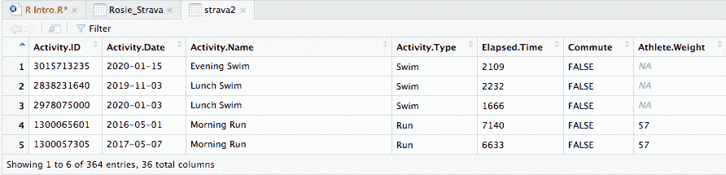
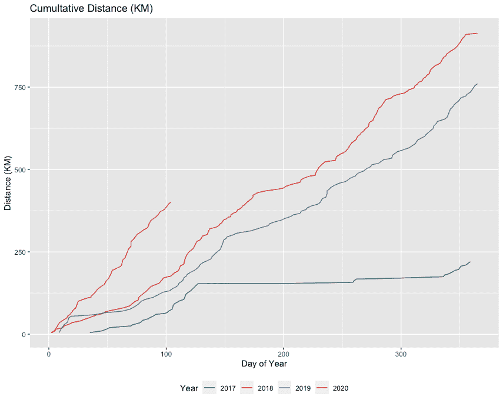
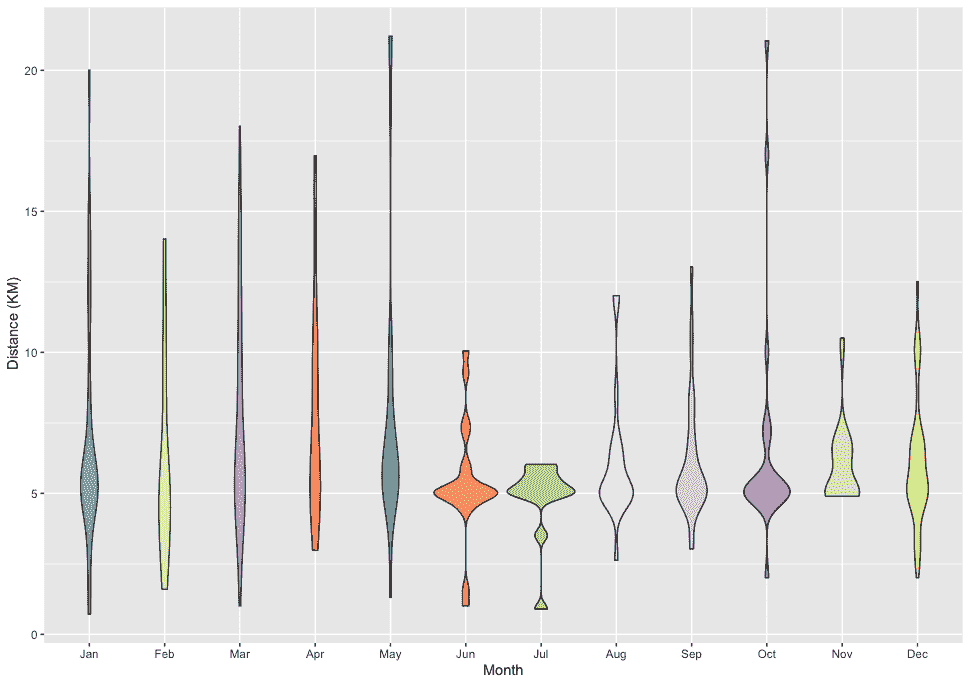
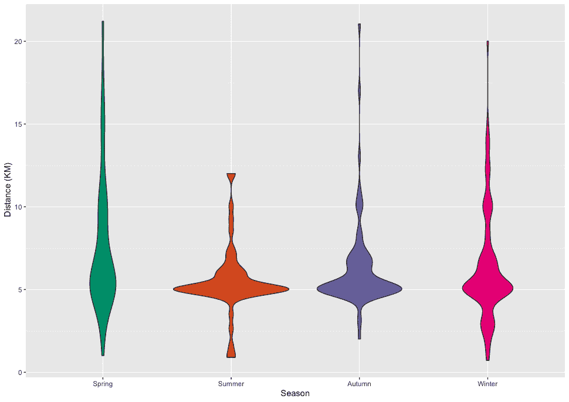
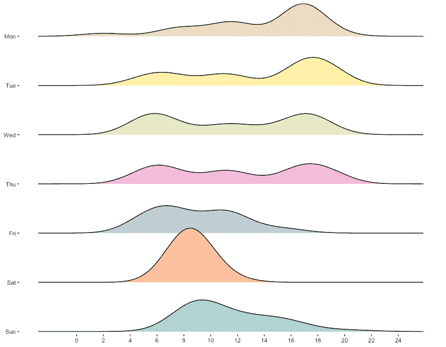
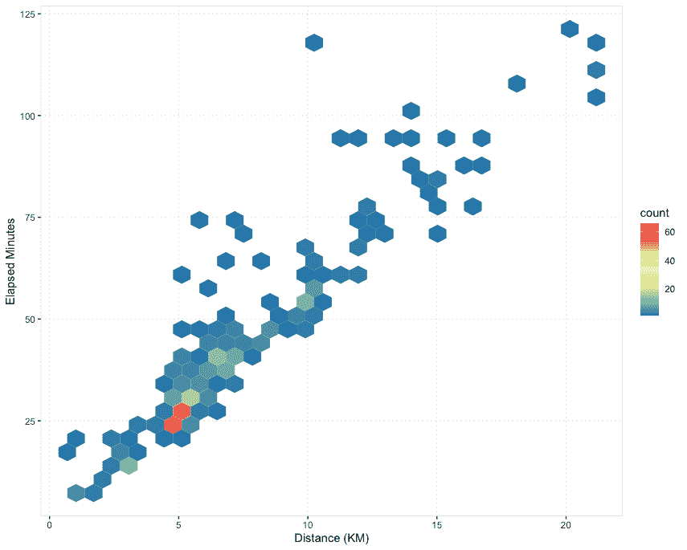
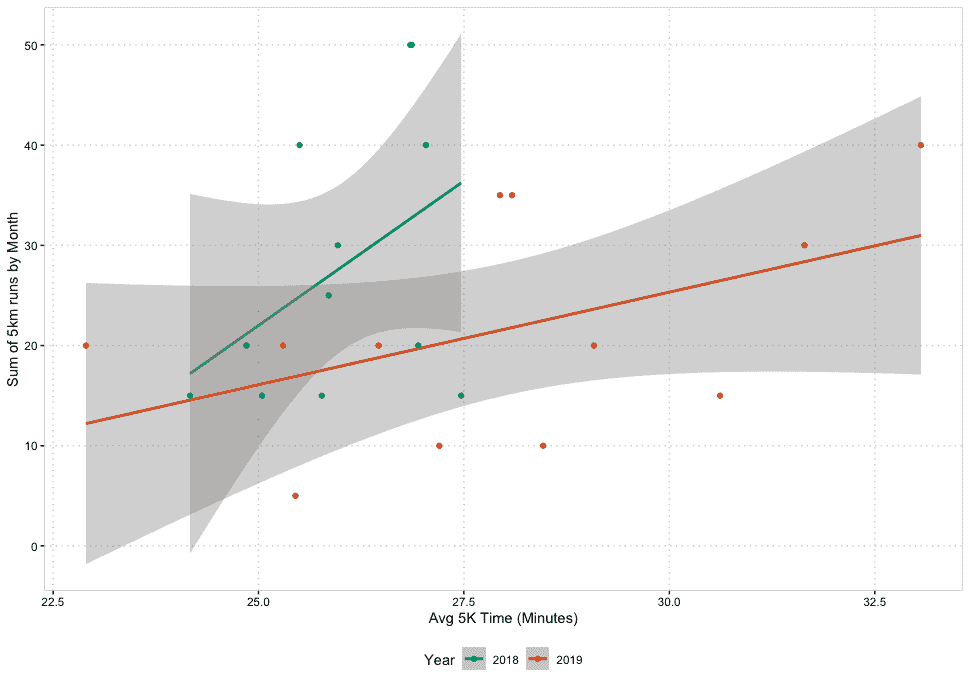

# 使用 R 分析我的 Strava 数据:第 2 部分

> 原文：<https://towardsdatascience.com/using-r-to-analyse-my-strava-data-part-2-9124b1955b27?source=collection_archive---------54----------------------->

在我的第一篇博文中，我讨论了想要学习 R 的原因，并分享了我在掌握该软件的前三周内所取得的成就。在这篇文章中，我将继续阐述我所学到的东西和我所遇到的更多困难，并希望与其他 R 初学者分享一些有趣的见解和有用的技巧。

这里提醒一下我的数据集中的一些变量。



Strava 数据样本

**累积线状图**

首先是累积线图，它显示了我从 2017 年开始的距离的累积和。很高兴看到 2020 年有了一个良好的开端(在运动方面！).



每年累积距离

由于这个输出需要将多个操作串在一起，管道操作符(来自 dplyr 包)真的派上了用场，它可以帮助跟踪我正在做的事情，因为它以逻辑步骤来布局代码。管道操作符实际上翻译成‘然后’。所以在下面的例子中，我说:获取我的 Strava 数据集**，然后**按年份分组，**然后**按活动日期的顺序排列，**然后**将距离变量突变为该年距离的累积和，等等。这可以在没有管道操作员的情况下完成，但在我看来，这样做要干净得多，也更容易阅读。

```
#Cumulative distance per year
cum_plot <- strava2 %>%
    group_by(year) %>%
    arrange(Activity.Date) %>%
    mutate(cumulative_distance = cumsum(Distance)) %>%
    ungroup() %>%
    filter(year >= 2017) %>%
    ggplot(aes(x = day_of_year, y = cumulative_distance, color = factor(year))) +
    geom_line() +
    scale_color_brewer(palette = "Dark2") +
    theme(legend.position = "bottom") +
    #theme(panel.background = element_blank())+
      labs(title = "Cumultative Distance (KM)",
           y = "Distance (KM)",
           x = "Day of Year",
           colour = "Year")
```

[这个视频](https://www.youtube.com/watch?v=GftIZjRv9eI.)解释了如何使用管道操作符，以及 dyplyr 包中最有用的函数(选择、过滤、排列、变异、总结和分组)。我曾多次提到它，并向其他刚开始在 r 的人推荐一款手表。

**小提琴剧情**

在我的上一篇博客文章中，我展示了一个按活动类型划分的方框图，但鉴于我原本打算在 8 月份进行的伦敦铁人三项赛最近被推迟到 2021 年，并且由于数据中明显缺乏周期和游泳，我认为可能值得只为跑步做一个变化的方框图。

进入小提琴情节。这个图的小提琴形状来自于数据的密度。较厚的部分意味着小提琴该部分的值具有较高的频率，而较薄的部分意味着较低的频率。



按月距离的小提琴图

事实上，六月和七月的小提琴比其他月份短得多，宽得多，这证明了我的假设，即在夏季，我更有可能进行短途旅行。

```
#Violin plot
strava_runs <- filter(strava2, Activity.Type == “Run” )
 ggplot(strava_runs, aes (x = calendar_month, y = Distance, fill = calendar_month)) +
 geom_violin() +
 scale_fill_brewer(palette=”Set3") +
 theme(legend.position=’none’) +
 labs(y = “ Distance (KM)”,
 x = “Month”)
```

由于我的行为按月有明显的不同，我决定把我的跑步按季节分组是值得的。这个变量并不在我的数据集中，所以我使用了一个“case when”语句将每个月归入各自的季节。

```
#Runs by season
 strava2 <- strava2 %>% mutate (Season = case_when (
 calendar_month %in% c(“Mar”, “Apr”, “May”) ~ “Spring”,
 calendar_month %in% c(“Jun”, “Jul”, “Aug”) ~ “Summer”,
 calendar_month %in% c(“Sep”, “Oct”, “Nov”) ~ “Autumn”,
 calendar_month %in% c(“Dec”, “Jan”, “Feb”) ~ “Winter”,
 TRUE ~ “Others” ))
```



就像我之前说的，夏天不适合长跑！

**密度脊**

在与一位朋友分享了我之前的博客后，他指出，鉴于我的一些图表中显示的 5 公里活动的集中程度，我的数据集中可能存在跑偏。我认为情况很可能是这样；数据集内 355 次运行中的 70 次(20%)是停车运行-运行。

这一观察让我想到，按照一天中的小时和一周中的天来可视化我的跑步，来可视化我的数据集**中 Parkrun 的普遍性，这将会很有趣。**对密度脊线图进行排队，这是显示特定组的数值分布的理想方式，在本例中，为星期几和一天中的小时。



按一周中的每一天和一天中的每一小时分配活动

周六上午 9 点的高峰是显而易见的，我显然是一个超级 Parkrun 粉丝！我还发现很有趣的是，在周一早上，我不太可能锻炼，而在周五和周六晚上，你同样不太可能发现我在跑步(不言自明)。从美学的角度来看，我喜欢这张图，但密度脊可能会对这样的数据产生误导，所以事后来看，条形图或直方图可能是更好的选择，因为它们不会平滑点之间的数据。

这个图花了一段时间才完成，主要是因为 Strava 数据下载的日期和时间戳有更多的问题。一旦我解决了如何将时间从 12 小时制转换为 24 小时制，我就回到了正轨，但在按照逻辑顺序安排一周中的日子时遇到了一些小困难(我对其他有类似问题的人使用了“因子”和“级别”)。

我选择了柔和的配色方案，但在 Brewer palette 中有许多不错的调色板，在这里可以找到。

```
# Density Ridges
 density_ridge <- strava2$wday <- factor(strava2$wday, levels = c(“Sun”, “Sat”, “Fri”, “Thu”, “Wed”,”Tue”,”Mon”)) 
 ggplot(strava2, aes(x = Hour, y = wday, fill = wday )) +
 geom_density_ridges(scale = 1.1) +
 theme(panel.grid.major = element_blank(), panel.grid.minor = element_blank(), panel.background = element_blank())+
 scale_x_continuous(breaks=seq(0,24,2)) +
 scale_y_discrete(expand = c(0.01, 0) , labels = c(“Sun”, “Sat”, “Fri”, “Thu”, “Wed”,”Tue”,”Mon”))+
 theme(axis.text=element_text(size=rel(0.8))) +
 theme(legend.position=’none’) +
 scale_fill_brewer(palette=”Pastel2") +
 ylab(NULL)
```

**几何十六进制**

当数据集中有大量数据点时，这种类型的图对于表示两个数值变量(在本例中为经过的分钟数和距离)的关系非常有用。不是重叠，而是将绘图窗口分割成几个‘六边形格’，并计算每个六边形格的点数。颜色表示这个点数。



按距离划分的已用分钟数的几何十六进制曲线图

正如我在其他图表中展示的那样，活动主要集中在 5 公里范围内。但是该图增加了一个额外的维度，显示了经过的分钟数，您可以清楚地看到，大多数活动都在 5 公里的距离内，大约需要 25 分钟。然而，在这个图中丢失的是我的 5 公里跑所用时间的变化；25 分钟和 22 分钟的 5000 米之间的差别非常显著，我觉得这一点在这里被忽略了。

```
#Geom hex
 filter(strava2, Activity.Type == ‘Run’ & Elapsed.Mins < 150) %>%
 ggplot(aes(x = Distance, y = Elapsed.Mins)) + 
 geom_hex() + scale_fill_distiller(palette = “Spectral”) +
 labs(y = “Elapsed Minutes”,
 x = “Distance (KM)”) +
 theme(panel.background = element_rect(fill = “white”),
 panel.border = element_rect(colour = “lightgrey”, fill = NA, linetype = 1, size = 0.3),
 panel.grid.major.x = element_line(colour = “lightgrey”, linetype = 3, size = 0.3),
 panel.grid.major.y = element_line(colour = “lightgrey”, linetype = 3, size = 0.3)
```

**创建主题**

正如你在上面的代码中看到的，我在很多文本中格式化了情节的小细节。然而，作为一个 R 新手，我最近发现了一些我认为可以节省大量时间的东西。这就是创建你自己的主题的能力，这样你就不必在每次创建一个情节时改变你的视觉化的小细节(游戏改变者！).如何创建自己的主题在[这段视频](https://www.youtube.com/watch?v=1GmQ5BdAhG4)中解释得非常清楚。

这是我的主题示例:

```
#Create my own theme
 theme_rosie <- function() {
 theme(
 # add border 1)
 panel.border = element_rect(colour = “lightgrey”, fill = NA, linetype = 1),
 # color background 2)
 panel.background = element_rect(fill = “white”),
 # modify grid 3)
 panel.grid.major.x = element_line(colour = “lightgrey”, linetype = 3, size = 0.5),
 panel.grid.minor.x = element_blank(),
 panel.grid.major.y = element_line(colour = “lightgrey”, linetype = 3, size = 0.5),
 panel.grid.minor.y = element_blank(),
 # modify text, axis and colour 4) and 5)
 axis.text = element_text(colour = “black”, family = “Arial”),
 axis.title = element_text(colour = “black”, family = “Arial”),
 axis.ticks = element_line(colour = “black”),
 # legend at the bottom 6)
 legend.position = “bottom”
 )
 }
```

**平滑线散点图**

在过去的几个月里，我感觉自己比以往任何时候都更有规律地跑步，尽管如此，还是有很多天我发现跑步真的很难，即使是在我以通常感觉舒适的速度跑步的时候。一个人跑步时的感觉取决于许多因素，但我认为值得做一个基本测试，将我的距离总和与我每月的平均时间进行比较，看看这两个变量之间是否有任何相关性。我试图回答的问题是:你投入的越多(就距离而言)，你就越能以更快的速度获得更多的回报，还是事实上当你投入更多时，你会发现自己很疲劳，因此跑得更慢？

显然，有很多因素会影响你的速度，从温度到一天中的时间等等，更不用说你还做了什么其他的健身运动，比如交叉训练和速度训练。然而，为了这个练习的目的，我只关注了我每个月的总距离，仅仅是我的 5 公里跑。



有趣的是，看起来我每月跑的 5 公里越多，我的平均时间就越慢。所以说到跑步，总的来说，我投入的越少，出去的就越多。虽然这可能不是我生活的座右铭…

```
#Filter, group and summarise: 5K Runs
five_k_runs <- strava2 %>% 
 filter(Activity.Type == ‘Run’, Distance_Rounded == 5, Elapsed.Mins < 70) %>%
 group_by(year, calendar_month) %>% summarise (Sum_Distance= sum(Distance_Rounded), Avg_Time = mean(Elapsed.Mins), Num_Runs = length(Activity.ID))
 #create plot
 avg_5k_by_month <-
 five_k_runs %>%
 group_by(year) %>%
 ungroup() %>%
 filter(year >= 2018, year <= 2019) %>%
 ggplot(aes(x = calendar_month, y = Avg_Time, color = factor(year))) +
 geom_point(aes(size = Sum_Distance)) +
 guides( size = FALSE) +
 scale_color_brewer(palette = “Dark2”) +
 theme(legend.position = “bottom”) +
 labs(y = “Avg 5K Time (Minutes)”,
 x = “Month”,
 colour = “Year”) +
 geom_text(aes(label=Sum_Distance),hjust=2, vjust=2, size = 3)
 #apply theme
 avg_5k_by_month + theme_rosie()
```

**总结**

我确信我只是触及了可以做的事情的表面，但是使用 R 来分析我的 Strava 数据是一项非常有价值的活动，原因有很多。

首先，它让我对自己的训练有了更深刻的认识。这是我想强调的地方，比如夏季的长距离跑和冬季的长距离跑。这让我想在增加距离方面更进一步——我能经常跑 5 公里以上吗？这让我开始考虑天气数据和跑步后情绪跟踪等额外信息如何为我的洞察力增加额外的维度。这激励我继续努力工作。

就学习 R 本身而言，这是一个很好的方式来更好地理解它是如何工作的，以及 if 必须提供什么。这让我意识到 R 实际上并不像我预期的那么难学，但也让我更加确信你花时间去练习是很重要的。就个人而言，我认为使用你感兴趣的数据集是一种非常愉快的学习方式。无论是 Strava，英超联赛统计数据还是你的 Spotify 收听历史，如果你觉得有趣，它更有可能让你有动力继续下去。