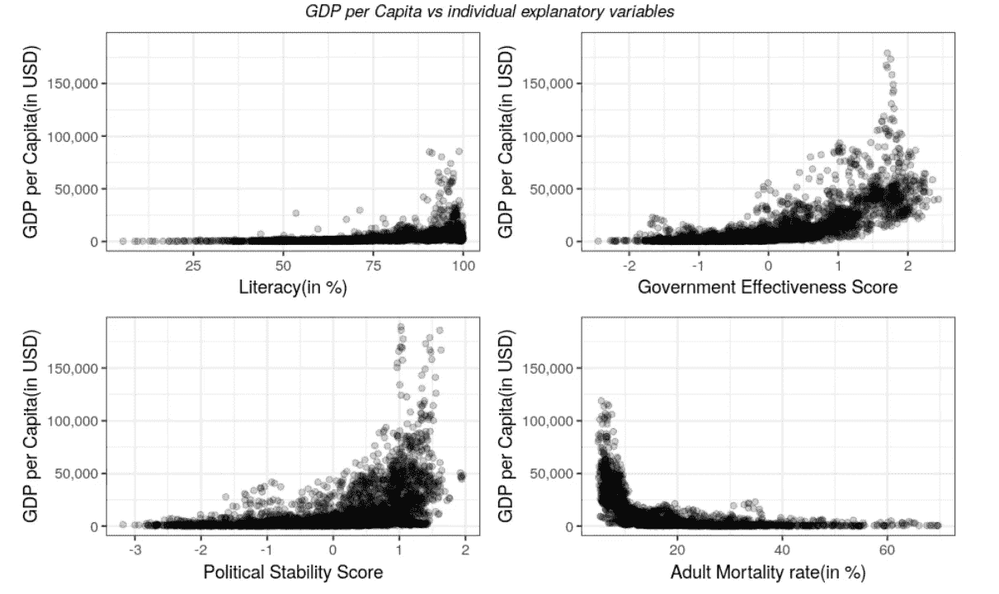

# 使用回归确定影响人均国内生产总值的最重要的社会因素

> 原文：<https://towardsdatascience.com/using-regression-to-determine-the-most-important-social-factors-impacting-gdp-per-capita-2296f4f02dcf?source=collection_archive---------15----------------------->

## 基于回归系数的 t 统计量对社会因素进行排序

# 介绍

世界各地的经济学家使用各种指标来衡量一个国家的繁荣和经济发展。其中一个指标是人均国内生产总值。一个国家的 GDP 或国内生产总值是一个国家在特定时期内生产的最终商品和服务的货币价值。人口较多的大国往往会有较高的 GDP。因此，为了消除这种对高人口的偏见，GDP 除以该国的总人口，这就给了我们该国的人均 GDP。

一个国家的发展会受到各种经济和社会因素的影响。本文只关注影响一个国家人均 GDP 的社会因素。总共选择了七个社会因素进行分析。世界银行的数据被用来收集所有这些特征。

1.  **识字率**:成人识字率是指 15 岁及以上能够读写并理解简单日常生活语句的人口比例
2.  **贫困**:每日生活费不足 3.2 美元的总人口比例。
3.  **贫民窟下**:居住在贫民窟的城市人口百分比。
4.  **腐败**:得分在-2.5 到 2.5 之间，得分越高表示腐败越少。
5.  **政府效力**:它反映了公众对公共服务质量、公务员质量及其不受政治压力影响的程度、政策制定和执行的质量以及政府对这些政策承诺的可信度的看法。这是一个介于-2.5 到 2.5 之间的分数，正值越大表示治理越好。
6.  **政治稳定**:衡量没有暴力和恐怖主义。这是一个介于-2.5 到 2.5 之间的分数，正值越大，表明政治越稳定。
7.  **成人死亡率**:是每 1000 人中 15 岁到 60 岁之间死亡的人数。

# 目标

该分析使用回归来发现所选择的因素是否影响人均国内生产总值。该研究还试图根据这些特征对人均国内生产总值的影响对其进行排名。

# 利益相关者

**政府**:知道了影响发展的特征的相对重要性，政府就可以计划投资资金和制定正确方向的政策。

投票者:投票者可以把它作为分析政府工作的一种手段，依据的是政府是否把重点放在重要的方面，或者它的政策是否针对对一个国家的发展贡献不大的因素。

变革者:希望在国家发展中有所作为的个人可以选择努力的方向，从而对国家的发展产生最大的影响。

# 分析

不同的特征是从[世界银行](https://data.worldbank.org/indicator)的数据中收集的，并被争论以将它们转换成期望的结构。使用回归来确定系数。为此，对所有特征进行了缩放，使得通过拟合回归模型获得的权重对应于每个特征的相对重要性。

对缩放特征拟合线性回归模型的结果表明`Literacy`对人均 GDP 没有影响。这个结果看起来很奇怪，因为识字总是与发展联系在一起。为了研究这一点，绘制了单个解释变量，以了解它们与因变量人均国内生产总值的关系。

这种分析表明，这些特征不是线性的，这意味着线性回归模型不能适合给定的数据。该图表明 Y 轴上的最大变化是从 0 到 150，000，而 X 轴上的最大变化是从 0 到 100。因此，人均国内生产总值和其他变量之间没有明显的关系。因此，人均国内生产总值的对数被用来使两个变量相似。

对数变换后，X 轴和 Y 轴的变化变得相似，人均国内生产总值和其他独立变量之间几乎呈线性趋势。例如，从识字率图中可以看出，随着识字率的增加，人均国内生产总值的对数也在增加，同样，其他变量也可以观察到这种趋势。这给了使用 GLM(广义线性模型)的动机。从上面的图中可以看出，链接函数显然是一个`log`链接函数，因为在对数变换后，数据的趋势呈线性。现在的挑战是决定在 GLM 使用哪一个发行系列。为了有所了解，绘制了因变量的 pdf:

上述密度的形状和`GDP per Capita`是一个正连续量的事实表明`Gamma`分布可以用来模拟密度函数。

> 于是用具有`log`连接功能的`Gamma`分布族对缩放后的数据拟合出 GLM。

通过对数变换因变量`GDP per Capita`还拟合了一个线性模型。如果模型是为预测目的而建立的，那么转换因变量并不是一个好的做法。但是这里的主要任务是识别特性的重要性。另外，`log`作为单调递增函数不影响可解释性。因此，对数转换的线性模型被用作第二模型。

## 确定特征重要性

确定特征的相对重要性的最直观和简单的方法之一是通过直接评估与从拟合回归模型获得的缩放特征相关联的权重。但是这没有考虑在确定权重或者换句话说置信区间时的误差。因此，为了减轻这种影响，`t statistic`被用来衡量重要性，因为它也包含了计算权重时的相关误差。

## 代码和详细信息

整个分析是在 r 中执行的。要了解详细的代码和整个流程，数据争论是如何执行的，一些导致共线性的特性是如何处理的，以及其他微小的细节，请查看我的[GitHub](https://github.com/sgauravm/FactorsImpactingGdpPerCapita/blob/master/gdpAnalysisR.ipynb)资源库中的笔记本。笔记本包含对每个步骤的文档分析，这将有助于更好地理解分析。

# 结果和结论

在考虑的七个因素中，只有以下四个特征对人均国内生产总值有独立影响:

1.  识字
2.  成人死亡率
3.  政府效能
4.  政治稳定

其他三个因素，即贫困、贫民窟和腐败，取决于上述四个因素。改变这四个变量可以改变三个因变量的值。

相关矩阵

上图显示了所有因素的相关值。相关性的数值从 0 到 1 不等。如果两个特征的相关性接近 0，这意味着这两个特征根本不相关，而如果相关性接近 1，则这两个特征可以被认为高度相关。负值表示增加一个变量会导致另一个变量减少，而正值表示增加一个变量会增加另一个变量。

1.  **贫民窟下**:该变量与识字率呈高度负相关，与成人死亡率呈高度正相关。这表明贫民窟人口可以通过提高识字率、降低成人死亡率或改善健康状况来减少。
2.  **低于贫困水平**:这一变量也与识字率高度负相关，与成人死亡率高度正相关。因此，可以通过提高识字率、降低成人死亡率或改善健康状况来减少贫困。
3.  **腐败**:腐败与政府效能有非常高的正相关关系。因此，一个有效的政府可以帮助减少腐败，即增加腐败分数，因为较高的分数代表较低的腐败。

下图显示了四个独立特征如何影响人均 GDP:

从上图中，可以得出结论:

1.  提高识字率、政府效率和政治稳定性会导致人均国内生产总值的增加。
2.  降低成人死亡率或改善健康状况可以提高人均国内生产总值。

现在我们知道了四个变量中的每一个是如何影响人均 GDP 的，让我们看看影响它的最重要的因素是什么:

这里分析了两个模型，这两个模型对于特征的重要性给出了相同的结果。重要性与拟合两个模型得到的 t 统计量的绝对值成正比。从上面的两个图表中，可以观察到:

> **识字率是影响人均国内生产总值的最重要因素，其次是成人死亡率，然后是政府效率和持久的政治稳定。**

# 国家比较

让我们看看 2018 年人均 GDP 最高的前 10 个国家

图表显示，摩纳哥在 2018 年的所有国家中人均 GDP 最高，美国排名第十。

## 印度、中国和美国的比较

根据人均 GDP，美国排名第 10，中国第 90，印度第 182。识字率也有类似的差异。美国和中国的识字率非常高，分别为 99%和 97%，而印度远远落后，为 74%。

根据维基百科的数据，2014 年美国在教育上花费了其 GDP 的 5%。2016 年，中国将国内生产总值的 4%用于教育。另一方面，印度 2019 年的教育支出仅占 GDP 的 3%。这显示了一种严重的担忧。美国和中国都有很高的识字率，为了赶上他们，印度需要在教育上投入更多。