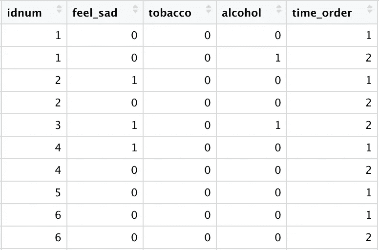
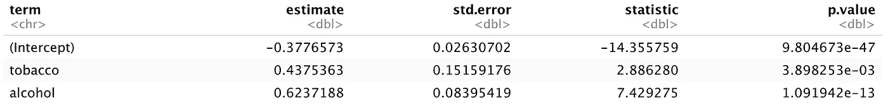
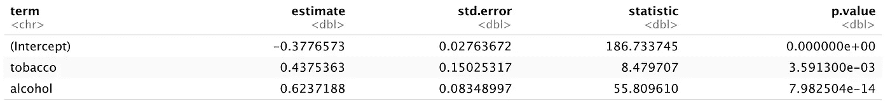
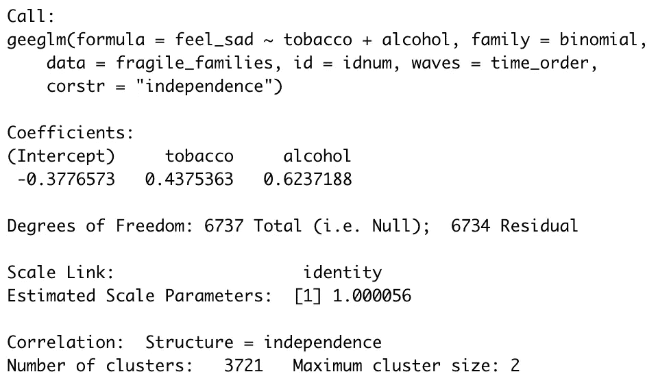
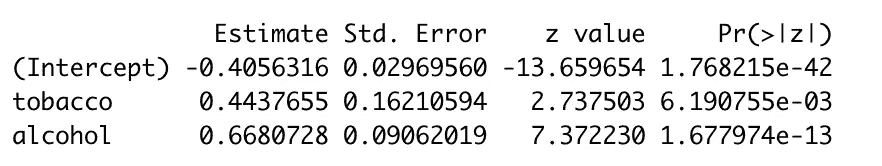
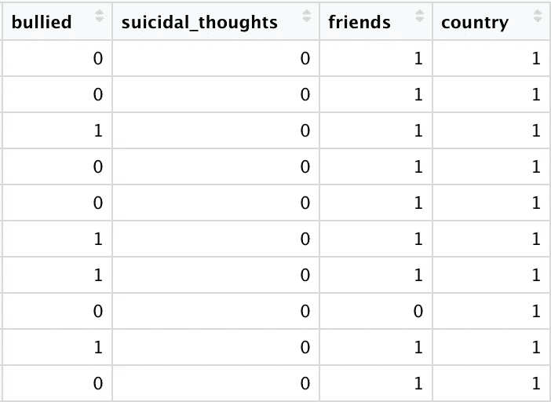
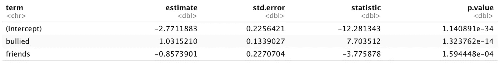
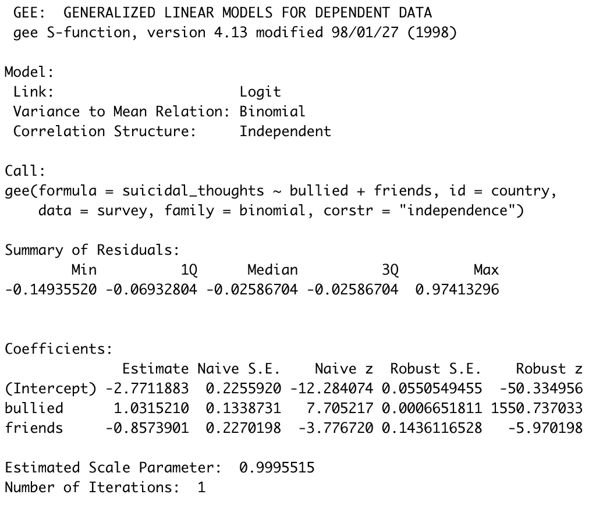
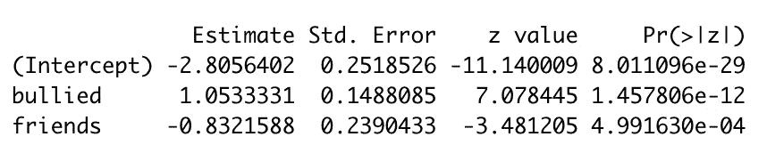

# 使用相关数据的回归

> 原文：<https://towardsdatascience.com/using-regression-with-correlated-data-5845a2eed3d2?source=collection_archive---------13----------------------->

## [视频教程](https://towardsdatascience.com/tagged/video-tutorial)

## 教程(包括 R 代码)使用广义估计方程和多级模型。


照片由来自[佩克斯](https://www.pexels.com/photo/space-grey-ipad-air-with-graph-on-brown-wooden-table-187041/?utm_content=attributionCopyText&utm_medium=referral&utm_source=pexels)的[布拉克 K](https://www.pexels.com/@weekendplayer?utm_content=attributionCopyText&utm_medium=referral&utm_source=pexels) 拍摄

虽然回归模型由于其简短的语法而易于运行，但这种可访问性也使得不适当地使用回归变得容易。这些模型有几个关键的假设，需要满足这些假设才能使它们的输出有效，但是无论这些假设是否满足，您的代码通常都会运行。

视频教程

对于线性回归(用于连续结果)，这些假设如下:

1.  **独立性:所有观测值相互独立，残差不相关**
2.  线性:X 和 Y 之间的关系是线性的
3.  同方差:不同 X 值的残差的恒定方差
4.  正态性:数据应该在回归线周围呈正态分布

对于逻辑回归(与二元或有序分类结果一起使用)，这些假设如下:

1.  **独立性:所有观测值相互独立，残差不相关**
2.  logit 中的线性:X 和 Y 的 logit 之间的关系是线性的
3.  正确指定模型，包括缺少多重共线性

在这两种简单的回归模型中，独立的观察值对于拟合一个有效的模型是绝对必要的。如果你的数据点是相关的，这种独立性的假设就被违反了。幸运的是，仍然有办法用相关数据生成有效的回归模型。

# 相关数据

数据中的相关性主要通过多次测量(例如，对每个参与者间隔 1 周进行两次测量，并且个体内部的数据点不是独立的)或者如果数据中存在聚类(例如，在不同学校就读的学生中进行调查，并且来自给定学校的学生的数据点不是独立的)。

结果是，结果是在单个观察的水平上测量的，但是存在单个(在多个时间点的情况下)或集群的第二个[水平](https://www.ncbi.nlm.nih.gov/pmc/articles/PMC6071979/),在该水平上可以关联单个数据点。忽略这种相关性意味着标准误差无法精确计算，并且在大多数情况下会被人为降低。

了解您的数据是否相关的最佳方式是简单地通过熟悉您的数据和产生它的收集过程。如果您知道您有来自相同个体的重复测量，或者有可以分组到家庭或学校的参与者的数据，您可以假设您的数据点可能不是独立的。您还可以[通过计算 ICC(组内相关系数)来确定数据点在可能的组内的相关程度，或者通过在残差中寻找相关性，来调查数据的可能相关性](https://www.ncbi.nlm.nih.gov/pmc/articles/PMC6071979/)。

# 相关数据的回归建模

如前所述，简单回归会产生不准确的相关数据标准误差，因此不应使用。

相反，您希望使用能够解释数据中存在的相关性的模型。如果相关性是由于一些分组变量(如学校)或随着时间的推移而重复测量，那么您可以在广义估计方程或多水平模型之间进行选择。这些建模技术可以处理二元或连续的结果变量，因此当数据相关时，可以用来代替逻辑或线性回归。

## 广义估计方程

广义估计方程(GEE)将给出与简单回归产生的β估计相同或相似的β估计，但具有适当的标准误差。当您对相同的个人或单位进行重复测量时，广义估计方程特别有用。当您有许多小的集群时，这种建模技术往往工作得很好，这通常是对大量参与者进行少量测量的结果。GEE 还允许用户[指定众多关联结构](https://online.stat.psu.edu/stat504/node/181/)中的一个，根据您的数据，这可能是一个有用的特性。

## 多层建模

[多水平建模](http://www.bristol.ac.uk/cmm/learning/multilevel-models/what-why.html) (MLM)在数据点不独立时也提供了适当的标准差。当用户对聚类组内和聚类组之间的关系感兴趣，而不是简单地考虑标准误差估计中的相关性影响时，这通常是最佳的建模方法。MLM 还有一个额外的优势，就是能够处理两个以上级别的响应变量。MLM 模型的主要缺点是，它们需要在每个聚类中有更大的样本量，因此当聚类很小时可能不太适用。

在 r 中，GEE 和 MLM 都很容易使用。下面，我将介绍两种最常见的相关数据的示例:来自个人的重复测量数据和从具有重要分组变量(在本例中为国家)的个人收集的数据。我将为每个数据集拟合简单的回归、GEE 和 MLM 模型，并讨论哪种建模技术最适合这些不同的数据类型。

# 例子 1:来自脆弱家庭和儿童福利研究的数据

我将首先处理的数据来自普林斯顿大学[9 年级和 15 年级的脆弱家庭&儿童福利研究](https://fragilefamilies.princeton.edu/)，该研究跟踪了 1998 年至 2000 年间在美国主要城市出生的选定儿童的家庭。数据是公开的，可以通过在脆弱家庭[数据和文件](https://opr.princeton.edu/archive/restricted/Default.aspx)页面提交一个简短的请求来获取。由于这项研究年复一年地跟踪相同的家庭，来自相同家庭单位的不同时间点的数据点并不独立。

该数据集包含数十个变量，代表参与调查的儿童及其父母的健康状况。作为一名精神病学专家，我主要对检查儿童的心理健康感兴趣。参与的孩子们被问到他们是否经常感到悲伤，我将用这个“经常感到悲伤”问题的答案作为我的结果。由于药物使用与青少年心理健康状况不佳有关，我将使用代表酒精和烟草使用的变量作为预测指标*。

*注意:本文中创建的模型仅用于演示目的，不应视为有意义。在构建这些模型时，我没有考虑混杂、中介、其他模型假设或其他可能的数据问题。

首先，让我们加载将要使用的包。我加载了“tidyverse”来清理我们的数据，“haven”是因为我们将要读入的数据是 SAS 格式的，“geepack”运行我们的 GEE 模型，“lme4”运行我们的多级模型:

```
library(tidyverse)
library(haven)
library(geepack)
library(lme4)
```

现在让我们做一些数据清理，让这些数据为建模做好准备！

第 9 年和第 15 年的数据存放在单独的 SAS 文件中(可通过. sas7bdat 扩展名识别)，因此我们有一个代码块来读入和清理每个文件。这种清理必须单独进行，因为变量名和编码在不同的研究年份略有不同(参见代码簿的[数据和文档](https://opr.princeton.edu/archive/restricted/Default.aspx)页)。

数据集中包含数百个变量，因此我们首先选择将在我们的模型中使用的变量，并为其分配有意义的变量名，这些变量名在数据框中保持一致。接下来，我们过滤数据，只包括我们感兴趣的变量的完整数据的个人(下面的代码排除了这些变量的缺失数据的个人以及拒绝回答的个人)。

然后，我们以标准的 1 =“是”，0 =“否”格式重新编码变量。对于“feel_sad”变量，这也意味着将变量分成 4 个等级，代表不同程度的悲伤。我们最终得到一个二元变量，其中 1 =“悲伤”，0 =“不悲伤。”一些回归技术可以处理您的响应变量中的多个级别(包括 MLM)，但为了简单起见，我在这里将其二进制化。最后，我们创建一个“time_order”变量来表示观察结果是来自第一轮还是第二轮研究。

```
year_9 = read_sas("./data/FF_wave5_2020v2_SAS.sas7bdat") %>% 
  select(idnum, k5g2g, k5f1l, k5f1j) %>% 
  rename("feel_sad" = "k5g2g",
         "tobacco" = "k5f1l",
         "alcohol" = "k5f1j") %>% 
  filter(
    tobacco == 1 | tobacco == 2,
    alcohol == 1 | alcohol == 2,
    feel_sad == 0 | feel_sad == 1 | feel_sad == 2 | feel_sad == 3
  ) %>% 
  mutate(
    tobacco = ifelse(tobacco == 1, 1, 0),
    alcohol = ifelse(alcohol == 1, 1, 0),
    feel_sad = ifelse(feel_sad == 0, 0, 1),
    time_order = 1
  )year_15 = read_sas("./data/FF_wave6_2020v2_SAS.sas7bdat") %>% 
  select(idnum, k6d2n, k6d40, k6d48) %>% 
  rename("feel_sad" = "k6d2n",
         "tobacco" = "k6d40",
         "alcohol" = "k6d48") %>% 
  filter(
    tobacco == 1 | tobacco == 2,
    alcohol == 1 | alcohol == 2,
    feel_sad == 1 | feel_sad == 2 | feel_sad == 3 | feel_sad == 4
  ) %>% 
  mutate(
    tobacco = ifelse(tobacco == 1, 1, 0),
    alcohol = ifelse(alcohol == 1, 1, 0),
    feel_sad = ifelse(feel_sad == 4, 0, 1),
    time_order = 2
  )
```

然后，我们通过使用 rbind()堆叠两个清理过的数据框来合并第 9 年和第 15 年的数据。rbind()函数在这里工作得很好，因为两个数据框现在共享所有变量名。接下来，我们将“idnum”变量(它标识唯一的家族单元)转换成一个数值变量，以便它可以正确地用于对最终代码块中的数据进行排序。这一步是必要的，因为我们将用于运行 GEE 模型的 geeglm()函数假设数据帧首先按唯一标识符(在本例中为“idnum”)排序，然后按观察顺序排序(在此由新的“time_order”变量表示)。

```
fragile_families = rbind(year_9, year_15) %>% 
  mutate(
    idnum = as.numeric(idnum)
  )fragile_families = 
  fragile_families[
  with(fragile_families, order(idnum)),
]
```

上述代码生成了以下清理后的数据框，现在可以用于回归建模了:



让我们适应我们的模型:

1.  **简单逻辑回归**

首先，我们使用 glm()函数来拟合一个使用“脆弱家庭”数据的简单逻辑回归模型。因为我们有一个二元结果变量，“家庭=二项式”被用来指定应该使用逻辑回归。我们还使用“broom”包中的 tidy()来清理模型输出。我们创建这个模型只是为了进行比较——如前所述，已经违反了独立性假设，与这个模型相关的标准误差将无效！

```
glm(formula = feel_sad ~ tobacco + alcohol, 
    family = binomial, data = fragile_families) %>% 
  broom::tidy()
```

上面的代码产生了下面的输出，后续的建模方法将与它进行比较。吸烟和饮酒似乎都是参与儿童悲伤的重要预测因素。



**2。广义估计方程**

使用“geepack”包中的 geeglm()函数指定 GEE 模型的语法与标准的 glm()函数非常相似。“公式”、“系列”和“数据”是两个函数完全相同的参数。新增的是“id”、“waves”和“corstr”参数(参见[包文档](https://cran.r-project.org/web/packages/geepack/geepack.pdf)中所有可用的参数)。在“id”参数中指定了链接来自相同主题的观察的唯一标识符。在这种情况下，ID 是“idnum”，这是分配给参与研究的每个家庭的唯一标识符。在数据清理过程中创建的“time_order”变量在“waves”参数中起作用，它表示进行观测的顺序。最后，“corstr”可以用来指定主题内的相关结构。“独立性”实际上是这个参数的默认输入，它在这个上下文中是有意义的，因为当集群很小时它是有用的。然而，当一个对象内的所有观察值可以被认为是同等相关时，可以指定“可交换的”,当内部相关性随着时间而变化时，“ar1”是最好的。关于选择正确相关结构的信息可以在[这里](https://online.stat.psu.edu/stat504/node/181/)和[这里](https://stats.stackexchange.com/questions/83577/gee-choosing-proper-working-correlation-structure)找到。

```
geeglm(formula = feel_sad ~ tobacco + alcohol, 
       family = binomial, id = idnum, data = fragile_families, 
       waves = time_order, corstr = "independence") %>% 
  broom::tidy()
```

我们的 GEE 模型给出了以下输出:



如您所见，我们的β估计值与使用 glm()得出的结果完全相同，但标准误差略有不同，因为已经考虑了数据中的相关性。虽然烟草和酒精仍然是悲伤的重要预测因素，但 p 值略有不同。如果这些 p 值更接近 0.05，那么通过精确的标准误差测量可以很容易地将 p 值推到显著性水平之上或之下。

* *注:GEE 和逻辑回归的检验统计看起来完全不同，但这只是因为逻辑回归输出中提供的检验统计是 Z 统计，而 GEE 输出中提供的检验统计是 Wald 统计。Z 统计量的计算方法是将估计值除以标准误差，而 Wald 统计量的计算方法是将估计值除以标准误差的结果平方。因此，这两个值在数学上是相关的，通过对 GEE“统计数据”列中的值求平方根，您将会看到与初始 Z 统计数据相比更加温和的变化。

使用 geeglm()函数，验证您的分类是否被正确识别也很重要。您可以通过运行上面的代码来做到这一点，而不需要 broom::tidy()步骤，因此:

```
geeglm(formula = feel_sad ~ tobacco + alcohol, 
       family = binomial, id = idnum, data = fragile_families, 
       waves = time_order, corstr = "independence")
```

这段代码产生如下所示的输出。您需要查看输出的最后一行，其中描述了“集群数量”和“最大集群大小”。我们对几千个人进行了 2 次观察，因此这些值在我们的数据环境中是有意义的，并且表明函数正确地注册了聚类。但是，如果分类的数量等于数据集中的行数，则可能是工作不正常(很可能是数据的排序被关闭)。



**3。多级建模**

接下来，让我们使用来自 [lme4 包](https://www.rdocumentation.org/packages/lme4/versions/1.1-23)的 glmer()拟合一个多水平模型。同样，所需的代码几乎与用于逻辑回归的代码相同。唯一需要的更改是在公式参数中指定随机斜率和截距。这是通过代码的“(1 | idnum)”位完成的，它遵循以下结构:(随机斜率|随机截距)。分组变量，在本例中为“idnum”，在|的右边被指定为“随机截距”，而“1”表示我们不希望预测因子的效果在不同的组之间有所不同。Rense Nieuwenhuis 的一篇[有用的博客文章](http://www.rensenieuwenhuis.nl/r-sessions-16-multilevel-model-specification-lme4/)提供了这种 glmer()语法的各种例子。

lme4 包与 broom 包不兼容，因此我们在创建了一个包含模型输出摘要的列表后提取模型的系数。

```
mlm = summary(glmer(formula = 
                    feel_sad ~ tobacco + alcohol + (1 | idnum), 
                    data = fragile_families, family = binomial))mlm$coefficients
```

同样，输出类似于简单的逻辑回归模型，烟草和酒精的使用仍然是悲伤的重要预测因素。估计值与使用 glm()和 geeglm()函数得出的值略有不同，因为数据中的分组不再被忽略，也不再被视为需要通过纠正标准误差来解决的烦恼；相反，它们现在作为模型的一个重要部分被合并。与通过逻辑回归产生的估计值相比，所有估计值的标准误差估计值更高，Z 值和 p 值保持相似，但反映了估计值和标准误差值的这些重要变化。



# 例 2:来自全球学校学生健康调查的数据(GSHS)

我们将浏览的第二个数据集来自世卫组织的全球在校学生健康调查(GSHS)。这项调查在 13-17 岁的学龄儿童中进行，目的是帮助各国确定健康优先事项，确定健康相关行为的流行率，并促进直接比较各国的流行率。我们将使用来自两个国家的数据，分别是[印尼](https://www.cdc.gov/gshs/countries/seasian/indonesia.htm)和[孟加拉](https://www.cdc.gov/gshs/countries/seasian/bangladesh.htm)，这些数据可以直接从这些国家各自的描述页面下载。

这些数据是跨部门的:一次在两个国家的学生中进行了相同的调查。我感兴趣的是使用这个数据集中的变量来描述孩子是否有朋友，孩子是否被欺负(我的预测因素)以及孩子是否认真考虑过自杀(我的结果)之间的关系。很可能这两个国家之间的这些关系是不同的，孩子们与来自同一个国家的其他孩子更相似。因此，知道一个孩子是来自印度尼西亚还是孟加拉国提供了关于那个孩子的反应的重要信息，并且违反了独立观察的假设。

让我们再次加载包:

```
library(tidyverse)
library(haven)
library(lme4)
library(gee)
```

请注意,“geepack”包已被替换为“gee”包。“gee”软件包更容易用于(在我看来)按分组变量(如国家)进行聚类的数据，而不是具有多个观察值的个人数据。

接下来，让我们加载数据(也是 SAS 格式，所以我们再次使用“haven”包)并进行一些基本的清理。这里的数据清理遵循与脆弱家庭和儿童福利研究数据所使用的程序类似的结构:选择重要的变量并为其指定有意义的、一致的名称，并且创建一个新的变量来指示观察值属于哪个聚类(在这种情况下是新的“国家”变量)。

```
indonesia = read_sas("./data/IOH2007_public_use.sas7bdat") %>% 
  select(q21, q25, q27) %>% 
  rename(
    "bullied" = "q21",
    "suicidal_thoughts" = "q25",
    "friends" = "q27"
  ) %>% 
  mutate(
    country = 1,
  )bangladesh = read_sas("./data/bdh2014_public_use.sas7bdat") %>% 
  select(q20, q24, q27) %>% 
  rename(
    "bullied" = "q20",
    "suicidal_thoughts" = "q24",
    "friends" = "q27"
  ) %>% 
  mutate(
    country = 2
  )
```

同样，两个数据框堆叠在一起。由于在这两个国家的收集过程中变量的编码是一致的，因此使用这种组合数据集可以只进行一次清理。丢失的数据被删除，所有变量都从字符串格式转换为数字格式。最后，变量变异成一致的二进制格式。

```
survey = rbind(indonesia, bangladesh) %>% 
  mutate(
    suicidal_thoughts = as.numeric(suicidal_thoughts),
    friends = as.numeric(friends),
    bullied = as.numeric(bullied),
    suicidal_thoughts = ifelse(suicidal_thoughts == 1, 1, 0),
    friends = ifelse(friends == 1, 0, 1),
    bullied = ifelse(bullied == 1, 0, 1)
  ) %>% 
  drop_na()
```

我们清理后的数据框现在如下所示:



让我们适应我们的模型:

1.  **简单逻辑回归**

除了变量名称和指定的数据之外，glm()代码与用于脆弱家庭研究数据的代码保持一致。

```
glm(formula = suicidal_thoughts ~ bullied + friends, 
    family = binomial, data = survey) %>% 
  broom::tidy()
```

不出所料，在这个样本中，孩子是否有朋友和是否被欺负都是自杀想法存在的重要预测因素。



**2。广义估计方程**

gee 包中的 gee()函数允许我们轻松地将 GEE 用于我们的调查数据。该函数比以前使用的 geeglm()函数更适合，因为数据不随时间相关，而是由一个单独的变量表示，该变量可以用“id”参数表示(在本例中为“country”)。formula 和 family 参数与 glm()函数中使用的参数相同，geeglm()函数中使用的“corstr”参数也是相同的。但是，与 geepack 包不同，gee 包与 broom::tidy()函数不兼容，因此使用 summary()函数查看输出。

```
gee = gee(suicidal_thoughts ~ bullied + friends, data = survey, 
          id = country, family = binomial, 
          corstr = "exchangeable")summary(gee)
```

我特别喜欢 gee()函数的一个原因是，输出中实际上包含了朴素的标准误差和 Z 检验统计数据(朴素的意思是这些值是由回归产生的，其中没有考虑聚类，您将看到这些值与上面的 glm()函数产生的值完全相同)。您会注意到使用 GEE(“稳健”)产生的标准误差和 Z 检验统计数据发生了巨大变化，尽管我们的两个预测值仍然很显著。似乎考虑到国内相关性，可以使用低得多的标准误差。



**3。多级建模*****

* * *注:如上所述，模型仅用于演示目的，不一定有效。在这种情况下，对于我们的 MLM 模型，我们希望有两个以上的组(即来自其他国家的数据)。如果你真的只用两组 MLM 模型，你应该考虑一个[小样本量修正](https://www.tandfonline.com/doi/abs/10.1080/00273171.2017.1344538?journalCode=hmbr20)。

最后，我们用调查数据集尝试 MLM。代码与用于脆弱家庭研究数据的代码完全相同，但指定了新的公式、分组变量和数据集。

```
mlm = summary(glmer(formula = 
                    suicidal_thoughts ~ bullied + friends + 
                    (1 | country), 
                    data = survey, family = binomial))mlm$coefficients
```

同样，beta 估计值和标准误差估计值现在也比使用 glm()得到的值稍有调整。与“被欺负”和“朋友”变量相关的 z 值和 p 值略小，尽管欺负和有朋友仍然是自杀想法的重要预测因素。



# 哪个模型最适合这些例子？

普林斯顿大学脆弱家庭和儿童福利研究的数据最好用 GEE 来表示。这是由于 2 个观察值的最大聚类大小，单个家庭在一段时间内有多个数据点的事实，以及我们更感兴趣的是在标准误差估计中考虑分组，而不是实际评估家庭之间的差异。

多水平建模最适合来自全球基于学校的学生健康调查(GSHS)的数据，因为这些数据是跨地区收集的，可以分为两大类。此外，可以进一步研究输出，以确定组内和组间的差异，我们可能对国家内部和国家之间的关系感兴趣。

如何解释违反独立观察假设的情况将取决于您的数据结构和您对数据收集过程的一般了解，以及您是否认为相关性是一个需要调整的烦恼或值得探索的事情。

总之，回归是灵活的，某些回归模型可以处理相关数据。然而，检查给定技术的假设并确保您的分析策略适合您的数据总是很重要的。