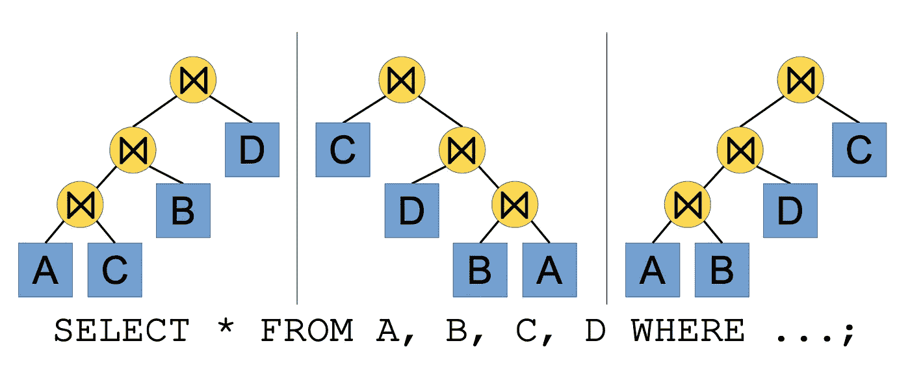
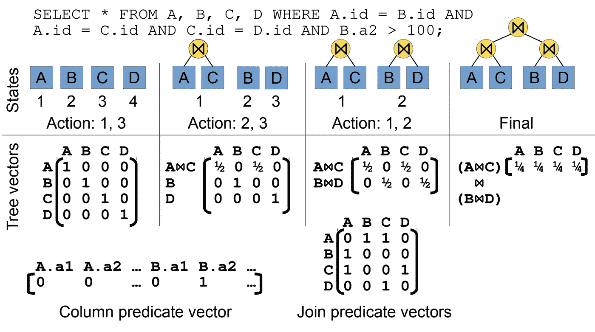
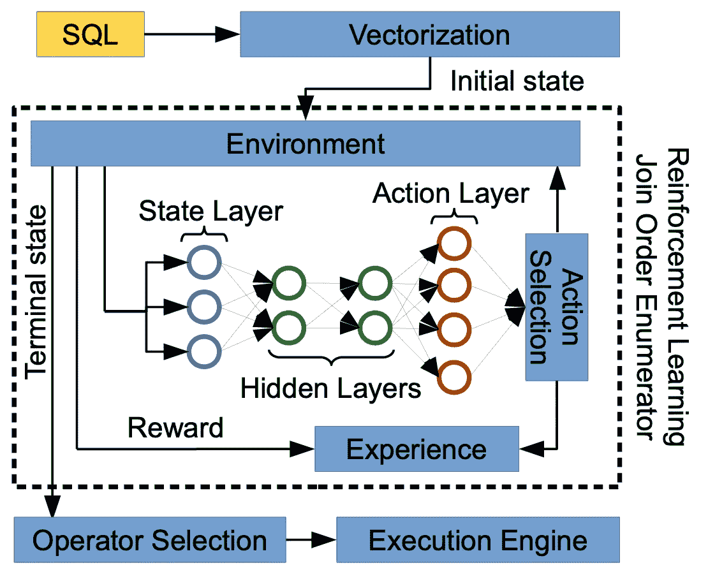
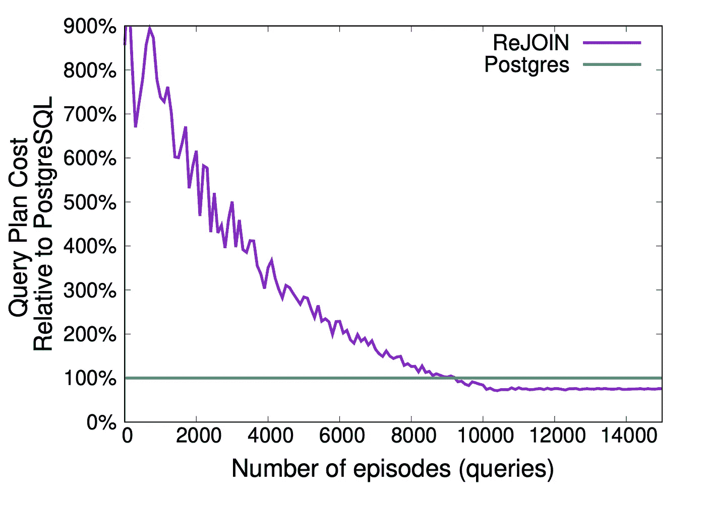
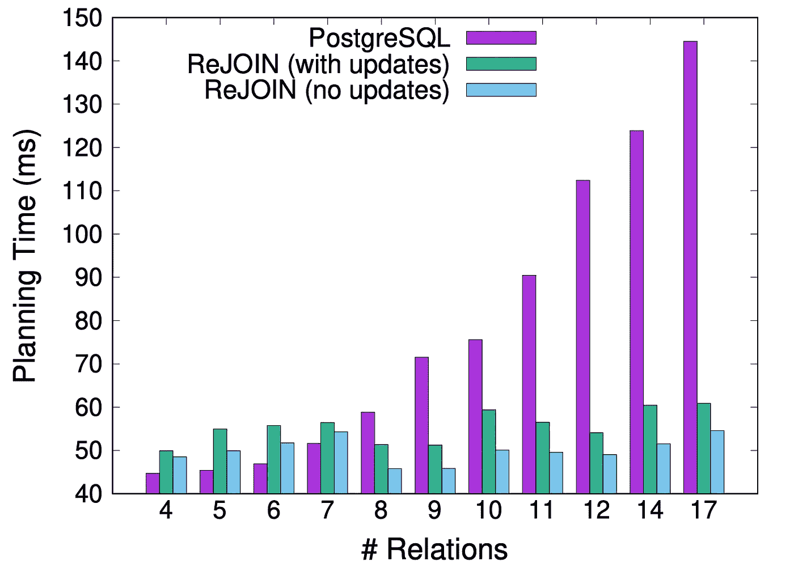

# 利用强化学习产生更好的连接排序策略

> 原文：<https://towardsdatascience.com/using-reinforcement-learning-to-produce-better-join-ordering-strategy-2fd2761ebf3a?source=collection_archive---------19----------------------->

## 我们可以训练一个 AI 模型来决定首先加入哪些表吗？

连接表格。由 [Unsplash](https://unsplash.com?utm_source=medium&utm_medium=referral) 上的 [chuttersnap](https://unsplash.com/@chuttersnap?utm_source=medium&utm_medium=referral) 拍摄

假设您在 RDBMS 上有以下查询:

> 从 A、B、C、D 中选择*

你是要先加入 *A* & *B* 再加入结果跟*C*&D 吗？还是先把 *A* & *C* 加入，再把结果用 *B* 加入，再把结果用 *D* 加入比较好？

今天我们将讨论一篇有趣的论文，作者是 Ryan Marcus 和 Olga Papaemmanouil，题目是“连接顺序枚举的深度强化学习”本文将机器学习世界与数据库世界交叉。他们试图训练一个强化学习代理来决定连接关系的顺序，即首先连接哪些关系(RDBMS 表)，接下来是哪些关系，等等。作为一个具体的例子，假设我们有四个关系 A、B、C 和 D。我们希望代理决定是加入 A & B，然后将结果关系加入 C 并最终加入 D，还是先加入 A & C，然后加入 B & D，然后加入两个结果关系，或者任何其他排序可能性。

连接排序策略是数据库查询优化的一部分，其目标是产生一个低延迟运行的物理查询计划。我们可以把这个问题看作是搜索所有可能的连接顺序并选择最便宜的一个。如果我们可以生成一个可以减少初始步骤中的行数的顺序，那么我们就可以省去后续步骤来联接最终将被丢弃的行。目前，DBMSs 使用试探法来决定连接顺序。System-R 使用动态规划寻找一个代价最低的左深树，而 PostgreSQL 使用贪婪算法选择一个代价低的对，直到构建出整个订单。然而，这些策略在某种程度上是静态的，并且数据库不从反馈中学习(例如，基数、查询延迟)。因此，他们可能会重复使用同样糟糕的连接排序策略。

# 重新加入枚举器

现在让我们来谈谈 ReJOIN，这是一个通过使用强化学习来枚举和选择连接顺序的解决方案。

## 强化学习

我们将把连接顺序枚举问题建模成强化学习问题。在强化学习中，我们训练一个与*环境*交互的*代理*。环境将告诉代理当前状态 *s* 以及在 = { *a₀、a₁、.。。，一个当前状态下可以拍的* }。然后，代理必须选择一个动作，并进入下一个状态，在该状态下，它将接收一组新的动作。代理反复执行这个过程，直到它到达一个*终端状态*，在这里没有更多的动作可用。此时，代理完成了一个*集*，并将根据其采取的行动获得*奖励*。代理的目标是通过从经验中学习来最大化回报。

## 将连接顺序问题映射到强化学习的术语

图 1:二元连接树(Marcus & Papaemmanouil，2018)

连接排序可以表示为一棵二叉连接树，如上图所示。为了采用强化学习来连接排序问题，我们将使用以下映射:

*   每个*状态*将代表一个二元连接树。然后，我们将这个二元连接树转换成一个状态向量，并添加更多的信息，如连接谓词和选择谓词。
*   每个动作代表将两个子树合并成一个树。
*   当我们已经加入所有关系时，一集*就结束了。*
*   *奖励*将基于结果连接排序的成本模型评估来计算。

## 状态向量

图 2:作为向量的状态表示(Marcus & Papaemmanouil，2018)

如前所述，我们将二叉连接树和进一步的连接信息表示为向量。我们将每个子树编码为大小为 *n* 的向量 *v* ，其中 *n* 是数据库中关系的总数。如果关系不在二元连接树中， *vᵢ* 的值为 0，并且 *1/h(i，x)* 其中 *h(i，x)* 是关系 *i* 在子树 *x* 中的高度(到根的距离)。例如，在图 2 的最左边，我们可以看到我们将子树 A 表示为[1 0 0 0],因为在这种情况下，关系 A 的高度为 1，其他关系不存在于子树中。在左起第二张图片上，假设我们连接了 *A* 和 *C* ，产生了新的关系 A ⨝ C。现在 A & C 的高度为 2，因此我们用 1/2 填充 A & C 列上的值。列 B 和 D 保持为 0，因为它们不在这个子树中。

此外，我们添加了连接谓词和列选择谓词向量。连接谓词将是一个 n×n 二进制矩阵 m，其中如果在和之间存在连接谓词，则 *m(i，j)* 的值将为 1，否则为 0。在图 2 中， *m(1，2)* = *m(2，1)* 的值是 1，因为我们在 A 和 B 之间有一个连接谓词(A.id == B.id)。 *m(1，3)* = *m(3，1)* 的值也是 1，因为我们在 A 和 C 之间有一个连接谓词( *A.id == C.id* )

列选择谓词是一个 k 维二元向量，其中 k 是所有关系的属性总数。如果我们在这个属性中有选择谓词，那么这个向量中的项的值将为 1，否则为 0。在图 2 中，B.a2 的值是 1，因为在 SQL 查询中，我们有一个选择谓词 *B.a2 > 100* 。

## 训练模型

图 3:重新加入的架构(Marcus & Papaemmanouil，2018)

我们通过寻找产生最高回报的优化策略来训练强化学习代理。我们通过训练神经网络来实现这一点，该神经网络将状态向量作为输入，并将动作向量作为输出。动作向量是一个保存了 *n* 个项目的向量，每个项目代表一个可能采取的动作。我们在中间放置了两个隐藏层。我们训练模型来优化产生高回报行动的权重。

ReJOIN 将前几集的信息记录为一对权重及其奖励 *(θ，r)* 。然后，它使用此信息中的样本来估计接下来事件的政策梯度。

## 结果

图 3:性能比较(Marcus & Papaemmanouil，2018 年)

上图显示了使用 PostgreSQL 和 ReJOIN 生成的计划执行查询的比较。作者通过使用连接顺序基准数据集和查询来执行这个基准测试。正如我们所看到的，最初，ReJOIN 给出了一个糟糕的执行计划(例如，比 PostgreSQL 差 9 倍)。在几千集之后，它开始实现与 PostgreSQL 相同的性能，并且在某个时候，开始产生更好的执行计划。

图 4:计划时间对比(Marcus & Papaemmanouil，2018)

本文的另一个极好的结果是，当我们向查询中添加更多的关系时，重加入的计划时间不会变长。在 PostgreSQL 的情况下，它花费更多的时间来计划更多关系的连接，因为可能的连接组合需要计算更多的成本。

你也可以在[这个库](https://github.com/antonismand/ReJOIN)中找到关于这篇论文的实现和扩展实验。

# 结论和公开挑战

这项研究显示了利用强化学习进行数据库优化的一些潜力。它显示了积极的结果，在某些查询上，该模型生成的连接顺序在执行性能和计划时间方面可以超过 PostgreSQL 生成的连接顺序。

然而，它花费了大量的片段(查询执行)来达到一个好的结果。然后，作者提出了未来研究的一些机遇和挑战，例如:

*   **使用实际查询延迟作为奖励**。目前提出的方法是使用成本模型作为奖励。成本模型支持快速训练，但也容易出错，因为实际的查询延迟可能与成本模型不一致。
*   **扩展优化器**。在查询优化的世界里，重加入只处理连接顺序问题。研究社区可以进一步研究在查询优化的其他方面应用类似技术的可能性，比如选择物理操作符、使用索引和合并谓词。

**参考文献:**

[1] Marcus，r .，& Papaemmanouil，O. (2018 年 6 月)。连接顺序枚举的深度强化学习。在*第一届利用人工智能技术进行数据管理的国际研讨会会议录*(第 3 页)。ACM。