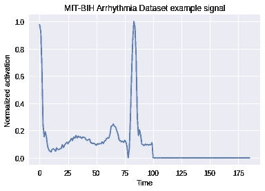
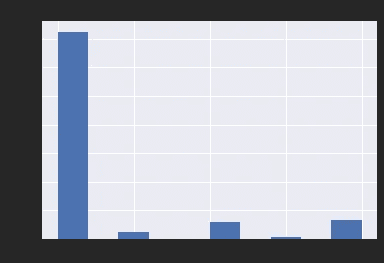
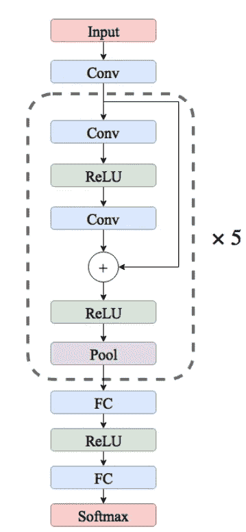
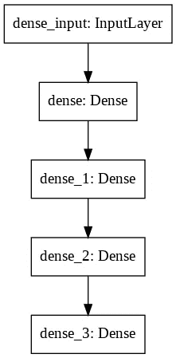
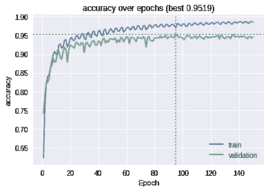
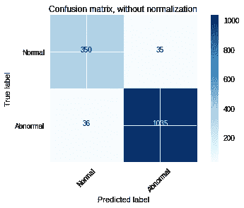
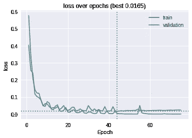

# 使用 ResNet 处理心电图时间序列数据

> 原文：<https://towardsdatascience.com/using-resnet-for-time-series-data-4ced1f5395e3?source=collection_archive---------24----------------------->

像普通 RNN 这样的递归神经网络或者像 LSTM 和 GRU 这样的更高级的模型曾经是深度学习实践者进入时间序列领域的 goto 模型。NLP 提供了丰富的序列数据，提供了一个自愿的对象。但是像伯特和 GPT 这样的变压器架构肯定已经占领了这个领域。除了这些变压器架构之外，CNN 还在时间序列领域取得了回归或进步。CNN 擅长模拟时间序列吗？

> CNN 在模拟时间序列方面有多好？

为了回答这个问题，这篇文章复制了一篇名为“*ECG heart beat class ification:A Deep Transferable re presentation*”[1]的文章，该文章将基于 CNN 的架构 ResNet 应用于心电图(ECG)数据。把迁移学习应用到这个问题上。

Keras 代码是以笔记本的形式提供的，可以很容易地用例如 Google Colab [在这里](https://github.com/spdrnl/ecg/blob/master/ECG.ipynb)执行。

# 这篇文章的概述

该职位的结构如下:

*   数据集简介
*   ResNet 简介
*   使用平原 MLP 和 ResNet 建立基线
*   运用迁移学习
*   讨论
*   结论

# 数据集简介

与原始研究相关的文章使用了两组心电图数据:

*   [麻省理工学院-BIH 心律失常数据集](https://www.physionet.org/physiobank/database/mitdb/)【2】
*   [PTB 诊断心电图数据库](https://www.physionet.org/physiobank/database/ptbdb/)【3】

(两个数据集都可以在 Kaggle 上获得，详情见笔记本。)

两个数据集都包含标准化的 ECG 信号。每次观察有 187 个时间步。在 2D 绘制的观察示例呈现:

观察值的 2D 表示

在最初的麻省理工学院-BIH 数据集中，每个观察值被分配了以下标签之一:

*   答:房性早搏
*   f:心室融合搏动
*   n:正常节拍
*   v:室性早搏)
*   n:正常窦性心律
*   室性心动过速

在 Kaggle 数据集中，这恰好是最初研究的来源，这些标签被融合成 5 个类别。数据集提供了长度分别为 87554 和 21892 的训练和测试数据集。不算太寒酸！

融合类别的分布

PTB 数据集(长度为 14552)仅将正常和异常标签分配给观察值；标签的分布如下所示。

PTB 数据集中标签的分布

在最初的研究中，适合麻省理工学院-BIH 数据集的模型权重被转移到 PTB 数据集。由于麻省理工学院-BIH 的数据集比 PTB 的数据集大得多，这可能是有意义的。

在复制开始之前，首先提供一个简短的 ResNet 刷新程序。

# ResNet 简介

ResNet 的目标是允许优化具有更多层的深层网络。为此，ResNet 引入了跳过连接。跳过连接是通过将信号从前面的层添加到后面的层来创建的。原文中提供了一个很好的例证:

研究的 ResNet 设置

这里发生了什么事？来自第一卷积层的信号被加到第一 ResNet 块中的第三卷积层的信号上。(注意，信号是在 ReLU 之前添加的。块末尾的池层严格来说不是 ResNet 块的一部分，它是特定于这个应用程序的。)

事实证明，增加这些跳跃连接可以实现深度学习网络。

关于卷积的一个注记。虽然输入数据是二维的，但它是一维的。因此，卷积也将是一维的；过滤器将从左向右移动。

让我们编码！

# 使用平原 MLP 和 ResNet 建立基线

在评估原始研究的迁移学习设置之前，首先在 PTB 数据集上拟合基线多层感知器(MLP)和没有迁移学习的 ResNet 模型。如果没有必要，为什么要把事情复杂化？有人可能会说深度学习模型本身就是一个复杂的问题。在这种情况下，有人会说神经网络很容易适应数据，给出了非常有效的实现。

基线 MLP 网络由 15、10 和 5 的 3 个隐藏 ReLU 层组成，后面是一个 sigmoid 激活层。Keras 制作了这个模型的图片:

克拉斯笔下的 MLP

MLP 几乎以 97.5%的训练准确度解析了训练数据。这大概是这种架构的最大可能。尽管使用了一些 L2 正则化，对训练数据的过拟合还是发生了，如下所示。

MLP 对训练数据的过度拟合

最终验证准确率为 95.2%，测试准确率为 95.1%。10%的小验证数据集似乎工作得很好。下面是使用测试数据生成的混淆矩阵。

MLP 模型的混淆矩阵

为了更好地测量，MLP 模型使用循环学习率进行优化，学习率使用学习率查找器进行估计。fast.ai 推广了这种做法。将这种做法应用于 SGD 和 Adam，这种设置的效果似乎提高了约 1%的准确性，即在验证数据集上从 93.7%提高到 94.7%。有趣到可以留到以后用。不幸的是，Keras 对这些工具的支持还没有标准化。

在 MLP 无法完全解析训练数据的情况下，ResNet 会像热刀穿过黄油一样处理数据。训练数据被完全解析，几乎验证数据也是如此。

ResNet 的损耗曲线

你肯定是在开玩笑吧，费曼先生？放大图的最后一点，由于验证损失增加，可以观察到一些过度拟合。

增加验证损失表明过度拟合

对于神经网络来说，解析训练数据集并不罕见，事实上这被认为是一个很好的开始实践。但是验证指标也非常好，准确率达到 99.7%。在讨论部分，产生了一个可以解释这些结果的假设。

# 运用迁移学习

对于迁移学习模型，ResNet 模型首先适用于更大的麻省理工学院-BIH 数据集。迁移学习设置很简单:最后完全连接的层在 PTD 数据集上重新训练。出于好奇，下面描述了实现这一点的代码片段。

Keras 中的迁移学习

使用汇总功能，可以验证可训练参数的数量已经显著减少。

可训练参数减少

在麻省理工学院 BIH 分校上的结果很好，准确率达到 98.5%。应用迁移学习后，在 PTB 数据集上的测试准确率达到 96.4%。原始论文报告迁移学习后的准确率为 95.9%，这些数字大致相同。

# 讨论

虽然这很有诱惑力，但在 PTB 数据集上没有迁移学习的 ResNet 的最初几乎完美的验证和测试分数应该非常谨慎地解释。对这些分数的合理解释可能是，由于训练、验证和测试集的随机化，网络实际上记住了样本所来自的人的心电图模式。处理这个问题的正确方法是确保验证和测试集中的数据不包含来自训练数据中存在的人的数据。在这个装置中，对人的概括被积极地测试。然而，造成这种情况的特征在数据中并不存在。

麻省理工学院-BIH 数据集上的 ResNet 结果没有证实这一假设:测试集上的准确率为 98.5%。即使对于倾斜的类，这也是一个非常好的结果。请注意，该模型必须预测 5 个类别，而不是 2 个，这是一项更困难的任务。

所使用的数据心电图是高度周期性的，幸运的是！这使得时间序列可以被格式化成更小的“瓦片”,在这些瓦片中可能存在与众不同的心脏活动模式。直觉上，CNN 网络非常适合这种环境。

就迁移学习而言，迁移学习能提高成绩的假设不无道理。潜在的假设是，构成信号形状的基本分量在具有不同标签的信号中是共享的。在这种情况下，结果并没有证实它的用途。通过在网络的末端重新训练更多的层，通过一次一步地将层的权重设置为可训练的，可以改善结果。

没有与 LSTM 或 GRU 的网络进行比较；这可能是以后的主题。

# 结论

虽然可能有一些方法上的缺陷进入了这一重复研究，但将 CNN 应用于时间序列的案例已经提出。对于心电图数据，搜索的是一组重复信号的重复模式:这正是 CNN 网络所擅长的。

# 参考

[1] Kachuee，m .，Fazeli，s .，Sarrafzadeh，m .:心电图心跳分类:一种深层次的可转换表示法。In: 2018 IEEE 医疗保健信息国际会议(ICHI)。第 443-444 页。IEEE (2018)。

[2]穆迪 GB，马克 RG。麻省理工学院-BIH 心律失常数据库的影响。医学和生物工程 20(3):45–50(2001 年 5-6 月)。

[3] Bousseljot R，Kreiseler D，Schnabel，a . EKG 的神经病学-信号数据库生物医学技术，40 级，ergnzungsband 1(1995)S 317。