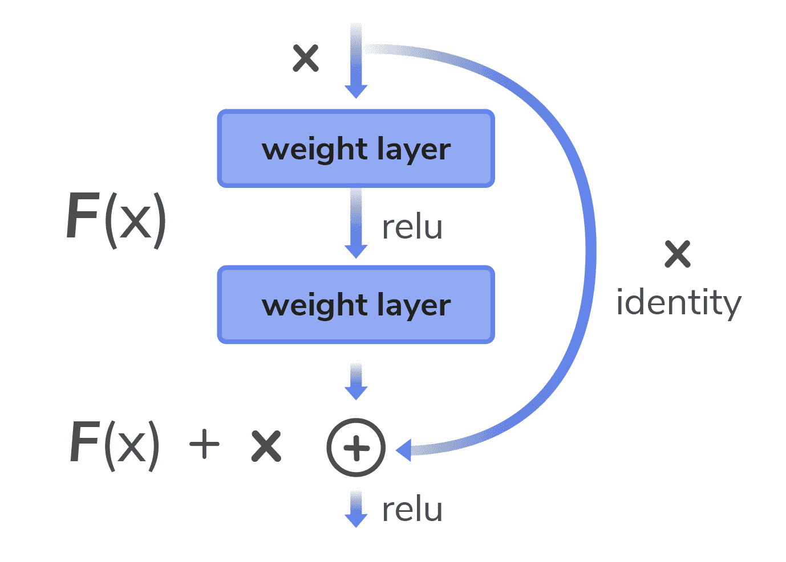
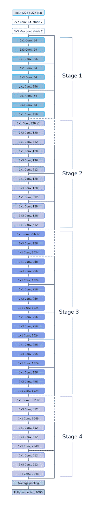
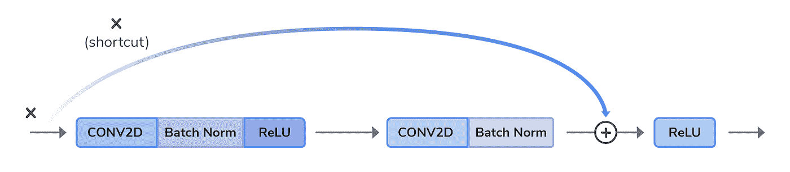
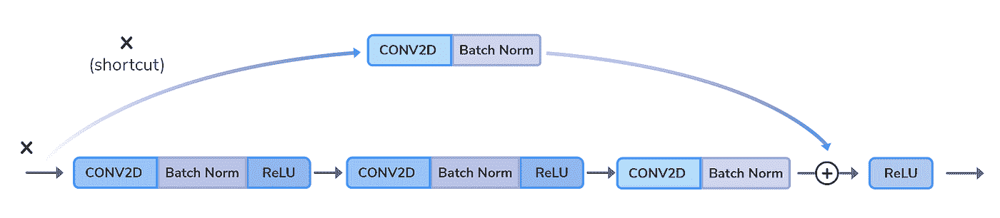
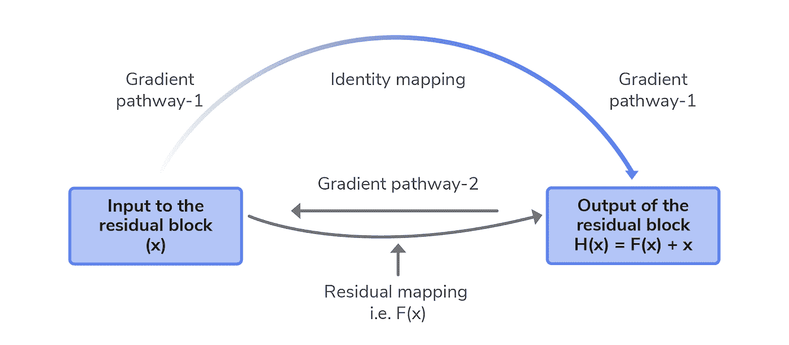
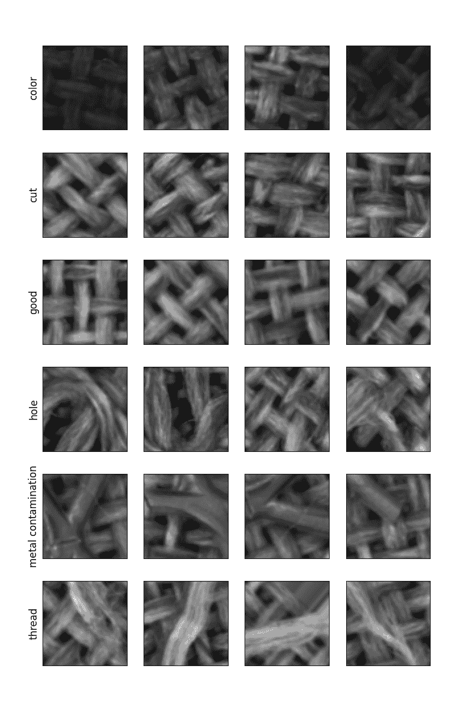
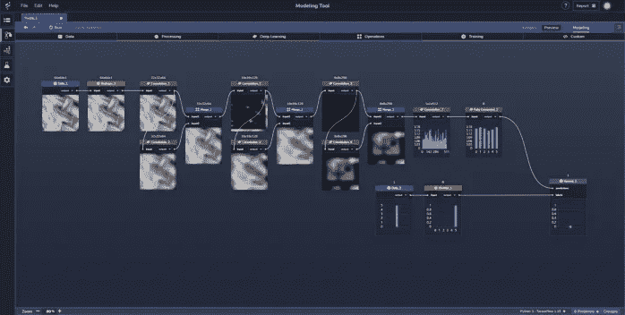

# 使用 ResNets 检测工业物联网纺织品生产中的异常

> 原文：<https://towardsdatascience.com/using-resnets-to-detect-anomalies-in-industrial-iot-textile-production-42da77d49ad2?source=collection_archive---------41----------------------->

用于图像分类的机器学习模型通常使用[卷积神经网络](https://en.wikipedia.org/wiki/Convolutional_neural_network)(CNN)从图像中提取特征，同时采用[最大池](https://computersciencewiki.org/index.php/Max-pooling_/_Pooling)层来降低维度。目标是从图像区域中提取越来越高级的特征，最终进行某种预测，例如图像分类。

为了提高精度，简单地向网络添加更多的层是很有诱惑力的。然而，研究表明，添加太多的层会增加训练时间，甚至导致精度下降。

在这篇博客中，我们将深入探讨为什么深度神经网络会出现这种情况，如何解决这个问题，并以一个工业物联网用例为例，看看如何在感知实验室中构建一个更有效的模型。

**消失的渐变问题**

影像分类模型通常使用一系列相互反馈的层来实现其目标，其中额外的层可以提高最终分类的准确性。然而，添加太多的层会导致反向传播期间的*消失梯度*问题，其中损失函数的越来越小的梯度导致对权重的更新变得越来越小，直到它们趋向于零。这反过来会导致上面提到的培训问题。

**拯救残余网络**

克服这个问题的一种流行方法是合并残差块，它们共同形成一个*残差网络* ( *ResNet)* 。残差块通过引入早期层跳过未来层的架构模式解决了这个问题。这些“跳过连接”通常通过一个*加法*操作来实现，由此，在一些卷积层之后，来自网络中较早的特征被添加到新计算的特征，如下所示:

*图 1:残差块的概述。形象由* [*感知力*](http://www.PerceptiLabs.com) *灵感* [*来源*](https://adventuresinmachinelearning.com/introduction-resnet-tensorflow-2/) *。*

跳跃连接为梯度在反向传播期间的流动提供了额外的、更短的路径，并且经验表明这使得更深的计算机视觉网络能够更快地训练。

残差块的工作方式如下:

*   输入张量 X 流向 ResNet 块，并沿两条路径向下流动。
*   x 通过卷积层(如图 1 *权重层*所示)沿主路径向下流动，就像在普通 CNN 中一样，这通常被称为*卷积块*。结果输出近似于函数 F(x)。
*   X 还流经跳过连接，也称为*身份* *块*，因为它只是转发 X，同时保留其维度。
*   F(x)和 X 然后被加在一起，然后被发送到激活函数(在这个例子中是 [ReLU](https://en.wikipedia.org/wiki/Rectifier_(neural_networks)) )。

如下面图 2 中的*所示，残差块通常被“链接”在一起以形成 ResNets。来自最终残差块的输出与来自最终跳过连接的输出一起被组合，然后被传递到其他类型的层(例如，平均池和[完全连接层](https://en.wikipedia.org/wiki/Convolutional_neural_network#Fully_connected))用于分类:*

*图 2:50 层 ResNet 模型示例。形象由* [*感知力*](http://www.PerceptiLabs.com) *灵感* [*来源*](https://adventuresinmachinelearning.com/introduction-resnet-tensorflow-2/) *。*

在用于图像分类的典型 CNN 中，较早的层通常学习较低级别的抽象(例如，线、角等。)，而后续层学习更高级别的抽象(例如，形状组等)。).通过使用跳过连接，我们允许梯度通过网络，而不需要通过激活函数。这有助于网络将信息传递给网络中的后续层，使它们能够学习复杂的特征，而没有梯度消失的风险。

图 3 描绘了 ResNet 块对图像分类模型的应用:

*图 3:由使用卷积和批量归一化计算的两层组成的 ResNet 块的示例。在此示例中，在通过 RelU 生成标识块(x)的激活之前，通过 skip 连接将 ResNet 块的输出添加到标识块(x)。当输入与输出激活具有相同的维度时，可以使用这种架构。图片由* [*感知*](http://www.PerceptiLabs.com) *灵感* [*来源*](https://adventuresinmachinelearning.com/introduction-resnet-tensorflow-2/) *。*

注意，在某些情况下，可以用*卷积*块代替*恒等*块，例如当输入和输出尺寸不同时:

*图 4:ResNet 块的例子，其中输入和输出具有不同的维度。在这种情况下，在生成卷积块(x)的激活之前，ResNet 块的输出通过 skip 连接被添加到卷积块(x)。形象由* [*感知器*](http://www.PerceptiLabs.com) *灵感* [*来源*](https://adventuresinmachinelearning.com/introduction-resnet-tensorflow-2/) *。*

由于残差块，梯度现在可以在通过两条路径的反向传播期间流回网络:

*图 5:示出了梯度在反向传播期间可以流经的两个路径的图。形象由* [*感知力*](http://www.PerceptiLabs.com) *灵感* [*来源*](https://adventuresinmachinelearning.com/introduction-resnet-tensorflow-2/) *。*

当梯度流回穿过*梯度路径-2* 时，残差块中的权重层(在图 5 中表示为 F(x ))被更新，并且新的梯度值被计算。随着梯度继续流过较早的残差块，它将继续减小(即，趋向于 0)。但是，梯度也会流回跳过连接，从而完全避开残差块中的权重层，因此将保留其值。这允许保持完整的渐变值传播回早期层，允许它们学习激活，从而避免渐变消失的问题。

**将 ResNets 应用于工业物联网应用**

图像分类技术对于计算机视觉问题特别有用，例如在工业物联网(例如，制造业)中遇到的那些问题。

为了说明这一点，我们在 GitHub 上整合了一个[纺织品分类项目](https://github.com/PerceptiLabs/Textile-Classification)。该项目以 72000 幅纺织纤维的特写图像作为输入，每幅图像包含六种可能的制造分类之一(例如，颜色问题、织物切割等)。)，以及每个图像的相应分类:

*图 6:具有各种类型制造分类的纺织织物图像示例。其中五个代表异常，而“良好”分类意味着在图像中没有发现问题。图像由***感知。**

*项目中的示例 PerceptiLabs 模型包含三个 ResNet 块，每个 ResNet 块对图像进行卷积以提取特征，并包含直接按原样转发每个块的输入(即，作为标识块)的跳过连接。使用配置为应用*加法*操作的*合并*组件，将其添加到块的输出:*

**

**图 7:感知实验室中的纺织品图像分类模型概述。图像由***感知。***

**该项目展示了这种模型如何用于工业物联网的质量控制。例如，相机可以在制造过程中随机拍摄织物的特写照片，然后将它们呈现给模型以进行异常检测。**

**最重要的是，这个项目展示了在 PerceptiLabs 中构建 ResNet 块是多么容易。**

****结论****

**具有大量层的神经网络容易遭受*消失梯度*问题，由此在反向传播期间梯度趋向于零。由于梯度值如此之小，网络中位于较早位置的层可能很少更新或根本不更新其激活，从而导致训练速度变慢、停止，甚至失去其准确性。**

> **ResNet 块是这个问题的一个很好的解决方案，因为它们允许你使用大量的层，最重要的是，它们很容易在 PerceptiLabs 中构建。**

**因此，要想知道这有多简单，请务必查看我们在 GitHub 上的[纺织品分类项目](https://github.com/PerceptiLabs/Textile-Classification)。一如既往，我们希望您能参与我们的[社区频道的讨论。](https://www.perceptilabs.com/community)**