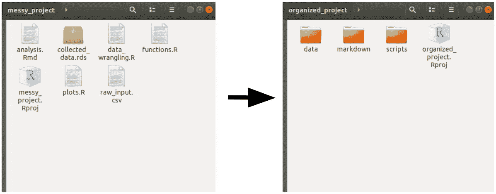
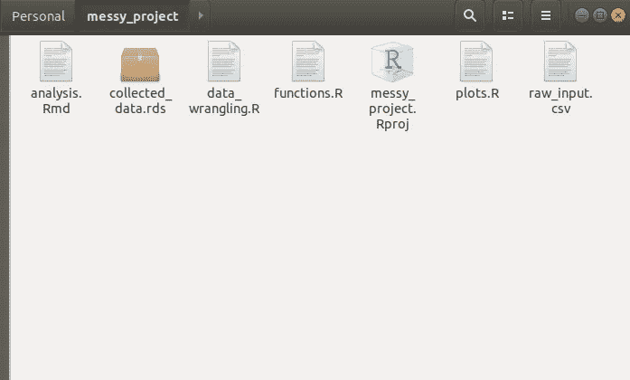

# 使用 RStudio 项目模板帮助数据科学团队实现项目标准化

> 原文：<https://towardsdatascience.com/using-rstudio-project-templates-to-help-the-project-standardization-in-data-science-teams-a963db12abac?source=collection_archive---------45----------------------->

## 改善数据科学中的团队协作和项目标准化


[斯科特·格雷厄姆](https://unsplash.com/@sctgrhm?utm_source=medium&utm_medium=referral)在 [Unsplash](https://unsplash.com?utm_source=medium&utm_medium=referral) 上拍照

数据科学领域的许多工作仅仅依靠数据科学家/分析师来保证项目的标准化和代码的可复制性；不幸的是，这变成了混乱/混乱的来源，因为每个人(即使在同一个团队)都有不同的工作策略。为了帮助确保团队共享相同的项目标准，RStudio 提供了一种 cookiecutter，您可以在其中开发(以包的形式)许多模板，供同一团队的用户共享。



# 项目模板背后的故事

最近的研究旨在为社会提供方法，帮助用户更好地理解和组织他们的项目、数据和从这些数据中产生的见解。从 [CRISP-DM](https://en.wikipedia.org/wiki/Cross-industry_standard_process_for_data_mining) 一直到[团队数据科学流程](https://docs.microsoft.com/en-us/azure/machine-learning/team-data-science-process/overview)，经过 [KDD](https://en.wikipedia.org/wiki/Data_mining#Process) ，我们经历了许多方式来增强我们在团队中的工作能力，共同努力以更快的速度和更高的可重复性获得所需的洞察力。

尽管如此，这个过程会重复无数次，并且回过头来重新开发一个洞察力，或者重新训练一个模型的过程会变得很有挑战性，因为很久以前编写的代码不容易获得，并且可能很难理解几周/几个月/几年前开发这个项目的整个过程。

一些项目可能看起来像这样:



代表无组织方式存储数据和代码的图像

即使只是打开一个存储库，把脚本、文件、函数。gitignores 和任何类型的文件需要交付一个[闪亮的](https://shiny.rstudio.com/)网页或机器学习模型，或某种分析，这个过程缺乏创建代码和过程的能力，这些代码和过程可以被将来可能被分配到这个项目的任何其他人理解。

因此，这个 RStudio 项目模板旨在帮助用户在开始项目时创建某种模式，帮助团队标准化项目组织，以便每个人都可以轻松地被分配到一个项目，并了解那里发生了什么。

也许，把项目变成这样:

```
-- project_directory/
 | -- data/
    | -- raw/
    | -- reference/
    | -- processed/
 | -- scripts/
    | -- modelling/
    | -- analysis/
    | -- production/
 | -- markdown/
 -- .gitignore
 -- project_directory.Rproj
```

# 创建新的 R 包

项目模板可用于创建具有预先指定结构的新项目，创建这些项目模板的一种方法是创建 R 包，这将允许用户与任意多的用户共享其模板。

R 包的创建过程(相当简单)非常简单。 [Hadley 的 R 包指南](http://r-pkgs.had.co.nz/)涵盖了创建包过程中的许多注意事项。但是由于我们的包将只包含一个函数，它不应该需要开发一个更健壮的包所涉及的复杂性。

从项目的菜单中创建一个 R 包很容易，应该让用户看到一个样例包，它包含 R 包结构、`hello.R`函数和一些其他文件。第一步是删除位于`R/`的`hello.R`文件和位于`man/`的`hello.Rd`文件。之后，我们从一个干净的包开始，第一步是创建我们的函数。

# 创建将创建模板的函数

为了“创建模板”,我们必须指示 R 将如何处理它，以及当我们在新的项目菜单中提供这个函数时，它将如何表现。因此，这个函数采用一个强制参数，另一个是附加参数，可以帮助您的项目创建工具的逻辑。第一个参数将始终是这个新项目的路径，因为它也将创建一个. RProj 文件，它将驻留在一个新文件夹中。该函数的其他参数作为`...`传递，可以在代码中用它们的名字调用它们，或者将它们分配给`dots <- list(...)`。

我们的函数将执行一些任务，显示一些可以嵌入到项目创建模板中的特性。它将:

*   用`writeLines()`创建一个 README.md 文件；
*   如果一个复选框被选中，它将创建一个`.gitignore`文件；
*   给定来自用户的选定输入，创建具有特定名称的文件夹；

为了创建一个函数，并确保`roxygen2`可以解释它，并导出应该由最终包导出的函数，我们将根据下面的语法编写函数。

```
#' This package will create a function called create_project()
#'
#' It's callback is at: inst/rstudio/templates/project/create_project.dcf
#'
#' @exportcreate_project <-
function(path, ...) {# Create the project path given the name chosen by the user:
dir.create(path, recursive = TRUE, showWarnings = FALSE)# Change the working directory to the recently created folder:
setwd(file.path(getwd(), path))# Collect the list of inputs in a list to be called later:
dots <- list(...)# In the project template we've added 2 choices for the user:
# * One allows them to select if the project will have a .gitignore file
# * The other will create a folder, given a select input from the user# Check .gitignore argument
if(dots[["createGitignore"]]) {
git_ignores <-
c(
'.Rhistory',
'.Rapp.history',
'.RData',
'.Ruserdata',
'.Rproj.user/',
'.Renviron'
)writeLines(paste(git_ignores, sep = '\n'), '.gitignore')
}# Check selected folder
if(dots[["folder"]] == "Production"){
dir.create("production", recursive = TRUE, showWarnings = FALSE)
} else {
dir.create("development", recursive = TRUE, showWarnings = FALSE)
}}
```

# 创建`.dcf` 文件

创建了函数文件后，下一步是创建`.dcf`文件。这个文件负责创建用户将与之交互的框。除了用户将要输入的路径，您还可以创建任意数量的复选框/文本输入/选择输入，以便向最终用户授予定制权限。对于我们的项目，我们将创建一个复选框，以便用户可以决定是否创建`.gitignore`文件和一个选择输入，以便用户可以定义项目的范围(开发或生产)；

> *本解决方案(开发或生产)仅用于说明目的，并不反映项目的任何实际状态。*

必须在文件夹`inst/rstudio/templates/project`中的包内用您选择的名称创建`.dcf`文件，它应该遵循下面的语法:

```
Binding: create_project
Title: My First Project Template
OpenFiles: README.md
# In the project you can also add icons (the icon should be a PNG, smaller than 64kb
# and in the inst/rstudio/templates folder
# Icon: name_of_pic.pngParameter: folder
Widget: SelectInput
Label: Choose the scope of the project
Fields: Production, Development
Default: Production
Position: leftParameter: createGitignore
Widget: CheckboxInput
Label: Create .gitignore
Default: On
Position: right
```

# `devtools::document() + devtools::install()`

现在我们的包结构已经创建好了，我们可以使用`devtools::document()`函数来创建它的文档页面。尽管这个包主要是作为 RStudio 的一个插件开发的，但是在将它安装到 R 中之前，最好对它进行文档化，因为它会搜索项目运行所需的任何依赖项和包。

通过运行`devtools::install()`函数，在我们的包中，我们将安装它，并从现在开始使它在任何其他 R 会话中可用。这应该足以使 RStudio 可以将外接程序作为新的项目模板进行访问。

之后，您的项目模板应该可以在 RStudio 的项目列表中找到。如果您想了解更多关于调整您的项目模板并增加更多可定制性的不同功能，请查看 [RStudio 项目模板](https://rstudio.github.io/rstudio-extensions/rstudio_project_templates.html)页面。

# 结论

鉴于数据科学的最新发展及其与软件工程技术的集成，团队内标准化项目的需求变得很方便，以确保每个人都能理解，并被他们的搭档理解。这允许更快地调试项目，并减少了遗留代码的缺点，这些代码是同一个团队中的人无法理解的。当然，这个特性本身不会帮助记录代码，或者标准化编写 R 脚本的方式(请参考[tidy verse 风格指南](https://style.tidyverse.org/))，但是它是一个工具，可以帮助用户创建关于项目管理的模式。

查看托管本文中使用的代码的 [GitHub 页面](https://github.com/paeselhz/rstudioProjectTemplate)，如果您想尝试这个例子，可以克隆这个库，或者通过运行:`devtools::install_github('paeselhz/rstudioProjectTemplate')`将其安装在 R 中。