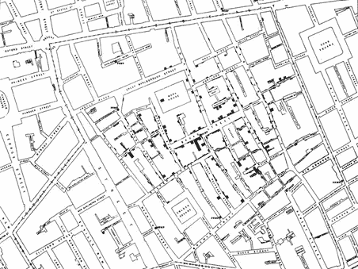
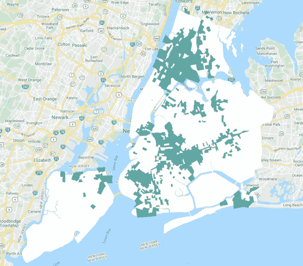
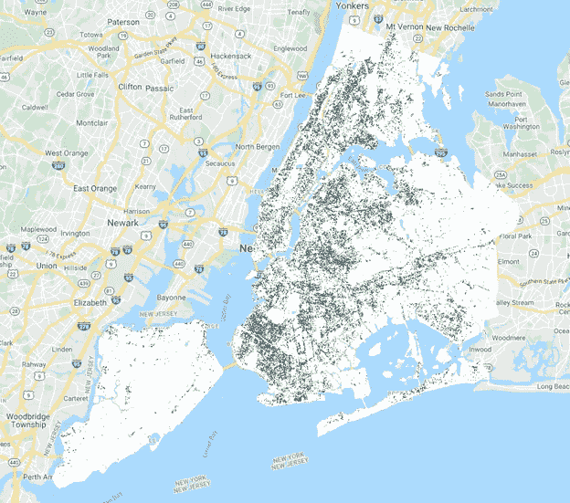
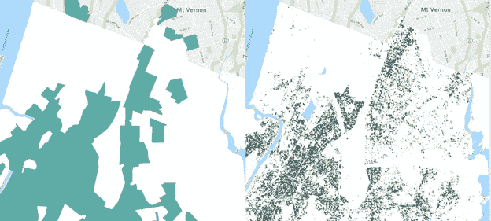
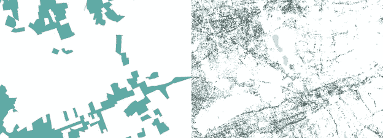
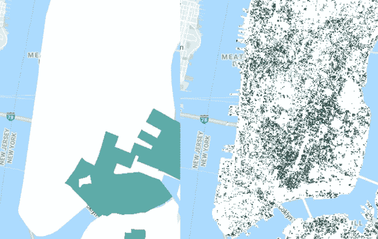

# 利用卫星描绘纽约市的经济机会

> 原文：<https://towardsdatascience.com/using-satellites-to-map-economic-opportunity-in-new-york-city-3059aece5404?source=collection_archive---------64----------------------->

## 纽约市高低经济机会的光谱特征初探。

纵观历史，纳入空间背景的数据揭示了在不断增加的海量数据中不可见的变革性见解。在 19 世纪中期的英国，一位名叫约翰·斯诺的医生因追踪 1854 年伦敦霍乱爆发而闻名。斯诺以绘制霍乱病例地图并展示其在城市水井周围的聚集而闻名——他认为霍乱是通过受污染的水源传播的，而不是像当时普遍认为的那样通过“不良空气”传播的。由于 Snow 的空间数据工作，公共卫生政策和实践在霍乱的检测和缓解方面取得了进展。在新冠肺炎指数感染全球数百万人的时候，似乎应该记住斯诺的经典著作。

霍乱病例地图。来源:[《论霍乱的传播方式》](https://archive.org/details/b28985266/page/n57/mode/2up)约翰·斯诺著，检索自[维基百科](https://en.wikipedia.org/wiki/John_Snow#/media/File:Snow-cholera-map-1.jpg)。

作为洛克菲勒基金会的一名空间数据科学家，我使用卫星和地理参考数据集来获得关于跨景观的模式和关系的见解，这是受雪的启发。洛克菲勒基金会和我们在股权和经济机会方面的工作感兴趣的一个主题是[机会区](https://www.irs.gov/newsroom/opportunity-zones-frequently-asked-questions) (OZs)，这是官方指定的经济困难社区，作为备受讨论的 2017 年减税和就业法案的一部分，投资者可以获得特殊的税收减免。如果人口普查区的个人贫困率至少为 20 %,家庭收入中位数不超过该地区中位数的 80 %,并且州政府从所有合格的人口普查区中选择一部分人口普查区，那么这些人口普查区就有资格获得 OZ 地位。今年早些时候，我们的团队询问是否有可能使用卫星图像来识别纽约市的机会区域。这个问题的核心是一个更深层次的问题:*在高收入和低收入地区，我们的建筑环境中是否有独特的特征和模式？*换句话说，*高收入地区和低收入地区之间是否存在空间和光谱上截然不同的特征？*

我们假设，是的，低收入和高收入地区之间确实存在显著的特征和模式，这将有助于不同的光谱特征，并决定在纽约市测试这一假设。在多项研究中，研究人员发现，纽约市和美国 T2[不同地区的经济状况(以及其他社会经济因素)可以使用谷歌街景图像进行统计评估。虽然卫星图像是从上面捕捉的，分辨率低得多——通常捕捉地面上几十平方米的像素——但其他研究人员发现，卫星测量的夜光](https://www.nber.org/papers/w21778)[可以解释发展中地区高达 75%的经济成果](https://science.sciencemag.org/content/353/6301/790?casa_token=Fbsw7df4U7wAAAAA:mzxwPw3NbkQtx2Pq6J-tDxVTngl-BjGxZbCi065oCieansI-M8ya8BAkcKhZy_Fnvr7RSdxVvnCeiA)。我们还认识到，卫星数据对于捕捉机会区域并不完美，因为它是栅格类型(或多或少是连续的)数据源，而人口普查边界是矢量类型(多边形),可捕捉指定区域内不同社会经济因素的平均值；我们并不期望在卫星数据中找到完美的边界框，而是簇的梯度显示或多或少可能是机会区域的区域。

作为我们的遥感负责人，我首先使用中位数家庭收入百分比和个人贫困率百分比确定了 2011 -2015 年期间纽约市内符合 oz 资格的所有人口普查区域——总共 806 个。在这项工作中，所有符合条件的人口普查区域*都被视为机会区，并在下方以深绿色显示在纽约市边界上方，以白色显示。然后，我使用谷歌地球引擎，用 Sentinel-2(一颗中等分辨率的公共卫星，每 10 天重复一次)为 2016 年的纽约市创建了一张合成的镶嵌图像。请注意，2016 年是 Sentinel-2 影像与所使用的 2011-2015 年人口普查数据最接近的一年。为了做到这一点，我提取了纽约市地区 2016 年全年的所有图像(总共超过 500 张图像)，并通过过滤云来处理每张图像，然后在所有重叠图像的每个波段的每个像素处取平均值。这个过程产生了一组相邻的图像，每个波段中的每个像素都包含 2016 年的平均反射率值，然后我将它们拼接在一起，创建了一个单一的图像。这种合成使数据集正常化，并使季节变化以及云覆盖的差距均匀化。*

有资格成为机会区的人口普查区域以绿色显示，覆盖在白色的纽约市上。

再次使用 Earth Engine，我使用 60，000 个点(代表不到 1%的可能像素)训练了随机森林分类器和最大熵分类器，这些点是使用 oz 和非 oz 的普查几何从合成 Sentinel-2 图像中提取的。我将这些分类器应用于整个合成图像，以将每个像素分类为 OZ 或 non-OZ，然后使用多数投票(一致)将两者组合成一个集成。生成的分类器如下所示，深绿色显示分类为 OZ 的像素，白色显示非 OZ。

集合 OZ 分类器，其中绿色分类为可能是 OZ，而白色分类为可能不是 OZ。

概括地说，这个模型比 random 要好，在 Bronx 和东布鲁克林表现得特别好，这两个地区的剪辑如下所示。我们第一个问题的答案是肯定的，纽约市的高收入和低收入地区有不同的共享光谱特征。很明显，拥有大量植被的区域往往被归类为非机会区域(公园是白色块证明了这一点)，而拥有大量水泥和沥青的区域往往被归类为机会区域(深绿色的主要道路证明了这一点)。

布朗克斯:左边是 OZs，右边是 Classifier。

东布鲁克林和皇后区:左边是 oz，右边是 Classifier。

很明显，拥有大量植被的地区往往被归类为非 OZ(公园是白色块证明)，而拥有大量水泥和沥青的地区往往被归类为 OZ(深绿色的主要道路证明)。然而，这些并不是唯一的驱动因素——否则，机场周围的区域将由于跑道而被完全归类为机会区域。因为对这种分类最重要的光谱带是红色、近红外和短波红外，所以植被、人造材料类型以及水和湿气积累可能起了重要作用。同样可能的是，某些类型的屋顶、街道的宽度和经常在街道上行驶的汽车数量也对分类有很大的影响。随着纽约市的街区继续中产阶级化，建筑物在新的发展时期之前被重新规划，过渡中的区域很可能提供混合的光谱特征。曼哈顿下城就是一个例子:虽然生活成本在过去几十年里飙升，但新建筑很少，改建的旧建筑受到青睐。分类器在曼哈顿下城的表现特别差，可能就是因为这个原因。

曼哈顿下城:左边是真正的 OZs，右边是分类器。

这项工作仍处于早期阶段，但它支持这样的假设，即存在与卫星可观测的经济机会相关的不同光谱特征的空间模式。卫星数据可能是一种有价值的工具，可用于以高分辨率了解经济机会、追踪某些类型的中产阶级化，以及以低成本和跨时间总体了解整个城市的社会阶层状况。随着新冠肺炎对纽约市的毁灭性影响，这种卫星地图的潜在用途已经成为前沿。在疫情早期就很清楚，低收入家庭更有可能生病，但也更有可能遭受严重的医疗并发症，从长远来看，更有可能受到不利影响。其他博客、文章和媒体来源已经利用公开的[纽约市健康数据](https://www1.nyc.gov/site/doh/covid/covid-19-data.page)将病例与邮政编码联系起来，对此进行了广泛的研究(尽管许多研究人员没有按照人口对邮政编码数据进行标准化)，我在这里不会深入研究这些趋势。展望未来，当我们学习减轻新冠肺炎时，高分辨率制图工具在选择测试地点或弹出式诊所方面可能是无价的。本着 John Snow 的精神，洛克菲勒基金会的数据科学团队致力于探索数据科学在现实世界问题中的这些新颖应用，以实现高效的社会变革。