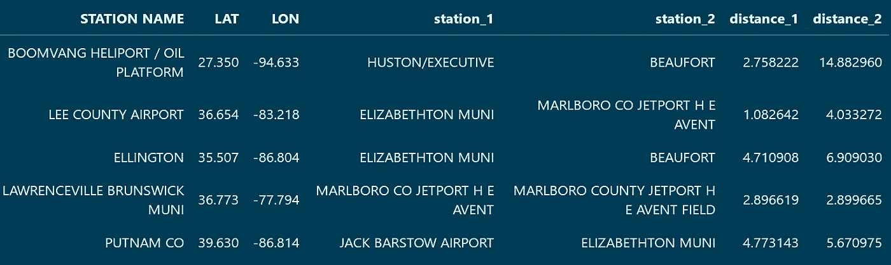
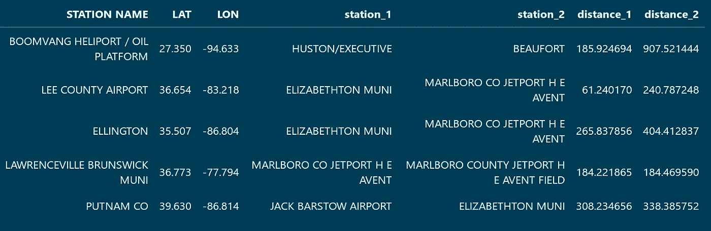

# 使用 Scikit-learn 的二叉树有效地查找经纬度邻居

> 原文：<https://towardsdatascience.com/using-scikit-learns-binary-trees-to-efficiently-find-latitude-and-longitude-neighbors-909979bd929b?source=collection_archive---------4----------------------->

## 在不破坏 Python 解释器的情况下将多组 GPS 坐标连接在一起


图片由[穆罕默德·哈桑](https://pixabay.com/users/mohamed_hassan-5229782/)来自 [Pixabay](https://pixabay.com/illustrations/car-trip-road-trip-travel-map-3880508/)

来自纬度和经度数据的工程特征看起来像是一项杂乱的任务，可能会诱使新手创建自己的 [***应用函数***](https://pandas.pydata.org/pandas-docs/stable/reference/api/pandas.DataFrame.apply.html) (或者更糟:一个巨大的 [**for 循环**](https://www.w3schools.com/python/python_for_loops.asp) )。然而，这些类型的 [***强力***](https://www.freecodecamp.org/news/brute-force-algorithms-explained/) 方法是潜在的陷阱，当数据集的大小增加时，这些陷阱会很快暴露出来。

例如:假设您有一个包含 *n* 项的数据集。将这些 *n* 项与 *n-1* 其他项进行显式比较所需的时间基本上接近 *n* 。这意味着数据集中的行每增加一倍，查找所有最近邻的时间就会增加 4 倍！

幸运的是，你不需要计算每个点之间的距离。在[***scikit-learn***](https://scikit-learn.org/)中有一些数据结构可以有效地确定邻居权限，这些数据结构利用了 [***优先级队列***](https://algs4.cs.princeton.edu/24pq/) 的力量。

它们可以在邻居模块 中找到 [**，本指南将向您展示如何使用这些难以置信的类中的两个来轻松解决这个问题。**](https://scikit-learn.org/stable/modules/neighbors.html#nearest-neighbor-algorithms)

# 入门指南

首先，我们加载库。

```
import numpy as np
from sklearn.neighbors import BallTree, KDTree# This guide uses Pandas for increased clarity, but these processes
# can be done just as easily using only scikit-learn and NumPy.
import pandas as pd
```

然后我们将根据从[](https://www.ncdc.noaa.gov/data-access/land-based-station-data)****国家海洋和大气管理局公开获得的气象站位置制作两个样本数据框架。****

```
# Column names for the example DataFrame.
column_names = ["STATION NAME", "LAT", "LON"]# A list of locations that will be used to construct the binary
# tree.
locations_a = [['BEAUFORT', 32.4, -80.633],
       ['CONWAY HORRY COUNTY AIRPORT', 33.828, -79.122],
       ['HUSTON/EXECUTIVE', 29.8, -95.9],
       ['ELIZABETHTON MUNI', 36.371, -82.173],
       ['JACK BARSTOW AIRPORT', 43.663, -84.261],
       ['MARLBORO CO JETPORT H E AVENT', 34.622, -79.734],
       ['SUMMERVILLE AIRPORT', 33.063, -80.279]]# A list of locations that will be used to construct the queries.
# for neighbors.
locations_b = [['BOOMVANG HELIPORT / OIL PLATFORM', 27.35, -94.633],
       ['LEE COUNTY AIRPORT', 36.654, -83.218],
       ['ELLINGTON', 35.507, -86.804],
       ['LAWRENCEVILLE BRUNSWICK MUNI', 36.773, -77.794],
       ['PUTNAM CO', 39.63, -86.814]]# Converting the lists to DataFrames. We will build the tree with
# the first and execute the query on the second.
locations_a = pd.DataFrame(locations_a, columns = column_names)
locations_b = pd.DataFrame(locations_b, columns = column_names)
```

**这创建了两个极小的数据帧:一个有 7 行，一个有 4 行。对于这么小的数据集，我们将要使用的数据结构不会在性能上提供任何帮助(实际上会是一个障碍)。 [**文档**](https://scikit-learn.org/stable/modules/neighbors.html#nearest-neighbor-algorithms) 提供了更多关于何时选择一种算法比另一种算法更有利的信息。**

# **使用 k-d 树**

**我们先用一棵 [***k-d 树***](https://en.wikipedia.org/wiki/K-d_tree) 来演示。它会将数据点分割成二叉树，每次评估一个维度，并在中间值上进行分割。然后，将使用另一组点和值 k 对其执行查询，以确定每个点要返回多少个相邻点。**

```
# Takes the first group's latitude and longitude values to construct
# the kd tree.
kd = KDTree(locations_a[["LAT", "LON"]].values, metric='euclidean')# The amount of neighbors to return.
k = 2# Executes a query with the second group. This will return two
# arrays.
distances, indices = kd.query(locations_b[["LAT", "LON"]], k = k)
```

**结果是两个数组。一个用于距离，一个包含相邻位置的索引(指用于构建树的数据帧)。**

**然后，索引可以被 [***映射到***](https://pandas.pydata.org/pandas-docs/stable/reference/api/pandas.Series.map.html) 到有用的值，并且两个数组容易地 [***与其余数据合并***](https://pandas.pydata.org/docs/user_guide/merging.html) 。**

****

**显示的距离是原始坐标之间的欧几里德距离。**

## **一些限制**

**k-d 树在没有大量维度的情况下表现很好。虽然这似乎适合这里的数据；在纬度和经度的情况下，基于欧几里德距离的差异进行评估将会以精度为代价。**

****

**图片来自 [Pixabay](https://pixabay.com/illustrations/globe-earth-magnifying-glass-hand-71443/) 的 [Gerd Altmann](https://pixabay.com/users/geralt-9301/)**

**为了更接近地近似坐标间的实际距离，我们可以使用[](https://en.wikipedia.org/wiki/Haversine_formula)*。不幸的是，k-d 树算法对此不起作用，因为它对于每个维度都有一种有点僵硬的方法。要查看哪些可用的距离度量可用于 k-d 树数据结构，请使用以下命令:***

```
*KDTree.valid_metrics*
```

# ***使用球树***

***一个 [***球树***](https://en.wikipedia.org/wiki/Ball_tree) 类似于一个 k-d 树，除了它不是在一个单独的维度上进行划分，而是根据到中心的径向距离来划分点。它能更好地处理更高维度的数据，也允许使用哈弗斯度规。***

***要在 scikit-learn 中使用具有哈弗线距离的球树，必须首先将坐标从角度转换为弧度。***

```
*# Creates new columns converting coordinate degrees to radians.
for column in locations_a[["LAT", "LON"]]:
    rad = np.deg2rad(locations_a[column].values)
    locations_a[f'{column}_rad'] = rad
for column in locations_b[["LAT", "LON"]]:
    rad = np.deg2rad(locations_b[column].values)
    locations_b[f'{column}_rad'] = rad*
```

***除此之外，这两个 API 几乎是相同的，并且大部分过程将在最小的修改下重复。***

```
*# Takes the first group's latitude and longitude values to construct
# the ball tree.
ball = BallTree(locations_a[["LAT_rad", "LON_rad"]].values, metric='haversine')# The amount of neighbors to return.
k = 2# Executes a query with the second group. This will also return two
# arrays.
distances, indices = ball.query(locations_b[["LAT_rad", "LON_rad"]].values, k = k)*
```

*****最后一点注意:**返回的距离将基于半径为 1 的 [***单位球体***](https://en.wikipedia.org/wiki/Unit_sphere) 。如果您想查看反映典型测量值的值，这是一个简单的转换。***

*   *****到英里:**距离 x 3,958.8(地球的半径以英里为单位)***
*   *****到千米:**距离 x 6,371(地球半径以千米为单位)***

******

***以英里为单位的最终数据帧。***

***在这个例子中只有 12 个数据点，使用具有哈弗斯度量的球树的优势无法显示。但是在一个更大的稀疏度更低的数据集中，这将是你在用纬度和经度进行评估时想要做出的选择。***

***当然，这两种算法都不仅限于这种用例，此处显示的步骤可以扩展到可以通过多种距离度量之一排序的任何一组要素。***

***我们建模的复杂系统有无数的影响因素，这些因素导致了数据科学家们一直在努力减少的误差水平。有了这些工具，您将更有能力有效地发现其他因素，并将特征工程提升到一个新的水平。***