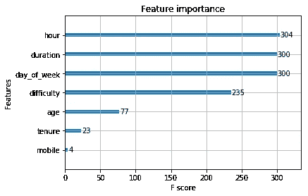
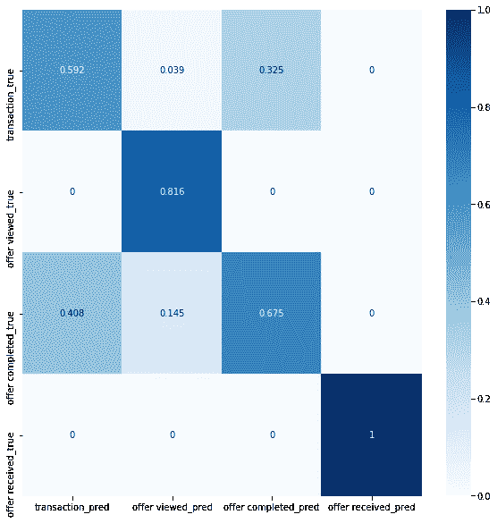
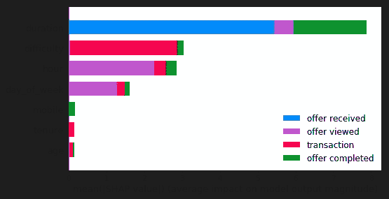
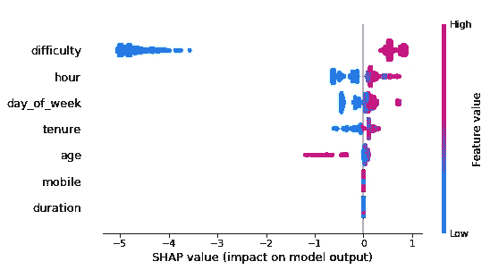
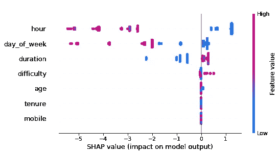
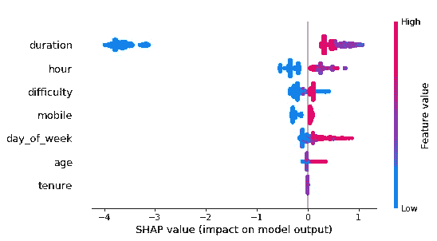
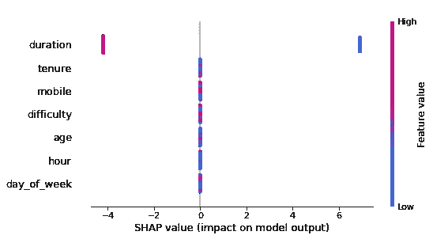

# 使用 SelectFromModel & SHAP 创建一个更好解释的 XGBClassifier 模型

> 原文：<https://towardsdatascience.com/using-selectfrommodel-to-create-a-better-xgbclassifier-model-ddebdf9b68fe?source=collection_archive---------30----------------------->

## 如何改进你的模型，并将结果传达给你的非技术团队。


图片由 [Aral Tasher](https://unsplash.com/@araltasher?utm_source=medium&utm_medium=referral) 在 [Unsplash](https://unsplash.com?utm_source=medium&utm_medium=referral) 上拍摄

处理零售数据总是很有趣，尤其是与客户的人口统计数据结合在一起的时候。当我在探索星巴克简化的促销、产品组合和顾客数据时，我知道我想用它做什么。这很简单；练习一些编码、数据工程、特征工程和模型设计。

该模型将用于更好地预测未来促销的影响，以及谁将从中受益。然而，我在这里的真正目标是探索*【选择来自模型】*函数&*【SHAP】*库。

因为我们需要一个分类模型，我们有一些很好的选项可以尝试。我们可以尝试集合方法，或者 KNN，神经网络，或者任何可以完成这项工作的方法。然而，由于数据是高度分类的，并且神经网络计算量大，我们将使用集成方法。此外，将神经网络用于所有事情会阻止我们扩展我们的技能集和对数据的理解。

# 数据探索和清理

除了客户的收入和性别。三个数据框中的所有字段都没有丢失任何值。例外的两个字段是不可归入的，因为许多值缺失(各 12.79%)，并且由于没有提交此类数据的客户也提供了假的出生年份(他们是 118 岁，这不太可能)。由于估算是不可能的，而且我不想输入缺少所有人口统计数据的记录，所以这些记录被从数据框中删除了。

之后，是 ol '常规预处理；更正数据类型，为非二进制分类字段创建虚拟变量，解析字段，并删除不重要的字段。

# 数据和特征工程

为了利用一些看起来不重要或无用的领域，需要设计新的领域。字段*“time”*包含从数据收集开始到一个月之前的小时计数器。我已经创建了字段*“一天中的某个小时”*和*“一周中的某天”*。


照片由 [Isaac Smith](https://unsplash.com/@isaacmsmith?utm_source=medium&utm_medium=referral) 在 [Unsplash](https://unsplash.com?utm_source=medium&utm_medium=referral) 上拍摄

出于探索的目的，我还在字段*【值】*之外创建了字段*【关键字】*和*【值】*。然而，它们没有任何用处，因为*“价值”中的不同值表示不同的概念(*一些是花费的金额，另一些是报价标识符)，而*“密钥”*只是降级的*“标签”*。

此外，我还创建了字段*“任期”*来显示每个人注册该应用程序后的天数。

现在，这三个数据框已准备好合并成一个大数据框。

# 模型设计和改进

我决定对购买的状态进行分类，不管是不是已经兑现。我选择分类的一个原因是，数据不包含要约-赎回交易的支付金额。如果所有交易的价值都是可用的，我们可能会得到一个更好的模型，甚至更好，探索每个报价对销售和收入的影响。

有四个标签要分类；a) *【交易】*，当没有报价要查看时进行交易，b) *【报价已接收】*，报价已发送，但未被查看，c) *【报价已查看】*，发送的报价已被用户查看，但未被兑换，最后，d) *【报价已完成】*，用户已兑换报价。

在将数据帧合并成一帧并删除所有不需要的列之后。我已经将数据分为训练和测试特征和标签。我手动这样做是为了确保标注的比例与原始数据框的比例相同。

第一个分类器表现不错；其准确率为 84.23%。然而，只有少数特征变得重要，其余的对模型的结果几乎没有影响。



初始 XGBClassifier 的特征重要性

如上所示，一些顶级特性是工程变量。由此可见，深入理解数据是多么重要。我没有进一步探索模型的性能，因为数字功能将大幅减少，模型的参数肯定会变得更好。

对模型的偏差结果有一个奇怪的观察。混淆矩阵显示，该模型能够 100%正确地对*“收到的报价”*进行分类。然而，它只在 44%的情况下正确地分类了*“交易”*。

在将我们的模型传入 *"SelectFromModel"* 函数，并迭代各种阈值后，我得到了以下模型，性能达到 84.73%的准确率。

```
SelectFromModel(estimator=XGBClassifier(base_score=0.5,
                                       booster='gbtree',
                                       colsample_bylevel=1,
                                       colsample_bynode=1,
                                       colsample_bytree=1, gamma=0,
                                       learning_rate=0.01, 
                                       max_delta_step=0,
                                       max_depth=3,  
                                       min_child_weight=1,
                                       missing=None,
                                       n_estimators=100,
                                       n_jobs=1, nthread=None,
                                       objective='multi:softprob',
                                       random_state=1, reg_alpha=0,
                                       reg_lambda=1,
                                       scale_pos_weight=1,
                                       seed=None, silent=None, 
                                       subsample=1,
                                       verbosity=1),
                max_features=None, norm_order=1, prefit=True,
                threshold=0.0058939322)
```

# 微调和结果解释

由于人口统计不适合作为特征，我保留了之前删除的记录，然后再次运行改进的模型。这导致模型的准确性略微提高了 1.28%(现在为 86.01%)。

更好的是，该模型对*“transaction”*的偏见大幅减少，59%的时间正确标记了类别。*【报价已完成】*和*【报价已查看】*偏差略有增加。然而，这个模型现在看起来好多了。



微调后的混淆矩阵

接下来，我们应该尽可能地解释结果。这将有助于决策者更好地理解数据、模型和输出，从而做出明智的决策。

我为此使用了*“SHAP”*库(SHapley Additive exPlanations 的简称)。这个库将 ML 模型从黑盒变成了人类可读的图形。



特征对标签分类的影响

该图显示了我们选择的每个特征对每个标签的分类的影响。请注意，并非所有功能都对每个标签有影响。

接下来，我们将分别探讨对每个标签的影响，以更好地理解每个特征的值如何影响分类器。



特征对交易的影响

现在我们看到了每个标签上的每个功能的影响。我们可以用人类能够理解的方式向决策者解释我们的发现和模型。类似于*“随着报价难度的增加，客户更有可能进行常规交易。”*或*更老的*



功能对已查看产品的影响



功能对报价的影响已完成



功能对收到的报价的影响

*客户更有可能兑现优惠。然而，这并不意味着年轻客户更喜欢不兑现优惠。*听起来比*好多了“年龄对要约兑现有负面影响。”*。

请注意，某些特征对某些标签来说比其他标签更重要。如果每个标签上的每个特征的效果被适当地解释，而不是特征的一般意义，这将使行动的计划变得容易得多。

此外，我们可以看到，并非所有类别的功能都很重要。在对通信渠道进行处理后，我们可以看到只有*【移动】*类别的*【渠道】*特征对分类有一定的影响。

# 结论

这是数据分析的一个经典案例，其中包括探索、预处理、建模和微调。这可以通过创建一个端到端的管道来自动化整个过程，或者至少是大部分过程来进一步改进。