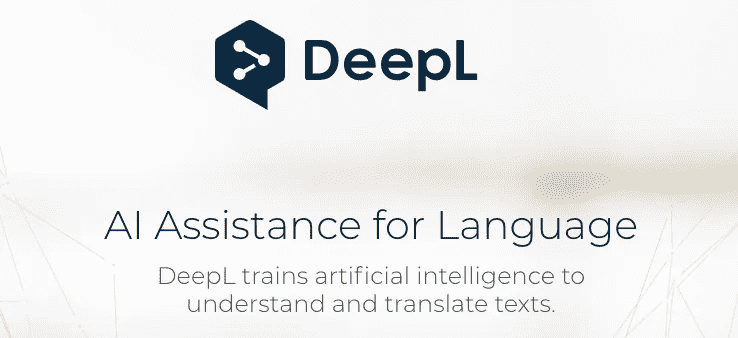
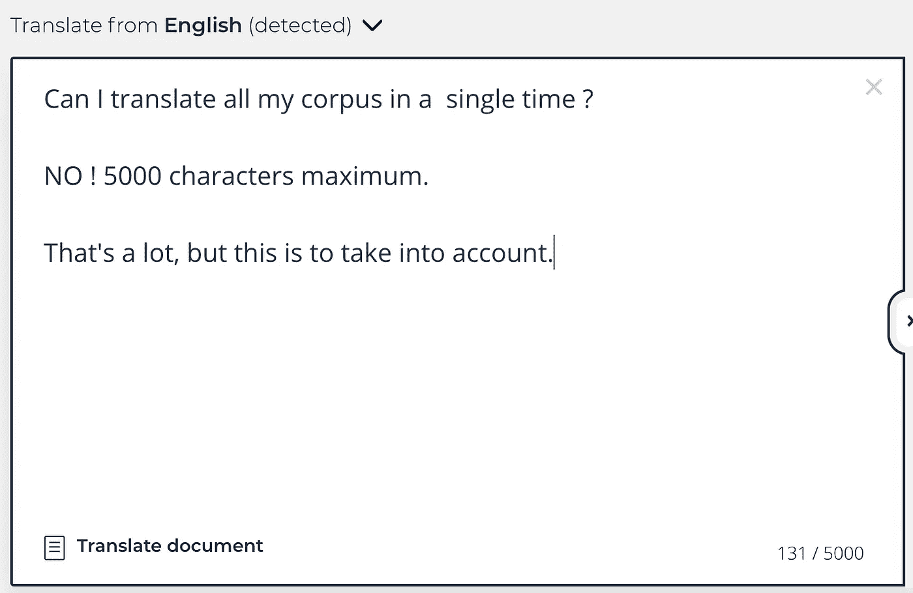
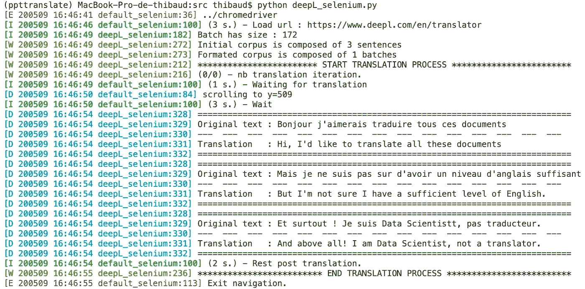
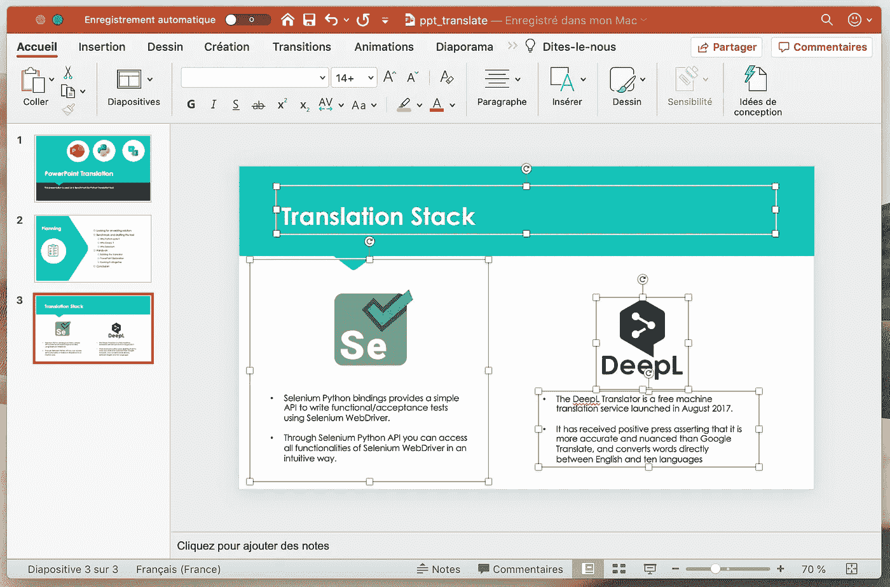
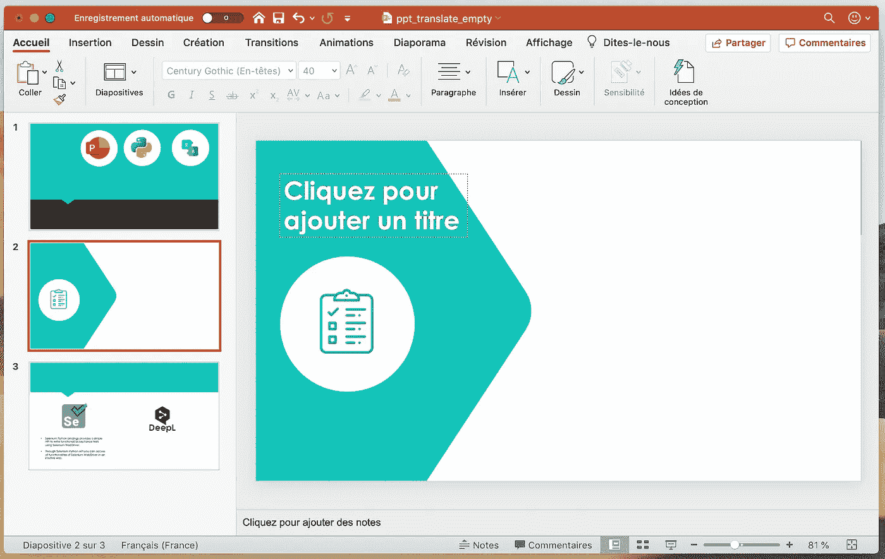
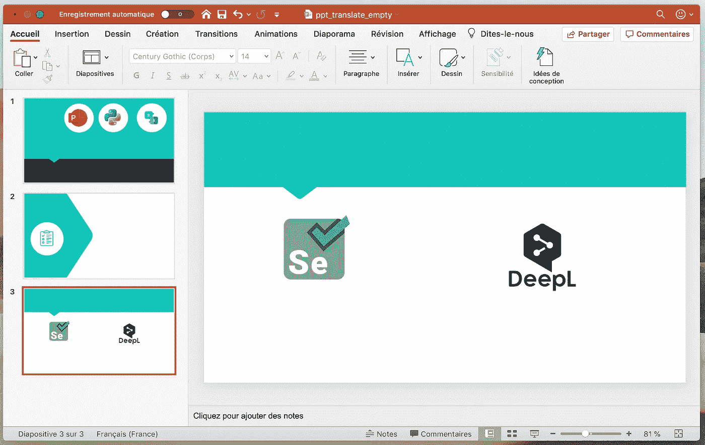

# 使用 Selenium 和 deepL 自动翻译 PowerPoint 文件

> 原文：<https://towardsdatascience.com/using-selenium-and-deepl-to-automate-the-translation-of-power-point-files-3c01f81f113?source=collection_archive---------26----------------------->


照片由 [Aaron Burden](https://unsplash.com/@aaronburden) 在 [Unsplash](https://unsplash.com/s/photos/information?utm_source=unsplash&utm_medium=referral&utm_content=creditCopyText)

## 曾经想要高效地翻译 PowerPoint 幻灯片吗？了解如何使用 Python 自动完成这一过程！

# 对自动化的需求

像许多顾问一样，我非常习惯使用 PowerPoint 演示文稿。但是最近，我被要求以一种非常特殊的方式与那些 **打交道。pptx* 文件。我没有展示我的工作或任何策略，而是被要求将一打又一打的幻灯片从法语翻译成英语。我的第一个想法和你一模一样:“真无聊…！!"。

是的*，很无聊*！但是你知道吗？事实是，开发人员*非常喜欢*被分配无聊的工作。这样他们就可以自动操作了！下面是我翻译数百张幻灯片中数万个单词的故事。

在本文中，您将发现如何用 Python 操作 PowerPoint 文件，以及如何从翻译网站提取信息。但是让我们从一个小的基准开始，从*为什么*开始，然后再到*如何*！

# 寻找现有的解决方案

紧接着绝望的*“太无聊了…”、*和自信的*“我会花一天时间给自己造一个神奇的机器人，这将使我接下来 3 天的工作顺利进行”*之后，是务实的*“我肯定能在网上找到免费的 PowerPoint 翻译器”。*

一个表演工具需要调和两者:

*   短句和长句的良好翻译水平
*   不修改原始文件的设计

在用于文档修改的免费在线工具的丛林中，很容易找到来自 **的转换器。pdf* 至 **。docx，*来自倍数 **。jpgs* 到单个*。pdf、文本翻译、表格提取、文件压缩等。表现非常好。不幸的是，PowerPoints 是复杂的文档，你可以找到许多不同的对象，它们可以组合在一起。

我轻而易举地找到了提供这种服务的网站，在几张幻灯片上做了一些测试，然后……立刻让自己完全听天由命了。在尝试了不同的翻译器之后，结果相当令人失望:**翻译过于近似**，并且**字体/大小/颜色与源文档**相比不时改变。毫无疑问，这可以完成部分工作。但是我仍然需要非常谨慎和耗时地阅读这些文件。冒着忘记明显的误译的风险，这些误译一眼就能看穿我。不会吧。

但愿我已经听同事们谈论过 PowerPoint 模板脚本，并阅读了许多关于这个主题的文章。有几个星期，我想实现一个 selenium 项目，那里有强大的在线翻译器，对网络用户免费。定制工具的想法诞生了。

# 基准测试和起草工具

## 堆栈展示

经过一些研究后，我相信下面的堆栈会产生有趣的结果。使用 [python-pptx](https://github.com/scanny/python-pptx) 包与文件进行交互。它允许我们处理演示文稿、幻灯片、形状、表格、段落、分组框等等。这个工具似乎很有前途。对于翻译部分，我会选择由人工智能驱动的翻译机。由于它的 API 不是免费的，Selenium 将非常适合访问网页和自动翻译。

## **为什么选择 Python-pptx？**

Python-pptx 是一个 Python 包，可以通过常用的`pip install python-pptx`命令行获得。它允许我们以一种非常结构化的方式探索 PowerPoint 文件。首先处理一个`Presentation`对象，它包含所有高级信息。然后你访问`Slides`对象，在每张幻灯片中你访问`Shapes`对象。形状可以是文本框、表格、图表、图像，甚至是一组形状。非常直观。

当你处理一个`text_frame`实例时，你可以访问文本和字体。看起来完美地满足了我们的需求:翻译文本而不改变其他任何东西！

最重要的是，文档非常全面，写得很好。

## **为什么是 DeepL？**

DeepL 是一个基于卷积神经网络的人工智能翻译器，它是在[linguie](https://www.linguee.com/)数据库上训练的。它于 2017 年推出，据报道，很快就在盲测中超越了竞争对手，包括谷歌翻译、微软翻译和脸书。与竞争对手的速度一样，它也将更加精确，更加细致入微。



一个强大的基于人工智能的翻译器，在线提供

我不会实现一个完整的基准，但这里有一个 DeepL 和谷歌翻译之间的比较。

**英文原文**

> *在过去，蚂蚁和蝉是朋友。他们非常不同。当蚂蚁努力工作的时候，蝉什么也没做。他们整天唱歌跳舞。*

**谷歌翻译**

> 秋天、四月和十一月。 **Ils** 培训课程**差异**。在工作期间，没有香烟。在整个旅程中，他们都在歌唱和跳舞。

**深度翻译**

> 家庭旅游、旅游和吸烟。**Elles**étain tèRS**differentes**。在这四个月的工作中，没有香烟。在整个旅程中。

对于不懂法语的读者，我们在这里介绍了 Google 和 DeepL 之间的两项重大改进:性别检测(在法语中，蝉和蚂蚁都是阴性词，因此我们用 ***elles*** 而不是****ils***来修饰它们，后者是 *elles* 的阳性词)，以及时间的一致性，即根据事件发生的时间使用正确的变化形式。*

*这里的例子已经足够了，但是在很少的单词的短句中，翻译也要好得多，并且可以很好地处理停用词。这对 PowerPoint 用例非常重要。我们开始吧，我们将使用 DeepL。*

***为什么是硒？由于 DeepL 的 API 不是免费的，我们将不得不从它的网络接口使用它。无需争辩，Selenium 是完成这类任务的完美工具。正如他们自己所说:***

> *Selenium 自动化浏览器*

*要发现 Selenium 的威力，我建议你阅读[这篇文章](https://medium.com/better-programming/lets-create-an-instagram-bot-to-show-you-the-power-of-selenium-349d7a6744f7)，它详细介绍了这个库，并解释了如何创建 Instagram 机器人。*

# ***动手操作***

## ***从无到有的工具***

*正如你可能已经猜到的，这个项目有**两个不同的部分**，这基本上意味着**三个步骤:***

*   *构建翻译器*
*   *与 PowerPoint 演示文稿互动*
*   *放在一起*

*让我们深入研究并发现解决方案是如何工作的！*

## *构建翻译器*

*为了记住这个过程，我们要做的是*

*   *创建 selenium 驱动程序*
*   *打开 deepL 网页*
*   *将文本发送到网页的输入文本区域*
*   *从翻译文本区域阅读翻译文本*
*   *关闭页面和 selenium 驱动程序*

*直截了当，是吧？*

*不幸的是，deepL 页面都是用 Javascript 编写的，翻译后的文本不会出现在 HTML 内容中，即使显示在屏幕上也是如此。这是第一个挑战:不可能确定从哪个 Html div(或其他什么)组件中提取文本内容。*

*希望 Selenium 是一个伟大的工具，deepL 在另一点上使它变得容易:他们为我们提供了一个“复制到剪贴板按钮”。识别之后，只需单击一下就可以将翻译后的文本放入剪贴板(注意剪贴板库已经(安装&)导入到第 3 行。*

> *注意:在文本输入和点击复制按钮之间有一个等待时间:`time.sleep(3)`。这是由于互联网连接和通过网络的请求。除了翻译过程之外，无论文本有多长，在您的浏览器中收到翻译文本之前都有一个最短的等待时间。*

*这里有一个句子翻译器。现在，如何从单个句子到一个完整的语料库？第一种解决方案是循环整个过程。但是考虑到`3s-translation`需要等待，对于更长的语料库来说，它会非常慢。想象一下，一个有 50 张幻灯片的 PowerPoint，包含一个标题和几个文本框，需要几个小时。*

*但是再一次，DeepL 让我们变得容易了。它允许我们一次翻译不同的段落。因此，我们可以同时发送多个句子，从句子中建立一个语料库。为了实现这一点，我们通过将句子连接成一个长字符串来创建一个更长的文本。为了确保算法不会在我们的句子之间添加任何上下文，我们使用一个连接字符串进行连接。翻译后，连接符字符串被用作拆分符字符串，这样我们就可以逐句得到翻译。*

*从不同的句子创建单个字符串语料库*

> *太棒了。所以，如果我发送我的全部语料库，我将在几秒钟内得到它的翻译？*

*还没有。使用 DeepL，对翻译的字符数有限制。让我们发现这一点。*

**

*来自 DeepL 网站的截图*

> *注意:您可以看到“翻译文档”选项。如果你点击它，你就可以上传一个 PowerPoint 文件。不幸的是，文件大小是有限的，并且有一个到高级选项的重定向，这不是免费的。*

*事实上，如右下角所示，翻译的限制是 5000 个字符。如果有人试图多放一些，页面就会变红，翻译只针对文本第 5000 个字母之前的句子。*

*这不是一个真正的问题，只要它是一个非常合理的限制，我们可以创建调整后的批量句子。想法是这样的:给定一个巨大的语料库，我们将创建一批句子，这样每一批大约(略少于)5000 个字符。*

*对于每一批，我们将运行前面的函数。如果我们有一个 200 个句子的语料库，平均 90 个字符(15 个单词，5 个字母/单词+1 个空白/单词)，总共 18 000 个单词，它将可能创建 4 批:3*5000 + 1*3000。计算并不完全正确，因为由于 joiner 而有额外的字符，但你得到了想法。*

*调整语料库的大小*

> *注意:随着文本大小的增加，翻译时间也会增加。它不是线性增加的，但是为了翻译 5000 个字符，在将翻译的文本提取到剪贴板之前，等待 20 秒而不是 3 秒是合理的。时间也取决于翻译语言。例如，如果你想从英语翻译成法语或西班牙语，它很快。翻译成中文要长得多。我做了一些测试，在那种情况下等待的时间更多在 45s 左右。关于翻译的准确性，我相信 DeepL，但我无法验证！*

> *太好了！现在一切都好吗？我能把我最喜欢的书从葡萄牙语翻译成荷兰语吗？*

*再次，有一些新的挑战。运行前面的脚本可以很好地处理少量文本。事实上，selenium 的`send_keys`功能模拟了一个人在键盘上一个接一个地按键。它做得更快，但他做到了。这意味着 deepL 一个接一个地接收近 5000 个字符。**网站检测到这是一个机器人行为。**然后反机器人插件将翻译过程替换为一种不稳定的行为:改变 DeepL 网站的页面，打开弹出窗口，或者试图在你的计算机上下载翻译。非常糟糕。*

*我没有做很多测试来了解速度限制是什么，因为对于大型语料库来说，打字慢会花很多时间。*

*另一个非常直观的方法是**更好地**模仿人类与网页互动的方式。确实如此。如果让你翻译十句话，你会把这十句话从头开始写到文本框里吗？或者你会从你的原始文件中使用一个基本的*复制/粘贴*？就是它:*复制/粘贴*现在是我们最好的盟友。*

*使用 Selenium 的复制/粘贴功能*

> ***警告** : selenium 复制/粘贴的方式似乎取决于你使用的操作系统和导航器。我来解释一下:当你模拟使用你的键盘时，在 MacOS 中你会实现 COMMAND + V，而在 Windows 上，你会实现 CONTROL + V。*
> 
> *在 MacOS + Chrome 上，我发现它可以很好地与:`element.send_keys(Keys.SHIFTT, Keys.INSERT)`*

*好了，我们快好了。这很好，但是还有另一个问题需要解决:当我们添加这么多文本时，翻译框变得更大:比你的屏幕还要大。*

*起初，这似乎不会改变什么，但是我们使用的“复制到剪贴板按钮”位于页面的底部。而现在已经出屏了。那么我们仍然可以在 Html 语法中检测到它，但是 selenium 不能模拟对它的点击。*

*下一步:滚动页面。Selenium 有一个内置的方法来做到这一点。*

*使用 Selenium 进行滚动，以便能够点击选定的按钮*

*我们到了！我们的翻译器现在可以工作了，可以翻译我们需要的所有文本了。免费准确的翻译。太好了！*

*一个好的实践是将 selenium scrappers 实现为类。基于我们在这里看到的，你可以在这里找到[和](https://github.com/ThibaudLamothe/translate-pptx/blob/master/src/deepL_selenium.py)完整的`seleniumDeepL`类，这使得翻译更加容易。注意，它从同一个 [GitHub repo 中的](https://github.com/ThibaudLamothe/translate-pptx)[可用的](https://github.com/ThibaudLamothe/translate-pptx/blob/master/src/default_selenium.py)类继承了一些基本的 selenium 属性。*

***三句话语料库中的翻译示例***

```
*corpus_fr = [
    "Bonjour j’aimerais traduire tous ces documents",
    "Mais je ne suis pas sur d’avoir un niveau d’anglais suffisant",
    "Et surtout ! Je suis Data Scientist, pas traducteur."
]*
```

**

*3 句话翻译的外壳日志*

*`seleniumDeepL`对象提供了那篇文章中没有讨论的有趣的附加特性，例如:*

*   *选择翻译的目标语言。我们可以使用 DeepL 中所有可用的语言。截至今日，已有:*英语(* `en` *)、法语(* `fr` *)、西班牙语(* `sp` *)、德语(* `de` *)、荷兰语(* `nl` *)、葡萄牙语(* `pt` *)、波兰语(* `pl` 【T24)、汉语(`zh`和*日语(* `ja` 【T30)DeepL 会自动检测源语言，要选择目标语言，您需要将[www.deepl.com/en/translator](http://www.deepl.com/en/translator)URL 中的`en`更改为所需的语言。*
*   *通过只翻译语料库或当前批次中尚未看到的句子，加快处理速度。*
*   *从/向 json 文件导入和导出翻译{句子 1:翻译 1，句子 2:翻译 2，…}*

*总而言之，我们已经看到了如何:*

*   *以字符串列表的形式加载数据，使用连接字符串将它们以 5k 字母为一批连接起来，并在一个较小的语料库中转换这些批次，以加快翻译速度。*
*   *通过将它们添加到剪贴板来翻译每个批处理，并从剪贴板粘贴到 DeepL 翻译框中。我们等待几秒钟的翻译，找到，滚动并点击“复制到我的剪贴板按钮”。最后一步是使用 joiner 字符串将翻译后的数据分割成原始大小。*

## ***PowerPoint 探索***

*这一部分更短更简单:给定一个 PowerPoint 文件，我们希望提取它的所有文本，将其提供给我们的翻译人员，并用他们的翻译替换所有文本。*

***提取文本***

*我们现在想要获取演示文稿中的所有文本。接下来阅读所有这些需要有条不紊地浏览文件。*

**

*PowerPoint 屏幕截图—全文(1/3)*

*每个演示文稿都以相同的方式构建:*

*   *演示文稿包含幻灯片*
*   *幻灯片包含形状*
*   *形状可能包含文本*

*python-pptx 有对应的内置对象。这迅速导致了这个功能:*

*用 python-pptx 从 PowerPoint 中提取文本*

*我们现在有演示文稿的所有文本吗？全部吗？真的吗？我们去看看。*

*为了确定我们正在收集的文本，我不是只收集文本，而是用空字符串替换它们，然后以空版本保存演示文稿。打开它，我们将快速检查是否所有的文本都已被选中(和删除),并推断我们的算法是否运行良好。*

*让我们分两步来做:*

1.  *将`texts.append(paragraph.text)`替换为`paragraph.text = ‘’`*
2.  *在我们的`get_texts_from_file` 函数的末尾使用`prs.save(output_file)`*

*这是上一张图片的演示结果:*

**

*PowerPoint 屏幕截图—空文本(2/3)*

*这看起来几乎不错，但你可能会在第三张幻灯片上看到，我们还有一个文本。*

*事实上，在代码中，我们检查了所有将`has_text_frame`属性设置为`True`的形状。*

*但是所有的形状并不完全具有相同的类型。具体来说，我们要处理两种*特殊形状:**

*   ***组合形状** : 您可能知道，在 PowerPoint 中编辑包含大量信息的文件时，您可能会选择几个形状并将它们组合在一起。如果你仔细观察第一张截图，你会发现在*的右边部分*有两个矩形(一个用于图片，一个用于文本),而在*的左边部分*只有一个。这是因为 Selenium 徽标和 Selenium 文本组合在一起。在 python-pptx 中，这些元素被称为 [GroupShapes](https://python-pptx.readthedocs.io/en/latest/api/shapes.html#groupshapes-objects) ，事实上，GroupShapes 没有`text_frames`属性，因此`has_text_frame`属性默认设置为`False`。这就是为什么我们的算法没有隐藏该文本。希望 GroupShapes 有一个`Shapes`属性，它包含组合形状的单独形状。*
*   ***表格:**上例中没有表格，但问题是一样的。有些形状，除了`has_text_frame`，形状还有一个`has_table`属性。而当`has_table is True`我们可以访问[表](https://python-pptx.readthedocs.io/en/latest/api/table.html#table-objects)对象。表格没有文本值，但是`Table`包含`cell`，单元格有`text_frame`对象。问题解决了。*

*当这两种类型的形状都考虑在内时，结果要令人满意得多。*

**

*PowerPoint 屏幕截图—空文本(3/3)*

> *注意:还有一些其他形状，但它们主要是图形，并不意味着文本，所以我们不需要为它们费心。但是如果你必须处理 PowerPoint 文件，你肯定应该仔细看看写得很好的 python-pptx 文档；) !*

*现在我们确信我们已经阅读了演示文稿的所有文本，让我们进入下一步。*

***翻译***

*我们有一个句子列表，它看起来像一个为我们的翻译格式化的语料库。这个把它转化成批量语料库，在 deepL 网站上做一些迭代，返回一个字典。*

*我们可以再次遍历我们的 PowerPoint 并使用翻译词典替换文本。关键词是原文，价值是译文。*

***插入文本***

*这是最后一步:重新插入文本。这和我们以前做的没什么不同。我们必须检查文件的每一个`text_frame`,而不是设置空值，我们将设置翻译。*

> *注意:为了简化代码，我们在 l.15 上迭代通过`all_presentation_text_frames`。这是为了说明的目的:处理表格和分组形状的真实过程并不那么简单。ppt 操作的完整代码可从[这里获得。](https://github.com/ThibaudLamothe/translate-pptx/blob/master/src/ppt_interaction.py)*

*最后一次更新是必要的。这里我们替换了`text_frame.paragraph.text`值。事实上，它封装了比文本更多的信息。要理解这一点，您必须知道每个形状都有自己的参数(颜色、大小、位置、格式和**字体**)。这些是给定形状和 PowerPoint 模板的默认值。但有时我们可以手动更改这些信息。例如，如果文本太长，人们可能会决定将默认大小点从 16 改为 14，以便它正确地适应形状。在这种特定情况下，信息存储在`text_frame.paragraph.text.runs`中。这样我们就不能轻易地覆盖文本。*

*不幸的是，这是一个**关键点**:我们必须保持与输入文件完全相同的结构！*

*当然，有一个字体属性给出了关于字体的信息。但是这个不能存放和更换。因此，我们必须在幻灯片/形状/文本 _ 框架/段落/运行分析中更深入地修改文本，而不修改字体，并最终获得我们期望的结果。*

*我想说，尽管这是项目的终极挑战，但也是最难克服的。它需要理解`runs`的概念，并仔细阅读 python-pptx 文档。因为它变得非常技术性，我把这个函数放在这里，以防你对它感兴趣，但是如果你不明白它是如何工作的，不要担心。*

*替换 text_frame 文本而不影响字体属性*

> *所以我们来了！我们漫长旅程的终点！还有最后一件事要做:从头开始运行所有这些！*

## *放在一起*

*我们已经到了最后一步:使用我们构建的翻译器进行 PowerPoint 转换。我不会在这上面花太多时间，因为它只是我们到目前为止所看到的所有内容的组合，还做了一些重构。*

*翻译 PowerPoint 文件*

# *结论*

*我们已经看到了如何创建一个很好的工具来自动翻译 PowerPoint 文件，而不需要修改它们的外观，并且非常自信。尽管如此，请记住没有什么是完美的。因此，它不会阻止重新讲授输出，以检测最终的错误。事实上，DeepL 是一个非常强大的工具，但有时如果我们没有给它足够的上下文信息，它可能会产生近似的翻译。*

*该项目的一个关键成果是翻译部分，毫无疑问，它非常有用，对于所有涉及翻译的用例都是可重用的。*

*这也让我发现了 python-pptx 库，这是一个有趣而伟大的 PowerPoint 版本工具。*

*下一步，我们可以想象构建一个基本的 web 界面，包括上传区、目标语言下拉列表和翻译下载按钮。像[烧瓶](https://flask.palletsprojects.com/en/1.1.x/)或[破折号](http://dash.plotly.com/)这样的框架可以完成这项工作。*

*最后，我希望你喜欢阅读那个故事/教程，就像我喜欢这个项目一样。意识到这一点比花几天时间翻译幻灯片有趣得多。请注意，所有代码都可以在我的 Github 上的[这个库](https://github.com/ThibaudLamothe/translate-pptx)中找到。如果你想使用它，请随意，不要犹豫让一个明星参与项目。当然，欢迎任何备注或建议:)！*

*我要感谢我的同事和朋友 [Ismail Mebsout](https://medium.com/u/221f83647c85?source=post_page-----3c01f81f113--------------------------------) ，他刚刚发表了一堆关于[深度学习基础](/deep-learnings-mathematics-f52b3c4d2576)的文章，并激励我发表了这第一篇帖子！*