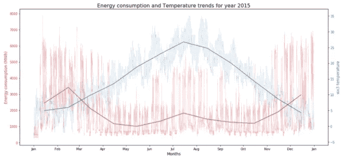

# 使用语义 ML 构建语言驱动的应用程序

> 原文：<https://towardsdatascience.com/using-semantic-ml-to-build-apps-powered-by-language-7be2a4e7e689?source=collection_archive---------55----------------------->

## [使用语义 ML 构建语言驱动的应用](/build-apps-powered-by-language-with-semantic-ml-c6f01fdf0e94)

作者[戴尔·马科维茨](https://medium.com/u/1b81dbdfe1ea?source=post_page-----7be2a4e7e689--------------------------------) — 7 分钟阅读

大多数人更擅长用语言描述世界，而不是用代码描述世界(嗯……大多数人)。那么，如果机器学习可以帮助弥合这两者之间的差距，那就太好了。

## [用神经网络预测能源需求](/forecasting-energy-consumption-using-neural-networks-xgboost-2032b6e6f7e2)

由[蔡佳顺](https://www.linkedin.com/in/chiahsoon/)、[李、](https://www.linkedin.com/in/zhaochen-li-9409961a7/)、[胡图](https://www.linkedin.com/in/minhtoo/)、以及[奎月咏家](https://www.linkedin.com/in/jia-yong-quah-834088164/) — 24 分钟读完

本文总结了我们用来赢得由新加坡南洋理工大学和 ai4impact 联合举办的深度学习数据大会的方法。如有任何疑问，请通过 LinkedIn 联系我们。

德里克·汤姆森在 Unsplash 上拍摄的照片

## [用数据理解幸福动态(第一部分)](/understanding-happiness-dynamics-with-data-part-1-ab58984a715a)

通过 [Lina Faik](https://medium.com/u/b6c0e8e98c84?source=post_page-----7be2a4e7e689--------------------------------) — 12 分钟阅读

在这些特殊时期，封锁给我们许多人留下了很多思考的时间。想想过去和未来。想想我们的生活方式和我们的成就。但最重要的是，想想我们对这个世界的贡献。