# 用通用句子编码分析不同音乐类型的歌词

> 原文：<https://towardsdatascience.com/using-sentence-embeddings-to-explore-the-similarities-and-differences-in-song-lyrics-1820ac713f00?source=collection_archive---------24----------------------->

## 应用谷歌的通用句子编码器和主成分分析来识别不同音乐流派的异同


在 [Unsplash](https://unsplash.com?utm_source=medium&utm_medium=referral) 上 [Annie Theby](https://unsplash.com/@annietheby?utm_source=medium&utm_medium=referral) 拍摄的照片

TLDR:使用谷歌的通用句子编码器/ PCA 和 Plotly 在 3d 空间中表示歌词。点击这里玩:【https://plotly.com/~kitsamho/238/ 

我对音乐的持久热爱始于 1992 年，在我 12 岁的圣诞节，溺爱我的父母掏钱给我买了一台 Alba HiFi。

皮带传动转盘？检查！
双卡带播放器？检查！
带**低音增强**的图形均衡器？当然啦！

从那以后，我一直在听各种各样的音乐。

我现在快 40 岁了，在这 28 年的音乐生涯中，我加深了与音乐的关系。我是一名[吉他手](https://youtu.be/OlCw5WQvffI?t=1881)，一名 DJ，一名[舞曲制作人](https://soundcloud.com/honanofficial)。音乐以多种快乐的方式打断了我的生活——我想对你们许多人来说也是如此。

因此，尽管我觉得我(相当)有资格谈论音乐流派，但我发现很难定义它们和/或区分它们。

# 流派不断演变，流派是主观的

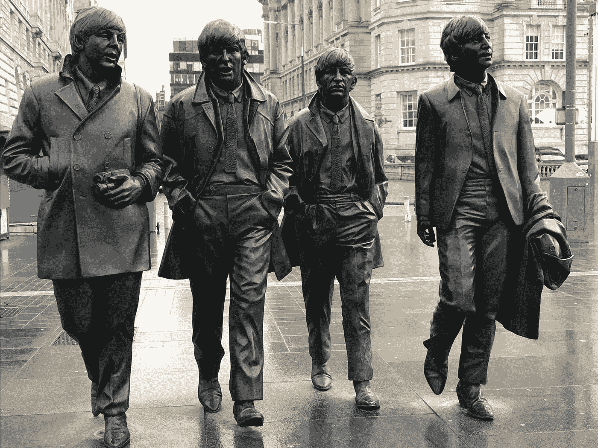

照片由 [IJ 波特温](https://unsplash.com/@jithotw?utm_source=medium&utm_medium=referral)在 [Unsplash](https://unsplash.com?utm_source=medium&utm_medium=referral) 上拍摄

划分流派的界限是模糊的，随着时间的推移，这种界限更加模糊。滚石乐队和甲壳虫乐队最初被一些人指责为魔鬼的作品，但如今却像平板家具一样成为主流。

*** [*杀戮者*](https://i2.wp.com/metalinjection.s3.amazonaws.com/wp-content/uploads/2013/01/Slayer-headbang.gif?resize=470%2C353) *在位至尊为恶魔的作品仅供参考。\m/*

# 流派被操纵


在 [Unsplash](https://unsplash.com?utm_source=medium&utm_medium=referral) 上[猎人赛跑](https://unsplash.com/@huntersrace?utm_source=medium&utm_medium=referral)的照片

当商业利益盖过真实性时(几乎总是令人难过)，就可以制造“类型”。这些人为的标签被唱片公司用来锁定客户群以获得商业优势，有时以某种方式反映出[社会中更深层次的缺陷。](https://www.rollingstone.com/music/music-features/labels-ditch-urban-1011593/)

# 那么我们有什么方法可以衡量流派呢？

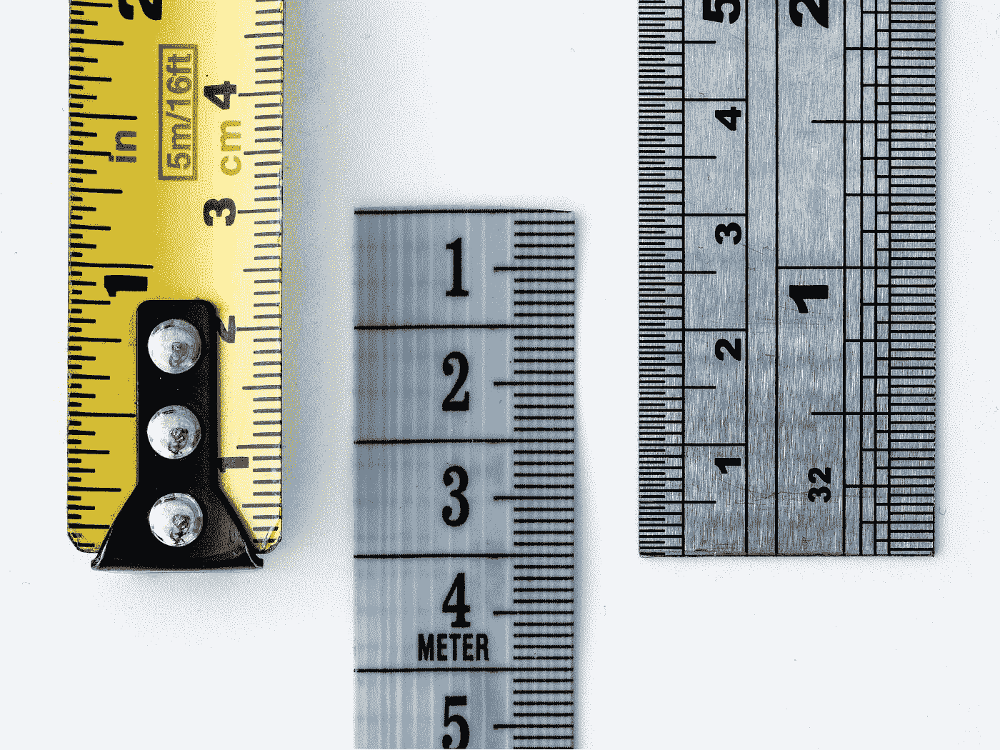

威廉·沃比在 [Unsplash](https://unsplash.com?utm_source=medium&utm_medium=referral) 上拍摄的照片

很明显，流派分类可能是主观的、有争议的，甚至可能是徒劳的——毕竟，好音乐就是好音乐，对吗？

然而，我想说至少有两种有效的方法来区分不同的流派:一首歌的音乐性和歌词。

# 这音乐听起来像什么？


由 [Blaz Erzetic](https://unsplash.com/@www_erzetich_com?utm_source=medium&utm_medium=referral) 在 [Unsplash](https://unsplash.com?utm_source=medium&utm_medium=referral) 上拍摄的照片

是不是…

*   直播还是测序？(摇滚 vs. Techno？)
*   大声还是安静？(Dubstep vs. Chillout？)
*   不协和还是有旋律？(痛击金属 vs 灵魂？)
*   可预见还是不可预见？(流行与爵士？)

# 音乐在说什么，它是如何被表达的？


照片由[维达尔·诺德里-马西森](https://unsplash.com/@vidarnm?utm_source=medium&utm_medium=referral)在 [Unsplash](https://unsplash.com?utm_source=medium&utm_medium=referral) 上拍摄

*   歌词是否基于某种情绪(如悲伤、快乐、愤怒)？
*   歌词是在说**话题**(爱情、失去、战争、不公、压迫、死亡)吗？

对于这个项目，我想特别关注歌曲作者在歌曲中使用的歌词和语言。

我们都觉得抒情的内容因流派而异。但是有没有一种方法可以定量地测量这个呢？

# 项目目标

> 不同流派的歌词之间存在差异，我们可以量化和衡量这一点！

# 挑战和方法


照片由[帕特里克·帕金斯](https://unsplash.com/@pperkins?utm_source=medium&utm_medium=referral)在 [Unsplash](https://unsplash.com?utm_source=medium&utm_medium=referral) 拍摄

## 我们从哪里获得数据？

*   我们将从**Musixmatch.com**搜集歌词，这是一个免费网站，拥有大量准确的歌词内容

## 什么样的方法/度量将允许我们以直观的方式量化抒情多样性？

*   我们将使用来自**谷歌通用句子编码器**的高维向量来表示歌词
*   我们将应用**主成分分析(PCA)** 将这些高维表示降低到 n=1，2，3 维

## 我们如何以一种有意义的方式将它可视化？

*   我们将使用 **Plotly** 并建立一个简单的情节和更复杂的 2d 和 3d 散点图的组合，以查看歌词的相似之处和不同之处

**我的 GitHub** [**这里**](https://github.com/kitsamho/songlyrics_univeral_sentence_encoder) 有所有笔记本和全部原始数据

# 获取数据


来源:[https://www.musixmatch.com/](https://www.musixmatch.com/)

为了准备这个项目，我发现很难在网上找到准确的歌词来源。歌曲要么不完整，要么可用的音量不够全面。

Musixmatch.com 似乎是少数几个遗址之一:

1.  有很多内容。
2.  相当准确。

所以让我们把它作为我们的数据源。

Musixmatch 有一个开发者 API，我们可以用它来获取歌词数据，但他们只允许你一天打 2k 个电话，而且你只能玩每首歌 30%的歌词。

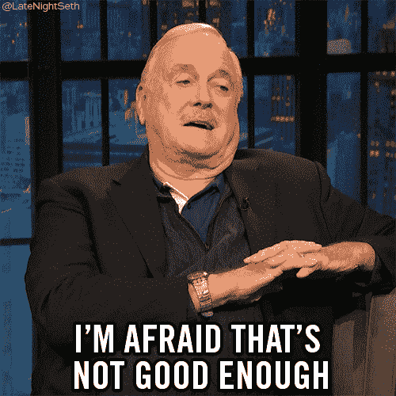

资料来源:Giphy

让我们通过结合使用**请求**和 **HTML 解析**来解决这个问题。这是一个“浏览器外”的过程，因此我们可以轻松实现多线程来加快进程。这意味着我们可以在更短的时间内获得更多的内容。

我在下面写了一个 Python 类，它包含了为艺术家提取歌词内容的所有方法。

Musixmatch.com 的 Python scraper 类

## 运行铲运机

你所需要做的就是用一个 Musixmatch 艺术家 URL 和一个流派标签来实例化这个类…

```
scraper = MusixmatchScraper('[https://www.musixmatch.com/artist/Jack-Johnson'](https://www.musixmatch.com/artist/Jack-Johnson'),'folk')
```

..然后调用`self.Run()`方法启动刮刀。

***告诫*** *—如果你想刮很多歌词，在可能的情况下，你应该轮换你的 IP 地址。如果你向 Musixmatch.com 发出太多请求，你的 IP 地址将会被屏蔽，尽管只是暂时的。我发现在这种情况发生之前，你可以删除 c.250 歌曲。*

# 刮多个艺术家

`MusixmatchScraper()`的编码方式允许你抓取**一个**艺术家的内容。如果你想得到多个艺术家，你可以像这样创建一个循环:

抓取多位艺术家的歌词

该类返回一个熊猫数据帧，如下所示:

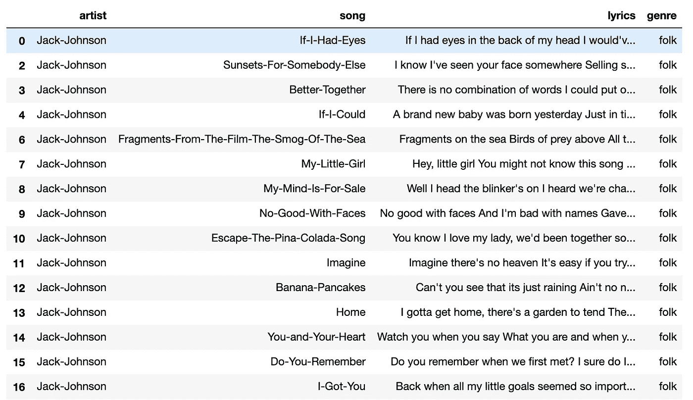

示例数据帧输出

太好了，现在我们有数据了。让我们研究一下数据，看看我们有什么。

# 探索性数据分析


照片由[卢克·切瑟](https://unsplash.com/@lukechesser?utm_source=medium&utm_medium=referral)在 [Unsplash](https://unsplash.com?utm_source=medium&utm_medium=referral) 上拍摄

在我们开始看句子嵌入之前，让我们用 Plotly 来激发一些简单的情节。

# 熊猫& Plotly


资料来源:www.plotly.com

比起其他任何东西，我通常更喜欢视觉化的情节。它们看起来更好，具有交互性，你可以使用 [Plotly Chart Studio](https://plotly.com/chart-studio/) 轻松管理和分享它们。唯一的缺点是它需要相当多的代码(和许多嵌套的字典！)从 Plotly 中获得有用的东西，当你只想快速浏览数据时，这很烦人。


资料来源:Giphy

我推荐的一件事是**将 Plotly 更新到至少 4.8** ，因为熊猫现在可以使用 **Plotly 作为后端绘图的库**，而不是“审美受损”的 Matplotlib。

在下面的代码块中——我们可以通过将`.plot.bar()`添加到 DataFrame 对象中，从 Pandas DataFrame **中生成一个简单的条形图。**

简单如 123，abc！

`pd.DataFrame([1,2,3],['a','b','c']).plot.bar()`

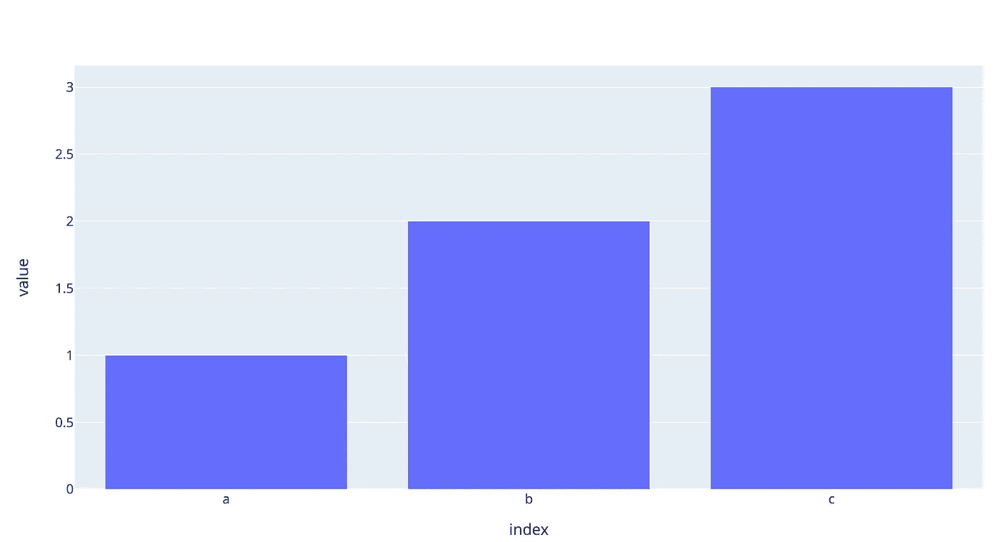

Plotly 后端输出示例

如果你想的话，你可以调整你的图形的外观和感觉，通过使用你通常用在 **Plotly Graph Objects** 上的相同参数，这样就有了额外的熟悉的灵活性。

好了，回到这个项目...

# 我们有哪些流派和艺术家？

我决定从一系列流派中挑选歌词，有些流派比其他流派更极端，以便看看我们是否能看到差异，但我也选择了非常重叠的流派，看看是否有共性。

让我们看看每个流派有多少首歌曲。

```
#plot genres
fig_genre = pd.DataFrame(df.genre.value_counts()).plot.bar(template='ggplot2')#title parameters
title_param = dict(text='<b>Count of Genre</b><br></b>', 
                        font=dict(size=20))#update layout
fig_genre.update_layout(title=title_param,
                  width=1000,
                  height=500,        
                  xaxis = dict(title='Genre'),
                  yaxis = dict(title='Count'))#change the colour
fig_genre.update_traces(marker_color='rgb(148, 103, 189)')#show plot
fig_genre.show()
```

每一种类型都有相当好的表现——至少足以进行有意义的比较。


这里的原剧情:[https://chart-studio.plotly.com/~kitsamho/240/#/](https://chart-studio.plotly.com/~kitsamho/240/#/)

按流派划分的艺术家呢？

让我们带着一些视觉化的东西进城，创建一个流派和艺术家的旭日图。如果想和剧情互动，原剧情的链接在脚注里。

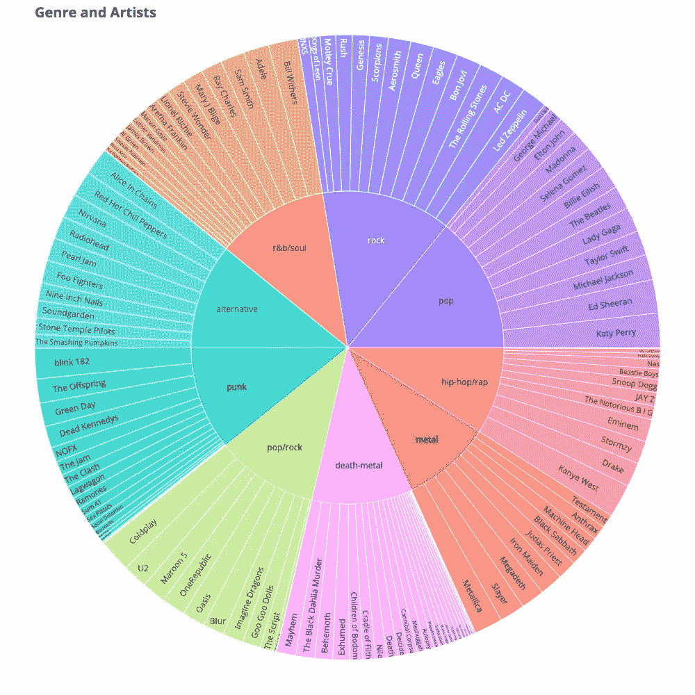

这里互动剧情:【https://plotly.com/~kitsamho/254/ 

我有一系列的乐队和艺术家，我觉得他们代表了这些流派。你可能不同意我的观点。没关系，流派的定义可能会有争议。

# 歌词长度有区别吗？

让我们按体裁来探讨歌词长度。

```
#get lyric frequencies for each song
df['lyric_count'] = df['lyrics'].map(lambda x: len(x.split()))
```


此处原创剧情:【https://chart-studio.plotly.com/~kitsamho/244】T4

Hip-hop 是一个非常抒情的流派——许多描述 hip-hop 歌词数量的关键描述性指标都不同于所有其他流派。

当我们分析那些歌词的内容时，看看那些歌词的*内容*是否也不同，这将是很有趣的。这很方便地把我带到了 EDA 的下一部分——词性(PoS)分析。

# 词性分析


照片由[布雷特·乔丹](https://unsplash.com/@brett_jordan?utm_source=medium&utm_medium=referral)在 [Unsplash](https://unsplash.com?utm_source=medium&utm_medium=referral) 上拍摄

所以下一件有趣的事情是理解这些歌词的内容。为了做到这一点，我将使用空间模型将歌词内容分类到其相关的词类中，即分类歌词中的哪些词是名词、动词、形容词等等。这将使我们对不同体裁的抒情内容的差异有更多的了解，并可能暗示相似和不同之处。

```
import spacy#load spacy model
nlp = spacy.load('en_core_web_sm')def pos(string,pos):

    """Returns any token that qualifies as a specific part of speech"""

    doc = nlp(string) #fit model

    return ' '.join(list(set([i.text for i in doc if i.pos_ == pos]))) #return any tokens that qualify
```

让我们在一个循环中调用上面的函数，并获得包含所有有用词类的新列。

```
#get nouns
pos_of_interest = ['NOUNS','VERBS','ADJ','ADV]#loop through each PoS
for pos in pos_of_interest:
      df[pos] = df.lyrics.map(lambda x: pos(x,pos))
```

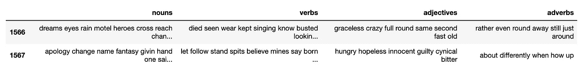

PoS 的示例数据帧输出

# 最常见的单词

下面是一个计算字符串中最常见标记的函数。我们可以用它来分析一首歌中最常见的词，包括我们刚刚制作的词表。

计算字符串中最常见单词的函数

```
#call the function on one gram
musixmatch_mostcommon(df.lyrics,token=1).head(10)
```

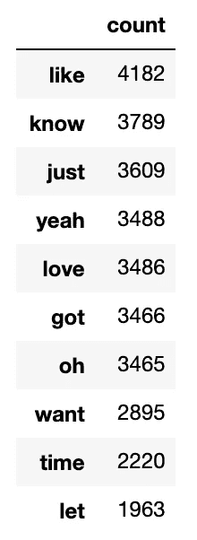

示例数据帧输出

更有用的是找到一种方法，在所有的体裁和不同的词类中使用这种功能。一种有效的方法是使用树形图可视化。Plotly 对此有一个很好的模板，所以我构建了一个函数来完成这项工作。

# 树形图可视化

在 Plotly 中创建树形图可视化的函数

让我们调用该函数并查看输出

```
noun_treemap = musixmatch_genremap(df,pos='nouns')
```

**警告**——其中一些歌词很露骨

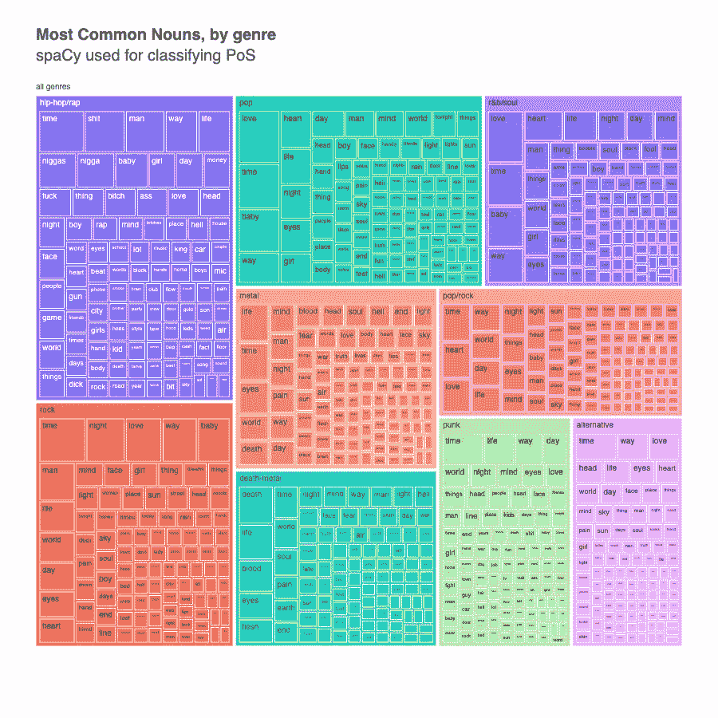

这里互动剧情:【https://plotly.com/~kitsamho/246/ 

如果你使用的是台式机，我强烈建议你访问树状图脚注中的链接(如上),以便与之互动。

# 通用句子编码

现在我们开始真正有趣的部分——使用**向量**来代表我们的歌词。然后，我们可以使用各种技术来显示哪些向量/歌词是相似的或不同的。

# 什么是向量表示？


由[马库斯·斯皮斯克](https://unsplash.com/@markusspiske?utm_source=medium&utm_medium=referral)在 [Unsplash](https://unsplash.com?utm_source=medium&utm_medium=referral) 上拍摄

单词的向量表示对于自然语言处理来说是一个重大的进步。试图“理解”语言的早期方法通常涉及计数单词(例如单词袋模型或加权模型/ TFIDF 方法)。这些方法的局限性在于它们没能抓住语言的语境。毕竟，*‘孩子弄坏滑板’*这句话和*‘滑板弄坏孩子’的意思很不一样……*尽管有相同的类型和字数。


来源:Giphy——孩子玩滑板


来源:Giphy——滑板断了孩子

Tomas Mikolov 等人的 Word2vec 是游戏规则的改变者，因为单词不再基本上表示为计数，而是表示为高维向量。这些向量，或者说**嵌入**，是通过在文本语料库上训练一个简单的神经网络而产生的。这些单词嵌入表示一个单词与相邻单词的**关系，因此也表示其上下文。因此，单词“walking”和“walked”的向量将比单词“swimming”和“swam”更相似。**


来源:[https://developers . Google . com/machine-learning/crash-course/embeddings/translating-to-a-lower dimension-space](https://developers.google.com/machine-learning/crash-course/embeddings/translating-to-a-lower-dimensional-space)

如果你想了解这方面的更多信息，我建议你阅读[原始白皮书](https://papers.nips.cc/paper/5021-distributed-representations-of-words-and-phrases-and-their-compositionality.pdf)或[我与 ASOS 评论在 TrustPilot 上做的一个项目](https://kitsamho.github.io/trustpilot-nlp-explore-content/#)。

# 谷歌的通用句子编码器

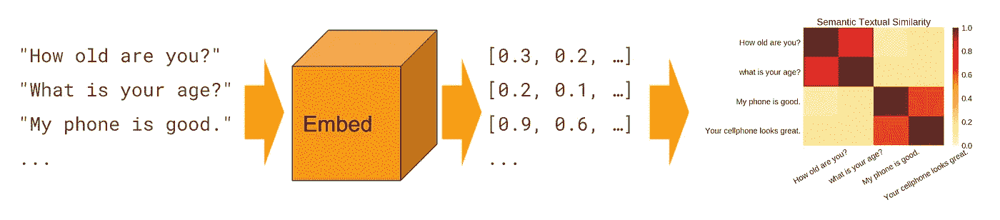

来源:https://tfhub.dev/google/universal-sentence-encoder/ 4

在这个项目中，我们将使用**谷歌的通用句子编码器**，这是一种经过数百万(可能数十亿)人训练的最先进的编码器？)的文档。

它就像 word2vec，但使用了类固醇。

> 通用语句编码器将文本编码成高维向量，这些向量可用于文本分类、语义相似性、聚类和其他自然语言任务。
> 
> 该模型针对大于单词长度的文本进行训练和优化，例如句子、短语或短段落。它在各种数据源和各种任务上接受训练，目的是动态适应各种各样的自然语言理解任务。

来源:【https://tfhub.dev/google/universal-sentence-encoder/】T44

如果你想了解更多关于这个模型的信息，我强烈建议你阅读关于 [TensorFlow hub](https://tfhub.dev/google/universal-sentence-encoder/1) 的文档，因为它涵盖了更多的细节。

# 在我们的歌词数据上使用谷歌通用句子编码器


[https://tfhub.dev/google/universal-sentence-encoder/](https://tfhub.dev/google/universal-sentence-encoder/1)4

让我们使用 Tensorflow Hub 加载模型..

```
#get universal sentence encoder
USE = hub.load("[https://tfhub.dev/google/universal-sentence-encoder/4](https://tfhub.dev/google/universal-sentence-encoder/4)")
```

让我们写一个简短的函数，它可以使用这个模型获得任何字符串输入的高维向量。

```
def getUSEEmbed(_string,USE = USE):

    """Function takes a string argument and returns its high dimensional vector from USE"""

    return np.array(USE([_string])[0])
```

让我们得到一个简单句子的向量…

```
example = getUSEEmbed('Hello how are you?')
```

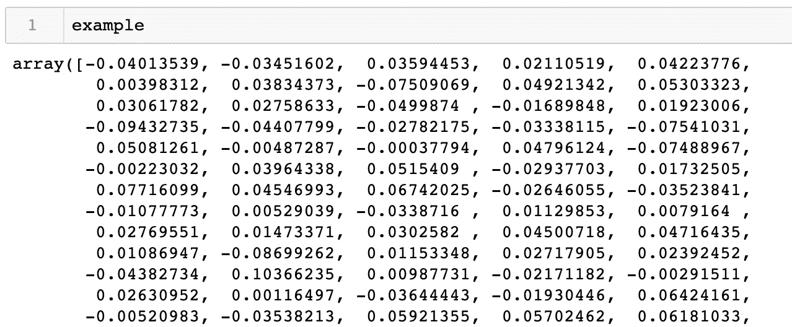

高维向量表示“你好吗？”

如你所见，一个简单的句子现在已经被编码成一个形状为(512，)的高维向量

# 评估向量之间的相似性和差异


弗兰克·麦肯纳在 [Unsplash](https://unsplash.com?utm_source=medium&utm_medium=referral) 上拍摄的照片

这个项目的基石是想办法**找到歌词的异同**。当我们将歌词编码成向量表示时，我们需要使用一些技术来让我们**找到向量的相似性和差异性**

我们可以通过以下方式做到这一点:

1.  使用**余弦相似度**
2.  维度**缩减和可视化**(使用类似主成分分析的东西)

# 余弦相似性

通常，当我们拥有连续的低维数据时，我们会使用类似欧几里德距离的东西来衡量相似性/差异。我们将把这个距离度量用于类似 KNN 分类器的东西，或者甚至在聚类维数减少的向量时，例如在 PCA 之后。

然而，因为我们来自句子编码器的向量具有非常高的维度，那么使用**余弦相似度**是一个比欧几里德距离更好的接近度度量，至少开始是这样。

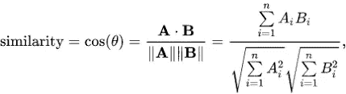

余弦相似度将相似度计算为两个向量的归一化点积/来源:【https://en.wikipedia.org/wiki/Cosine_similarity 

余弦相似度越接近 1，意味着两个向量之间的差异最小(输入字符串**相似**)，而余弦相似度越接近 0，意味着两个向量非常不同(输入字符串**不同**)

让我给你看一个有四个句子的例子。

其中两个是关于**天气的..**

*   *“今天天气会很暖和”*
*   *“今天将是一年中阳光最充足的一天”*


照片由[清水久美子](https://unsplash.com/@shimikumi32?utm_source=medium&utm_medium=referral)在 [Unsplash](https://unsplash.com?utm_source=medium&utm_medium=referral) 上拍摄

另外两个是关于**早餐**

*   *“我喜欢我的鸡蛋单面煎”*
*   *“早餐是我最喜欢的一餐”*

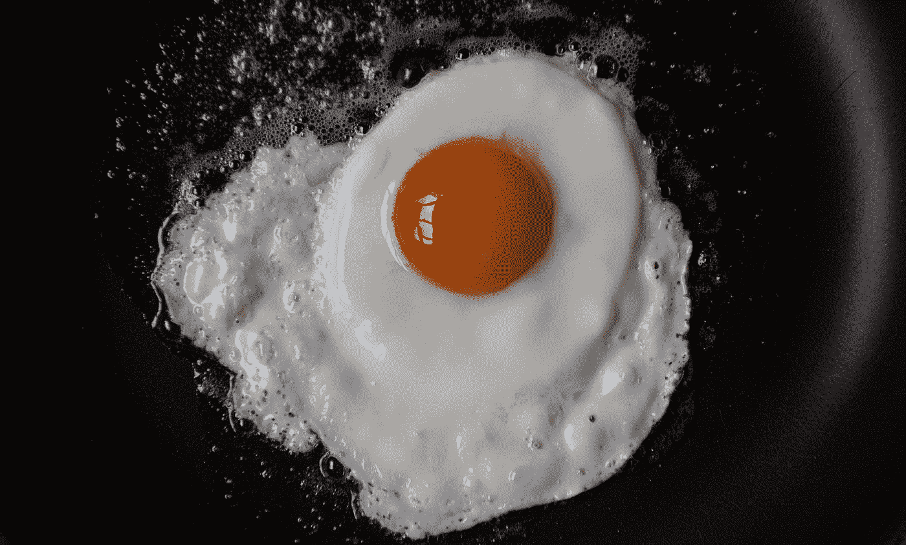

照片由[威廉·冈克尔](https://unsplash.com/@wilhelmgunkel?utm_source=medium&utm_medium=referral)在 [Unsplash](https://unsplash.com?utm_source=medium&utm_medium=referral) 上拍摄

我特别选择了一些例子，在这些例子中，单词“sunny”/“sunniest”被用作隐喻和形容词。让我们看看编码是否能捕捉到这种差异。

```
#some example sentences
example_sentences = ["The weather is going to be really warm today",

                     "Today is going to be the sunniest day of the year",

                     "I like my eggs sunny side up",

                     "Breakfast is my favourite meal"]#get embeddings for each example sentence
embed = [getUSEEmbed(i) for i in example_sentences]#set up a dictionary where each sentece is a key and its value is its 512 vector embedding
dic_ = dict(zip(example_sentences,embed))#let's find all the unique pairwise sentence combinations
combo = [list(i) for i in itertools.combinations(example_sentences, 2)]
```

现在我们需要一个函数来计算相似度。

```
def cosineSimilarity(vec_x,vec_y):

    """Function returns pairwise cosine similarity of two vector arguments"""

    return cosine_similarity([vec_x],[vec_y])[0][0]
```

让我们制作一个数据框架，映射每个独特句子对的余弦相似度。

```
#empty list for data
cs = []#lop through each unique sentence pairing
for i in range(len(combo)):

    #get cosine similarity for each
    cs_ = cosineSimilarity(dic_[combo[i][0]],dic_[combo[i][1]])

    #append data to list
    cs.append((combo[i][0],combo[i][1],cs_))#construct DataFrame
cs_df = pd.DataFrame(cs,columns['sent_1','sent_2','cosine_similarity']).\
                    sort_values(by='cosine_similarity',ascending=False)
```

让我们检查数据帧。

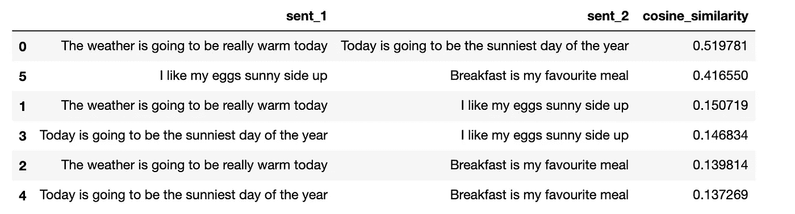

比较四个句子的余弦相似度

这太酷了。**最相似的句子有更多的相似向量**(余弦相似度 0.41 / 0.51)。即使使用一个作为隐喻和形容词的词有歧义，编码也是足够不同的。让我们看看是否可以将这一点应用到我们的歌词中。

# 获取每首歌曲的嵌入


由[塞萨尔·马丁内斯·阿吉拉尔](https://unsplash.com/@nosoycesar?utm_source=medium&utm_medium=referral)在 [Unsplash](https://unsplash.com?utm_source=medium&utm_medium=referral) 拍摄的照片

首先，我们需要得到每首歌的向量。

```
#get USE embeddings for each song
df_embed = pd.DataFrame([getUSEEmbed(df.lyrics[i]) for i in range(df.shape[0])],\
                        index=[df.song[i] for i in range(df.shape[0])])
```

用`df_embed.head(5)`检查数据帧

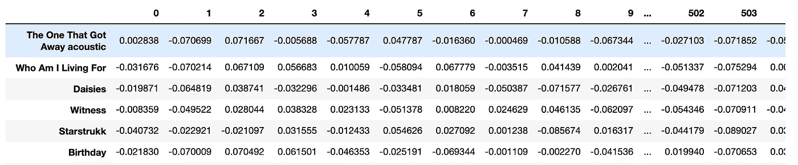

每首歌曲的向量—高维度/列

让我们使用另一种数据简化技术— **主成分分析**，来减少这些嵌入的维度，同时保留尽可能多的方差。

我构建了一个全面的函数来完成这项工作。

PCA 函数将维数减少到 n=1，2，3 个分量

让我们调用这个函数并获得三个新的数据帧。

```
pc_1 = musixmatch_PCA(df,df_embed,n_components=1)
pc_2 = musixmatch_PCA(df,df_embed,n_components=2)
pc_3 = musixmatch_PCA(df,df_embed,n_components=3)
```

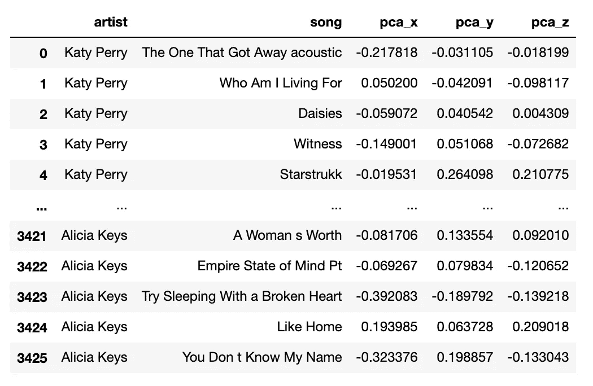

示例数据帧输出

我们来做一些分组，探讨一下哪些艺人的歌词彼此最相似。

正如我们所看到的——即使只有一个组成部分，不同流派的艺术家也倾向于聚集在一起。死亡金属、重金属和摇滚彼此略有不同，但与流行音乐和灵魂乐有很大不同。这是有道理的。

如果你熟悉这些乐队，当你向下滚动时，你会对流派如何演变有强烈的感觉，我们可以在主成分 1 的变化中看到这一点。

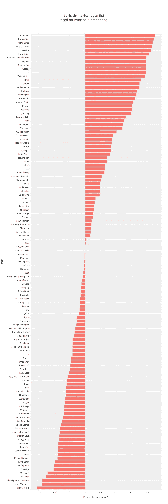

此处原创剧情:[https://chart-studio.plotly.com/~kitsamho/248](https://chart-studio.plotly.com/~kitsamho/248)

让我们看看同样的分析，但是**是按流派分组的。**

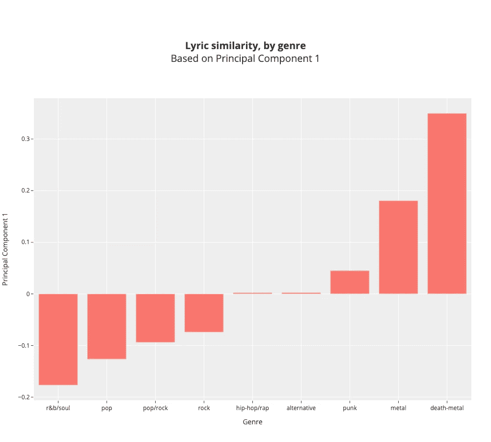

此处原创剧情:[https://chart-studio.plotly.com/~kitsamho/248](https://chart-studio.plotly.com/~kitsamho/248)

这个平均视图证实了我们上面的怀疑。

让我们做一个更复杂的可视化，使用散点图来显示这些数据。

我们可以在二维空间(PC1、PC2)中观察，也可以在三维空间(PC1、PC2、PC3)中观察

下面的函数将上面的一些函数与一些更复杂的 Plotly 函数结合起来，生成二维(PC1 / PC2)或三维(PC1 / PC2 / PC3)散点图

让我们调用函数，看看情节是什么样的。同样，我强烈建议你点击页脚处的剧情链接，如果你想和所有类型互动，以及它们在剧情中的位置。

```
scatPlot_2 = musixmatch_scatplot(df,df_embed,n_components=2)
```

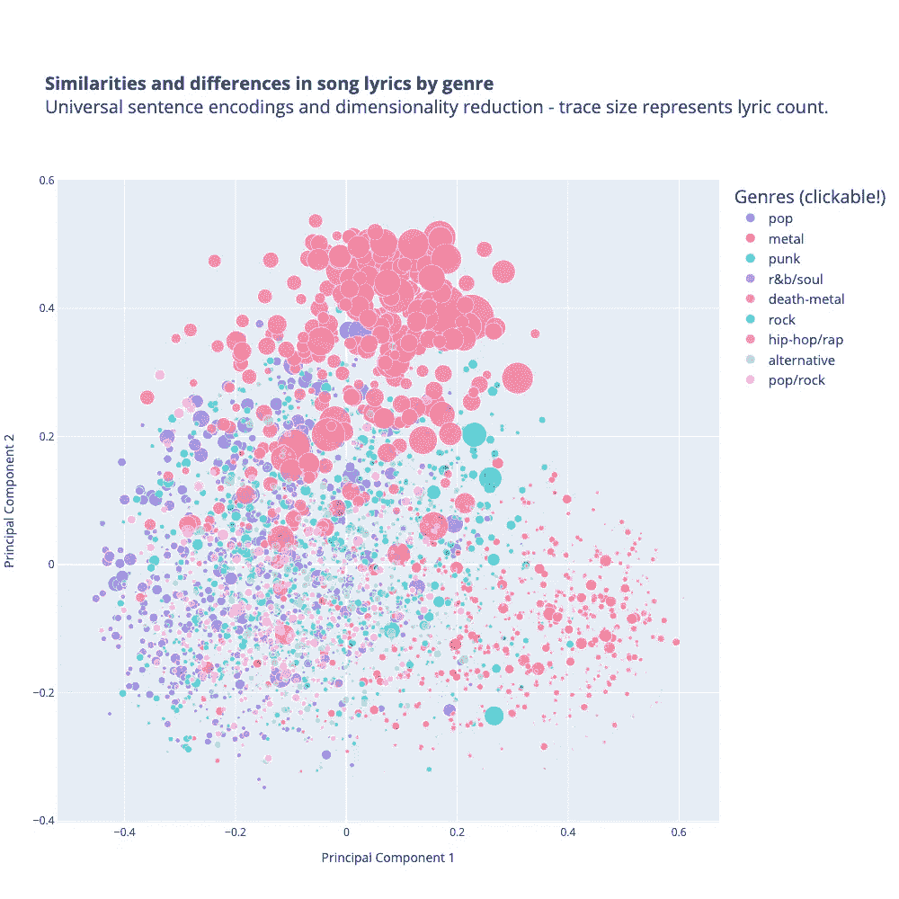

互动剧情点击这里:[https://plotly.com/~kitsamho/236/](https://plotly.com/~kitsamho/236/)

我们也可以创建一个类似的图，但是利用 PCA 的 3 个维度。

```
scatPlot_3 = musixmatch_scatplot(df,df_embed,n_components=3)
```

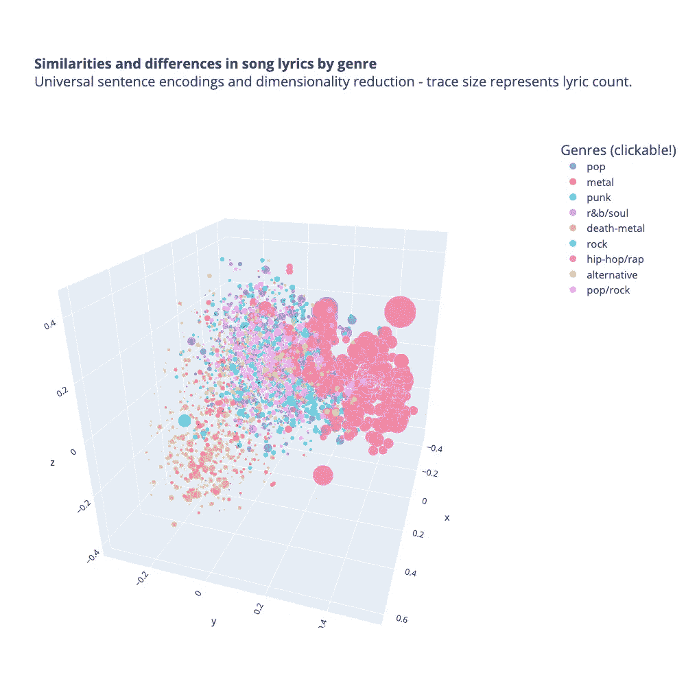

互动剧情点击这里:[https://plotly.com/~kitsamho/238/](https://plotly.com/~kitsamho/238/)

# 结论


[亚历克斯](https://unsplash.com/@alx_andru?utm_source=medium&utm_medium=referral)在 [Unsplash](https://unsplash.com?utm_source=medium&utm_medium=referral) 上的照片

我们已经表明，不同音乐流派的歌词确实有所不同，尽管有趣的是，当我们以逐步的方式从一种流派转移到另一种流派时，歌词内容之间有着非常明显的关系。我认为下面的形象化很清楚地将这一点带到了生活中。


不同流派的**歌词并不完全相互排斥**——除非你比较两个极端。也就是说，死亡金属和灵魂乐之间有很大的区别，但区别流行音乐和流行摇滚的方式却很少。

这些发现反映了音乐的真实本质，因为音乐类型是不固定的，对于每一种类型，都可能有一种“邻近的”类型在抒情内容上是相似的。

毕竟很多 r&b/soul 的粉丝也会喜欢 pop…..但也许不是朋克和/或金属？

# 应用程序


照片由[JESHOOTS.COM](https://unsplash.com/@jeshoots?utm_source=medium&utm_medium=referral)在 [Unsplash](https://unsplash.com?utm_source=medium&utm_medium=referral) 上拍摄

我们已经表明，通用句子编码/迁移学习是一种非常强大和非常简单的技术，可以用来找出不同流派歌词的差异和相似之处。

它在其他问题上的应用有很多:

*   **歌曲/歌词推荐系统** —使用相似性度量来查找具有相似歌词的歌曲
*   **通过查找相似的文档(如电子邮件、客户反馈/评论)对大量文本进行分段**
*   识别**抄袭**
*   用作**分类任务**的特征

感谢您的阅读，如果您想进一步交流，请联系我们！我把笔记本保存在 GitHub 上，所有代码都准备好了，可以在其他项目中使用。如果有，请告诉我，我很想看。

萨姆（男子名）

# 参考和链接

*   [1] GitHub(含 Jupyter 笔记本):[https://GitHub . com/kitsamho/song lyrics _ univeral _ sentence _ encoder](https://github.com/kitsamho/songlyrics_univeral_sentence_encoder)
*   【2】美汤:[https://www.crummy.com/software/BeautifulSoup/bs4/doc/](https://www.crummy.com/software/BeautifulSoup/bs4/doc/)
*   [3]谷歌通用句子编码器:[https://tfhub.dev/google/universal-sentence-encoder/4](https://tfhub.dev/google/universal-sentence-encoder/4)
*   [4]阴谋地:[https://plot.ly/python/](https://plot.ly/python/)
*   [5]musix match . com:【https://www.musixmatch.com/ 