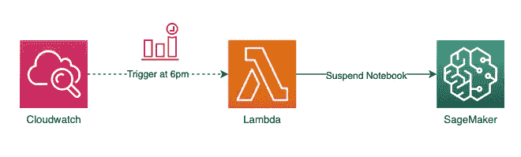
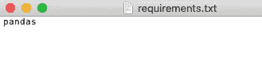
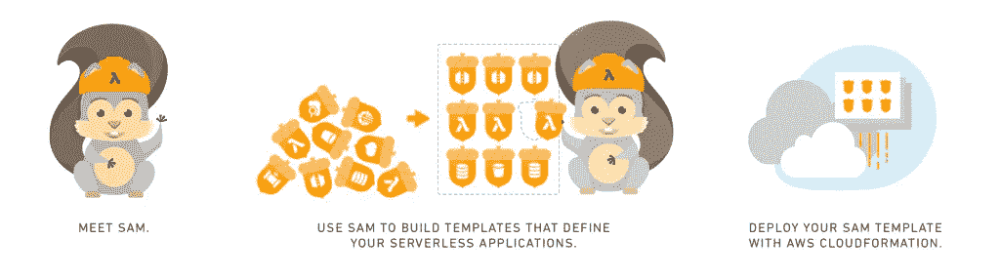
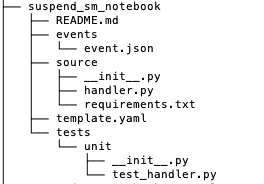
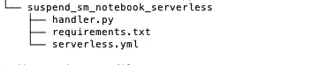
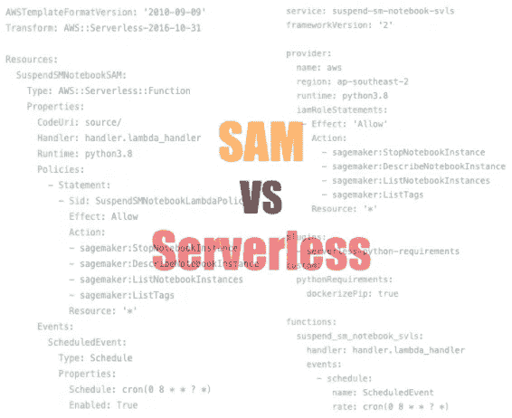
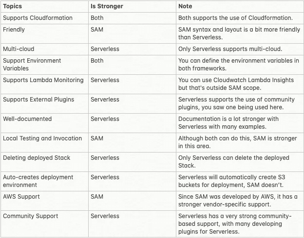

# 使用无服务器和 SAM 部署预定的 Lambda

> 原文：<https://towardsdatascience.com/using-serverless-and-sam-to-deploy-a-scheduled-lambda-with-packages-ed7efdc73070?source=collection_archive---------15----------------------->

## [实践教程](https://towardsdatascience.com/tagged/hands-on-tutorials)

## 使用 AWS SAM 和无服务器构建和部署计划的 AWS Lambda 以及外部平台相关包


图片来源:来自 [unsplash](https://unsplash.com/photos/ErWSi1CA-vo) 的古伊列梅·加西亚

# Lambda 构建和部署

有几种方法可以部署 Lambda 函数，最常见的方法是在 IDE 中编写代码，测试，保存，然后部署。您可能还需要它在某个时间运行，同样，更多的点和 Cloudwatch 事件的点击。这不符合**最佳实践**、**易于管理**如撤销变更、**版本控制**和**代码可重用性**。

## 基础设施作为代码

然而，由于许多开源工具的可用性，管理和供应云资源已经变得容易得多，这些工具允许您通过使用人类可读的配置文件(如 YAML)来定义和配置您的资源。其中， **AWS 无服务器应用程序模型(SAM)** 和**无服务器**，是将 Lambda 部署为依赖项和 IaC 的最佳框架。

## 问题陈述:暂停笔记本资源



Cron 调度的 Lambda 的设计视图

与许多数据科学家一起工作，我们经常面临的问题之一是笔记本电脑在下班后不使用时仍在运行。在本文中，我将演示如何使用 SAM 和 Serverless 部署一个带有外部依赖的 cron 调度的 Lambda，以挂起 SageMaker 笔记本。

我们将部署的 Python 代码如下:

注意:任何带有 always_on: no 标签的笔记本都将被暂停

和需求文件:



requirements.txt 内容

*我们用熊猫做什么……没什么，我只是想展示一个引入外部依赖的例子。*

## **设置 AWS CLI**

确保您的计算机上安装了 AWS CLI，并且您已经使用`aws configure`设置了环境。

*最好练习* *使用临时凭证，或 CI/CD 环境进行部署。*

# AWS 无服务器应用程序模型(SAM)



图片来源: [AWS](https://aws.amazon.com/blogs/aws/new-aws-sam-local-beta-build-and-test-serverless-applications-locally/)

## SAM 概述

AWS SAM 是一个**开源框架**，允许您将 Lambda 等无服务器应用程序部署到 AWS。它支持配置管理、本地测试和调试，以及与 DevOps 流程的集成。SAM 使用最佳实践方法将配置文件转换为 Cloudformation 脚本。

## 部署具有外部依赖性的 SAM 调度 Lambda

**5 个简单步骤:**


**1。安装 SAM CLI**

按照此[链接](https://docs.aws.amazon.com/serverless-application-model/latest/developerguide/serverless-sam-cli-install.html)安装 SAM CLI，我们将使用它将 SAM 包部署到 AWS 上。SAM 需要 Docker 和 amazon 映像来进行本地测试和构建部署，因为 Lambda 是基于 Linux 的环境。

`> docker pull amazon/aws-sam-cli-build-image-python3.8`

**2。创建您的 SAM 项目**

运行以下命令创建您的项目:

```
> sam init --runtime python3.8 *--app-template hello-world --name suspend_sm_notebook* 
```

您应该看到创建了以下文件夹和文件:



注意:文件夹 hello_world 重命名为 source，并添加了 requirements.txt

将 Python 代码复制到`handler.py`中，然后就可以构建 YAML 文件来部署 Lambda 和基于时间的 Cloudwatch 事件了。

**3。构建 SAM 模板**

完整模板

使用 SAM，您可以部署各种无服务器模型，但是因为我们想要部署 Lambda，所以资源类型将是`Function`。还增加了一项政策，允许其与 SageMaker 笔记本电脑进行交互。SAM `Event`将通过 Cron 表达式经由`Schedule`调用 Lambda 函数。

**4。建造你的萨姆**

一旦您完成了测试，您就可以构建您的部署，该部署会将您的代码与来自需求的任何依赖项打包在一起。由于`pandas`的性质，它必须在类似 lambda 的容器中编译。

`**>** sam build --use-container --manifest source/requirements.txt`

**5。部署您的 SAM**

最后，您可以部署到您的 AWS 环境中。SAM 将使用在您的设备上设置的 AWS 配置，只需确保它具有所需的访问权限和现有的 S3 存储桶。

`**>** sam deploy --stack-name SuspendSMNotebookSAM --s3-bucket sam-lambda-deploy-apse2-jy --region ap-southeast-2 --capabilities CAPABILITY_IAM`

# 无服务器应用框架


图片来源:[无服务器](https://www.serverless.com/)

## 无服务器概述

Serverless 是一个**开源框架**，它允许您将无服务器应用程序部署到云中。与 SAM 不同，它还允许您部署到其他云，如 GCP 和 Azure，并有一个免费的托管仪表板来提供完整的应用程序生命周期管理视图。

## 部署具有外部依赖性的 SAM 调度 Lambda

**4 个简单步骤:**


**1。安装无服务器 CLI**

按照此[链接](https://www.serverless.com/framework/docs/getting-started/)进行无服务器设置。对于那些已经安装了节点的用户，可以使用 npm 进行安装。无服务器允许您安装可用于部署的插件。在这种情况下，python-requirements 插件用于允许无服务器将 python 与需求中的依赖项打包在一起。

`**>** npm install -g serverless`

`**>** docker pull lambci/lambda:build-python3.8`

`**>** serverless plugin install -n serverless-python-requirements`

**2。创建您的无服务器项目**

运行以下命令创建您的项目:

`**>** serverless create --template aws-python3 --path suspend_sm_notebook_serverless`

您应该会看到以下创建的文件:



注意:添加一个 requirements.txt

**3。构建无服务器模板**

完整模板

作为一个多云框架，必须将目标提供商定义为 AWS 和 ap-southeast-2 region。添加 Lambda 的策略和角色是为了授予 SageMaker 访问权限，以及授予 cron 调度调用`schedule`访问权限。

**4。部署您的无服务器**

这一步很简单，只需运行下面的命令，它会在后台将您的无服务器模板转换为 Cloudformation，在需求中打包依赖项，并为您的部署创建一个 S3 存储桶。

`> serverless deploy`

**回滚和删除部署(可选)**

无服务器允许您回滚到以前的部署:

`> serverless deploy list`

`> serverless rollback --timestamp <timestamp>`

或者清理并从 AWS 中删除我们部署的堆栈。

`> serverless remove`

# 那么…我应该用哪一个呢？



图片来源:作者

正如您所看到的，AWS SAM 和 Serverless 都实现了允许您使用外部平台相关包将 cron 调度的 Lambda 部署到 AWS 的目标。这些框架在配置格式和简单性方面本质上也是相似的。然而，它们也有各自的优点和缺点:



无服务器和 SAM 的比较

在选择 Serverless 还是 SAM 时，一些因素应该基于您想要实现的目标、您的团队能力和专业知识以及强大的社区(开源)。

作为一个建议，如果您在一个多云环境中工作，无服务器可能是一个更好的选择，但是如果本地测试和评估更重要，那么 SAM 可能更适合您的团队。

# 关于我

> 我喜欢写媒体文章，并为知识共享社区做贡献。除了尝试新的食物配方，我还帮助企业构建云和数据解决方案。请随时与我联系并向我问好！
> 
> — [李帝努·雅玛](https://www.linkedin.com/in/cyamma/)