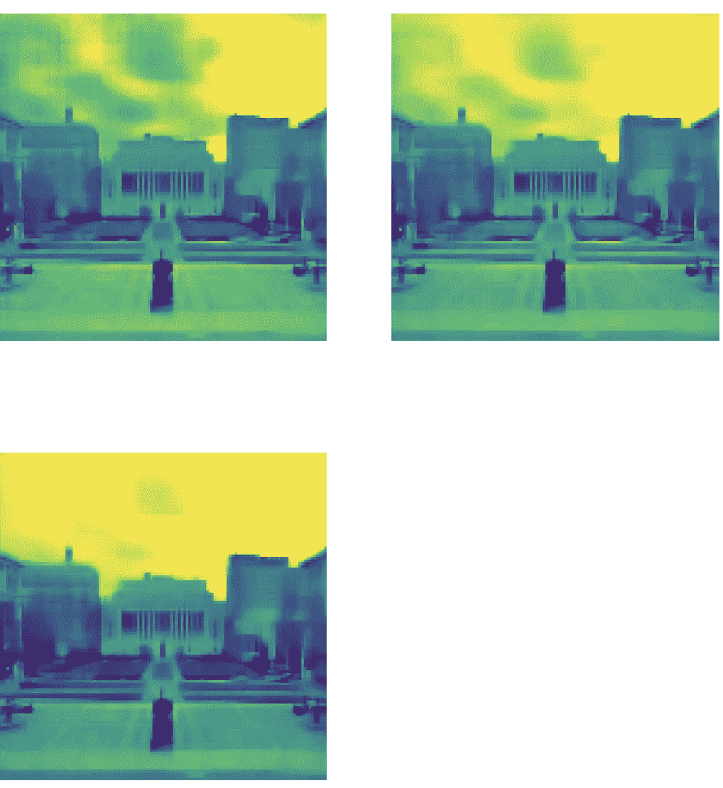

# 使用跳过连接来增强去噪自动编码器算法

> 原文：<https://towardsdatascience.com/using-skip-connections-to-enhance-denoising-autoencoder-algorithms-849e049c0ac9?source=collection_archive---------25----------------------->

## 在 Flickr 的一个 RGB 图像样本上，比较了具有跨越瓶颈的残差网络的自动编码器和没有残差网络的自动编码器的去噪性能。

# 自动编码器:

官方的 [Keras](https://blog.keras.io/building-autoencoders-in-keras.html) 博客，称自动编码器为“**自我监督**算法的一个例子，因为它们的**目标是从输入数据**生成**。因此，它们被用于图像重建的任务。**

**自动编码器的主要部件有: ***编码器、瓶颈*和*解码器*** 。编码器在每一步提取图像特征，并在此过程中压缩输入数据。瓶颈将输入限制在其最低维度，即输入数据的压缩表示。解码器出现在这个瓶颈之后，用于重构输入数据。损失测量用于比较生成或重建的数据与输入数据的接近程度。**

# **图像去噪:**

****

**来源: [GIPHY](https://giphy.com/gifs/color-colour-FkUyGd7FDh1gk)**

**数据去噪图像是自动编码器的一个常见应用。图像中的噪声可以理解为图像颜色或亮度的*随机变化*，降低图像质量。在图像数据的各种使用情况下，去除这种噪声通常是预处理步骤。卷积自动编码器可用于此目的。编码器学习提取将它们与图像中的噪声分开的特征。从而压缩图像。来自瓶颈的最终压缩表示被传递到解码器。解码器最终解压缩图像，使噪声最小化。**

## **跳过从编码器到解码器的连接**

**我们知道深度神经网络遭受**[*退化问题*](https://arxiv.org/abs/1512.03385) 。由于自动编码器具有多个卷积和去卷积层，因此当重建图像时，由于这种信息丢失，它们的性能也会受到影响。由跳跃连接组成的剩余网络是解决这个问题的已知方案。因此，为了提高自动编码器的性能，可以从编码器到解码器添加这样的“跳过连接”，即跨越瓶颈 的 ***。这些附加连接可以直接将特征映射从编码器的较早层发送到解码器的较晚层。这有助于解码器形成输入图像的更清晰定义的解压缩。*******

********

****跨越瓶颈的剩余网络，来源:作者****

****为了了解这些残差网络的优势，让我们来看看卷积自动编码器模型不同阶段的激活输出。首先，我们训练了一个没有跨越瓶颈的跳跃连接的自动编码器模型。然后，我们添加它们，并在相同的图像样本上再次训练模型。****

# ****数据集****

****10K RGB 图像的样本取自 Kaggle 上 Flickr 图像的[数据集。所有的分析都是使用 Google Colab 的 GPU 完成的。](https://www.kaggle.com/hsankesara/flickr-image-dataset)****

# ****模型****

****我们使用 Keras 的功能 API 来构建自动编码器模型。由于计算限制，输入图像被调整到较小的尺寸(128，128，3)。图像像素也以 1/255 的因子标准化。此外，通过应用高斯噪声矩阵，图像被故意破坏。这些损坏的图像形成了自动编码器的输入，而原始图像在训练模型时被用作目标。构建卷积网络时，重要的是要记住，随着深入，通道或滤波器的数量会增加，而输入的大小(高度和宽度)会减小。****

```
****#Input** 
input_img = Input(shape=(128, 128, 3))**#Encoder** 
y = Conv2D(32, (3, 3), padding='same',strides =(2,2))(input_img)
y = LeakyReLU()(y)
y = Conv2D(64, (3, 3), padding='same',strides =(2,2))(y)
y = LeakyReLU()(y)
y1 = Conv2D(128, (3, 3), padding='same',strides =(2,2))(y) **# skip-1**
y = LeakyReLU()(y1)
y = Conv2D(256, (3, 3), padding='same',strides =(2,2))(y)
y = LeakyReLU()(y)
y2 = Conv2D(256, (3, 3), padding='same',strides =(2,2))(y)**# skip-2**
y = LeakyReLU()(y2)
y = Conv2D(512, (3, 3), padding='same',strides =(2,2))(y)
y = LeakyReLU()(y)
y = Conv2D(1024, (3, 3), padding='same',strides =(2,2))(y)
y = LeakyReLU()(y)**#Flattening for the bottleneck**
vol = y.shape
x = Flatten()(y)
latent = Dense(128, activation='relu')(x)** 
```

****下面是解码器的代码。转置卷积或反卷积层用于构建该解码器。[去卷积层](https://machinelearningmastery.com/upsampling-and-transpose-convolution-layers-for-generative-adversarial-networks/)的工作方式大致类似于卷积层和上采样层的组合。最初，我们在没有第一个和第二个跳过连接的情况下训练模型。然后，使用 Keras 中 layers API 的 Add()将这些连接从编码器的早期层添加到解码器的后期层。lrelu_bn()辅助函数用于将激活应用于这些添加，并将结果传递给批处理规范化层。****

```
****# Helper function to apply activation and batch normalization to the # output added with output of residual connection from the encoder**def lrelu_bn(inputs):
   lrelu = LeakyReLU()(inputs)
   bn = BatchNormalization()(lrelu)
   return bn**#Decoder**
y = Dense(np.prod(vol[1:]), activation='relu')(latent)
y = Reshape((vol[1], vol[2], vol[3]))(y)
y = Conv2DTranspose(1024, (3,3), padding='same')(y)
y = LeakyReLU()(y)
y = Conv2DTranspose(512, (3,3), padding='same',strides=(2,2))(y)
y = LeakyReLU()(y)
y = Conv2DTranspose(256, (3,3), padding='same',strides=(2,2))(y)
y= Add()([y2, y]) **# second skip connection added here**
y = lrelu_bn(y)
y = Conv2DTranspose(256, (3,3), padding='same',strides=(2,2))(y)
y = LeakyReLU()(y)
y = Conv2DTranspose(128, (3,3), padding='same',strides=(2,2))(y)
y= Add()([y1, y]) **# first skip connection added here**
y = lrelu_bn(y)
y = Conv2DTranspose(64, (3,3), padding='same',strides=(2,2))(y)
y = LeakyReLU()(y)
y = Conv2DTranspose(32, (3,3), padding='same',strides=(2,2))(y)
y = LeakyReLU()(y)
y = Conv2DTranspose(3, (3,3), activation='sigmoid', padding='same',strides=(2,2))(y)**
```

****因为输入图像是标准化的，所以它们的结果像素值在 0 和 1 之间。为了获得可比较的重建图像，在最终层中使用了“sigmoid”激活。在训练集之外，1k 个图像被用作验证集。使用二元交叉熵作为损失函数。最后，两个模型都被训练了 200 个时期，最小批量为 32。学习率为 0.001 的 Adam 优化器在收敛时给出最小的训练和验证损失。****

*******让我们来看看测试图像模型各层的激活输出。这将有助于我们清楚地看到编码器-解码器的作用！*******

****激活输出是使用 [keract](https://github.com/philipperemy/keract) 包创建的。****

## ****测试图像:****

****我们拍摄一张哥伦比亚大学校园的测试图片。测试图像根据模型调整了大小，并添加了随机噪声。“有噪声的”图像被用作模型的输入。****

************

原始调整大小的图像(左)，添加了随机噪声的图像用作模型的输入。(右)**** 

## ****编码器的激活输出****

********

****第一卷积层的激活输出****

****由于两种型号的编码器相同，因此该部件的激活输出也相同。在检查前三个卷积层的激活输出时，可以看到大部分图像信息被保留。这也可能意味着图像中的噪声也保留在模型的这个阶段。然而，当我们深入模型时(参见第三个卷积层之后的层的激活输出)，保留的信息相当抽象。该模型开始提取更高层次的特征，例如边界、拐角和角度。****

********

****第二和第三卷积层的激活输出****

************************

****“摘要”第四、第五和第六卷积层的激活输出****

********

****第七卷积层的激活输出和输入图像的压缩表示****

## ****解码器的激活输出(没有跨越瓶颈的跳跃连接的模型)****

****有趣的是，解码器的激活输出与上述编码器的序列完全相反。****

************************

****第一、第二和第三去卷积层的激活输出****

****在第三个去卷积层之后，我们仍然看不到图像的任何边缘被再次形成。****

************************

****第四、第五和第六解卷积层的激活输出****

****如下图所示，在解码器的最后一层，没有明确定义图像的解压缩方式！****

****************

****第七反卷积层和最后一层的激活输出****

## ****解码器的激活输出(添加了跳过瓶颈连接的模型)****

****正如在编码器的激活输出中所看到的，其早期层保留了噪声，但是后期层提取了图像的更高表示。因此，从编码器的第三和第五卷积层到解码器的第三和第五去卷积层进行跳跃连接。该解码器的第一、第二和第三解卷积层的激活输出与先前版本的解码器相同。然而，在第三层之后，我们看到激活输出与先前解码器的不同。下面我们可以清楚地看到，在第六个反卷积层的激活输出中，图像再次形成。****

************************

****第四、第五和第六解卷积层的激活输出****

****该解码器的最后一层给出了测试输入图像的清晰定义的解压缩版本。****

****************

****第七反卷积层和最后一层的激活输出****

# ****结果的比较****

****第一个模型的去噪图像输出:****

********

****具有跨越瓶颈的跳跃连接的第二模型的去噪图像输出:****

********

****我们可以清楚地看到，跨越瓶颈连接的 autoencoder 模型性能更好！****

# ****前方的路…****

****除了对图像去噪之外，这种方法可以用于自动编码器的任何图像重建应用。虽然跳过连接提高了自动编码器的性能，但是可以试验这些连接的位置和数量。该模型也可以用不同级别的噪声因子来训练，以便更好地概括结果。完整的代码可以访问[这里](https://github.com/MS1997/Autoencoders-with-skip-connections)！****

## ****参考资料:****

****J.董，人。毛，沈振华。杨，【2017】利用卷积自动编码器和对称跳跃连接学习深度表示****