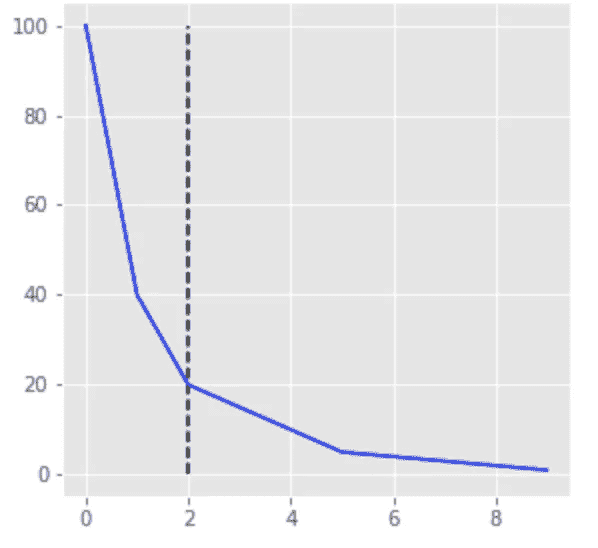

# 使用通气管进行多标签标注。

> 原文：<https://towardsdatascience.com/using-snorkel-for-multi-label-annotation-cc2aa217986a?source=collection_archive---------13----------------------->

## 如何使用浮潜的多类实现来创建多标签


hazy research @[Snorkel.org](http://snorkel.org)的浮潜

sculpt 是一个很好的小软件包，它允许我们使用标签函数(LFs ),简单如启发式或关键字，复杂如算法和人工注释器，以便创建一个标签数据集，用于训练分类器。

> “通气管是一个系统，用于以编程方式*建立和管理训练数据集**，而无需手动标记**。在 snuck 中，用户可以在几小时或几天内开发大型训练数据集，而不是在几周或几个月内手工标记它们。”—[Snorkel.org](https://www.snorkel.org/get-started/)*

## *动机*

*使用通气管来创建多标签的动机很简单。通气管允许我们使用简单的试探法或关键字来创建一个监督数据集。当我们需要理解为什么一个样本被分配到一个特定的类别时，使用它作为一个标记算法允许一定程度的清晰度。你也可以想到这样一个场景，你创建了一个启发式的多标签算法，分配稀疏数量的多标签；当您的产品或功能需要大量的多标签，以便为您的客户提供更高的价值。*

## *通气管*

*值得注意的是，在整个过程中，我们实际上是在创建两个分类器，第一个使用的是 sauce 的 *MajorityLabelVoter* 或 *LabelModel，*前者为我们提供了一个多数票作为基线，后者为我们提供了 secret-sauce 模型，后者是为了训练一个机器或深度学习(MLDL)算法，因为我们不想依赖我们创建的标签函数。我们希望训练一个不局限于我们的关键字、正则表达式等的分类器。我们想要一个比我们给它的更一般化的分类器。理想情况下，它会发现，例如，我们在标记过程中没有考虑到的标记与我们的最终标记之间的相关性。*

## *使用多级通气管*

*首先，我们需要了解如何使用通气管。考虑一个情感分类任务和下面的句子:1。“蛋糕尝起来真难吃”，2。“奶油真好”& 3。“这食物是公平的”。这些句子分别是否定句、肯定句和中性句。因此，我们将创建几个相应地分配标签的逻辑框架。*

```
*from snorkel.labeling import labeling_function

@labeling_function()
def lf_keyword_good(x):
    return POSITIVE if "good" in x.text.lower() else ABSTAIN

@labeling_function()
def lf_keyword_bad(x):
    return NEGATIVE if "bad" in x.text.lower() else ABSTAIN@labeling_function()
def lf_keyword_fair(x):
    return NEUTRAL if "fair" in x.text.lower() else ABSTAIN*
```

*剩下的过程很简单，一旦你有了很多 LFs，你就可以把它们用在你的*熊猫身上。DataFrame* 训练其中一个模型，即 *MajorityLabelVoter* 或 *LabelModel。**

```
*from snorkel.labeling import LabelModel, PandasLFApplier

# Define the set of labeling functions (LFs)
lfs = [lf_keyword_bad, lf_keyword_good, lf_keyword_fair]

# Apply the LFs to the unlabeled training data
applier = PandasLFApplier(lfs)
L_train = applier.apply(df_train)

# Train the label model and compute the training labels
label_model = LabelModel(cardinality=3, verbose=True)
label_model.fit(L_train, n_epochs=500, log_freq=50)
df_train["label"] = label_model.predict(L=L_train, tie_break_policy="abstain")*
```

**df_train["label"]* 也将包含弃权标签，因此为了进一步训练我们的二级分类器，我们必须将它们过滤掉。*

```
*df_train = df_train[df_train.label != ABSTAIN]*
```

*同样，在过滤的数据集上训练二级分类器(在本例中为随机森林)的目的是“**推广到标注函数和**T0 的覆盖范围之外*

```
***from** **sklearn.ensemble** **import** RandomForestClassifier

clf = RandomForestClassifier()
clf.fit(df_train.drop(['label'],axis=1), df_train["label"])*
```

## *将通气管用于多标签*

*通气管只能作为多类贴标机开箱使用。要将其用于多标签，您可以执行以下三种方法之一:*

1.  *使用 *MajorityLabelVoter 的* predict_proba()并分配所有“概率”≥ 0 的类。即第一个和最后一个[0.5，0，0.5]。我们可以把它想象成一个样本，它存在于两个聚类中，或者来自两个类别的两个关键词，这允许一个样本具有多个标签。例如，“汉堡包有好有坏”。*
2.  *使用 *LabelModel 的* predict_proba，分配所有概率高于“拐点”的类。可以用 [Kneed](https://pypi.org/project/kneed/) 算出来。本质上，我们的概率是 softmax，只有少数人会得到高值。请注意，根据我的实证测试，MajorityLabelVoter 的概率值与 LabelModel 的概率值之间有很高的相关性，即前者是一个“硬”softmax，而后者是你对 softmax 的预期。即[0.5，0，0.5]对[0.45，0.06，0.49]。*
3.  *使用 *MajorityLabelVoter* 或 *LabelModel* 训练“一对所有”模型，并根据预测分配多标签。请注意，在考虑放弃标签时，您需要考虑一个策略。*

**

*最高概率的图示。*

## *实践中的多标签*

*因为“1”和“2”给出了相似的输出，并且从“1”获得多标签的计算更简单，所以我选择基于 1 分配多标签。*

*请注意，当一个模型分配一个弃权标签时，它不能决定谁是赢家。我们在 predict_proba()的输出中观察到了这种行为。比如考虑下面这个概率向量:[1.0，0，0]，这里的赢家是第一类。现在，考虑下面的向量:[0.5，0，0.5]，我们看到这不是一个明确的赢家，因此，浮潜将分配一个弃权标签。*

*当我们为每个具有非零概率的类分配一个标签时，我们实际上消除了所有的放弃标签，标记了所有的数据集，并为每个样本分配了许多多标签。*

*以下代码使用了一个 *MajorityLabelVoter* 分类器，并根据所有分数高于零的类分配标签。就这么简单:)。*

```
*from snorkel.labeling import MajorityLabelVoter
from sklearn.preprocessing import MultiLabelBinarizerY = [['POSITIVE', 'NEGATIVE', 'NEUTRAL']]# fit a MultiLabelBinarizer
mlb = MultiLabelBinarizer()
mlb.fit_transform(Y)# create a majority vote model and predict
majority_model = MajorityLabelVoter(cardinality=3)
predictions = majority_model.predict_proba(L=L_test)df_multilabel = pd.DataFrame()
df_multilabel['predict_proba'] = predictions.tolist()# get all the non zero indices which are the multi labels
df_multilabel['multi_labels'] = df_multilabel['predict_proba'].apply(lambda x: np.nonzero(x)[0])

#transform to mlb for classification report
df_multilabel['mlb_pred'] = df_multilabel['multi_labels'].apply(lambda x: mlb.transform([x])[0])print(df_multilabel.head())#convert to str in order to see how many multi labels did we gain
multi_label_string = df_multilabel.multi_labels.apply(lambda x: ", ".join(le.inverse_transform(x)))
print(multi_label_string.value_counts()[:50])# print some metrics using classification report 
y_pred = df_multilabel.mlb_pred.apply(lambda x: list(x)).to_numpy().tolist()
y_true = mlb.transform(Y.values).tolist()print(classification_report(y_true, y_pred, target_names = mlb.classes_))*
```

*就这样，您已经为每个样本创建了多个标签。请记住，由于这种使用浮潜的方法论，在标记策略方面非常贪婪，您可能会得到一个非常面向回忆的模型。你的经历会有所不同。*

*Ori Cohen 博士拥有计算机科学博士学位，主要研究机器学习。他是 TLV 新遗迹公司的首席数据科学家，从事 AIOps 领域的机器和深度学习研究。*