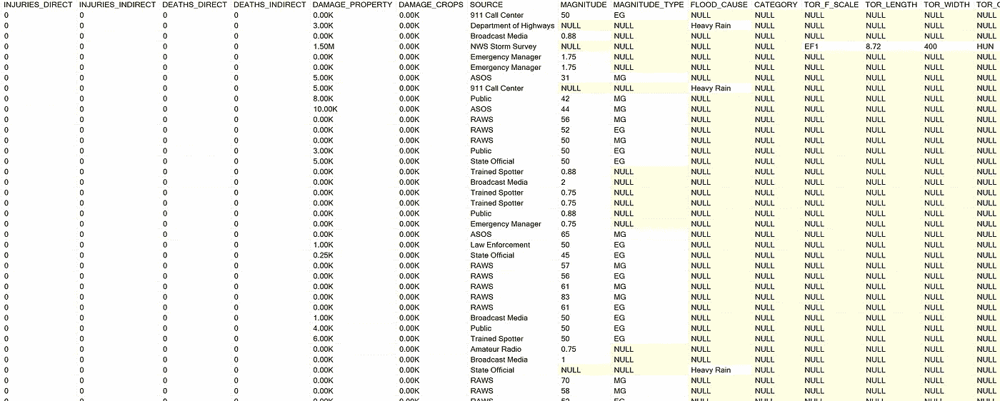
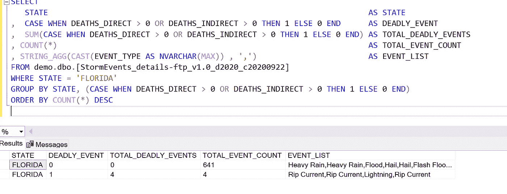

# 用 SQL 玩‘你有过吗？’

> 原文：<https://towardsdatascience.com/using-sql-to-play-have-you-ever-4e1ab7c99967?source=collection_archive---------43----------------------->

## 高级 SQL 技术第 2 部分:collect_list、group_concat、agg_array、string_agg 等等


图片来自 [Pixabay](https://pixabay.com/?utm_source=link-attribution&utm_medium=referral&utm_campaign=image&utm_content=707200) 的[好友痞子](https://pixabay.com/users/brrr-910186/?utm_source=link-attribution&utm_medium=referral&utm_campaign=image&utm_content=707200)

学习使用高级 SQL 技术可以在两个方面帮助你。它使您能够更快地获得洞察力，如果您使用输出进行进一步分析，您可以以最有效的布局清理和格式化数据。如果您的数据已经到达一个可以直接在 python 中使用的格式良好的列表中，该怎么办？让我们回顾一下不同数据库中的一些技术，继续使用我在以前的[文章](/how-to-set-up-ms-sql-server-on-aws-c1105ce08fb4)中使用的恶劣天气细节数据。

虽然这很重要，但我不想只讨论代码的语法，而是想把重点放在业务用例上。学习如何找出哪种技术可以帮助你回答业务问题是至关重要的。为了让它变得有趣，我喜欢关注那些超出典型范围的问题。好吧， [Sharknado 的文章](/hey-data-were-there-any-sharknados-in-2020-b616932faced)有点出格。

## 这个问题

> 佛罗里达，你曾经…经历过导致生命损失的天气事件吗？
> 
> 给我一份所有死亡事件的清单。

## 用 SQL 怎么回答这个问题？

答案取决于你的数据库。每个数据库可能需要稍微不同的 SQL。这也取决于你希望你的结果如何格式化。

需要考虑的事项:

请求者将如何使用该列表？如果他们要将列表传递给 python 程序，您需要提供不同的格式，以便他们将列表剪切并粘贴到 PowerPoint 演示文稿中。

你想要那个列表排序吗？您希望对列表进行重复数据删除吗？

## 数据

数据本质上是“垂直的”,由每个事件的时间戳列出。我们的目标是将这个事件数据展平成一列。


样本风暴数据—作者截图



样本风暴数据—作者截图

如果你想在家玩，这里有一个数据链接:

[](https://www.ncdc.noaa.gov/ncei-severe-weather-data-inventory) [## NCEI 的恶劣天气资料目录

### 恶劣天气数据目录(SWDI)是美国恶劣天气记录的综合数据库。

www.ncdc.noaa.gov](https://www.ncdc.noaa.gov/ncei-severe-weather-data-inventory) 

## MySQL: GROUP_CONCAT()

MySQL Group_Concat 返回找到的元素的列表，以逗号分隔。它没有类似 python 的列表格式["c "，" d "，" e "，" f"]。您可以使用一些额外的代码来创建这种格式，如下所示。


MySQL Group_Concat —作者截图

```
SELECT 
   STATE                                                           
,  CASE WHEN DEATHS_DIRECT > 0 OR DEATHS_INDIRECT > 0 
        THEN 1 ELSE 0 
        END      AS DEADLY_EVENT
,  SUM(CASE WHEN DEATHS_DIRECT > 0 OR DEATHS_INDIRECT > 0 
            THEN 1 ELSE 0 END) 
       AS TOTAL_DEADLY_EVENTS
, COUNT(*)  AS TOTAL_EVENT_COUNT
, GROUP_CONCAT(EVENT_TYPE)  AS EVENT_LIST
, GROUP_CONCAT(DISTINCT EVENT_TYPE) AS UNIQUE_EVENT_LIST
, CONCAT('[' , GROUP_CONCAT( DISTINCT CONCAT( '\"', EVENT_TYPE ,'\"')), ']') AS UNIQUE_EVENT_LIST_BRACKETED
FROM severe_events_details
WHERE STATE = 'FLORIDA'
GROUP BY STATE, (CASE WHEN DEATHS_DIRECT > 0 OR DEATHS_INDIRECT > 0 
THEN 1 ELSE 0 END)
ORDER BY COUNT(*) DESC
```

## 雪花:ARRAY_AGG()和 LISTAGG()

如果请求者想要一个重复数据删除的 python 列表，那么 ARRAY_AGG(DISTINCT)就是您所需要的。如果他们想要一个简单易读的列表，LISTAGG()就很好。


雪花数组 _Agg —作者截图


雪花数组 _Agg —作者截图

```
SELECT 
   STATE AS STATE
,  CASE WHEN DEATHS_DIRECT > 0 OR DEATHS_INDIRECT > 0 
        THEN 1 ELSE 0 END      AS DEADLY_EVENT
,  SUM(CASE WHEN DEATHS_DIRECT > 0 OR DEATHS_INDIRECT > 0 
             THEN 1 ELSE 0 END) AS TOTAL_DEADLY_EVENTS
, COUNT(*)  AS TOTAL_EVENT_COUNT
, ARRAY_AGG(EVENT_TYPE) AS EVENT_LIST
, ARRAY_AGG(DISTINCT EVENT_TYPE) AS UNIQUE_EVENT_LIST
, LISTAGG(DISTINCT EVENT_TYPE ,', ')  AS UNIQUE_LIST_AGGFROM MEDIUM_DEMO.PUBLIC.WEATHER_EVENT_DETAILS
WHERE STATE = 'FLORIDA'
GROUP BY STATE, (CASE WHEN DEATHS_DIRECT > 0 OR DEATHS_INDIRECT > 0 THEN 1 ELSE 0 END)
ORDER BY COUNT(*) DESC
```

## MS SQL-SERVER TSQL: STRING_AGG()

TSQL 有点混乱。创建完整列表和唯一列表需要分成两个不同的查询。请求时，Sting_Agg 不允许使用 Distinct。

你可以得到你需要的东西，但是要达到它需要更多的工作。



TSQL String_Agg —作者截图

```
SELECTSTATE  AS STATE,  CASE WHEN DEATHS_DIRECT > 0 OR DEATHS_INDIRECT > 0 
        THEN 1 ELSE 0 END      AS DEADLY_EVENT,  SUM(CASE WHEN DEATHS_DIRECT > 0 OR DEATHS_INDIRECT > 0 
         THEN 1 ELSE 0 END) AS TOTAL_DEADLY_EVENTS, COUNT(*)  AS TOTAL_EVENT_COUNT, STRING_AGG(CAST(EVENT_TYPE AS NVARCHAR(MAX)) , ',')                        AS EVENT_LISTFROM demo.dbo.[StormEvents_details-ftp_v1.0_d2020_c20200922]WHERE STATE = 'FLORIDA'GROUP BY STATE, (CASE WHEN DEATHS_DIRECT > 0 OR DEATHS_INDIRECT > 0 THEN 1 ELSE 0 END)ORDER BY COUNT(*) DESC
```


TSQL String_Agg —作者截图

```
SELECTSTATE AS STATE
,  CASE WHEN DEATHS_DIRECT > 0 OR DEATHS_INDIRECT > 0 
        THEN 1 ELSE 0 END      AS DEADLY_EVENT,  SUM(CASE WHEN DEATHS_DIRECT > 0 OR DEATHS_INDIRECT > 0 
             THEN 1 ELSE 0 END) AS TOTAL_DEADLY_EVENTS
, COUNT(*)  AS TOTAL_EVENT_COUNT, STRING_AGG(CAST(EVENT_TYPE AS NVARCHAR(MAX)) , ',')                        AS UNIQUE_EVENT_LIST, CONCAT('[' , (STRING_AGG(CONCAT('"', CAST(EVENT_TYPE AS NVARCHAR(MAX)) , '"'), ',')) , ']')   AS UNIQUE_EVENT_LIST_BRACKETEDFROM(SELECT DISTINCT STATE, EVENT_TYPE, DEATHS_DIRECT,DEATHS_INDIRECTFROM demo.dbo.[StormEvents_details-ftp_v1.0_d2020_c20200922]) XWHERE STATE = 'FLORIDA'GROUP BY STATE, (CASE WHEN DEATHS_DIRECT > 0 OR DEATHS_INDIRECT > 0 THEN 1 ELSE 0 END)ORDER BY COUNT(*) DESC
```

## Hive 和 Spark SQL: COLLECT_SET 和 COLLECT_LIST

Collect_List 返回所有值。Collect_Set 返回唯一值。

COLLECT_LIST(EVENT_TYPE)返回[Rip 电流，Rip 电流，闪电，Rip 电流]

COLLECT_SET(EVENT_TYPE)返回[Rip 电流，闪电]

# 结论

根据您的需要和您的数据库，使用 SQL 有许多方法来回答一个业务问题。当您经常在平台之间切换时，所有的命令开始融合在一起。这就是为什么如果有人告诉我他们编码时很少使用谷歌，我会立刻不信任他们。除非他们连续几年只使用一种语言，否则我会把他们叫出来。