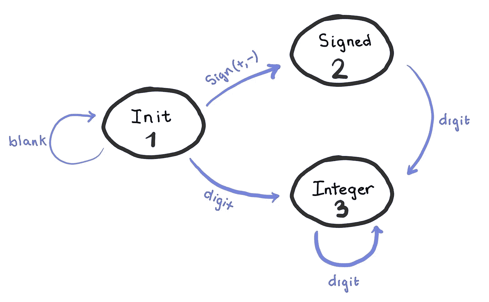
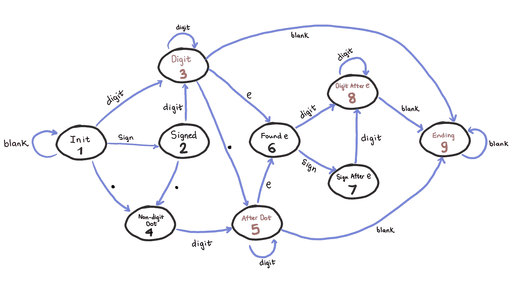

# 用状态机解决复杂编码面试问题。

> 原文：<https://towardsdatascience.com/using-state-machine-to-solve-complex-coding-interview-questions-2b8897e23582?source=collection_archive---------12----------------------->

图片来自 unsplash.com[@ othentikisra](http://twitter.com/othentikisra)

这篇博客是我的“大型科技公司黑客技术面试 15 天备忘单”的一部分。在这篇博客中，我们将使用状态机来解决两个编码面试问题。我希望这些例子能帮助你理解状态机解决问题的方法，以及它在解决包含许多复杂情况的问题时是多么的强大。

# 背景:

有限状态机(FSM)是一种用于设计算法的抽象。它通过转换将有限数量的状态映射到其他状态。状态机在任何给定时刻只能处于一种状态。

使用 FSM 处理编码面试问题的步骤:

*   识别所有类型的输入数据。
*   识别 FSM 的所有可能状态。
*   识别给定输入状态之间的有效转换。
*   画出有限状态机图。
*   按照 FSM 图实现算法。

# 面试问题示例:

> ***问题 1:*** *实现将字符串转换为整数的* `*atoi*` *。* ***完整描述****:*[*https://leetcode.com/problems/string-to-integer-atoi/*](https://leetcode.com/problems/string-to-integer-atoi/)***举例:***`*" -42"*`*=>*`*-42*`*=>*`*4193*``*"words and 987"*`

在这个问题中，我们需要处理三种类型的输入数据:空白字符(空格)、符号字符(+或-)和数字字符(0->9)。我们从初始状态 1 开始。对于空白字符，状态保持在 1，对于符号字符，我们移动到状态 2，对于数字字符，我们移动到状态 3。继续确定状态 2 和 3 中的有效转换，我们有下图。

有了这个图表，我们可以得出下面的算法:

> ***问题 2*** *:验证给定的字符串是否可以解释为十进制数。* ***完整描述****:*[【https://leetcode.com/problems/valid-number/】](https://leetcode.com/problems/valid-number/)***举例:***`*"0"*`*=>*`*true*``*" 0.1 "*`*=>*`*true*``*"abc"*`*=>*`*false*``*false*``*" 6e-1"*`*=>*`*true*`
> `*" 99e2.5 "*`*=>*`*false*``*"53.5e93"*`*=>*`*true*``*" --6 "*`*=>*`*false*`

*相关的输入类型有:空白字符(空格)、符号字符(+或-)、数字字符(0->9)、`*e*`和`*.*` 我们从初始状态 1 开始，扩展到不同的状态，以构建下面的 FSM 图。*

**

*如果输入以状态 3、5、8 或 9 结束，则为有效数字。其余的是中间状态，它们会给出错误的输出。*

*下面是我对 FSM 图的实现。*

# *结论*

*使用状态机有助于避免代码中出现太多嵌套的 if-else 语句，并使代码更加简单。*