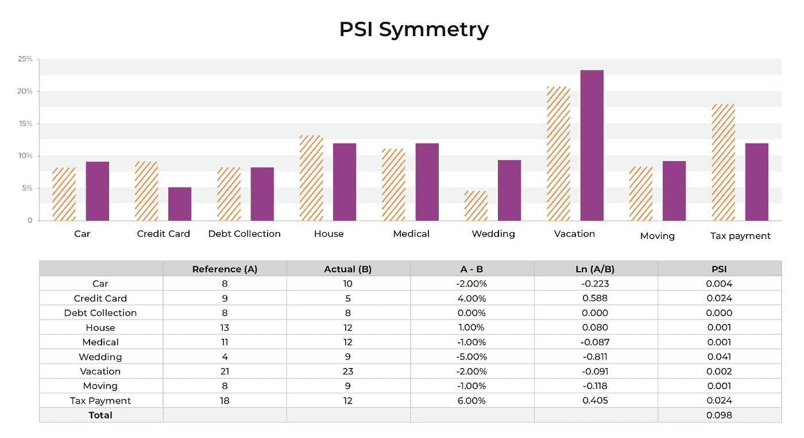
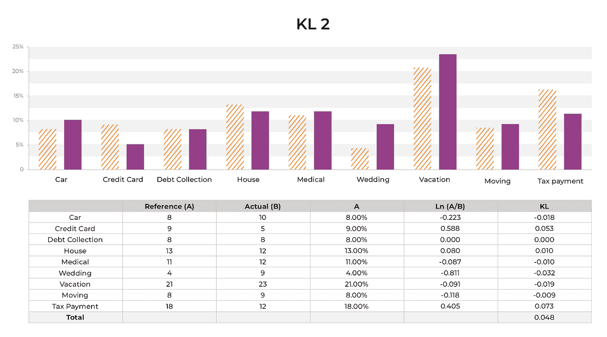

# 使用统计距离进行机器学习的可观察性

> 原文：<https://towardsdatascience.com/using-statistical-distance-metrics-for-machine-learning-observability-4c874cded78?source=collection_archive---------11----------------------->

图片作者。统计检查:输入、输出和实际值

# 介绍

统计距离用于量化两个分布之间的距离，在 ML 可观测性中非常有用。这篇博文将深入研究统计距离度量，以及如何使用它们来检测常见的机器学习模型故障模式。

# 为什么要进行统计距离检查？

机器学习中的数据问题可能有很多种，从突然的数据管道故障到特征输入的长期漂移。统计距离度量为团队提供了影响模型的数据变化的指示和故障排除的洞察力。在模型部署后的真实世界中，这些数据分布的变化可能以各种不同的方式出现，并导致模型性能问题。

这里是我们在实践中看到的一些真实世界的数据问题。

*   不正确的数据索引错误—破坏数据的上游映射
*   错误的文本处理—导致新令牌模型从未见过
*   错误处理案例
*   新文本字符串的问题
*   具有不同坐标或索引的不同要素源
*   第三方数据源做出更改，删除要素、更改格式或移动数据
*   新部署的代码改变了特征向量中的项目
*   定期的每日数据收集失败，导致丢失值或缺少文件
*   软件工程改变了一个领域的意义
*   第三方库功能变更
*   假设有效格式发生变化，但突然无效
*   日期字符串改变格式
*   系统会自然发展，功能也会改变
*   外部世界急剧变化(如新冠肺炎疫情),每个功能都在变化
*   数量的急剧增加扭曲了统计数据

这些是使用统计距离检查可以发现的数据问题的示例。

# 在哪里使用统计距离检查

统计距离可用于分析

*   **模型输入**:模型输入的变化，特别是关键的最重要的特征或可能是上游模型输出的特征。
*   **模型输出**:模型输出的变化
*   **实际值:**实际值的变化(地面接收到的真实值)。在某些情况下，预测后的短时间内可能无法获得真实情况。在这些情况下，团队经常使用代理指标/数据。

这些检查对于模型性能故障排除非常有洞察力，并且它们允许团队在主要的模型问题影响业务结果之前就发现这些问题。在下图中，可以对模型输入(要素)和模型输出(预测)进行统计检查。

图片作者。统计检查:输入、输出和实际值

# 如何使用统计距离检查

统计距离度量是在两个分布之间定义的——分布 A 和分布 b。其中一个分布通常被称为 [**参考分布**](https://arize.com/glossary/reference-distribution/) (我们将它称为分布 A)——这就是你要比较的。另一个分布通常是您正在与参考分布进行比较的系统的当前状态(我们称之为分布 B)。

# 什么是参考分布？

在 ML 可观测性的背景下，参考分布可以是许多不同的选项。首先要区分的是，参考分布可以是跨固定时间窗口的分布(分布不变)或移动时间窗口的分布(分布可能变化)。

在下图中，您可以看到固定参考分布的示例包括培训分布的快照、初始模型部署分布(或认为分布稳定的时间)以及验证/测试集分布。使用固定参考分布的统计距离的一个示例是将从训练环境(分布 A)得到的模型预测分布与从生产环境(分布 B)得到的模型预测分布进行比较。

参考分布也可以是移动窗口。在下图中，有两个参考分布是移动窗口的例子——上周和 A/B 测试用例。对于第一个例子，人们可能想要比较上周的预测和本周的预测的分布。在这种情况下，每周都会有一个新的参考分布。如果您正在生产中 A/B 测试两个不同的模型版本，您可以比较来自您的冠军模型的预测分布是否类似于来自挑战者模型的预测分布。

您设置为参考分布的选项将取决于您试图捕捉的内容，我们将深入探讨常见的统计距离检查以设置模型。

图片作者。参考分布

# 统计距离检查的常见用例

## 模型输入

模型输入可能突然漂移、逐渐漂移或周期性漂移，具体取决于参考分布的设置。俗话说，“垃圾进来，垃圾出去。”换句话说，模型的好坏取决于流入模型的数据。如果输入数据发生变化，并且与模型之前观察到的或训练的数据有很大不同，则可能表明模型性能可能有问题。

以下是对模型输入设置的一些统计距离检查:

1.  **培训中的特征分布**vs**生产中的特征分布**

在生产过程中，特征的分布会随时间漂移。了解产品中的特征分布是否随着时间的推移而改变，以及这是否会影响模型，这一点非常重要。在该设置中，参考分布(分布 A)是训练中的特征分布。当前窗口(分布 B)可以设置为某个时间窗口(例如:一天、一周、一个月等)上的特征分布。如果特征分布变化很大，设置更长的回看窗口会很有帮助，这样统计距离检查的噪声会更小。

图片作者。功能(培训)与功能(生产)

2.**生产时间窗 A** 的特征分布 vs**生产** **时间窗 B** 的特征分布

在生产中的两个不同时间间隔对要素设置分布检查也很有用。与培训和生产检查相比，这种分布检查可以关注更短期的分布变化。如果将训练分布设置为参考分布，如果有任何波动(例如:交通模式、季节变化等)，设置较短的生产时间窗口可能会产生噪音。针对上周和本周设置统计距离检查可以指示特征值中的任何突然异常值或异常值。这些对于识别可能被更大的时间窗口掩盖的任何数据质量问题也非常有用。

识别特征中是否有分布变化可以给出模型性能退化的早期指示，或者如果该特征不影响模型性能，是否可以丢弃该特征。如果对模型性能有重大影响，则可能导致模型重新训练。虽然应该调查特性分布的变化，但这并不总是意味着会有相关的性能问题。如果该特征对模型不太重要，并且对模型预测没有太大影响，那么特征分布变化可能更多地表明它可以被丢弃。

现实世界中的团队使用模型输入检查来确定模型何时变得陈旧，何时重新训练模型，以及可能指示性能问题的特性片段。我与之交谈过的一个团队使用财务模型进行核保，通过将产品中的功能与培训中的功能进行比较来生成对功能稳定性的分析，以确保模型决策仍然有效。

## 模型输出

就像模型输入会随时间漂移一样，模型输出分布也会随时间变化。对模型预测设置统计距离检查可确保模型的输出与其参考分布不会有太大差异。

3.**培训中的预测分布**vs**生产中的预测分布**

输出漂移的目标是检测模型相对于训练的工作方式的巨大变化。虽然这些对于确保模型在先前测试和批准的范围内运行是极其重要的，但这并不保证存在性能问题。类似于特征分布变化不一定意味着存在性能问题，预测分布变化也不保证存在性能问题。一个常见的例子是，如果一个模型被部署到一个新的市场，在一些模型输入和模型输出中会有分布变化。

图片作者。距离检查的参考分布示例

4.**生产时间窗 A** 的预测分布对比**生产** **时间窗 B** 的预测分布

与模型输入类似，预测分布也可以被监控到生产中的另一个时间窗口。我们与之交谈的一个团队正在评估一个垃圾邮件过滤器模型，他们使用模型输出的分布与一个固定的时间框架来显示可能通过模型的攻击模式的变化。这里的参考分布可以是移动时间窗口或固定时间帧。我们听到的一个常见的固定时间框架是使用初始模型启动窗口。

5.**型号版本 A** 的预测分布与**型号版本 B** 在同一时间窗口的预测分布

支持 canary 模型部署的团队可以对不同模型版本的预测分布设置统计距离检查。A/B 在生产中测试两个不同的模型，每个模型接收一定量的流量，或者根据历史数据回测一个模型，通过比较预测分布，可以深入了解一个模型相对于另一个模型的表现。

## 模型实际值

6.**培训**的实际分配与**生产**的实际分配

在做出模型推断后，实际数据可能不总是在短期范围内。但是，对实际分布的统计距离检查有助于确定从训练数据中学习的结构是否不再有效。这方面的一个主要例子是新冠肺炎·疫情，它导致交通、购物、需求等模式与疫情开始前的生产模式有很大不同。除了大规模的转移之外，了解特定群组的训练数据与生产之间的实际分布可以识别是否存在

## 模型预测与实际

7.**产量**的预测分布与**产量**的实际分布

这种统计距离检查是比较预测和实际的生产分布。这有助于通过精确定位与实际值差异最大的特定预测群组来发现性能问题。这些检查有时可以发现被平均数据掩盖的问题，如梅伊或 MAPE。

# 常见的统计距离度量

我们刚刚讨论了统计距离的常见用例。有许多不同的统计距离度量来量化分布之间的变化。不同类型的距离检查对于捕捉不同类型的问题很有价值。在这篇博文中，我们将介绍以下 4 种距离测量方法，以及每种方法最具洞察力的时间。

*   [人口稳定指数](https://arize.com/blog-course/population-stability-index-psi/)
*   Kullback Leibler 散度( [KL 散度](https://arize.com/blog-course/kl-divergence/)
*   詹森香农发散( [JS 发散](https://arize.com/blog-course/jensen-shannon-divergence/))
*   推土机距离(EMD)
*   [科尔莫戈罗夫斯米尔诺夫试验](https://arize.com/blog-course/kolmogorov-smirnov-test/) (KS 试验)

## 磅/平方英寸(pounds per square inch)

**[**PSI 指标**](https://arize.com/blog-course/population-stability-index-psi/) **在金融行业有很多现实应用。对于分布相当稳定的数值和分类特征来说，这是一个很好的度量。****

**等式:PSI =(Pa-Pb)ln(Pa/Pb)PSI 是一种理想的分布校验，用于检测分布中的变化，这些变化可能会使作为模型输入的要素的有效性降低。它经常在金融中用于监控模型的输入变量。它有一些众所周知的阈值和有用的属性。**

****

**图片作者。根据分布计算 PSI 的原始值**

**通过以上 PSI 值，我们可以看到:**

*   **分布的任何变化都将增加 PSI 总数，无论变化是正还是负。这意味着不管分布是增长还是收缩，任何变化都会增加 PSI。**
*   **ln(Pa/Pb)项意味着，代表小百分比分布的仓中的大变化将比具有大百分比分布的仓中的大变化具有更大的影响(对 PSI)**
*   **与从 12%增加到 18%相比，分配箱从 4%增加到 9%对 PSI 的影响几乎是两倍**
*   **上面的示例分布包括许多小百分比变化(小于 6%)，其中没有一个单独产生超过 0.1 的 PSI 项，这是模型调查的经验法则基准。关键是，相对于行业基准，微小的变化不会改变指针。**
*   **阈值的设置我们建议采用通用的金融行业基准，或者基于该特征/预测/实际的 PSI 的先前样本的天数/小时数**
*   **0.1-0.25 的金融行业基准通常可以捕捉仓位之间 10%左右的波动**

****

**图片作者。PSI 计算开关分布:对称**

**PSI 是对称的，也就是说，如果颠倒分布，PSI 值是相同的。在上面的示例中，我们将紫色图形与之前示例中的黄色图形进行了交换，值 0.98 与之前的反向分布相同。**

**下面的示例对一个重要要素使用了种群稳定性指数(PSI)。该检查定期运行，权衡您希望收到更改警报的速度与您试图检测的更改类型。**

**当检查低于一个明确定义的阈值时，就需要对变化进行调查，这可能表明存在模型性能问题。**

****

**图片作者。PSI —按日开启功能**

**下面显示了一个实时特征，其中稳定性指数远低于设置的 0.15 限制(0.1–0.25 金融行业标准范围)。在设置时，我们建议查看多天的统计窗口来设置检测范围。**

****

**图片作者。PSI(较大变化)-按日启用功能**

**上述每日 PSI 分布变化是引入新的分类特征时测量特征的真实变化。**

## **KL 散度**

**如果一个分布相对于另一个或小样本量具有高方差，KL 散度统计是有用的。**

**等式:KLdiv = Ea[ln(Pa/Pb)]=(Pa)ln(Pa/Pb)**

**KL 散度是一个众所周知的度量，可以认为是样本分布和参考(先前)分布之间的相对熵。像 PSI 一样，KL 散度也有助于捕捉分布之间的变化。也和 PSI 类似，它有信息论的基础。**

**与 PSI 的一个重要区别是 KL 散度是不对称的。反向分布将具有不同的值-您将从 A -> B 然后 B -> A 获得不同的值。非对称指标对于分布监控来说并不理想，因为当您切换参考分布与比较分布时，您会获得不同的值。对于监控用户来说，这可能显得不直观。**

****

**图片作者。KL-散度示例计算**

**虽然 KL-Divergence 中的不对称使得它不适合于监视度量，但是它确实为 KL-Divergence 提供了一些其他有用的应用。例如，KL-散度不对称与贝叶斯定理中比较先验值和后验值时发现的不对称并没有什么不同。我们发现，当参考分布中有大量样本，而比较分布中有非常少的一组样本(导致更多的方差)时，这种不对称性特别有用。**

****

**图片作者。KL-散度:开关分布不对称**

## **JS 分歧**

**方程:JS Div(P，Q) = KL-DIV(P，M) + KL-DIV(Q，M)**

**参考= M(混合分布)= (P + Q)**

**JS 散度有一些有用的属性。首先，它总是有限的，所以不存在被零除的问题。当一个分布在某些区域有值而另一个没有值时，就会出现被零除的问题。其次，与 KL-Divergence 不同，它是对称的。**

**JS 散度使用两种分布的混合作为参考。这种移动窗口检查的方法存在挑战；混合参考基于移动窗口分布的变化而变化。由于移动窗口在每个周期都在变化，所以混合参考也在变化，并且如果没有经过深思熟虑的处理，每个周期中的度量的绝对值不能直接与之前的周期进行比较。有一些变通方法，但对于移动窗口来说并不理想。**

****

**图片作者。JS 分歧问题(不稳定参考)**

**对于每个分配检查，移动窗口在每个期间都会发生变化。它代表当前期间分布的一个示例。JS 分布对于移动窗口有一个独特的问题，因为混合将随着您比较的每个时间窗口而变化。这会导致 JS Divergence 返回的值的含义定期发生变化，从而在不同的基础上比较不同的时间范围，这不是您想要的。**

**PSI 和 JS 都是对称的，并且具有用于度量监控的潜力。相对于 JS，我们建议对 PSI 进行一些调整，作为移动窗口的距离度量，用于警报。**

## **推土机的距离**

**方程式:𝐸𝑀D0=0**

**𝐸𝑀𝐷𝑖+1=(𝐴𝑖+𝐸𝑀𝐷𝑖) − 𝐵𝑖**

**𝑇𝑜𝑡𝑎𝑙𝐷𝑖𝑠𝑡𝑎𝑛𝑐𝑒=∑|𝐸𝑀𝐷𝑖|**

**推土机的距离测量给定区域内两个概率分布之间的距离。推土机距离对于非重叠数值分布移动和高维空间(例如图像)的统计非常有用**

**作为分布检查的一部分，使用以上 PSI 和 KL 计算，将 Bin0 与 Bin0、Bin1 与 Bin1 等进行比较。Bin0 永远不会与 Bin1 进行比较，计算会修复 Bin 比较。**

**以下统计距离检查在计算中不包含锁定的条柱。箱号是不相关的；更重要的是分布之间的距离。**

**推土机的距离是一个相当古老的计算方法——它是在 1781 年制定的。在一维分布的情况下，它捕获在将一个分布移动到另一个分布时，分布的形状和到平均值的距离保留了多少。**

****

**图片作者。一维经验模态分解的可视化**

**推土机的距离可以简单地用一个一维的例子来说明，如上图所示(最初 EMD 算法被设计用来解决移动泥土的问题)。这里，推土机的距离可以被认为是将一堆泥土移动到另一堆泥土中所需的功。卡车沿着直路(X 轴)将泥土装入卡车，从而填满泥土。移动泥土所需的功由沿 X 轴的每个单位计算，以及卡车中有多少泥土，以及卡车可以运输多少单位的泥土。卡车将泥土倒入另一个分配区。分布的距离越远，推土机的距离就越大，因为卡车会将泥土从一个位置运输到另一个位置。分布越分散和重叠，数量就越小。**

**与 KL 散度相比，EMD 处理 KL/PSI 需要修改的自然非重叠分布。**

# **使用统计距离和模型性能指标**

**统计距离检查对于模型的可观察性非常有用。有许多设置配置可以帮助识别不同的模型问题(漂移、数据分布变化、数据质量问题、模型性能退化等)。这些统计距离度量最好与模型性能度量一起分析。**

**使用分布变化的性能度量使团队能够识别可能降低模型整体性能的预测片段。在下面的示例中，整体模型精度为 71%。使用统计距离度量，我们可以看到在 2 个箱中有显著的移动。这些箱子的性能如何？这个运动在模型中引起任何全局性能问题了吗？在本例中，我们可以看到这些频段的性能低于整体精度。**

****

**图片作者。功能的性能分析**

**将统计距离检查与更广泛的模型故障排除工作流联系起来有助于识别不同的模型故障模式。我们的建议是:**

*   **对要素、预测和实际值设置统计距离检查**
*   **当统计距离度量超过合适的阈值时，确定这是否会影响模型性能**
*   **当查看模型性能时，与来自训练/验证集的性能进行比较**
*   **查看与更改相关的特定存储片的性能**

****

**图片作者。分布变化并不总是意味着性能问题**

**分布的变化可能会也可能不会引起大的下游问题。关键是，不应该在真空中看待任何变化，或者仅仅因为某些事情发生了变化就进行调查。应该根据其他系统性能指标过滤这些更改，以调查哪些是重要的。**

# **结论**

**以下是我们将总结的最终想法/建议:**

*   **统计距离检查在跟踪模型的输入、输出和实际情况的变化方面非常有用，允许团队在业务影响之前发现问题。**
*   **PSI 应用于监控顶级特性的特性漂移**
*   **PSI 应用于监控概念漂移的预测输出和实际值**
*   **当一个分布的样本数小得多并且方差大时，应该使用 KL 散度**
*   **JS 散度可用于特征漂移，但由于混合(参考)是变化的，你应该看绝对数字而不是每天**
*   **零值比较，当一个 bin 有值而另一个没有值时，需要以一种非常周到的特定方式来处理。需要对脱离分布的事件进行事先处理，以便脱离分布的小变动不会破坏 PSI calc。拉普拉斯平滑的标准方法，即给每个面元增加一个小值，效果并不好。请了解更多详情。**
*   **当发生重大分布变化时，我们建议查看绩效指标，并调查再培训是否是一种解决方案。**

## **联系我们**

**如果这个博客引起了你的注意，并且你渴望了解更多关于[机器学习可观察性](https://arize.com/platform-overview/)和[模型监控](https://arize.com/model-monitoring/)，请查看我们的其他[博客](https://arize.com/blog/)和 [ML 监控](https://arize.com/ml-monitoring/)上的资源！如果您有兴趣加入一个有趣的 rockstar 工程团队，帮助模型成功生产，请随时[联系](https://arize.com/contact/)我们，并在此处[找到我们的空缺职位](https://arize.com/careers/)！**