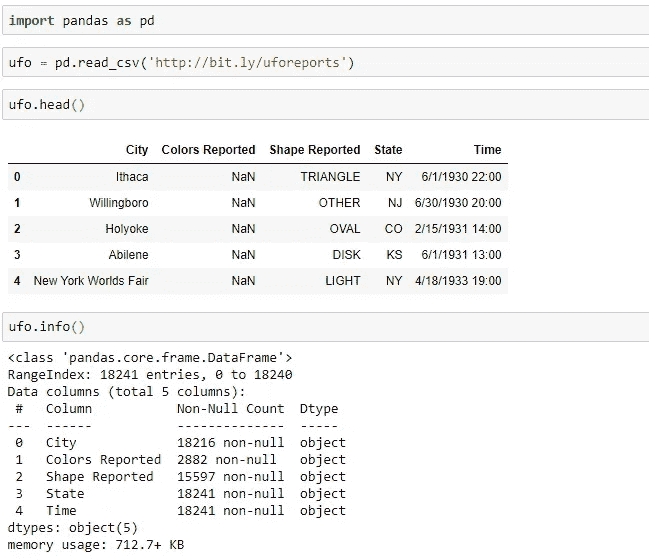
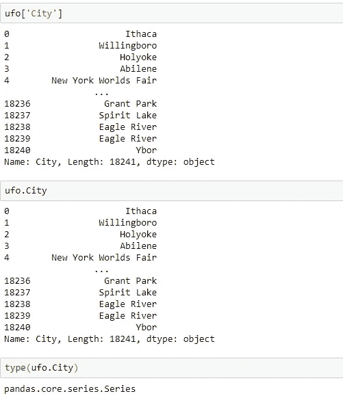
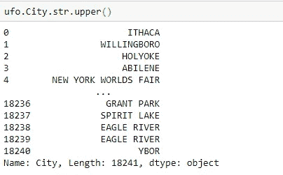
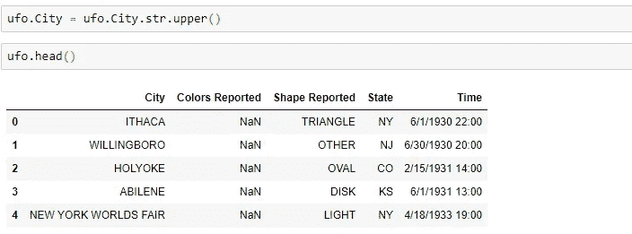
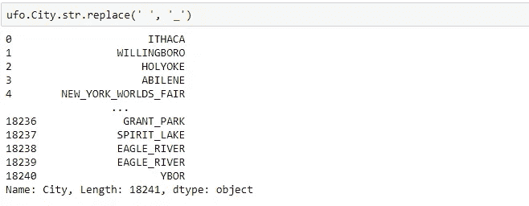
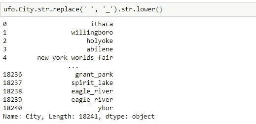

# 在 Pandas 中使用字符串方法

> 原文：<https://towardsdatascience.com/using-string-methods-in-pandas-5e4509ff1f5f?source=collection_archive---------20----------------------->

## 如何在 Python 中对 pandas 数据帧中的列应用字符串方法


照片由[法比奥](https://unsplash.com/@fabioha?utm_source=medium&utm_medium=referral)在 [Unsplash](https://unsplash.com?utm_source=medium&utm_medium=referral) 上拍摄

通常在熊猫数据帧中，我们有包含字符串值的列。幸运的是，pandas 提供了一种将字符串方法应用于整个列的简单方法，这些列只是 pandas 系列对象。我们可以将这些 series 对象(或列)的值作为字符串访问，并通过使用 series 的 str 属性对它们应用字符串方法。让我们在这里看一些例子。

## 创建数据帧

我们将使用在这里[发现的不明飞行物报告](http://bit.ly/uforeports)来创建我们的数据框架。然后，我们将使用 dataframe head 方法查看 dataframe 的前 5 行，并使用 dataframe info 方法检查我们的列值。



info 方法的输出告诉我们，列中的所有非空值很可能是字符串对象。在本教程中，我们将主要关注城市列。

## 将字符串方法应用于列

记住熊猫数据帧是由列组成的。这些列中的每一列都是熊猫系列对象。在 pandas 中，我们可以访问这些数据帧和系列对象的方法和属性。Pandas 为我们提供了一系列用于处理字符串的方法。这些字符串方法将应用于列中的每个条目。

为了将字符串方法应用于列，我们将使用 Series 对象的 str 属性。因此，一般来说，我们将使用以下格式:

> Series.str.

假设我们想将 ufo 数据帧中的所有城市名称转换成大写。首先，我们需要访问该系列(或列)，然后添加。str，最后加上我们要用的具体方法。要找到我们可用的所有字符串方法，请转到[这里](https://pandas.pydata.org/pandas-docs/stable/reference/series.html)并找到字符串处理部分。

我们可以使用括号或点符号来访问系列或列，如下所示:

```
# bracket notation
ufo[‘City’] # dot notation
ufo.City
```



*注意城市列的类型是一个序列对象。因此，我们可以对该对象应用任何级数方法。*

因此，要将我们列中的所有城市名称转换为大写，我们可以添加。str 后跟 upper 方法，如下所示:

```
ufo.City.str.upper()
```



注意:这实际上并没有改变我们的原始数据帧。如果我们想改变我们的原始数据帧，我们可以用下面的代码将这个输出值赋给我们的原始城市列:

```
ufo.City = ufo.City.str.upper()
```



*现在，我们原始 ufo 数据帧的城市列包含大写的城市名称。*

[](/how-to-index-data-in-pandas-with-python-4437c24ff332) [## 如何用 Python 索引 Pandas 中的数据

### 如何在 Python 中使用 loc 和 iloc 方法

towardsdatascience.com](/how-to-index-data-in-pandas-with-python-4437c24ff332) 

## 替换列中的字符

如果我们想用下划线替换 City 列中的所有空格，该怎么办？我们可以通过使用 replace 方法来实现这一点。我们只需指定要替换的内容，然后用什么来替换它。

```
ufo.City.str.replace(‘ ’, '_')
```



注意所有的空格都被替换成了下划线。

## 链接方法

我们也可以将字符串方法链接在一起。记住，这些系列方法返回一个熊猫系列对象。所以我们可以给它们添加另一个字符串方法。例如，假设我们想用下划线替换所有空格，并将所有城市名改为小写。我们可以通过下面的代码来实现这一点:

```
ufo.City.str.replace(‘ ‘, ‘_’).str.lower()
```



*自从不明飞行物。City.str.replace('，' _ ')返回一个 Series 对象，我们可以只使用或链接另一个 Series 方法到它。*

## **本教程使用的所有代码:**

如果你喜欢阅读这样的故事，并想支持我成为一名作家，考虑注册成为一名媒体成员。每月 5 美元，你可以无限制地阅读媒体上的故事。如果你用我的 [*链接*](https://lmatalka90.medium.com/membership) *注册，我会赚一小笔佣金。*

[](https://lmatalka90.medium.com/membership) [## 通过我的推荐链接加入媒体——卢艾·马塔尔卡

### 阅读卢艾·马塔尔卡的每一个故事(以及媒体上成千上万的其他作家)。您的会员费直接支持…

lmatalka90.medium.com](https://lmatalka90.medium.com/membership) 

## 结论

在本教程中，我们学习了如何访问 pandas 数据帧中的列并对其应用字符串方法。