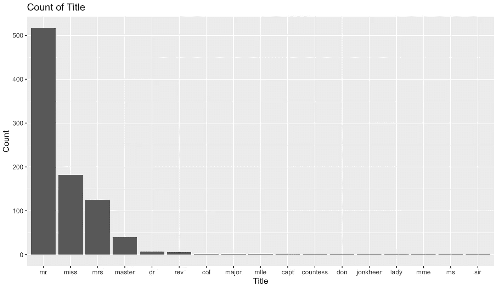
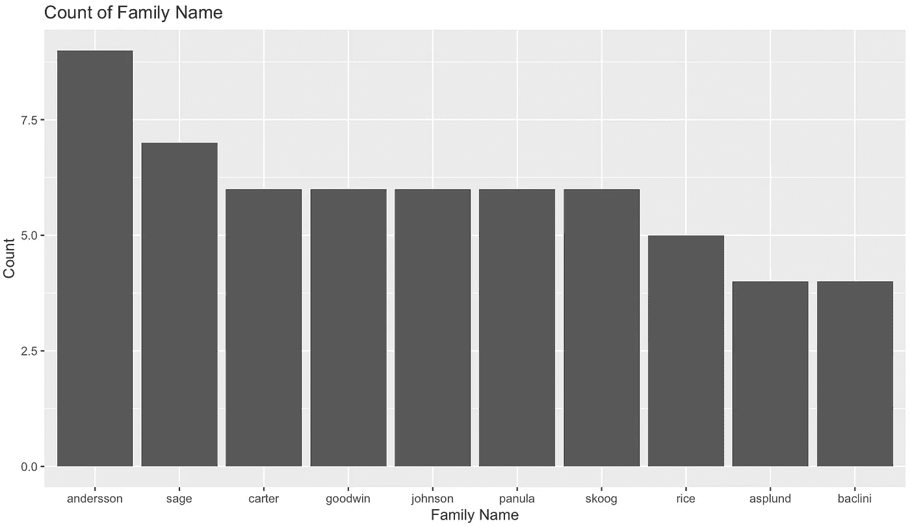
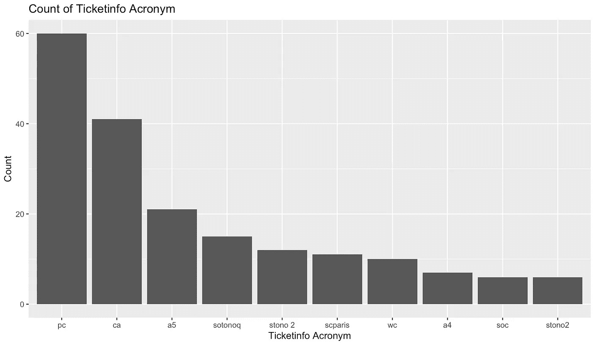
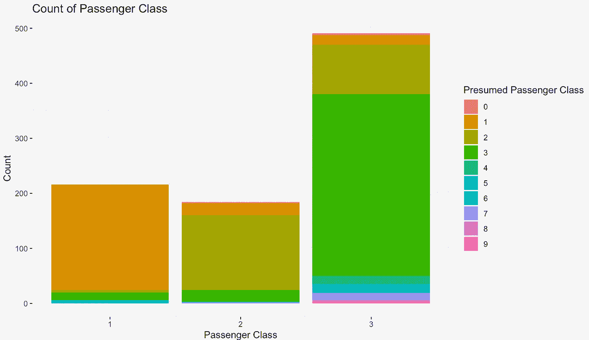

# 使用 Stringr 和 Regex 从 R 中的文本和字母数字数据中提取特征

> 原文：<https://towardsdatascience.com/using-stringr-and-regex-to-extract-features-from-textual-alphanumeric-and-punctuation-data-in-r-2565256c0a77?source=collection_archive---------18----------------------->

## 使用 Titanic 数据集的特征提取教程

大型数据集通常充斥着难以破译的数据。人们可能会想到文本数据、名称、唯一标识符和其他种类的代码。通常，分析这些数据集的人会很快丢弃这些变量。然而，有时这种类型的数据中可能有有价值的信息，这可能有助于您的分析。

很高兴地，R 提供了惊人的包“stringr”，它非常适合这些目的。本快速教程将向您展示如何从这些变量中提取微小但仍有洞察力的数据。在这种情况下，我们将从 Titanic 数据集提取这种数据。


美国国家海洋和大气管理局在 [Unsplash](https://unsplash.com/s/photos/titanic?utm_source=unsplash&utm_medium=referral&utm_content=creditCopyText) 拍摄的照片

# 加载数据集

如果你想跟随教程，使用下面的命令加载 Titanic 数据集。泰坦尼克号数据集以泰坦尼克号乘客的各种信息为特色，以练习预测他们的生存。本教程旨在研究一些大多数人在开始分析时会立即丢弃的变量(如姓名和票证)。然而，我们希望与他们合作，看看我们是否能提取一些有用的信息。如果您想知道如何使用 Stringr 和 regex，请跳过这一部分。

```
### install package
install.packages("titanic")### load package
library(titanic)### load dataset
df = titanic_train #load dataset
```

# 安装和加载字符串

在开始之前，我们需要安装和加载 Stringr 包。

```
### install package
install.packages("stringr")### load package
library(stringr)
```

现在，我们都准备好了，可以开始了。

# 从名称中提取标题

作为第一个练习，我想从名字中提取标题。这是因为我相信，比如说，贵族比凡人更有可能生存下来。还有，我假设年轻的未婚女性(“小姐”)更有可能活下来。可能，标题中可能有很多信息。

titanic 数据集中的名称(df$Name)都是这样保存的:

> Futrelle，夫人雅克希思(莉莉可能皮)

为了避免任何错误，我们首先要运行一个命令，将所有这些字符串转换成小写，并保存为新变量:

```
df$lcName = str_to_lower( df$Name )
```

标题(上例中的 Mrs)前面有一个空格，前面有一个点。我们可以使用 regex(正则表达式)作为一种语言，将这种模式传递给 Stringr，并要求它以如下方式查找标题:

> (?<=\\s)[[:alpha:]]+(?=\\.)

This pattern consists of three parts:

1.  **(？< =\\s)** 告诉 Stringr 我们要寻找的文本段在(？由空格(\\s)分隔。
2.  **[[:alpha:]]+** 告诉 Stringr 我们要寻找的文本由一个或多个(+)字母([[:alpha:]])组成。
3.  **(？=\\.)**告诉 Stringr 我们要找的那段文本已经开始(？=)加一个点(\\。).

可以看到 regex 使用了各种符号来交流模式。当你想开发自己的模式时， [Stringr 备忘单](http://edrub.in/CheatSheets/cheatSheetStringr.pdf)是一个有用的指南。[这个网站](https://www.regextester.com/)提供了一个测试正则表达式模式的简单方法。

我们提取标题，并通过让 Stringr 在小写的“Name”字符串中查找这个模式，将其保存为一个新变量。

```
df$title = str_extract( df$lcName, "(?<=\\s)[[:alpha:]]+(?=\\.)" )
```

现在让我们使用 Ggplot2 和下面的命令来绘制我们的新变量“title”。

```
### install package (ggplot2 is a must have)
install.packages("ggplot2")### load package
library(ggplot2)### plot titles
ggplot(data.frame(table(df$title)),aes(x=reorder(Var1, -Freq),y=Freq))+
  geom_col()+
  labs(title="Count of Title", x="Title",y="Count")
```



您可以看到，Stringr 很好地从名称中提取了所有的标题，现在我们有了一个新的分类变量，可以用作我们分析的输入。

# 从名称中提取族

作为第二个练习，我想从 names 字符串中提取姓氏。我相信家庭成员可能是生存的一个预测因素，也就是说，如果一个家庭成员存活，在控制了性别等其他因素后，其他成员也更有可能存活。

在上面的示例“name”字符串中，您可以看到这个人的姓，例如 Futrelle，是第一个单词。所以我们可以告诉 Stringr 获取第一个匹配模式([[:alpha:]]+)的单词(str_extract)并获取第一个单词，这就是 family。

但是，数据集中有姓氏，如“范德·普兰克”或“奥德怀尔”如果我们在这种情况下取第一个单词，我们只会得到“vander”或“o”，而不是整个家族的名字。因此，我们需要修改模式以包含任何类型的字符(。)长度为 1 个字符以上，后跟一个逗号(？=\\,).

```
df$family=str_extract(df$lcName,".+(?=,)")
```

这一次，因为我们有很多姓，所以让我们画出 10 个最常用的姓。

```
t=data.frame(table(df$family))t=t[order(-t$Freq),]ggplot(head(t,10),aes(x=reorder(Var1,-Freq),y=Freq))+
  geom_col()+
  labs(title="Count of Family Name", x="Title",y="Family Name")
```



同样，我们现在有了新的变量“family name”，我们可以使用它进行进一步的分析。

# 从票中提取信息

在大多数对泰坦尼克号数据集的分析中，人们很快就丢弃了船票信息。然而，机票代码中的一些字母可能意味着什么。例如，它们可以表示票是最后一分钟购买的，并且乘客没有为航行做好充分准备。

但是，这些缩写和代码的写法不一致(例如，“SOC”和“S.o.C .”)，这就是为什么这些数据需要一些准备工作。让我们打扫它。

```
### set ticket codes to lowercase
df$lcTicket=str_to_lower(df$Ticket)### remove punctuation from ticket codes
df$lcTicket=str_replace_all(df$lcTicket,"[:punct:]","")
```

现在我们已经清理了一些数据，让我们提取这些缩写。通常，机票代码看起来像这样:

> 索托诺 2 3101287

在我看来，“sotono 2”是一个首字母缩写词，可能意味着什么，“3101287”是一些机票号码(我稍后会详细介绍)。如果我们考虑缩写词的模式，它是字符(。)后面跟一个空格(\\s)，空格后面跟一个三位数或更长的数字([[:digit]])({ 3，})。有时，整个机票代码是一些首字母缩写词(例如，一个乘客将“line”作为机票)，这意味着我们可以给 Stringer 另一个选项(“|”是“or”运算符)，即整个代码是感兴趣的首字母缩写词([[:alpha:]]+)。我们使用下面的命令告诉 Stringr 查找这个模式，并将其保存在一个新变量“ticketinfo”中。然后，我们删除空白并替换 NA 值。

```
### identify acronym
df$Ticketinfo = str_extract( df$lcTicket, ".+(?=\\s(?=[[:digit:]]{3,}))|[[:alpha:]]+" )### remove whitespaces from ticketinfo
df$Ticketinfo = str_replace_all( df$Ticketinfo, "\\s", "" )### remove NA values
df$Ticketinfo = ifelse( is.na(df$Ticketinfo), "none", df$Ticketinfo )
```

让我们再次绘制 10 个最常见的 ticketinfo 值。

```
t=data.frame(table(df$Ticketinfo[df$Ticketinfo!="none"]))t=t[order(-t$Freq),]ggplot(head(t,10),aes(x=reorder(Var1,-Freq),y=Freq))+
  geom_col()+
  labs(title="Count of Ticketinfo Acronym", x="Ticketinfo Acronym",y="Count")
```

你可以看到这对许多乘客来说增加了相当多的信息。将近 60 名乘客的值为“PC”在检查数据后，我相信它可能意味着“私人客舱”，因为许多(但不是所有)头等舱乘客的机票上都印有这个值。



# 从机票号码中提取免费升级

关于泰坦尼克号命运多舛的处女航，有趣的是船只有一半的容量。这艘船本可以轻而易举地运送更多的乘客横渡大西洋。这让我想到一些乘客可能已经“免费”升级到了更高的舱位。对机票号码的初步检查显示，第一个数字似乎与乘客等级(Pclass)相关，但也有例外。我假设第一个数字可以携带一些关于阶级变化的信息，这将对乘客的生存概率产生深远的影响。让我们提取首字母缩写词后的数字的第一个数字，并将其保存为假定的乘客类别(PresumedPclass)。

我们先提取一下票号。同样，票号由数字([[:digit:]])组成，长度为 3 个或更多字符({3，})。让我们也将它存储为一个字符(as.character)，而不是一个数字，以便仍然对它使用 Stringr。

```
df$Ticketno = as.character( str_extract( df$lcTicket, "[[:digit:]]{3,}" ))
```

那么我们就取这个票号的第一个数字([[:digit:]])存储为推定的旅客类别。

```
df$PresumedPclass = str_extract( as.character(df$Ticketno) ,"[[:digit:]]{1}")
```

现在，让我们再次绘制这个新变量，但是让我们在所提供的乘客类的上下文中绘制它，看看它是如何相关的。

```
ggplot(df, aes(x=Pclass, fill=PresumedPclass))+
  geom_bar()+
  labs(title="Count of Passenger Class", x="Passenger Class",y="Count")+
  scale_fill_discrete(name="Presumed Passenger Class")
```

正如我们在下图中看到的，这两个值大部分是相关的。但有时他们不会。在这两个类别不匹配的情况下，这可能是令人兴奋的信息。



## 进一步阅读

您想了解更多信息吗？[在 Medium 上关注我](https://medium.com/@mattifuchs)看我的其他故事！